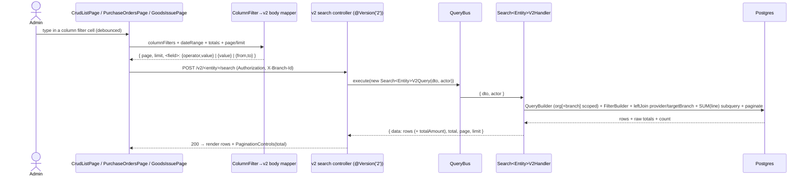
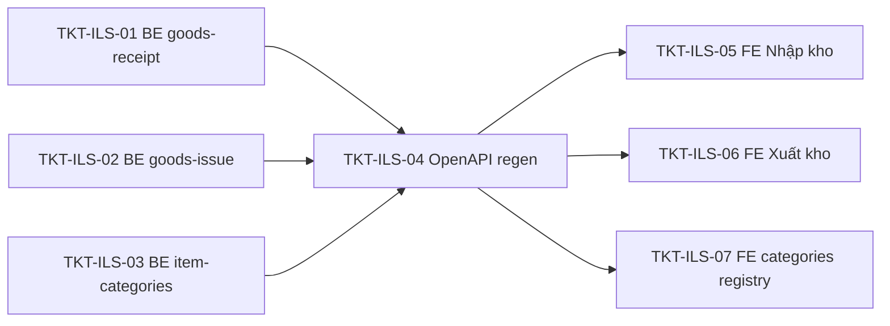

# EPIC-03062026 Inventory list server-side CQRS search (categories + Nhập/Xuất kho)

## Goal

Phase-2 of the admin-list CQRS search initiative. Add dedicated **CQRS v2 search endpoints** for three more list surfaces and wire their per-column filters to query the **whole** org dataset with server-side pagination, instead of filtering the loaded page in memory.

Reuses the `invoice-v2` / ACS pattern (`cqrs-search-endpoint` skill): `FilterBuilder` + the shared filter sub-DTOs, envelope `{ data, total, page, limit }`. **BE + FE** (unlike the ACS phase-1, which was backend-only).

The three surfaces:

| #   | Surface (UI)               | route / page today                                  | endpoint today                                          | target endpoint                             |
| --- | -------------------------- | --------------------------------------------------- | ------------------------------------------------------- | ------------------------------------------- |
| 1   | Nhóm hàng hoá (categories) | `/admin/inventory-item-categories` (`CrudListPage`) | `GET /admin/entities/inventory-item-categories/records` | `POST /v2/inventory-item-categories/search` |
| 2   | Nhập kho (goods receipt)   | `/inventory/purchase-orders` (`PurchaseOrdersPage`) | `GET /goods-receipts`                                   | `POST /v2/goods-receipts/search`            |
| 3   | Xuất kho (goods issue)     | `/inventory/goods-issues` (`GoodsIssuePage`)        | `GET /inventory/goods-issues`                           | `POST /v2/inventory/goods-issues/search`    |

## Decisions (locked)

- **Row data is byte-identical to the columns each page renders today** (the hard constraint: *trả y chang cái FE đang map*). Verified column→field bindings:
  - **categories** (`ItemCategoryEntity`, generic CRUD) — full entity; the 3 visible columns read `code` (Mã nhóm hàng hóa), `name` (Tên danh mục), `createdAt` (Ngày tạo).
  - **goods-receipt** (`GoodsReceiptEntity`) — keep the nested **`provider { id, code, name }`** + `providerId` (party cell reads `row.provider?.name`), and `documentNumber`, `receivedAt`, `description` (Diễn giải), `reason` (Lý do), `purpose` (Loại chứng từ enum `OTHER`/`TRANSFER_IN`), `status`. **Add a computed `totalAmount`** so the FE reads `row.totalAmount` (Tổng tiền) instead of summing `lines` client-side.
  - **goods-issue** (`GoodsIssueEntity`) — keep nested **`provider { id, code, name }`**, `providerId`, **`targetBranch { id, name }`**, `customerName` (the party cell cascades provider → targetBranch → customerName), and `documentNumber`, the date the Ngày column uses (`issueDate` if present, else `createdAt`), `notes` (Diễn giải), `reason` (Lý do), `purpose` (Loại chứng từ enum `OTHER`/`SALE`/`TRANSFER_OUT`/`DISPOSAL`), `status`. **Add computed `totalAmount`.**
- **`totalAmount` is computed in SQL** via a correlated subquery `SUM(line.quantity × line.unit_price)` over the line table — the same formula the FE uses today. It is both **returned per row** and **server-filterable** (a `CompareFilterDto`, default `<=`) and would otherwise be impossible to paginate against. (This is the one place we do not "fetch raw + aggregate in JS" — server-side pagination on a derived total requires it; flagged here intentionally.)
- **Response envelope = `{ data, total, page, limit }`** (POS/ACS v2 convention). The two hand-built pages adapt to `limit`; `CrudListPage` already maps `limit ↔ pageSize`.
- **Sort = the page's current default, no `sortBy`.** categories `createdAt DESC`; goods-receipt `receivedAt DESC`; goods-issue the same date field DESC. The migrated lists lose clickable header sorting (consistent with the POS v2 + ACS screens).
- **Scope.** categories is `ORGANIZATION`-only. goods-receipt / goods-issue are `ORGANIZATION + BRANCH` — handlers must scope exactly as the current `GET` list does (org always; `branchId` when `actor.branchId` is set). The current list-query scoping is the source of truth; mirror it, do not invent.
- **Controllers / modules.** categories search is **appended to the existing `AdminSearchV2Controller`** (admin-search module, alongside the 5 ACS endpoints). goods-receipt and goods-issue searches live in **their own modules** (`goods-receipt`, `goods-issue`) as a dedicated `*-v2.controller.ts` + query + handler, mirroring the `inventory-item-v2.controller.ts` precedent. Each module imports `CqrsModule` and registers its handler. The existing `GET` list endpoints/services are left untouched.
- **No new permissions.** Reuse the read key already guarding each current list: categories `inventory.read` (from its `CrudEntityConfig`); goods-receipt / goods-issue reuse the permission on their existing `GET` list method.
- **No schema change, no migration, no entity change, no events, no idempotency surface** (read-only). Backend identifiers/comments/Swagger/errors stay **English**; FE strings stay **Vietnamese**.

## Scope

- **API:** 3 CQRS query+handler pairs + 3 request DTOs. categories colocated in `AdminSearchModule`; goods-receipt/goods-issue in their own modules with a small `*-v2.controller.ts`. Regenerate `openapi.snapshot.json` + api-client `schema.ts`.
- **backoffice-web:**
  - categories — **one entry** in the `CRUD_V2_SEARCH` registry (`components/crud/crudV2Search.ts`); `CrudListPage` then auto-routes its per-column filters to the v2 endpoint (no other FE change).
  - Nhập kho / Xuất kho — **bespoke** wiring: add a server-side per-column filter row + debounce + server pagination to the two hand-built tables, reading `row.totalAmount`. (These are not `CrudListPage`; they are migrated like `EmployeesPage` was.)
- UI strings stay **Vietnamese**.

## Success Metrics

- For each of the 3 surfaces, `POST /v2/<entity>/search` with per-column filters narrows results against the **whole** org (+ branch) dataset and paginates against the server `total`.
- Returned rows are field-for-field equal to today's list rows (goods-receipt/issue keep nested `provider`/`targetBranch`; categories full entity), **plus** the new `totalAmount` matching the old client-side sum.
- The existing `GET /goods-receipts`, `GET /inventory/goods-issues`, and `GET /admin/entities/inventory-item-categories/records` are **byte-for-byte unchanged**.
- `pnpm --filter @erp/api test` green incl. new handler specs (org/branch scoping + each filter operator + `totalAmount` subquery + preserved joins). FE builds; the 3 lists load, filter, paginate against the live API.

## Flows

## Tickets

- [TKT-ILS-01 BE: Goods-receipt search endpoint (#2, computed `totalAmount`)](../tickets/TKT-ILS-01-be-goods-receipt-search.md)
- [TKT-ILS-02 BE: Goods-issue search endpoint (#3, polymorphic party + `totalAmount`)](../tickets/TKT-ILS-02-be-goods-issue-search.md)
- [TKT-ILS-03 BE: Inventory-item-categories search endpoint (#1, AdminSearch module)](../tickets/TKT-ILS-03-be-item-categories-search.md)
- [TKT-ILS-04 OpenAPI regen + api-client snapshot](../tickets/TKT-ILS-04-openapi-regen.md)
- [TKT-ILS-05 FE: Nhập kho (PurchaseOrdersPage) server-side filters](../tickets/TKT-ILS-05-fe-goods-receipt-page.md)
- [TKT-ILS-06 FE: Xuất kho (GoodsIssuePage) server-side filters](../tickets/TKT-ILS-06-fe-goods-issue-page.md)
- [TKT-ILS-07 FE: inventory-item-categories CRUD_V2_SEARCH registry entry](../tickets/TKT-ILS-07-fe-categories-registry.md)

## Dependencies

- Depends on: [EPIC-03062026 Backoffice admin list server-side CQRS search](./EPIC-03062026-admin-list-cqrs-search.md) (the `AdminSearchModule` + `AdminSearchV2Controller` + shared filter DTOs this clones), its [FE wiring epic](./EPIC-03062026-admin-list-cqrs-search-fe.md) (the `CRUD_V2_SEARCH` registry + `BaseDataTable` filter cells reused for categories), [EPIC-03062026 Inventory item search v2](./EPIC-03062026-inventory-item-search-v2.md) (the `inventory-item-v2.controller.ts` per-module v2-controller precedent), [EPIC-29052026 Supplier management](./EPIC-29052026-supplier-management.md) (`ProviderEntity`).
- Reuses: `common/filters/FilterBuilder` + `filter.dto` sub-DTOs (`StringFilterDto`, `EnumFilterDto`, `DateRangeFilterDto`, `CompareFilterDto`); `@Actor()`/`ActorContext`; `@nestjs/cqrs`; the `cqrs-search-endpoint` skill; FE `crudV2Search.ts` registry + `buildV2Body` + `useCrudV2Search` + `BaseDataTable` filter cells; existing read permissions — no new seeding.

### Ticket dependency graph

## Out of scope

- Modifying the existing `GET` list endpoints / services / `BaseCrudService` / the categories `CrudEntityConfig` fields — all left untouched (categories only gains a registry entry on the FE).
- Mutations (create/duplicate/edit/delete) — they stay on their current paths.
- Schema/migration changes, new entities, events, new permissions.
- Header-click column sorting on the migrated lists (v2 has no `sortBy`).
- Making the goods-receipt/issue list rows carry `lines` (the list no longer needs them; row-detail dialogs keep fetching the full document via `GET /:id`). If a page is found to depend on list-row `lines` for anything other than the total, the FE ticket keeps returning them — verified there, not assumed here.
