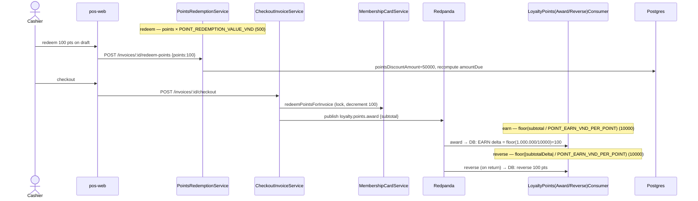
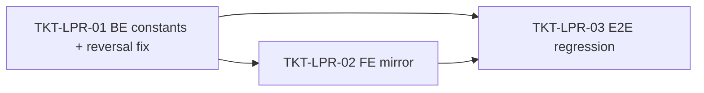

# EPIC-03062026 Loyalty point rate change (earn 10% → /1000, redeem 1pt = 500đ)

## Goal

Re-price the loyalty programme so the worked example holds end-to-end:

- **Earn:** a 1.000.000đ sale credits **100 points** (10% of value, then ÷1.000).
- **Redeem:** **100 points → 50.000đ** off (1 point = 500đ).
- **Net effect:** ~**5% effective cashback** (down from the current ~100%).

This is a **rate-constant change only** — no new entity, no migration, no new endpoint, no new event. Both rates already live as single-source-of-truth constants; the work is changing their values, fixing the one place that hard-codes the old earn divisor as a magic number, and updating tests.

### Current vs target (the two constants that drive everything)

| Constant | File | Now | New | Effect |
| --- | --- | --- | --- | --- |
| `POINT_EARN_VND_PER_POINT` | `apps/api/src/modules/customer/loyalty.constants.ts` | `1000` | **`10000`** | `floor(subtotal / 10000)` → 1.000.000đ = 100 pts |
| `POINT_REDEMPTION_VALUE_VND` | same file (+ pos-web mirror) | `1000` | **`500`** | `points × 500` → 100 pts = 50.000đ |

> ⚠️ **Decision to confirm at Step 3:** the original request named only the *redemption* side, but the worked example (1.000.000đ → **100** points) requires changing the **earn** rate too — today's code earns `floor(1.000.000 / 1000)` = **1000** points, 10× the example. This epic changes **both**. If the intent is 10% *net* cashback (not 5%), redemption stays `1000` and only earn changes — flag it and I'll adjust before implementing.

## Scope

- **API (`modules/customer`):**
  - `loyalty.constants.ts` — change both constant values + doc comments. Earn (`membership-card.service.ts:136`) and redeem (`pos/services/points-redemption.service.ts:61`) read the constants, so no logic edit there.
  - `consumers/loyalty-points-reverse.consumer.ts:50` — the return-reversal divisor is a **hard-coded `1000`** mirroring the old earn rate. Replace with `POINT_EARN_VND_PER_POINT` so a returned sale reverses exactly the points it earned (otherwise a 1.000.000đ return reverses 1000 pts while the sale only earned 100 → over-reversal, capped at balance but wrong).
- **FE (`pos-web`):** `src/constants/loyalty.constant.ts` mirror → `500` + comment. Used display-only in `checkout-session.store.ts` and `PromoMenu`; BE remains source of truth.
- **No migration / no backfill.** Existing point balances are integer counts in `membership_cards.points`; changing rates does not touch historical rows. Points earned at the old rate stay as-is and going forward redeem at 500đ each.
- **Multi-tenant scope:** unchanged — earn/redeem/reverse already filter by `actor.organizationId`. Rates are global constants (not per-org); making them org-configurable is **out of scope** (see below).
- **Events / idempotency:** unchanged. Award/reverse consumers keep their existing dedupe (`processed_events` + `historyRepo.findOne({ invoiceId })`); redemption inherits the global `IdempotencyInterceptor`. No topic or payload change.
- **No backoffice changes.** UI strings stay Vietnamese; backend identifiers/comments/Swagger English. No `openapi:generate` (no endpoint signature change; pos-web hand-writes its DTOs anyway).

## Success Metrics

- A 1.000.000đ checkout for a carded customer credits exactly **100** points (`point_history.EARN.delta = 100`).
- Redeeming 100 points produces `pointsDiscountAmount = 50000` and lowers `amountDue` by 50.000đ.
- Returning that 1.000.000đ sale reverses exactly **100** points (not 1000) — reversal divisor tracks the earn rate.
- No hard-coded loyalty `1000` remains in source except as the literal value of the two constants; `grep` confirms.
- `pnpm --filter @erp/api test` + `test:e2e` green with updated assertions.

## Flows

## Tickets

- [TKT-LPR-01 BE: change earn/redeem rate constants + fix reversal divisor + unit tests](../tickets/TKT-LPR-01-be-rate-constants-and-reversal-fix.md)
- [TKT-LPR-02 FE: pos-web redemption-rate mirror + display copy](../tickets/TKT-LPR-02-fe-pos-redemption-mirror.md)
- [TKT-LPR-03 E2E: loyalty earn/redeem/reverse regression at new rates](../tickets/TKT-LPR-03-e2e-loyalty-rate-regression.md)

## Dependencies

- Depends on: [EPIC-007 PosInvoiceCustomerPromotions](./EPIC-007-pos-invoice-customer-promotions.md) (loyalty card + point-history + redemption), [EPIC-011 PosReturnExchange](./EPIC-011-pos-return-exchange.md) (return-reversal consumer).
- Reuses: existing `loyalty.constants.ts` single-source-of-truth pattern; `MembershipCardService`, `PointsRedemptionService`, `LoyaltyPointsConsumer`/`LoyaltyPointsReverseConsumer`; no new permission, no new event, no migration.

### Ticket dependency graph

## Out of scope

- Making rates **configurable per organization** (DB-backed loyalty settings + admin UI). That would be its own epic (migration + entity + service + endpoint + FE settings page). This epic keeps them as code constants.
- Changing the earn **base** (still `invoice.subtotal`), tier multipliers, or expiry rules.
- Re-valuing or migrating **historical** point balances; only the forward-looking rate changes.
- Any change to checkout, return creation, or accounting/journal posting beyond the point math.
