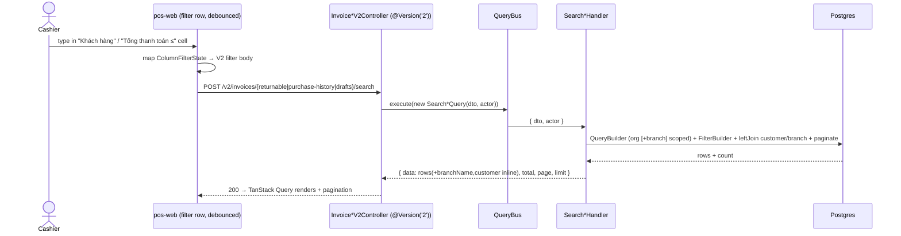
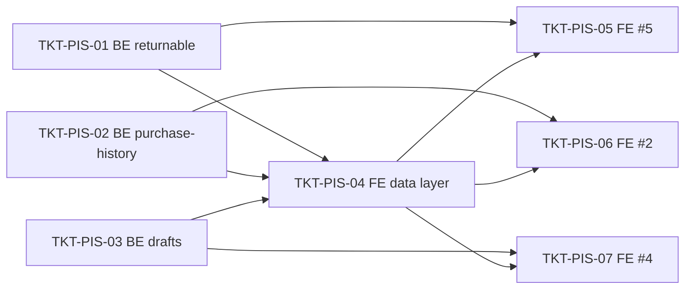

# EPIC-03062026 POS server-side invoice search

## Goal

Move the three POS-web invoice-list surfaces from **client-side** filtering (fetch one page, filter in memory) to **server-side** search via dedicated CQRS endpoints, so the filter rows query the full dataset with pagination. Reuses the `invoice-v2` CQRS pattern (`cqrs-search-endpoint` skill) — `FilterBuilder` + the shared filter sub-DTOs — but adds **new** endpoints; the shared `POST /v2/invoices/search` (used by `InvoiceListPage`) is **left untouched** per decision.

The three surfaces:

| # | Surface | FE entry point | Today | Target endpoint |
| - | ------- | -------------- | ----- | --------------- |
| #5 | "Đổi trả nhanh" (returnable sales) | `ReturnGoodsPage` → `ReturnInvoiceTable` | `GET /invoices?status=paid` + in-memory filter | `POST /v2/invoices/returnable/search` |
| #2 | "Lịch sử mua hàng" (customer purchase history) | `CustomerDetailDialog` → `PurchaseHistoryTab` | `GET /invoices?customerId=…` + in-memory filter | `POST /v2/invoices/purchase-history/search` |
| #4 | "Hóa đơn chưa thanh toán" (held drafts) | `DraftInvoicesDialog` | `GET /invoices/drafts` + in-memory filter | `POST /v2/invoices/drafts/search` |

## Decisions (locked)

- **#5 returnable set:** `type = SALE` **and** `status = PAID` only (matches the current `status=paid` behaviour; single-value enum, no IN-list needed).
- **"Tổng thanh toán" column + its `≤` filter:** maps to `invoice.totalPaid` (numeric(18,2)).
- **Store/branch name** ("Tên cửa hàng" #2 / "Chi nhánh" #5): served by the **new dedicated endpoints**, which `leftJoin` the branch table and inline `branchName` per row — the shared V2 endpoint is not modified.
- **#4 "Toàn bộ" control** is the `PosDateRangeFilter` date preset (not a status dropdown); the free-text box ORs over `code` / customer `name` / customer `phone`.

## Scope

- **API (`modules/pos`):** three new CQRS query+handler+controller triplets + DTOs; register handlers in `pos.module.ts`. No schema change, no new entity, no migration. Read-only — no events, no idempotency surface.
- **Multi-tenant scope:** all handlers filter by `actor.organizationId`. #5 and #4 also scope by `actor.branchId` (POS is branch-bound); #2 is **org-wide for one `customerId`** (purchase history spans stores), so it does *not* branch-scope.
- **FE (`pos-web`):** new request/response DTOs in `src/dtos/invoice.dto.ts`, new `invoiceService` methods, new `INVOICE_KEYS`, rewritten react-query hooks, a shared `ColumnFilterState → V2 filter body` mapper, and re-wiring of the three screens to drive the existing `PosDataTableFilterCell` rows server-side (debounced) with pagination. pos-web hand-writes its DTOs and calls `http` directly — it does **not** consume `@erp/api-client`, so `openapi:generate` is hygiene-only, not an FE gate.
- **No backoffice changes.** UI strings stay Vietnamese; backend identifiers/comments/Swagger English.

## Success Metrics

- Typing in any filter cell on #5 / #2 / #4 narrows results against the **whole** dataset, not just the loaded page; pagination reflects the server `total`.
- #5 returns only `SALE` + `PAID` invoices for the active branch; #2 returns one customer's finalized invoices across stores with the store name shown; #4 returns held drafts matching the free-text + date-range query.
- The shared `POST /v2/invoices/search` and `InvoiceListPage` behave exactly as before (no diff to that endpoint).
- `pnpm --filter @erp/api test` green incl. new handler specs (org/branch scoping + each filter operator).

## Flows

## Tickets

- [TKT-PIS-01 BE: Returnable-invoice search endpoint (#5)](../tickets/TKT-PIS-01-be-returnable-invoice-search.md)
- [TKT-PIS-02 BE: Customer purchase-history search endpoint (#2)](../tickets/TKT-PIS-02-be-purchase-history-search.md)
- [TKT-PIS-03 BE: Draft-invoice search endpoint (#4)](../tickets/TKT-PIS-03-be-draft-invoice-search.md)
- [TKT-PIS-04 FE: Invoice-search data layer (DTOs + service + hooks + filter mapper)](../tickets/TKT-PIS-04-fe-invoice-search-data-layer.md)
- [TKT-PIS-05 FE: Wire "Đổi trả nhanh" to server-side search (#5)](../tickets/TKT-PIS-05-fe-return-goods-search.md)
- [TKT-PIS-06 FE: Wire "Lịch sử mua hàng" to server-side search (#2)](../tickets/TKT-PIS-06-fe-purchase-history-search.md)
- [TKT-PIS-07 FE: Wire "Hóa đơn chưa thanh toán" to server-side search (#4)](../tickets/TKT-PIS-07-fe-draft-invoices-search.md)

## Dependencies

- Depends on: [EPIC-007 PosInvoiceCustomerPromotions](./EPIC-007-pos-invoice-customer-promotions.md) (invoice entities + V2 search pattern), [EPIC-011 PosReturnExchange](./EPIC-011-pos-return-exchange.md) (return eligibility semantics).
- Reuses: `common/filters/FilterBuilder` + `filter.dto` sub-DTOs; `@Actor()`/`ActorContext`; `CqrsModule` (already imported in `pos.module.ts`); the `cqrs-search-endpoint` skill; pos-web `PosDataTableFilterCell`, `columnFilter.ts`, `FilterOperatorEnum`/`OPERATOR_OPTIONS`, `INVOICE_KEYS`, and the `http`/`invoiceService` data layer.
- Reuses existing `pos.invoice.read` permission — no new permission seeding.

### Ticket dependency graph

## Out of scope

- Modifying `POST /v2/invoices/search` or `InvoiceListPage`.
- Changing return/exchange creation, debt collection, or checkout flows.
- Fixing the latent `GET /invoices/drafts` session-scoping gap (FE passes no `session_id`, so it currently returns all org drafts) beyond what TKT-PIS-03/07 explicitly decide.
- Adding a status IN-list to `FilterBuilder` (not needed; #5 is single-status).
