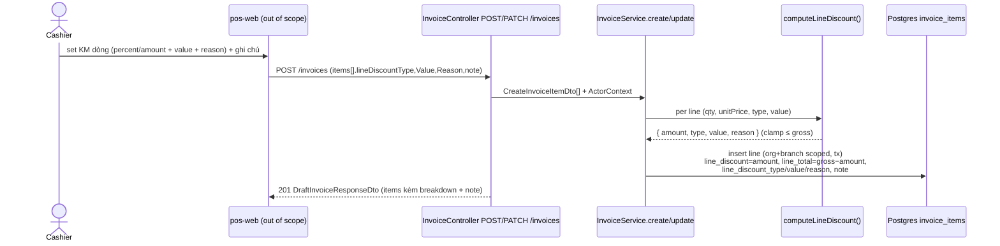
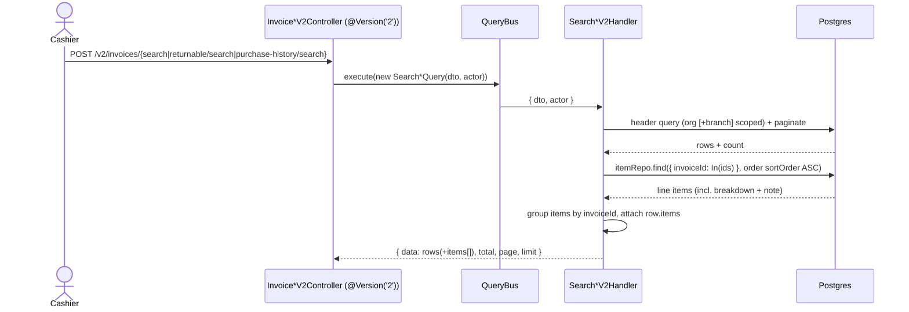
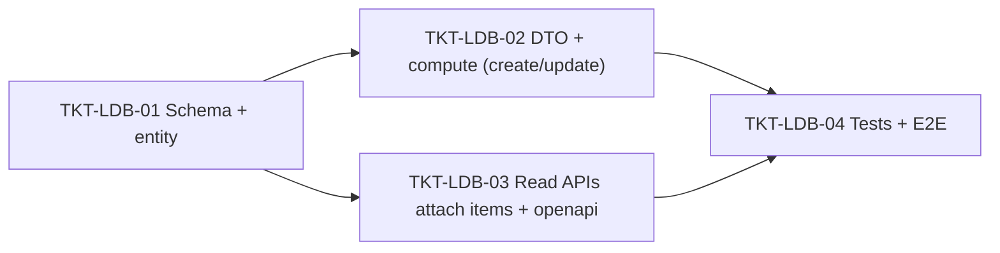

# EPIC-03062026 POS per-line discount breakdown + line note in read APIs

## Goal

Cho phép mỗi dòng hàng trên hóa đơn POS mang **khuyến mãi/chiết khấu thủ công riêng** (vd "KM 10 % (59.000) - cc") và **ghi chú riêng** ("Ghi chú: hhh"), rồi **lưu đầy đủ breakdown** và **trả về** các trường này ở mọi API đọc hóa đơn liên quan.

Hiện trạng đã map từ code:

- `InvoiceItemEntity` đã có `lineDiscount` (numeric — **chỉ số tiền đã tính**) và `note` (text). `CreateInvoiceItemDto` đã nhận cả hai. `InvoiceService.create()` (dòng 122) và `InvoiceService.update()` (dòng 274) đều map hai trường này và tính `lineTotal = quantity × unitPrice − lineDiscount`.
- **Thiếu breakdown:** không lưu được loại giảm (`percent`/`amount`), giá trị gốc (vd `10`), và lý do/nhãn (vd `cc`). Đọc lại không tái hiện được "10 %" hay nhãn "cc".
- **Đọc:** `GET /invoices/:id` (`findOneWithItems`), `GET /invoices/drafts` (`findDrafts`) và `POST /v2/invoices/drafts/search` **đã trả line items**. Ba handler search posted **chỉ trả header, không có line items**: `SearchInvoicesV2`, `SearchReturnableInvoicesV2`, `SearchPurchaseHistoryV2`.

## Decisions (locked với user)

- **Mô hình:** chiết khấu **dòng thủ công** — KHÔNG liên kết `PromotionEntity`/`DiscountCode`/`InvoicePromotionEntity` (vốn chỉ ở cấp hóa đơn). Khớp với `CartLineDiscount { type: "percent" | "amount"; value; reason }` mà pos-web đang giữ ở state.
- **Lưu đầy đủ breakdown:** thêm 3 cột vào `invoice_items` — `line_discount_type` (enum `percent`/`amount`, nullable), `line_discount_value` (numeric(18,2), nullable), `line_discount_reason` (varchar, nullable). Giữ nguyên `line_discount` (số tiền đã tính, **server tính lại** từ type+value) và `note`.
- **Server là nguồn sự thật cho số tiền:** khi `lineDiscountType` có mặt, backend tự tính `lineDiscount` (`percent` → `round2(quantity × unitPrice × value / 100)`; `amount` → `round2(value)`), clamp ≤ gross. Khi `lineDiscountType` vắng mặt → giữ tương thích ngược: dùng `lineDiscount` thô như hiện tại (type/value = null).
- **Trả line items ở cả 3 nhóm API đọc** (user chọn cả ba): draft (đã có → tự lộ cột mới), posted search + detail, returnable + purchase-history. `findOneWithItems`/draft đã trả items nên cột mới tự xuất hiện; **ba V2 search handler posted sẽ được gắn thêm `items[]`** theo đúng pattern của `SearchDraftInvoicesV2Handler`.
- **Phạm vi: chỉ backend.** KHÔNG sửa `invoicePayloadMapper.ts` (đang strip `note` + hardcode `lineDiscount: 0`) hay UI pos-web — tách sang PR FE khác.
- **Tương thích EPIC-03062026 (pos-invoice-search):** epic đó cố tình **không đụng** `POST /v2/invoices/search`. Epic này **có** đụng — nhưng chỉ **bổ sung** mảng `items[]` mỗi row (additive, consumer cũ bỏ qua field thừa). Đánh đổi: tăng kích thước payload list. Chấp nhận theo lựa chọn của user (mirror y hệt draft search đã làm).

## Scope

- **Entities/tables:** mở rộng `invoice_items` (3 cột mới) — KHÔNG bảng mới. Migration hand-written. Scope giữ nguyên `organization + branch` của `InvoiceItemEntity`.
- **API surface (`modules/pos`):**
  - Ghi: `CreateInvoiceItemDto` (+ DTO item của `UpdateInvoiceDto` nếu tách riêng) nhận 3 field mới; helper `computeLineDiscount()` dùng chung trong `create()` + `update()`.
  - Đọc: gắn `items[]` vào `SearchInvoicesV2Handler`, `SearchReturnableInvoicesV2Handler`, `SearchPurchaseHistoryV2Handler`. Verify draft/detail tự lộ cột mới.
- **Events:** không. Read-only ở phía đọc; ghi đi qua create/update draft (đã thừa hưởng `IdempotencyInterceptor` toàn cục — không tái hiện).
- **FE:** ngoài phạm vi.
- Ngôn ngữ: prose ticket tiếng Việt; toàn bộ identifier/enum/cột/Swagger/error/log/comment backend là **English**.

## Success Metrics

- Tạo/sửa draft với `lineDiscountType=percent, lineDiscountValue=10, lineDiscountReason="cc"` trên 1 dòng giá 590.000 → DB lưu `line_discount_type='percent'`, `line_discount_value=10`, `line_discount=59000`, `line_discount_reason='cc'`, `line_total=531000`; `note` lưu đúng.
- `GET /invoices/:id`, `GET /invoices/drafts`, `POST /v2/invoices/drafts/search`, và **ba** endpoint posted search/returnable/purchase-history **đều** trả mỗi line item kèm `lineDiscountType`, `lineDiscountValue`, `lineDiscount`, `lineDiscountReason`, `note`.
- Dòng cũ (đã tạo trước migration) vẫn hợp lệ: `line_discount_type/value/reason = NULL`, `line_discount` giữ nguyên — không vỡ đọc.
- `pnpm --filter @erp/api test` xanh (unit compute + handler attach) và E2E round-trip create→read xanh.

## Flows

### Ghi — tạo/sửa draft với KM dòng + ghi chú

### Đọc — search posted gắn line items

## Tickets

- [TKT-LDB-01 BE: Migration + entity columns (line discount breakdown)](../tickets/TKT-LDB-01-be-schema-line-discount-breakdown.md)
- [TKT-LDB-02 BE: DTO fields + computeLineDiscount in create/update](../tickets/TKT-LDB-02-be-dto-service-compute.md)
- [TKT-LDB-03 BE: Attach line items to posted/returnable/purchase-history search + verify reads + openapi](../tickets/TKT-LDB-03-be-read-apis-line-items.md)
- [TKT-LDB-04 BE: Tests + E2E round-trip + DoD gate](../tickets/TKT-LDB-04-be-tests-e2e.md)

## Dependencies

- Depends on: [EPIC-007 PosInvoiceCustomerPromotions](./EPIC-007-pos-invoice-customer-promotions.md) (invoice + invoice-item entities, checkout), [EPIC-03062026 POS server-side invoice search](./EPIC-03062026-pos-invoice-search.md) (the three V2 search handlers this epic extends).
- Reuses: `InvoiceItemEntity`/`InvoiceService` (extend, không tạo mới); `SearchDraftInvoicesV2Handler` item-attach pattern; `DraftInvoiceResponseDto`/`DraftInvoiceItemDto` (extends entity → cột mới tự lộ); `@Actor()`/`ActorContext`; `CqrsModule` (đã import trong `pos.module.ts`); `IdempotencyInterceptor` toàn cục.
- Reuses permission `pos.invoice.read` / `pos.invoice.write` hiện có — không seed permission mới.

### Ticket dependency graph

## Out of scope

- FE pos-web: `invoicePayloadMapper.ts` (đang strip `note` + hardcode `lineDiscount: 0`), hiển thị breakdown khi đọc, `CartLineDiscount` wiring — tách PR khác.
- Liên kết dòng tới `PromotionEntity`/`DiscountCode`/`VoucherEntity` hoặc thêm `invoice_item_id` vào `invoice_promotions`.
- Line items của luồng return/exchange (`create-return-invoice.service.ts`, `create-exchange-invoice.service.ts`) — chúng copy từ dòng gốc, không nhận DTO KM dòng. Cột mới vẫn tồn tại nhưng để NULL cho các dòng này.
- Áp KM dòng vào tính điểm/COGS/journal — `lineTotal` đã trừ chiết khấu nên subtotal/amountDue tự đúng; không thay đổi accounting posting.
