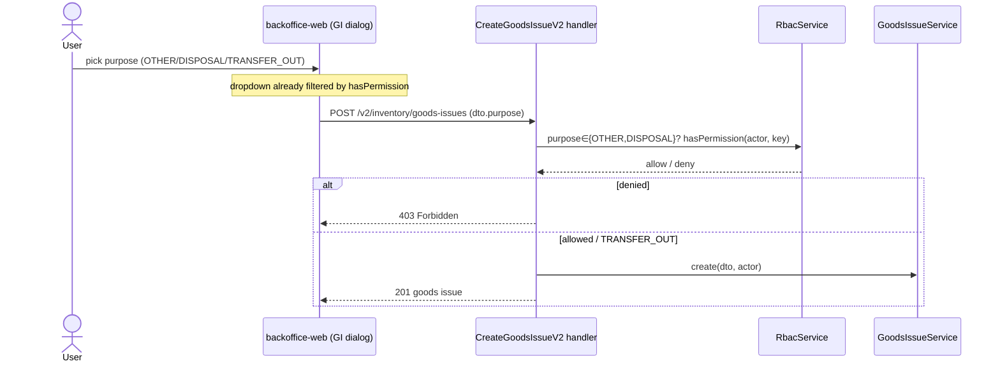
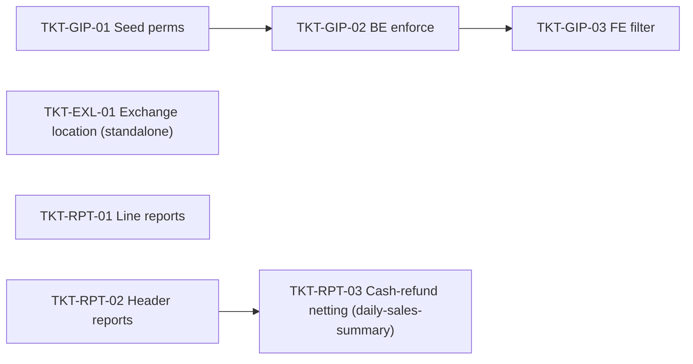

# EPIC-05072026 Inventory & report corrections (items #3, #8, #10)

## Goal

Three independent correctness fixes across goods-issue, POS exchange, and reporting.
Bundled as one batch epic; the three streams share no code and can ship in any order.

| # | Stream | Problem | Outcome |
| - | ------ | ------- | ------- |
| #3 | Goods-issue purpose permissions (`GIP`) | Any user past the single `inventory.write` guard can create a goods issue of **any** purpose | "Xuất khác" (OTHER) & "Hủy hàng" (DISPOSAL) gated behind dedicated permissions; "Điều chuyển" (TRANSFER_OUT) stays open |
| #8 | Exchange "Mua thêm" → showroom (`EXL`) | Exchange **new** lines deduct from the storage warehouse (kho lưu trữ) instead of the showroom | New lines resolve the showroom location like every other sale/return path |
| #10 | Reports net returns (`RPT`) | The 4 active invoice reports sum every invoice positively — a return **adds** to revenue; cash refunds are also never netted | Revenue/quantity net returns & exchanges via line `direction` (OUT `+`, IN `−`); cash figures net refunds via `refundedAmount`/`refundMethod` |

## Decisions (locked)

- **#3:** two **separate** permission keys — `inventory.goods-issue.other-issue` and
  `inventory.goods-issue.disposal` — so a role can be allowed one purpose without the other.
- **#10:** the canonical netting rule is **line `direction`** (`OUT` adds, `IN` subtracts);
  reports derive goods figures from `Σ(OUT) − Σ(IN)`, which nets SALE, RETURN and mixed
  EXCHANGE uniformly.
- **#10:** the legacy `reporting.service.ts` dashboard (queries non-existent `pos_sales` /
  `pos_returns` / `receivables` tables) is **out of scope** — a separate rewrite.
- **#10 (cash refunds):** a cash refund is **not** stored in `invoice_payments` (only
  net-positive payments are), so the report sources it from the invoice header
  (`refundMethod === CASH && refundedAmount > 0`) and subtracts it from the cash columns and
  `Thực thu`. Scoped to `daily-sales-summary`; `invoice-order-listing` is deferred.

## Scope

- **API `modules/inventory/goods-issue`:** inject `RbacService` into the create path for a
  body-based (`dto.purpose`) permission check; no schema change.
- **API `modules/rbac` + `database/seeds`:** two new permission keys (auto-persisted by
  `PermissionSyncService.onApplicationBootstrap` — **no migration**) + default role grants.
- **API `modules/pos`:** two-line fix in `create-exchange-invoice.service.ts`; remove a stray
  `console.log` in `resolve-branch-item-locations.ts`. Logic-only.
- **API `modules/reporting/invoice-report`:** thread `type` / line `direction` into the four
  report row-inputs + in-memory aggregators and sign them. Response columns unchanged.
- **FE `backoffice-web`:** filter the goods-issue purpose dropdown by `hasPermission`.
- **No `openapi:generate`** — no endpoint/DTO/response-shape change in any stream.
- All backend identifiers/comments/Swagger/logs English; FE strings Vietnamese.

## Success Metrics

- A user lacking `inventory.goods-issue.disposal` cannot see "Hủy hàng" and a direct API
  create with `purpose: DISPOSAL` returns 403; granting the key restores both.
- A POS exchange "Mua thêm" line for a warehouse-shelved item posts its `SALE_ISSUE` stock
  movement against the **showroom** location.
- A day with SALE 100,000 + RETURN 50,000 reports **50,000** revenue (not 150,000) on both
  `daily-sales-summary` and `revenue-by-item`.
- On `daily-sales-summary`, a SALE 1,500,000 (cash) + EXCHANGE refunding 750,000 cash reports
  `Tiền mặt = 750,000` and `Thực thu = 750,000` (not 1,500,000).
- `pnpm --filter @erp/api test` green including the new GI-permission, exchange-location and
  report-netting specs.

## Flows

## Tickets

- [TKT-GIP-01 Seed goods-issue purpose permissions + role grants](../tickets/TKT-GIP-01-seed-goods-issue-purpose-permissions.md)
- [TKT-GIP-02 Enforce purpose permission in the create path](../tickets/TKT-GIP-02-enforce-goods-issue-purpose-permission.md)
- [TKT-GIP-03 FE: filter goods-issue purpose options by permission](../tickets/TKT-GIP-03-fe-filter-goods-issue-purpose.md)
- [TKT-EXL-01 Fix exchange new-line location to showroom](../tickets/TKT-EXL-01-fix-exchange-new-line-showroom.md)
- [TKT-RPT-01 Net returns in line-grain reports](../tickets/TKT-RPT-01-net-returns-line-grain-reports.md)
- [TKT-RPT-02 Net returns in header-grain reports](../tickets/TKT-RPT-02-net-returns-header-grain-reports.md)
- [TKT-RPT-03 Net cash refunds in daily-sales-summary](../tickets/TKT-RPT-03-net-cash-refunds-daily-sales-summary.md)

## Dependencies

- Depends on: [EPIC-011 PosReturnExchange](./EPIC-011-pos-return-exchange.md) (invoice
  `type`/`direction` + exchange flow), [EPIC-013 StockByLocationApi](./EPIC-013-stock-by-location-api.md)
  (showroom/PSL location model), and the existing goods-issue + reporting modules.
- Reuses: `RbacService.hasPermission` (dynamic-check precedent at
  `reporting/reporting.service.ts`), `PermissionSyncService`, `resolveBranchItemLocations`
  (`{ showroomOnly: true }`), the in-memory invoice-report aggregators, and FE
  `lib/permissions.ts hasPermission`.

### Ticket dependency graph

## Out of scope

- Legacy dashboard reports (`reporting.service.ts` + `reports/{Dashboard,Sales,Aging,Cash}*Page`)
  querying non-existent tables.
- Changing STAFF's base ability to create goods issues (still `inventory.write`).
- The remaining batch items (1, 2, 4–7, 9).
