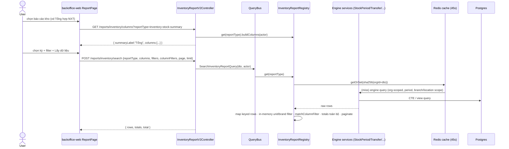
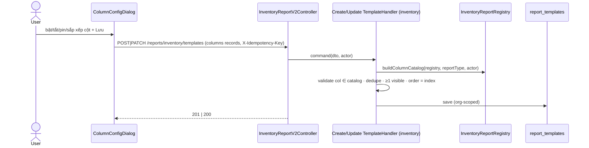
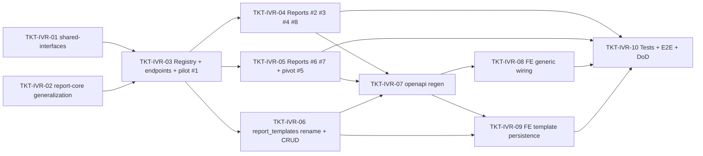

# EPIC-06072026 Báo cáo kho hàng theo structure báo cáo bán hàng (inventory-report v2)

## Goal

4 báo cáo bán hàng đã theo "structure đúng" (EPIC-11062026 registry + EPIC-24062026 chain-store 3-API contract): backend trả **column catalog** giàu metadata (band, filterKind, filterOptions, align, pinned, width, summaryLabel) → FE render generic; `POST search` trả **rows keyed theo field** + **columnFilters** + **totals backend tính trên toàn bộ rows**; `GET filter-options` cho dropdown thật; `invoice_report_templates` lưu cấu hình "Hiển thị cột" `{col, displayName, visible, frozen, order}` validate theo catalog từng reportType.

8 báo cáo kho hiện chạy trong `ReportPage` (chain-store) nhưng qua **adapter riêng từng báo cáo** (`_api/inventory-report.api.ts` → legacy `GET /reports/inventory/*`) với các thiếu sót:

- Dropdown filter đang **mock** (`report-inventory-filter.mock.ts`).
- Footer "Tổng" cộng **client-side trên trang hiện tại** (sai khi phân trang).
- **Không có lọc theo cột** (columnFilters).
- Cấu hình cột là **hằng số FE** (`report-registry/*.registry.ts`) thay vì backend catalog.
- Nhiều cột hardcode rỗng/0 dù engine có data (brand, color, size, transferOut/incoming, group...).
- Không lưu được cấu hình "Hiển thị cột".

**Outcome đo được:** 8 báo cáo kho chạy hoàn toàn theo contract 3-API như báo cáo bán hàng — columns từ backend, dropdown thật, lọc theo cột hoạt động, totals đúng trên toàn dataset, cấu hình cột lưu backend.

## Scope

- **Entities/tables:** KHÔNG bảng mới. 1 migration duy nhất: **rename `invoice_report_templates` → `report_templates`** (+ rename 2 index, down đảo ngược; không di chuyển data) — bảng template giờ generic cho cả sales lẫn inventory (quyết định Step 1). Entity → `ReportTemplateEntity`, file chuyển về `reporting/report-core/`.
- **API surface (custom, module `inventory-reports` sẵn có):** controller mới `inventory-report-v2.controller.ts` (`@Controller('reports/inventory')`, không đụng legacy GET routes):
  - `GET /reports/inventory/columns?reportType=` → `{ summaryLabel, columns: ReportColumnHeader[] }`
  - `POST /reports/inventory/search` → `{ rows, totals, total }` (keyed rows, columnFilters, totals toàn dataset)
  - `GET /reports/inventory/filter-options?type=&search=&page=` → `IDropdownOption[]`
  - `GET/POST/PATCH/DELETE /reports/inventory/templates[/:id]`
- **Registry song song:** `InventoryReportRegistry extends ReportRegistry<InventoryReportDefinition>` — KHÔNG đăng ký vào registry invoice (khác permission; `GET /reports/invoices/types` list toàn bộ `report_types` → seed inventory sẽ lộ vào picker bán hàng). KHÔNG seed `report_types`.
- **Core generalization (zero behavior change):** `ReportDefinition<TDto>`/`ReportRegistry` generic hoá; extract `matchColumnFilter` sang `reporting/report-core/column-filter.util.ts` (re-export chỗ cũ).
- **Data engines tái dùng nguyên:** `StockPeriodService`, `DocumentDetailService`, `StockBalancePivotService`, `TransferReportService`, `TempWarehouseReportService`, `date-range-resolver`, cache Redis 45s (`CacheService.getOrSet("inventory-reports", ...)`).
- **Events:** không. Chỉ đọc. **Permission:** tái dùng `inventory.reports.read`, không seed mới.
- **FE (backoffice-web, chain-store ReportPage):** thêm `backendKey` + `backendSource: 'invoice' | 'inventory'` vào metadata 8 report kho; generic fetcher route theo `backendSource`; xoá 8 custom fetcher + mock; dropdown thật qua filter-options; `ColumnConfigDialog` load/save template.
- **Legacy giữ nguyên:** `GET /reports/inventory/*` cũ + trang `/reports/storage/*` + static registries (fallback) — không đụng (quyết định Step 1).

## Quyết định (chốt ở Step 1)

1. **Full BE + FE** trong 1 epic.
2. **Legacy untouched** — contract mới song song.
3. **"Hiển thị cột" lưu backend** — tái dùng bảng template, **rename → `report_templates`**; handlers CQRS mới trong module inventory validate qua `buildColumnCatalog(InventoryReportRegistry, ...)` (util sẵn có, đã nhận registry param).
4. **Đắp cột có nguồn dữ liệu** (brand/color/size/transferOut/incoming từ `StockPeriodRow`; supplier enrich từ `item_providers` primary; group từ `categoryName`); cột không có nghiệp vụ backing giữ null (như epic bán hàng).

## 8 report definitions (backendKey → engine)

| # | FE key | backendKey | Engine |
|---|---|---|---|
| 1 | `inventory_in_out_stock_summary` | `inventory-stock-summary` | StockPeriodService `item_location` |
| 2 | `warehouse_voucher_detail_list` | `inventory-document-detail` | DocumentDetailService |
| 3 | `inventory_in_out_stock_quantity_detail` | `inventory-stock-quantity-detail` | StockPeriodService `includeBreakdown` |
| 4 | `store_inventory_in_out_stock_summary` | `inventory-stock-summary-by-store` | StockPeriodService `item_branch` |
| 5 | `stock_quantity_by_store` | `inventory-stock-by-store-pivot` | StockBalancePivotService (**cột động** `branch.qty.<branchId>` — mirror pattern payment-method động của daily-sales-summary) |
| 6 | `transfer_in_out_summary` | `inventory-transfer-summary` | TransferReportService (summary) |
| 7 | `transferred_goods_summary_by_store` | `inventory-transfer-by-store` | TransferReportService (by branch; `sourceStoreId` bắt buộc, default `actor.branchId`) |
| 8 | `temporary_warehouse_out_goods` | `inventory-temp-warehouse-out` | TempWarehouseReportService |

Column keys **PHẢI trùng key FE hiện có** (registry/mapper) để fallback + URL state tương thích.

## Success Metrics

- `GET /reports/inventory/columns` trả catalog đủ 8 reportType, VI labels + bands đúng; report #5 có cột động per-branch.
- `POST /reports/inventory/search`: rows keyed đúng shape FE; `totals` = tổng **toàn bộ** rows đã lọc (không phải trang); columnFilters (number + text operators) hoạt động; #6 sửa đúng bug `inOutDiffQty/Value` (map từ `qtyInOutDifference`).
- `GET /reports/inventory/filter-options?type=warehouse` trả storages org-scoped; FE không còn import mock nào cho báo cáo kho.
- Template CRUD round-trip với reportType kho; migration rename up/down clean; e2e template invoice cũ vẫn xanh sau rename.
- Legacy `GET /reports/inventory/*` không đổi response (regression).
- `pnpm --filter @erp/api test` + `test:e2e` + `openapi:generate` (snapshot + schema.ts committed).

## Flows

### Cấu hình bảng + lấy dữ liệu

### Lưu "Hiển thị cột" (template)

## Out of scope

- Dọn/xoá legacy endpoints + trang `/reports/storage/*` + static registries (epic cleanup sau khi contract mới soak).
- Consolidated-permission cho báo cáo kho (giữ parity org-wide với legacy dưới `inventory.reports.read`; flag cho product nếu cần siết như sales).
- FE template persistence cho 4 báo cáo bán hàng (hooks viết generic theo `backendSource`, sales adopt ở epic sau).
- Export Excel; multi-template có tên / chia sẻ per-user (v1 = 1 template ngầm định per reportType).
- Đắp số liệu cho cột chưa có nghiệp vụ backing (`inSalePrice/outSalePrice`, `branchCode` của branches, `inWh/outWh/outVoid`...) — trả null.

## Rủi ro đã nhận diện

1. color/size ngoài `StockPeriodRow` (document-detail, transfer-by-branch, pivot) — verify SQL engine có select không; nếu không → dùng lại attribute-subquery heuristic sẵn có hoặc trả null.
2. Fetch-all để columnFilters/totals — cap `MAX_REPORT_ROWS`, cache 45s, `hideZeroRows` default cho #1/#3/#4; sau này đẩy filter xuống SQL nếu chậm (contract không đổi).
3. Pivot #5 rộng khi org nhiều chi nhánh.
4. Số liệu #6 hiển thị **thay đổi** (sửa bug map `inOutDiffQty` từ `qtyDifference` → `qtyInOutDifference`) — ghi chú release.
5. Nguồn option `warehouse` = storages (resolve → locationIds); confirm org scoping bảng storages.

## Tickets

- [TKT-IVR-01 shared-interfaces: inventory-report contract](../tickets/TKT-IVR-01-shared-interfaces-inventory-report-contract.md)
- [TKT-IVR-02 BE: report-core generalization](../tickets/TKT-IVR-02-report-core-generalization.md)
- [TKT-IVR-03 BE: registry + v2 endpoints + pilot report #1](../tickets/TKT-IVR-03-be-registry-endpoints-pilot-report.md)
- [TKT-IVR-04 BE: reports #2 #3 #4 #8](../tickets/TKT-IVR-04-be-stockperiod-document-temp-reports.md)
- [TKT-IVR-05 BE: reports #6 #7 + pivot #5](../tickets/TKT-IVR-05-be-transfer-pivot-reports.md)
- [TKT-IVR-06 BE: rename report_templates + inventory templates CRUD](../tickets/TKT-IVR-06-be-report-templates-rename-crud.md)
- [TKT-IVR-07 openapi:generate + api-client snapshot](../tickets/TKT-IVR-07-openapi-regen.md)
- [TKT-IVR-08 FE: generic wiring + real dropdowns + xoá adapter/mock](../tickets/TKT-IVR-08-fe-generic-wiring.md)
- [TKT-IVR-09 FE: template persistence trong ColumnConfigDialog](../tickets/TKT-IVR-09-fe-template-persistence.md)
- [TKT-IVR-10 Tests + E2E + DoD gate](../tickets/TKT-IVR-10-tests-e2e-dod.md)

## Dependencies

- **Depends on:** [EPIC-11062026 invoice-report-builder](./EPIC-11062026-invoice-report-builder.md) (ReportDefinition/ReportRegistry, template entity + columns util, aggregator), [EPIC-24062026 chain-store-report-api](./EPIC-24062026-chain-store-report-api.md) (3-API contract, `ReportColumnHeader` giàu, filter-options, keyed rows), module `inventory-reports` sẵn có (5 engine services + views + cache), [EPIC-15062026 report-template-column-config](./EPIC-15062026-report-template-column-config.md) (`ReportTemplateColumn` records + `buildColumnCatalog`).
- **Reuses:** `inventory.reports.read`, `CacheService`, `date-range-resolver`, `ColumnFilterDto`, `matchColumnFilter`, `report-column.util`, `IdempotencyInterceptor` toàn cục, FE `mapHeadersToTableConfig`/`buildColumnFilters`/`RemoteSelectField`.

### Ticket dependency graph

