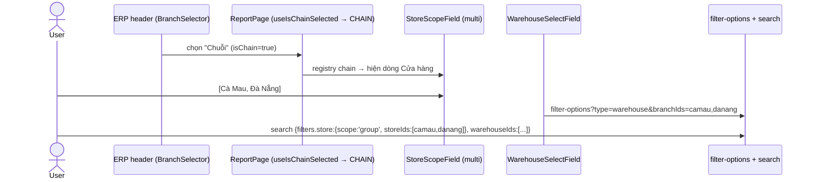
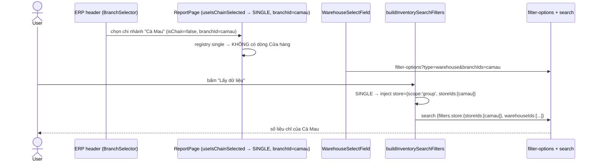
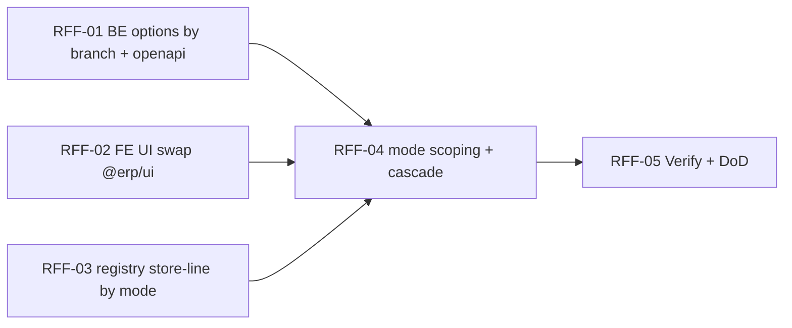

# EPIC-06072026 Report filter: store filter theo mode (chain/single) + kho phụ thuộc cửa hàng + đồng nhất control @erp/ui

## Goal

Panel filter báo cáo kho (chain-store `ReportPage`) phải phản ánh đúng **mode chi nhánh** do selector "chi nhánh" ở ERP header quyết định (`useIsChainSelected()` → CHAIN | SINGLE):

1. **CHAIN** (header chọn "Chuỗi"): dòng "Cửa hàng" = **multi-select** (StoreScope: Tất cả / Theo nhóm cửa hàng). Số liệu + dropdown "Kho" scope theo các cửa hàng đã chọn.
2. **SINGLE** (header chọn 1 chi nhánh cụ thể): **không có dòng "Cửa hàng"** — cửa hàng đã cố định = chi nhánh ở header. Số liệu + dropdown "Kho" scope theo **đúng chi nhánh header** đó.
3. **Kho phụ thuộc cửa hàng**: dropdown "Kho" chỉ liệt kê kho thuộc (các) cửa hàng đang hiệu lực — hết cảnh trả toàn bộ kho org bị trùng tên "Kho chính"/"Kho dự trữ"/"Kho showroom" ×N chi nhánh (xem ảnh).
4. **Đồng nhất control**: thay control thô (`<select>`/`<input date>` màu hardcode) bằng `@erp/ui` `SingleSelect`/`DateTimeField`.

**Outcome đo được**: header chọn "Cà Mau" (SINGLE) → panel không có dòng Cửa hàng, Kho chỉ hiện kho Cà Mau, số liệu chỉ của Cà Mau. Header chọn "Chuỗi" → dòng Cửa hàng multi-select hiện lại, chọn cửa hàng nào thì Kho + số liệu theo đó. Mọi dropdown/date dùng chung look @erp/ui.

## Scope

- **Backend** (`apps/api/src/modules/inventory-reports/` + `common/`): thêm `branchIds` (optional) vào `InventoryFilterOptionsQueryDto` + lọc storages theo branch trong `warehouses()`; **siết scope theo quyền chi nhánh** — expose `actor.branchIds` (ActorContext) rồi clamp trong `resolveInventoryBranchIds` (report search) + `stores()`/`warehouses()` (filter-options) để scope luôn ⊆ `actor.branchIds` (403 khi request chi nhánh ngoài quyền). Không entity/migration/event/permission mới (dùng `branchIds` từ JWT). `resolveInventoryBranchIds` giữ nguyên chữ ký → 8 report definition không phải sửa.
- **FE** (`backoffice-web`):
  - **Registry**: tách `single_filterRegistry*` vs `chain_filterRegistry*` cho báo cáo kho có dòng Cửa hàng (#1, #2, #3, #6): CHAIN có `STORE`, SINGLE bỏ `STORE`. Thêm `STORE` vào #3 (chain) — backend #3 đã honor `filters.store`.
  - **Mode-aware scoping**: thread `activeBranchId` (từ `useBranchStore`) vào data fetcher; `buildInventorySearchFilters` inject `store={scope:'group', storeIds:[activeBranchId]}` khi SINGLE (cho 4 báo cáo split) — không hiện dòng Cửa hàng nhưng vẫn scope đúng.
  - **Warehouse cascade**: `WarehouseSelectField` tính `branchIds` = STORE scope (CHAIN) hoặc `[activeBranchId]` (SINGLE); extend `useReportFilterOptions` nhận `branchIds`; reset WAREHOUSE khi STORE đổi (CHAIN).
  - **UI swap**: `ReportSelectField`/`PeriodSelect`/`DateRangeField`/`ReportPageHeaderFilter` → @erp/ui.
- **openapi**: DTO đổi → `openapi:generate`, commit snapshot + `schema.ts`.
- **Out of scope**: báo cáo bán hàng (invoice source — đã có single-mode qua X-Branch-Id riêng); báo cáo #4/#5/#7/#8 (không có dòng Cửa hàng multi; #7 dùng SOURCE/RECEIVING, #8 dùng STORE_SINGLE — giữ nguyên); multi-select kho (giữ single); restructure layout panel (giữ row + Popover); redesign StoreScope radio.

## Quyết định (chốt ở Step 1)

1. **SINGLE mode**: cả **số liệu + kho** scope theo chi nhánh ở header (FE inject `store=[headerBranchId]` lúc search). Không hiện dòng Cửa hàng.
2. **Split single/chain** áp dụng cho **mọi báo cáo kho có dòng Cửa hàng**: #1 (Tổng hợp NXT), #2 (Bảng kê phiếu), #3 (Chi tiết SL — thêm STORE ở chain), #6 (NX điều chuyển).
3. **Quyền chi nhánh (backend hard-gate)**: scope luôn ⊆ `actor.branchIds`. Expose `branchIds` trên `ActorContext`; clamp trong `resolveInventoryBranchIds` + filter-options. Dùng **tập `actor.branchIds`** (không phải consolidated-permission binary như invoice). **`actor.branchIds` rỗng ⇒ no-access (data rỗng), KHÔNG phải org-wide** — vì hệ thống luôn gán chi nhánh tường minh (`BranchService.create` tự gán người tạo; seed gán admin vào mọi branch; `resolveUserBranches` = `user_branch_assignments`, không override theo role). Không có "system admin thấy tất cả" → mọi user chỉ thấy chi nhánh được gán. **Caveat vận hành** (ghi DoD): (a) sau khi được gán chi nhánh mới phải re-login/refresh token mới thấy (JWT `branchIds` baked lúc login); (b) admin không phải người tạo branch phải được `assignUser` thủ công.
4. **Redesign = chỉ thay control** (SingleSelect + DateTimeField), giữ layout + Popover.
5. **Kho giữ single-select** (backend `warehouseIds` vẫn nhận `[id]`).

## Success Metrics

- `GET /reports/inventory/filter-options?type=warehouse&branchIds=<A>,<B>` chỉ trả storages có `branch_id ∈ ({A,B} ∩ actor.branchIds)`, vẫn org-scoped.
- **Quyền chi nhánh**: `type=store` chỉ trả chi nhánh user quản lý; `search` với storeId ngoài `actor.branchIds` → 403; `scope='all'` → chỉ chi nhánh của user (không phải toàn org) khi bị giới hạn.
- CHAIN: chọn nhóm cửa hàng → Kho + số liệu theo storeIds; đổi cửa hàng → Kho reset; scope='all' → Kho = tất cả kho org.
- SINGLE: không có dòng Cửa hàng; Kho = kho của chi nhánh header; `POST /reports/inventory/search` gửi `store={scope:'group', storeIds:[headerBranchId]}` → số liệu chỉ của chi nhánh đó.
- Báo cáo #3 (Chi tiết SL) ở CHAIN có dòng Cửa hàng + Kho cascade y hệt #1.
- Mọi `<select>`/date trong panel render bằng @erp/ui; build backoffice xanh.
- `pnpm --filter @erp/api test` xanh; `openapi:generate` chạy, snapshot + `schema.ts` committed.

## Flows

### CHAIN mode (header = Chuỗi)

### SINGLE mode (header = 1 chi nhánh)

## Tickets

- [TKT-RFF-01 BE: options theo branchIds + clamp scope theo quyền chi nhánh (actor.branchIds) + openapi](../tickets/TKT-RFF-01-be-warehouse-options-by-branch.md)
- [TKT-RFF-02 FE: swap control thô → @erp/ui (SingleSelect/DateTimeField)](../tickets/TKT-RFF-02-fe-ui-erp-ui-controls.md)
- [TKT-RFF-03 FE: registry single/chain — dòng Cửa hàng theo mode (+ STORE cho #3 chain)](../tickets/TKT-RFF-03-fe-registry-store-line-by-mode.md)
- [TKT-RFF-04 FE: mode-aware scoping + warehouse cascade + extend hook + reset](../tickets/TKT-RFF-04-fe-mode-scoping-warehouse-cascade.md)
- [TKT-RFF-05 Verify + DoD gate](../tickets/TKT-RFF-05-verify-dod.md)

## Dependencies

- Depends on: [EPIC-06072026 inventory-report-v2](./EPIC-06072026-inventory-report-v2.md) (`/reports/inventory/filter-options` + search + `useReportFilterOptions` + `ReportFilterLine` + `resolveInventoryBranchIds` + `StorageEntity.branchId`).
- Reuses: `@erp/ui` `SingleSelect`/`DateTimeField`/`MultiSelectChips`; `useBranchStore` (`branchId`/`isChain`); `StoreScopeValue`; report zustand `setFilterValue`; `InventoryFilterOptionsQueryDto`.

### Ticket dependency graph

