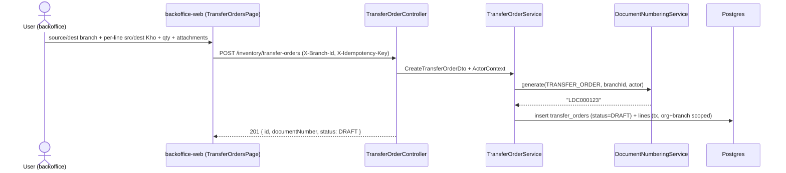
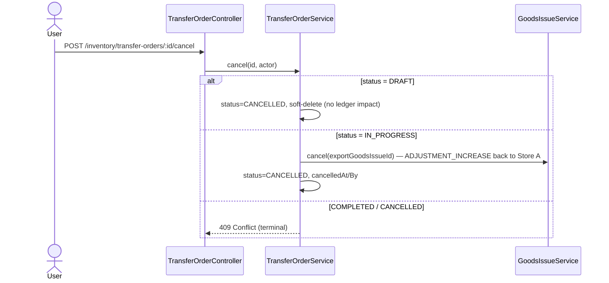
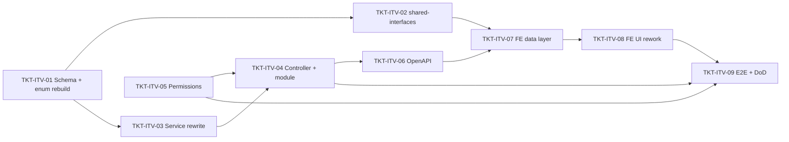

# EPIC-07062026 Phiếu Điều Chuyển Kho (two-phase transfer — extends TransferOrder)

## Goal

Turn the existing **Lệnh điều chuyển** (`TransferOrderEntity` / `transfer_orders`) into a **two-phase stock-transfer voucher** ("Phiếu điều chuyển kho") where the export leg (Store A) and the import leg (Store B) are confirmed **separately, at different times, by different staff**, with the voucher in-transit in between.

New state machine: `DRAFT → IN_PROGRESS → COMPLETED` (+ `CANCELLED`) — **replacing** the old `DRAFT → APPROVED → EXECUTED` flow and its `markExecuted` / `StockTransfer` linkage.

This is an **extend-in-place** epic, not a new entity: we keep the `transfer_orders` table, its page (`/inventory/transfer-orders`), and its `LDC` document number, and graft on the two-phase behavior. **Measurable outcome:** an existing-page voucher created in backoffice can be exported by the source branch (stock leaves Store A, status → `IN_PROGRESS`), then loaded by code and imported by the destination branch (stock arrives at Store B, two-way reference stored, status → `COMPLETED`) — multi-tenant scoped, idempotent, reversible.

## Scope

- **Extend** `TransferOrderEntity` (`transfer_orders`) — do NOT add a new table:
  - Status enum `TransferOrderStatus` rebuilt to `DRAFT | IN_PROGRESS | COMPLETED | CANCELLED` (drop `APPROVED`/`EXECUTED`; migrate `EXECUTED→COMPLETED`, `APPROVED→DRAFT`).
  - Add `exportGoodsIssueId`, `importGoodsReceiptId` (= **import_reference**), `exportedAt/By`, `completedAt/By`, `cancelledAt/By`, `attachmentIds` (jsonb). Legacy `approvedAt/By`, `executedAt/By`, `executedTransferId` columns are left in place but no longer written.
- **Extend** `TransferOrderLineEntity` (`transfer_order_lines`) — add `sourceStorageId` + `destinationStorageId` per line ("each item selects source & dest warehouse"); keep `requestedQty` as the transfer quantity. Header `sourceStorageId`/`destinationStorageId` remain the defaults.
- **Reuse** the posted-document machinery for the two stock legs — do NOT post the ledger directly:
  - Export → `GoodsIssueService.createAndPost({ purpose: TRANSFER_OUT, targetBranchId, … })` (ledger-only for TRANSFER_OUT).
  - Import → `GoodsReceiptService.createAndPost({ purpose: TRANSFER_IN, referenceType: STOCK_TRANSFER, referenceId: order.id, sourceBranchId, … })` (ledger-only when no `paymentMethod` / no `providerId`).
  - `import_reference` = the spawned **GoodsReceipt id** (`importGoodsReceiptId`); export `GoodsIssue id` stored too (`exportGoodsIssueId`) — bidirectional link.
- **Retire** the old endpoints `POST /:id/approve` + `POST /:id/execute` and `TransferOrderService.approve`/`markExecuted`; replace with `POST /:id/export` + `POST /:id/import` + `GET /by-code/:code`. (Verify no remaining caller of `markExecuted`.)
- Voucher code keeps the existing `LDC` number (`DocumentType.TRANSFER_ORDER`); rendered as a printable QR via the **In** button.
- **Negative stock ("xuất kho khống")** needs no backend change — the ledger allows negative balances (warns only). The warning is computed **client-side** before export; export proceeds regardless.
- Permissions: add `inventory.transfer.export` + `inventory.transfer.import`; reuse existing `inventory.transfer.read/create/cancel`; `inventory.transfer.approve` becomes legacy.
- **Backoffice-web only**: modify the existing `TransferOrdersPage` — create/edit dialog matching the current layout (THÔNG TIN CHUNG / CHỨNG TỪ / CHI TIẾT) but with **per-line source + dest warehouse** columns, attachments, export/import confirm buttons, load-by-code, QR/print, and cancel-reverse. No POS, no camera scanner.

## Success Metrics

- Full round-trip on the existing page: create (`DRAFT`, `LDC…`) → export by source branch (`IN_PROGRESS`, stock down at Store A, `exportGoodsIssueId` set) → load-by-code + import by destination branch (`COMPLETED`, stock up at Store B, `importGoodsReceiptId` = import_reference).
- After export the voucher is editable only on `description`/`attachmentIds`; changing lines/warehouses/branches in `IN_PROGRESS` is rejected; the user **cannot** force `COMPLETED` — only a successful import advances it.
- Export with insufficient stock succeeds (negative balance allowed) after the client-side warning.
- Cancelling `IN_PROGRESS` reverses the export (cancels the spawned `GoodsIssue`, restoring Store A); `DRAFT` cancels with no ledger impact.
- Spawning the two legs creates **no** journal entries, cash vouchers, or supplier debt.
- Migration is non-destructive: existing `transfer_orders` rows survive with remapped status; `transfer_order_lines` get nullable new columns; `synchronize` stays false; `migration:generate` shows no drift afterward.

## Flows

### Create (DRAFT)



### Export — Store A (DRAFT → IN_PROGRESS)

```mermaid
sequenceDiagram
  actor A as Store A staff
  participant FE as backoffice-web
  participant API as TransferOrderController
  participant SVC as TransferOrderService
  participant GI as GoodsIssueService
  participant L as StockLedgerService
  participant DB as Postgres
  A->>FE: load by code, review stock (client warns if insufficient)
  FE->>API: POST /inventory/transfer-orders/:id/export (X-Branch-Id=sourceBranchId)
  API->>SVC: confirmExport(id, actor)
  SVC->>SVC: assert status=DRAFT & actor.branchId=sourceBranchId; resolve each line source storage→location
  SVC->>GI: createAndPost({ purpose: TRANSFER_OUT, targetBranchId: destBranch, lines[src location] })
  GI->>L: recordBatchMovements (OUT, qty negative — negative allowed)
  GI-->>SVC: goodsIssue (POSTED)
  SVC->>DB: status=IN_PROGRESS, exportGoodsIssueId=gi.id, exportedAt/By (tx)
  SVC-->>API: publish "inventory.transfer-order.exported"
  API-->>FE: 200 { status: IN_PROGRESS }
```

### Import — Store B (IN_PROGRESS → COMPLETED)

```mermaid
sequenceDiagram
  actor B as Store B staff
  participant FE as backoffice-web
  participant API as TransferOrderController
  participant SVC as TransferOrderService
  participant GR as GoodsReceiptService
  participant L as StockLedgerService
  participant DB as Postgres
  B->>FE: load by code (only IN_PROGRESS loads for import)
  FE->>API: POST /inventory/transfer-orders/:id/import (X-Branch-Id=destinationBranchId)
  API->>SVC: confirmImport(id, actor)
  SVC->>SVC: assert status=IN_PROGRESS & actor.branchId=destBranch; resolve each line dest storage→location + uomCode
  SVC->>GR: createAndPost({ purpose: TRANSFER_IN, referenceType: STOCK_TRANSFER, referenceId: order.id, sourceBranchId, lines[dest location], no paymentMethod })
  GR->>L: recordBatchMovements (IN, qty positive)
  GR-->>SVC: goodsReceipt (POSTED) — no journal / no debt
  SVC->>DB: status=COMPLETED, importGoodsReceiptId=gr.id, completedAt/By (tx)
  SVC-->>API: publish "inventory.transfer-order.completed"
  API-->>FE: 200 { status: COMPLETED, importReference: gr.id }
```

### Cancel (DRAFT free / IN_PROGRESS reverses export)



## Tickets

- [TKT-ITV-01 Schema: extend transfer_orders + lines + enum rebuild + data migration](../tickets/TKT-ITV-01-schema-transfer-voucher.md)
- [TKT-ITV-02 shared-interfaces: TransferOrderStatus rebuild + TransferOrder/Line field additions](../tickets/TKT-ITV-02-shared-interfaces.md)
- [TKT-ITV-03 Service: rewrite create/getByCode/update/export/import/cancel; retire approve/markExecuted](../tickets/TKT-ITV-03-service.md)
- [TKT-ITV-04 Controller: replace approve/execute with export/import + by-code; module wiring + events](../tickets/TKT-ITV-04-controller-module.md)
- [TKT-ITV-05 RBAC: inventory.transfer.export + .import + VI labels](../tickets/TKT-ITV-05-permissions.md)
- [TKT-ITV-06 OpenAPI regen + api-client snapshot](../tickets/TKT-ITV-06-openapi.md)
- [TKT-ITV-07 FE data layer: extend transfer-order hooks + balance warning](../tickets/TKT-ITV-07-fe-data-layer.md)
- [TKT-ITV-08 FE UI: rework TransferOrdersPage — per-line src/dest Kho + export/import utility + QR](../tickets/TKT-ITV-08-fe-ui.md)
- [TKT-ITV-09 E2E + test plan + DoD gate](../tickets/TKT-ITV-09-e2e.md)

## Dependencies

- Depends on: existing `transfer-order` module + page, [EPIC-003 Inventory and CSV](./EPIC-003-inventory-and-csv.md) (stock ledger/balance), `goods-issue` + `goods-receipt` modules (both export their services), `DocumentNumberingModule`, `location` storage/location hierarchy (incl. per-storage unassigned location).
- Reuses: `GoodsIssueService.createAndPost` (TRANSFER_OUT, ledger-only), `GoodsReceiptService.createAndPost` (TRANSFER_IN, ledger-only when no payment), `DocumentNumberingService` (`TRANSFER_ORDER`/`LDC`), the global `IdempotencyInterceptor`, `BaseEntity`, the `erpApi` / `requireErpData` FE wrapper.
- Does NOT touch `StockTransferEntity` (`stock_transfers`, the "Chuyển kho" page) — only the abandoned `executedTransferId` linkage from TransferOrder is dropped from the active flow.

### Ticket dependency graph


