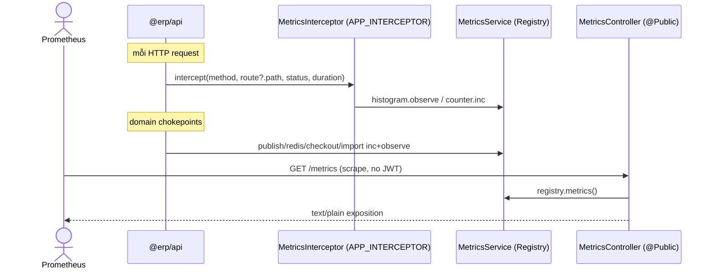
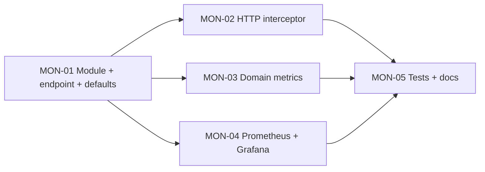

# EPIC-07072026 API monitoring — Prometheus metrics (`prom-client`)

## Goal

`@erp/api` hiện **không có metrics/observability** — chỉ có NestJS `Logger` và `/health` tự viết.
`docs/02-architecture.md` (§Observability) đã liệt kê các metric *dự kiến* nhưng chưa cài: API
latency/error rate, Kafka publish/consume + retry, Redis hit ratio, checkout duration, import
success/failure.

Epic này thêm `prom-client` vào `apps/api`, expose endpoint `GET /metrics` (`@Public`), thu thập
**default Node/process metrics + HTTP metrics + domain metrics** tại các chokepoint trên, và thêm
**Prometheus + Grafana** vào `docker-compose.yml` để chạy trọn vòng local.

Measurable outcome: `curl localhost:4000/metrics` (không JWT) trả text Prometheus với default
metrics + `http_request_duration_seconds` (label theo route pattern) + các domain counter; Prometheus
scrape API `UP`; Grafana render dashboard.

## Decisions (locked)

- **Phạm vi đầy đủ:** default Node metrics (`collectDefaultMetrics`) + HTTP histogram/counter +
  domain metrics (Kafka publish, Redis hit/miss, checkout duration, CSV import).
- **`/metrics` là `@Public()`** — dựa vào network isolation, **không** token. `@ApiExcludeEndpoint()`
  để loại khỏi Swagger → **không** cần `openapi:generate`.
- **1 Registry duy nhất** sở hữu bởi `MetricsService` (`@Global`). Domain code chỉ phụ thuộc
  `MetricsService`, không import `prom-client` trực tiếp.
- **Cardinality guard:** label route dùng `request.route?.path` (pattern, vd `/pos/invoices/:id`),
  fallback `unmatched`; **không** dùng raw URL. Không label theo org/branch (tránh cardinality).
- **Không migration, không shared-interfaces, không permission mới, không đổi contract API.**
  Kill switch: `METRICS_ENABLED=false`.

## Scope

- **API (thêm module, không thêm bảng):** `modules/metrics/` (`MetricsModule` `@Global`,
  `MetricsService`, `MetricsController`, `MetricsInterceptor`). Đăng ký `MetricsModule` trong
  `app.module.ts`; đăng ký `MetricsInterceptor` như `APP_INTERCEPTOR` trong `common.module.ts`.
- **Domain instrumentation:** `event-publisher.service.ts`, `modules/redis/cache.service.ts`,
  `pos/services/checkout-invoice.service.ts`, `inventory/csv/csv-import.service.ts`.
- **Config:** env `METRICS_ENABLED` (default `true`), `METRICS_PREFIX` (default `erp_`).
- **Infra:** `prometheus` + `grafana` services trong root `docker-compose.yml`, scrape config,
  Grafana datasource + starter dashboard.
- **Events:** không emit/consume event mới. Mọi identifier/log/swagger backend **English**.

## Success Metrics

- `GET /metrics` trả `200 text/plain` **không cần JWT**; endpoint **không** xuất hiện trong `/docs-json`.
- Có default metrics (vd `erp_process_cpu_seconds_total`, `erp_nodejs_eventloop_lag_seconds`).
- Sau vài request: `http_requests_total` + `http_request_duration_seconds_bucket` có label
  `route` là pattern (không có id thô), label set bị chặn.
- Trigger checkout / publish / import → domain counter tăng.
- `docker compose up -d prometheus grafana` → Prometheus Targets API `UP`, Grafana dashboard render.
- `METRICS_ENABLED=false` → registry rỗng, không side-effect, không lỗi.

## Flows

## Tickets

- [TKT-MON-01 BE: prom-client + MetricsModule + `/metrics` + default metrics](../tickets/TKT-MON-01-metrics-module-endpoint.md)
- [TKT-MON-02 BE: HTTP metrics interceptor](../tickets/TKT-MON-02-http-metrics-interceptor.md)
- [TKT-MON-03 BE: domain metrics (events/redis/pos/csv)](../tickets/TKT-MON-03-domain-metrics.md)
- [TKT-MON-04 Infra: Prometheus + Grafana docker-compose](../tickets/TKT-MON-04-prometheus-grafana-compose.md)
- [TKT-MON-05 Tests + docs](../tickets/TKT-MON-05-tests-and-docs.md)

## Dependencies

- Depends on: `CommonModule` interceptor stack, `AuthGuard` + `@Public()` decorator,
  `@nestjs/config` chain, `EventPublisher` / Redis `CacheService` / `CheckoutInvoiceService` /
  `CsvImportService` (điểm inject).
- Reuses: `@Public()` (`modules/auth/decorators/public.decorator.ts`), `LoggingInterceptor` timing
  pattern, `APP_INTERCEPTOR` slot trong `common.module.ts`, existing docker-compose + `docker/`.

### Ticket dependency graph

## Out of scope

- OpenTelemetry tracing, structured/JSON logging (pino/winston), log shipping.
- Alerting rules / Alertmanager.
- Chuyển `/health` sang `@nestjs/terminus` hoặc mở public `/health`.
- Metric label theo org/branch (cardinality risk) — hoãn.
