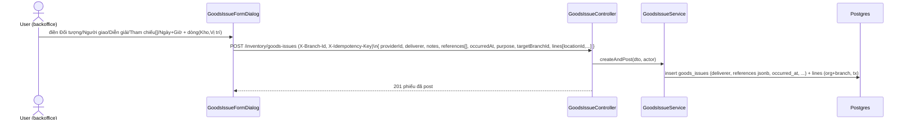
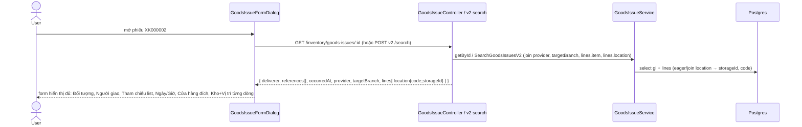
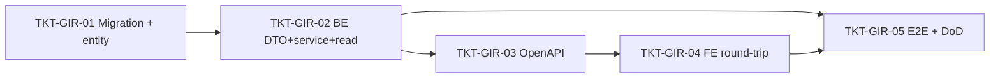

# EPIC-08062026 Phiếu xuất kho — round-trip đầy đủ trường (lưu + load lại)

## Goal

Form **Phiếu xuất kho** (`GoodsIssueFormDialog`, `backoffice-web`) hiện **mất dữ liệu** giữa lúc tạo và lúc xem lại: tạo xong mở phiếu (`XK000002`) thì **Kho**, **Vị trí**, **Cửa hàng đích**, **Đối tượng**, **Tham chiếu** trống, và **Người giao** / **Ngày-Giờ xuất** người dùng nhập không hề được lưu. Epic này làm cho phiếu xuất kho **round-trip đầy đủ**: mọi trường người dùng nhập đều được persist và hiển thị lại đúng khi xem/sửa.

Theo xác nhận của chủ sản phẩm:
- **Người giao** = text tự do → thêm cột `deliverer` (varchar) trên `goods_issues`.
- **Tham chiếu** = **danh sách mã** do FE gửi xuống → thêm cột `references` (jsonb `string[]`).
- **Ngày xuất / Giờ xuất** = lưu giá trị người dùng nhập → thêm cột `occurred_at` (timestamptz).
- **Đối tượng** (provider) giữ nguyên cho mọi mục đích (kể cả `TRANSFER_OUT`); chỉ sửa để round-trip đúng (đã persist sẵn, lỗi nằm ở read/display).

**Measurable outcome:** tạo phiếu xuất kho với đủ trường (đối tượng, người giao, diễn giải, danh sách tham chiếu, ngày/giờ xuất, mục đích `TRANSFER_OUT` + cửa hàng đích, dòng hàng có kho + vị trí) → mở lại phiếu hiển thị **chính xác từng trường đã nhập**, kể cả Kho/Vị trí từng dòng.

## Scope

- **Schema (`goods_issues`) — CÓ migration** (hand-written): thêm 3 cột nullable, không phá dữ liệu cũ:
  - `deliverer` `varchar` — Người giao (text tự do).
  - `references` `jsonb` default `'[]'::jsonb` — danh sách mã tham chiếu FE gửi (`string[]`).
  - `occurred_at` `timestamptz` — ngày+giờ xuất người dùng nhập (fallback `createdAt` khi null).
- **BE `@erp/api`** — module `inventory/goods-issue`:
  - `GoodsIssueEntity` + `dto/create-goods-issue.dto.ts` + `CreateGoodsIssueDto` (service interface) nhận & persist `deliverer`, `references`, `occurredAt`.
  - **Read fix (lỗi gốc Kho/Vị trí)**: v2 search handler chỉ join `lines.item`, **thiếu** `lines.location` → từng dòng về không có `location` (Kho/Vị trí trống). Thêm `leftJoinAndSelect('lines.location', …)`. v1 `getById` đã eager `lines.location` (giữ nguyên), bảo đảm trả `location.storageId` để FE map tên kho.
  - Read trả về `deliverer`, `references`, `occurredAt`, và (đã có) `provider`, `targetBranch`, `referenceType/Id`.
- **FE `backoffice-web`** — `apps/backoffice-web/src/pages/goods-issue/GoodsIssuePage.tsx`:
  - **Gửi** `deliverer`, `references`, `occurredAt` (ghép Ngày xuất + Giờ xuất) trong `handleSave`.
  - **Init từ `initial`** khi view/edit: `deliveryPerson` ← `initial.deliverer`; `targetBranchLabel` ← `initial.targetBranch?.name` (hiện đang khởi tạo rỗng — bug); danh sách Tham chiếu ← `initial.references`; `occurredAt` → Ngày/Giờ.
  - **Sửa DetailPanel (read-only)**: đang dùng `issue.location` (header) cho **mọi** dòng → đổi sang `line.location` từng dòng (Kho/Vị trí đúng theo dòng).
  - Tham chiếu render dạng **list** (nhiều mã).
- **OpenAPI**: sau khi đổi DTO → `pnpm openapi:generate`, commit snapshot + generated `schema.ts`.

## Out of scope

- Không đụng POS (`pos-web`).
- Không đổi luồng **export từ lệnh điều chuyển** (EPIC-08062026-goods-issue-from-transfer) — phiếu tạo qua `…/export` vẫn dùng đường riêng; epic này chỉ chuẩn hoá round-trip của phiếu xuất kho thường (`POST /inventory/goods-issues`).
- Không đổi nghĩa `referenceType`/`referenceId` (linkage hệ thống STOCK_TAKE/TRANSFER_ORDER) — `references` (jsonb) là danh sách hiển thị độc lập do FE quản.
- Không thêm quyền mới (tái dùng `inventory.read` / quyền tạo phiếu xuất hiện có).

## Success Metrics

- Tạo phiếu xuất kho điền đủ trường → GET phiếu trả về **đủ** `deliverer`, `references[]`, `occurredAt`, `providerId/provider`, `targetBranchId/targetBranch`, và mỗi dòng có `location{ id, code, storageId }`.
- Mở lại phiếu trên form: Đối tượng, Người giao, Diễn giải, Tham chiếu (list), Ngày/Giờ xuất, Cửa hàng đích, và **Kho + Vị trí từng dòng** hiển thị đúng giá trị đã nhập.
- Dòng có kho/vị trí khác nhau hiển thị khác nhau (không còn dùng location header cho mọi dòng).
- Migration chạy được, dữ liệu phiếu cũ vẫn valid (`occurred_at` null → hiển thị `createdAt`; `references` `[]`).
- `migration:generate` không sinh drift ngoài 3 cột; `synchronize` giữ false.

## Flows

### Tạo phiếu — lưu đủ trường

### Xem lại — load đủ trường

## Tickets

- [TKT-GIR-01 Migration + entity: deliverer / references(jsonb) / occurredAt](../tickets/TKT-GIR-01-schema-entity.md)
- [TKT-GIR-02 BE: DTO + service persist + read-path join lines.location](../tickets/TKT-GIR-02-be-dto-service-read.md)
- [TKT-GIR-03 OpenAPI regen + api-client snapshot](../tickets/TKT-GIR-03-openapi.md)
- [TKT-GIR-04 FE: gửi + load lại đủ trường, fix Kho/Vị trí + Cửa hàng đích + Tham chiếu list](../tickets/TKT-GIR-04-fe-roundtrip.md)
- [TKT-GIR-05 E2E + test plan + DoD gate](../tickets/TKT-GIR-05-e2e.md)

## Dependencies

- Reuses: `GoodsIssueEntity`/`GoodsIssueService`/`createAndPost`, `attachmentIds` jsonb pattern (mẫu cho `references`), `provider`/`targetBranch`/`reasonRef` eager relations đã có, `IdempotencyInterceptor`, `erpApi`/`requireErpData`, `LineItemGrid`/`LookupField` (`@erp/ui`), `DocumentNumberingService` (mã `XK`).
- Liên quan (không phụ thuộc cứng): [EPIC-08062026 Lập phiếu xuất kho từ Lệnh điều chuyển](./EPIC-08062026-goods-issue-from-transfer.md) — luồng export dùng đường riêng; round-trip ở đây áp dụng cho phiếu xuất kho thường.

### Ticket dependency graph

