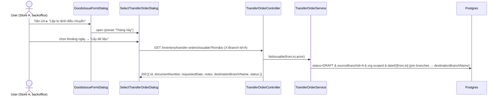
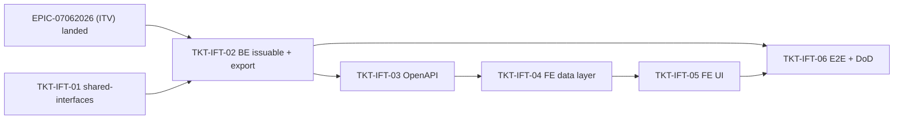

# EPIC-08062026 Lập phiếu xuất kho từ Lệnh điều chuyển ("Tiện ích" MISA)

## Goal

Thêm menu **Tiện ích** vào thanh công cụ form **Phiếu xuất kho** (`GoodsIssueFormDialog`, `backoffice-web`) theo phong cách MISA, với một mục **"Lập từ lệnh điều chuyển"**. Khi bấm, mở dialog **"Chọn lệnh điều chuyển"** liệt kê các **Lệnh điều chuyển** (`transfer_orders`) còn ở `DRAFT` mà chi nhánh đang chọn là **kho nguồn**; người dùng chọn 1 phiếu → nạp dữ liệu vào form (mục đích = `TRANSFER_OUT`, tham chiếu = mã `LDC`, các dòng hàng từ lệnh điều chuyển). Khi **Lưu**, phiếu xuất kho được tạo **chính là chân xuất (export)** của lệnh điều chuyển 2 pha (EPIC-07062026): spawn 1 GoodsIssue đã post, gắn `exportGoodsIssueId`, chuyển lệnh `DRAFT → IN_PROGRESS`. **Một lần trừ kho duy nhất.**

**Measurable outcome:** từ form phiếu xuất kho, người dùng kho nguồn chọn một lệnh điều chuyển `DRAFT`, sửa dòng nếu cần, bấm Lưu → tạo ra 1 phiếu xuất kho `POSTED` (purpose `TRANSFER_OUT`, `referenceType=TRANSFER_ORDER`, `referenceId=<lệnh>`), lệnh điều chuyển nhảy `IN_PROGRESS`, tồn Store A giảm đúng số đã xuất — đa-tenant scoped, idempotent.

## Scope

- **FE `backoffice-web` (chính)** — `apps/backoffice-web/src/pages/goods-issue/GoodsIssuePage.tsx`:
  - Thêm `ToolbarAction` **"Tiện ích"** (dropdown `options[]`) vào toolbar của `GoodsIssueFormDialog`; **chỉ 1 mục** "Lập từ lệnh điều chuyển" (3 mục MISA còn lại — nhập hàng / nhập kho / báo hàng — **không** render).
  - Dialog mới **`SelectTransferOrderDialog`** ("Chọn lệnh điều chuyển"): bộ lọc khoảng ngày (preset "Tháng này" + Từ ngày/Đến ngày + nút "Lấy dữ liệu"), bảng cột **Ngày / Số chứng từ / Lý do / Điều chuyển đến / Trạng thái**, chọn 1 dòng, nút **Chọn / Hủy bỏ**.
  - Pre-fill form khi chọn: `purpose=TRANSFER_OUT` (khóa), `targetBranchId=destinationBranchId`, "Tham chiếu" = `LDC…` (gắn `sourceTransferOrderId` ẩn, có nút `(x)` gỡ liên kết), các `FormLine` map từ dòng lệnh (item → SKU/tên/đơn vị, `sourceStorageId` → kho + vị trí mặc định, `requestedQty` → số lượng, `item.purchasePrice` → đơn giá).
  - Khi **Lưu** mà có `sourceTransferOrderId`: gọi **export** (`POST /inventory/transfer-orders/:id/export` kèm dòng đã sửa) thay cho `POST /inventory/goods-issues`; thành công → hiển thị phiếu xuất kho đã post (read mode).
- **BE `@erp/api` (nhỏ, KHÔNG migration)** — mở rộng module `transfer-order` của EPIC-07062026:
  - Endpoint picker **`GET /inventory/transfer-orders/issuable?from=&to=`** — trả các lệnh `DRAFT` + `sourceBranchId = actor.branchId`, lọc theo khoảng ngày (`requestedDate` fallback `createdAt`), **inline** tên chi nhánh đích (`destinationBranchName`) vào từng dòng. `inventory.transfer.read`.
  - Mở rộng **`confirmExport` + `POST /:id/export`** nhận body tùy chọn `ExportTransferOrderDto { lines?, reason?, notes? }`: khi có `lines` thì dùng dòng người dùng sửa (validate `itemId ∈` dòng của lệnh, `quantity > 0`) thay cho derive mặc định; spawn GoodsIssue với **`referenceType=TRANSFER_ORDER`, `referenceId=order.id`** (để form hiện "Tham chiếu LDC…"). Không body → giữ hành vi derive cũ (tương thích nút export trên `TransferOrdersPage`). `inventory.transfer.export`.
- **`@erp/shared-interfaces`** — thêm `GoodsIssueReferenceType.TRANSFER_ORDER`; type `IssuableTransferOrderListItem` (dòng picker, có `destinationBranchName`) + `ExportTransferOrderRequest` (body export kèm dòng).
- **KHÔNG migration**: cột `goods_issues.reference_id` (uuid) + `reference_type` (varchar) + `target_branch_id` đã có; giá trị enum mới chỉ là chuỗi varchar. `synchronize` giữ false.
- **Quyền**: tái dùng `inventory.transfer.read` (picker) + `inventory.transfer.export` (lưu = export). **Không seed quyền mới.**

## Out of scope

- Không đụng POS (`pos-web`), không scanner camera.
- Không build 3 mục "Lập từ…" còn lại của MISA.
- Không thay đổi chân **nhập** (import) — đã thuộc EPIC-07062026.
- Không xuất **một phần lặp lại**: mỗi lệnh `DRAFT` export đúng một lần (state-guard chống double-export). Nếu cần xuất nhiều đợt từ một lệnh là epic sau.

## Success Metrics

- Form phiếu xuất kho có dropdown **Tiện ích** → "Lập từ lệnh điều chuyển" mở dialog; dialog chỉ liệt kê lệnh `DRAFT` của **đúng chi nhánh nguồn** trong khoảng ngày; lệnh chi nhánh khác / không phải `DRAFT` không xuất hiện.
- Chọn 1 lệnh → form nạp đúng purpose `TRANSFER_OUT`, `targetBranchId`, mã `LDC` ở "Tham chiếu", và đủ dòng hàng.
- Bấm Lưu → **đúng 1** GoodsIssue `POSTED` (`TRANSFER_OUT`, `referenceType=TRANSFER_ORDER`, `referenceId=<lệnh>`), lệnh `IN_PROGRESS`, `exportGoodsIssueId` set, tồn Store A giảm; **không** tạo phiếu xuất kho trùng qua đường `POST /inventory/goods-issues`.
- Lưu lại lần 2 cùng `X-Idempotency-Key` → replay; cùng lệnh đã `IN_PROGRESS` → `409` (đã export). Người không thuộc chi nhánh nguồn → `403`.
- Không thay đổi schema; `migration:generate` không sinh drift.

## Flows

### Mở picker + nạp danh sách lệnh điều chuyển



### Chọn lệnh → pre-fill form

```mermaid
sequenceDiagram
  actor U as User
  participant DLG as SelectTransferOrderDialog
  participant FE as GoodsIssueFormDialog
  participant API as TransferOrderController
  U->>DLG: chọn 1 dòng → "Chọn"
  DLG->>API: GET /inventory/transfer-orders/:id (eager lines + item)
  API-->>DLG: { documentNumber, destinationBranchId, lines[ item, requestedQty, sourceStorageId ] }
  DLG->>FE: prefill(purpose=TRANSFER_OUT, targetBranchId, referenceNumber=LDC…, sourceTransferOrderId, lines→FormLine[])
  FE-->>U: form đã nạp (sửa dòng nếu cần; "Tham chiếu LDC…(x)")
```

### Lưu = export (DRAFT → IN_PROGRESS)

```mermaid
sequenceDiagram
  actor U as User
  participant FE as GoodsIssueFormDialog
  participant API as TransferOrderController
  participant SVC as TransferOrderService
  participant GI as GoodsIssueService
  participant L as StockLedgerService
  participant DB as Postgres
  U->>FE: Lưu (sourceTransferOrderId set)
  FE->>API: POST /inventory/transfer-orders/:id/export (X-Branch-Id=A, X-Idempotency-Key, body{ lines edited, notes })
  API->>SVC: confirmExport(id, actor, dto)
  SVC->>SVC: guard status=DRAFT & actor.branchId=sourceBranchId; validate lines.itemId ⊂ order; qty>0
  SVC->>GI: createAndPost({ purpose:TRANSFER_OUT, targetBranchId, referenceType:TRANSFER_ORDER, referenceId:order.id, lines })
  GI->>L: recordBatchMovements (OUT)
  GI-->>SVC: goodsIssue (POSTED)
  SVC->>DB: status=IN_PROGRESS, exportGoodsIssueId=gi.id, exportedAt/By (tx)
  API-->>FE: 200 { goodsIssue, transferOrder:{ status: IN_PROGRESS } }
  FE-->>U: hiển thị phiếu xuất kho đã post (Tham chiếu LDC…)
```

## Tickets

- [TKT-IFT-01 shared-interfaces: GoodsIssueReferenceType.TRANSFER_ORDER + IssuableTransferOrderListItem + ExportTransferOrderRequest](../tickets/TKT-IFT-01-shared-interfaces.md)
- [TKT-IFT-02 BE: issuable picker query + export nhận dòng đã sửa + gắn reference (KHÔNG migration)](../tickets/TKT-IFT-02-be-issuable-and-export.md)
- [TKT-IFT-03 OpenAPI regen + api-client snapshot](../tickets/TKT-IFT-03-openapi.md)
- [TKT-IFT-04 FE data layer: useIssuableTransferOrders + export-with-lines hook](../tickets/TKT-IFT-04-fe-data-layer.md)
- [TKT-IFT-05 FE UI: Tiện ích dropdown + SelectTransferOrderDialog + prefill + save-as-export](../tickets/TKT-IFT-05-fe-ui.md)
- [TKT-IFT-06 E2E + test plan + DoD gate](../tickets/TKT-IFT-06-e2e.md)

## Dependencies

- **Depends on: [EPIC-07062026 Phiếu Điều Chuyển Kho](./EPIC-07062026-inventory-transfer-voucher.md) đã land** — endpoint `POST /:id/export`, `confirmExport`, cột `exportGoodsIssueId`, state machine `DRAFT→IN_PROGRESS`, quyền `inventory.transfer.export`, `GoodsIssueService.createAndPost(TRANSFER_OUT)` đều do ITV cung cấp; epic này **mở rộng** chúng (thêm body dòng + reference) chứ không tạo lại.
- Reuses: `GoodsIssueReferenceType` + cột `reference_id/reference_type/target_branch_id` của `goods_issues` (đã tồn tại, dùng cho STOCK_TAKE), `PageToolbar`/`DropdownMenu` (`@erp/ui`), `erpApi`/`requireErpData`, `DocumentNumberingService` (mã `LDC`), `IdempotencyInterceptor`.
- **Lưu ý chồng lấn**: nút "Xác nhận xuất kho" của [TKT-ITV-08](../tickets/TKT-ITV-08-fe-ui.md) trên `TransferOrdersPage` trở thành **đường thứ hai** dẫn tới cùng `confirmExport`. Epic này **không xóa** nút đó; nếu muốn gom về một đường (form phiếu xuất kho), xử lý ở bước review riêng — không silent-remove.

### Ticket dependency graph


