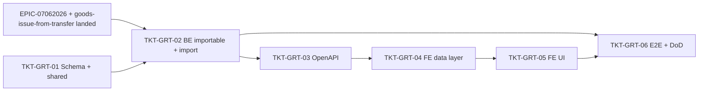

# EPIC-08062026 Lập phiếu nhập kho từ chứng từ điều chuyển ("Chọn chứng từ điều chuyển")

## Goal

Hoàn thiện **chân nhập (import)** của luồng điều chuyển 2 pha (EPIC-07062026) trên form **Phiếu nhập kho** (`PurchaseOrderFormDialog`, `backoffice-web`), đối xứng với chân xuất ([EPIC-08062026 goods-issue-from-transfer](./EPIC-08062026-goods-issue-from-transfer.md)). Khi mục đích = **"Điều chuyển từ cửa hàng khác"**, nút **"Chọn chứng từ điều chuyển"** (hiện đang `disabled`) mở dialog **"Chọn chứng từ xuất kho điều chuyển"** liệt kê các lệnh điều chuyển `IN_PROGRESS` mà **chi nhánh đích là chi nhánh đang chọn** (đã xuất kho, chờ nhập). Người dùng chọn 1 chứng từ → form nạp dòng hàng (khóa), chọn **Kho nhận**, bấm **Lưu = chân nhập**: `POST /inventory/transfer-orders/:id/import` spawn 1 GoodsReceipt đã post, lệnh `IN_PROGRESS → COMPLETED`, **một lần cộng kho duy nhất**.

**Measurable outcome:** từ form phiếu nhập kho, người dùng chi nhánh đích chọn một chứng từ điều chuyển đã xuất, chọn kho nhận, bấm Lưu → tạo 1 phiếu nhập kho `POSTED` (`TRANSFER_IN`, `referenceType=STOCK_TRANSFER`, `referenceId=<lệnh>`), lệnh `COMPLETED`, tồn chi nhánh đích tăng đúng số đã xuất; header (Đối tượng / Người giao / Tham chiếu / Ngày-Giờ) round-trip lên phiếu — đa-tenant scoped, idempotent.

## Scope

- **BE `@erp/api`** — module `transfer-order` (mở rộng EPIC-07062026):
  - **Picker query** `GET /inventory/transfer-orders/importable?from=&to=` (mirror `listIssuable`): lệnh `IN_PROGRESS` + `destinationBranchId = actor.branchId` + org-scoped, lọc khoảng ngày; **inline** `sourceBranchName`, **số phiếu xuất kho** (`exportGoodsIssueDocumentNumber` resolve qua `exportGoodsIssueId`) và **tổng tiền** (SUM `goods_issue_lines.line_total` của phiếu XK). Quyền `inventory.transfer.read`.
  - Mở rộng **`confirmImport` + `POST /:id/import`**: `ImportTransferOrderDto` nhận `destinationStorageId` (người dùng chọn kho nhận) **+ header** `providerId`, `deliverer`, `references`, `occurredAt`; forward các field này vào `GoodsReceiptService.createAndPost` (cùng `receivedAt = occurredAt`). Giữ guard `status===IN_PROGRESS` + `actor.branchId===destinationBranchId`. Dòng vẫn **derive từ lệnh** (khóa, không nhận dòng sửa).
  - `GoodsReceiptService.createAndPost` persist thêm `references`.
- **Schema (`goods_receipts`) — CÓ migration**: thêm 1 cột `references` jsonb (`string[]`, default `[]`). `providerId` / `deliveredBy` / `received_at` / `reference_id` / `reference_type` / `source_branch_id` **đã có**.
- **`@erp/shared-interfaces`** — thêm `ImportableTransferOrderListItem` (dòng picker: `exportGoodsIssueDocumentNumber`, `totalAmount`, `sourceBranchName`); mở rộng `ImportTransferOrderRequest` với `destinationStorageId` + header fields.
- **FE `backoffice-web`** — `apps/backoffice-web/src/pages/purchase-orders/PurchaseOrdersPage.tsx`:
  - Dialog mới **`SelectTransferReceiptDialog`** ("Chọn chứng từ xuất kho điều chuyển"): bộ lọc khoảng ngày (preset "Hôm nay" + Từ/Đến + "Lấy dữ liệu"), bảng **Ngày / Số chứng từ (XK) / Tổng thành tiền**, chọn 1 dòng + **Đồng ý / Hủy bỏ**.
  - Bật nút **"Chọn chứng từ điều chuyển"** (bỏ `disabled`) → mở dialog.
  - `prefillFromTransferOrder`: nạp `sourceBranchId`, "Tham chiếu" = số phiếu XK (gắn `sourceTransferOrderId` ẩn, nút `(x)` gỡ), các dòng map từ lệnh (item → SKU/tên/đơn vị, `requestedQty` → số lượng) — **khóa chi tiết** (không Thêm dòng / không sửa).
  - **Kho nhận**: thêm picker chọn kho đích (destinationStorageId) trên form (bắt buộc trước khi Lưu).
  - **Lưu** khi có `sourceTransferOrderId`: gọi `POST /inventory/transfer-orders/:id/import` (kèm `destinationStorageId` + header) thay cho `POST /goods-receipts`; thành công → hiển thị phiếu nhập đã post.

## Out of scope

- Không đụng POS (`pos-web`); không scanner camera.
- Không cho **nhập một phần / nhập nhiều đợt**: mỗi lệnh `IN_PROGRESS` nhập đúng một lần (state-guard chống double-import). Dòng khóa = đúng số đã xuất.
- Không đổi chân **xuất** (đã thuộc EPIC-08062026 goods-issue-from-transfer).
- Không đụng luồng nhập mua hàng thường (`OTHER`) — vẫn `POST /goods-receipts`.

## Success Metrics

- Form phiếu nhập kho, mục đích "Điều chuyển từ cửa hàng khác" → nút "Chọn chứng từ điều chuyển" mở dialog; dialog **chỉ** liệt kê lệnh `IN_PROGRESS` của **đúng chi nhánh đích** trong khoảng ngày; mỗi dòng có **số phiếu XK** + **tổng tiền**; lệnh chi nhánh khác / `DRAFT`/`COMPLETED`/`CANCELLED` không xuất hiện.
- Chọn 1 chứng từ → form nạp đúng nguồn, "Tham chiếu" = số phiếu XK, đủ dòng (khóa), người dùng chọn Kho nhận.
- Bấm Lưu → **đúng 1** GoodsReceipt `POSTED` (`TRANSFER_IN`, `referenceType=STOCK_TRANSFER`, `referenceId=<lệnh>`), lệnh `COMPLETED`, `importGoodsReceiptId` set, tồn đích tăng; header (Đối tượng/Người giao/Tham chiếu/Ngày) lưu lên phiếu.
- Lưu lại lần 2 cùng `X-Idempotency-Key` → replay; lệnh đã `COMPLETED` → `409`. Người không thuộc chi nhánh đích → `403`.
- Migration thêm đúng `references`; phiếu cũ valid (`references` `[]`); `synchronize` false.

## Flows

### Mở picker + nạp danh sách chứng từ điều chuyển (chờ nhập)

```mermaid
sequenceDiagram
  actor U as User (Store B đích, backoffice)
  participant FE as PurchaseOrderFormDialog
  participant DLG as SelectTransferReceiptDialog
  participant API as TransferOrderController
  participant SVC as TransferOrderService
  participant DB as Postgres
  U->>FE: Mục đích "Điều chuyển từ cửa hàng khác" → "Chọn chứng từ điều chuyển"
  FE->>DLG: open (preset "Hôm nay")
  U->>DLG: chọn khoảng ngày → "Lấy dữ liệu"
  DLG->>API: GET /inventory/transfer-orders/importable?from&to (X-Branch-Id=B)
  API->>SVC: listImportable(from,to,actor)
  SVC->>DB: status=IN_PROGRESS & destinationBranchId=B & org-scoped & date∈[from,to]\n(join branches → sourceBranchName; join goods_issues → XK số + SUM line_total)
  API-->>DLG: 200 [{ id, exportGoodsIssueDocumentNumber, requestedDate, totalAmount, sourceBranchName, status }]
```

### Chọn chứng từ → nạp form (khóa chi tiết) + chọn kho nhận

```mermaid
sequenceDiagram
  actor U as User
  participant DLG as SelectTransferReceiptDialog
  participant FE as PurchaseOrderFormDialog
  participant API as TransferOrderController
  U->>DLG: chọn 1 dòng → "Đồng ý"
  DLG->>API: GET /inventory/transfer-orders/:id (eager lines + item)
  API-->>DLG: { documentNumber, sourceBranchId, lines[ item, requestedQty ] }
  DLG->>FE: prefill(purpose=TRANSFER_IN, sourceBranchId, referenceNumber=XK…, sourceTransferOrderId, lines→FormLine[] khóa)
  U->>FE: chọn Kho nhận (destinationStorageId)
  FE-->>U: form đã nạp; "Tham chiếu XK…(x)"; chi tiết khóa
```

### Lưu = nhập (IN_PROGRESS → COMPLETED)

```mermaid
sequenceDiagram
  actor U as User
  participant FE as PurchaseOrderFormDialog
  participant API as TransferOrderController
  participant SVC as TransferOrderService
  participant GR as GoodsReceiptService
  participant L as StockLedgerService
  participant DB as Postgres
  U->>FE: Lưu (sourceTransferOrderId set, Kho nhận đã chọn)
  FE->>API: POST /inventory/transfer-orders/:id/import (X-Branch-Id=B, X-Idempotency-Key,\n body{ destinationStorageId, providerId, deliverer, references, occurredAt })
  API->>SVC: confirmImport(id, actor, dto)
  SVC->>SVC: guard status=IN_PROGRESS & actor.branchId=destinationBranchId; resolve destLocation(kho nhận)
  SVC->>GR: createAndPost({ purpose:TRANSFER_IN, referenceType:STOCK_TRANSFER, referenceId, sourceBranchId,\n receivedAt=occurredAt, providerId, deliveredBy=deliverer, references, locationId=destLocation, lines(derive) })
  GR->>L: recordBatchMovements (IN)
  GR-->>SVC: goodsReceipt (POSTED)
  SVC->>DB: status=COMPLETED, importGoodsReceiptId, destinationStorageId, completedAt/By (tx)
  API-->>FE: 200 { goodsReceipt, transferOrder:{ status: COMPLETED } }
```

## Tickets

- [TKT-GRT-01 Schema + shared-interfaces: goods_receipts.references + ImportableTransferOrderListItem + ImportTransferOrderRequest ext](../tickets/TKT-GRT-01-schema-shared.md)
- [TKT-GRT-02 BE: importable picker + confirmImport nhận kho nhận + header](../tickets/TKT-GRT-02-be-importable-import.md)
- [TKT-GRT-03 OpenAPI regen + api-client snapshot](../tickets/TKT-GRT-03-openapi.md)
- [TKT-GRT-04 FE data layer: useImportableTransferOrders + mapper](../tickets/TKT-GRT-04-fe-data-layer.md)
- [TKT-GRT-05 FE UI: SelectTransferReceiptDialog + nút + prefill khóa + kho nhận + save-as-import](../tickets/TKT-GRT-05-fe-ui.md)
- [TKT-GRT-06 E2E + test plan + DoD gate](../tickets/TKT-GRT-06-e2e.md)

## Dependencies

- **Depends on: [EPIC-07062026 Phiếu Điều Chuyển Kho](./EPIC-07062026-inventory-transfer-voucher.md) đã land** — `confirmImport`, `POST /:id/import`, cột `importGoodsReceiptId`, state machine `IN_PROGRESS→COMPLETED`, quyền `inventory.transfer.import`, `GoodsReceiptService.createAndPost(TRANSFER_IN)`. Epic này **mở rộng** chúng (kho nhận + header) chứ không tạo lại.
- **Đối xứng: [EPIC-08062026 goods-issue-from-transfer](./EPIC-08062026-goods-issue-from-transfer.md)** — tái dùng nguyên mẫu `SelectTransferOrderDialog` / `prefillFromTransferOrder` / save-as-export cho chân nhập.
- Reuses: `IssuableTransferOrderListItem` (mẫu type), `goods_receipts.providerId/deliveredBy/receivedAt/source_branch_id` (đã có), `attachment_ids` jsonb (mẫu cho `references`), `PageToolbar`/`LookupField` (`@erp/ui`), `erpApi`/`requireErpData`, `DocumentNumberingService` (mã `PNK`), `IdempotencyInterceptor`.

### Ticket dependency graph


