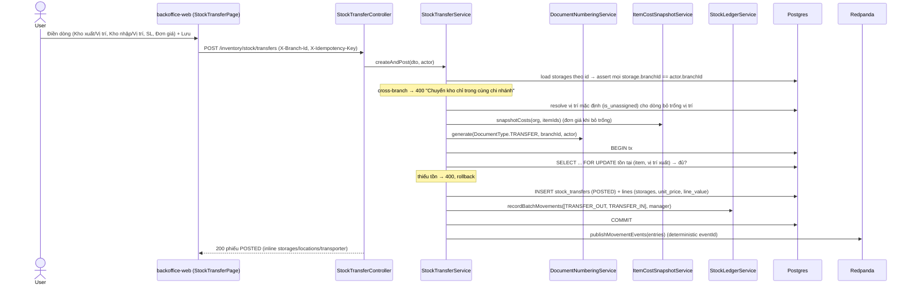
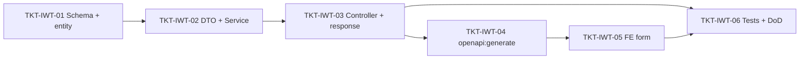

# EPIC-09062026 Chuyển kho giữa các kho trong cùng chi nhánh

## Summary

Nâng cấp tính năng **Chuyển kho** (`/inventory/stock-transfers`, module `inventory/transfer`) từ mô hình hiện tại _chuyển giữa các **vị trí** (location) trong **một kho** (storage)_ sang mô hình **chuyển giữa các kho (kho → kho)** trong **cùng một chi nhánh**, bám sát form mShopKeeper "Thêm mới phiếu chuyển kho" (Image #2/#3).

Quan hệ dữ liệu hiện hữu: `Branch (chi nhánh) → Storage (kho) → Location (vị trí)`. Tồn kho ghi nhận theo `(item, location, branch)` trong `stock_balances`. Mỗi storage có sẵn 1 location ảo `is_unassigned` ("Chưa xếp") — UI hiển thị là **"Mặc định"**.

Thay đổi cốt lõi:

1. **Mỗi dòng chi tiết mang Kho xuất + Kho nhập riêng** (`source_storage_id` / `destination_storage_id`), kèm Vị trí xuất / Vị trí nhập tùy chọn (bỏ trống → resolve về location `is_unassigned` của kho đó).
2. **Ràng buộc cùng chi nhánh**: mọi Kho xuất/Kho nhập phải thuộc `actor.branchId`. Chuyển **liên chi nhánh** vẫn là việc của module `transfer-order` (không đụng tới ở epic này).
3. **Khi lưu, tự động thực hiện xuất kho rồi nhập kho** trong **một** DB transaction: ghi `TRANSFER_OUT` (−qty tại vị trí xuất) → `TRANSFER_IN` (+qty tại vị trí nhập) qua `StockLedgerService.recordBatchMovements` (tái sử dụng path posting hiện có, bổ sung khóa bi quan kiểm tra tồn để không bán âm).
4. **Bổ sung field theo form đích**: `transporter_user_id` (Người vận chuyển — picker nhân viên), `unit_price` / `line_value` per dòng (Đơn giá / Thành tiền; bỏ trống Đơn giá → tự tính từ giá vốn snapshot), `attachment_ids` (Tài liệu đính kèm — theo đúng convention `jsonb` đang dùng ở `goods_receipts` / `transfer_orders`), `transferred_at` (Ngày + Giờ chuyển).
5. **Gộp UI**: trang Chuyển kho được rebuild thành **một** form kho→kho duy nhất. Dòng có Kho xuất = Kho nhập là chuyển vị trí nội bộ kho (bao trùm hành vi cũ); Kho xuất ≠ Kho nhập (cùng chi nhánh) là chuyển liên kho.

**Out of scope**:

- Chuyển kho **liên chi nhánh** (đã có ở `transfer-order`).
- Hạ tầng **upload file** thật sự: epic này chỉ thêm cột `attachment_ids` + nhận/trả mảng id theo convention sẵn có (chưa có endpoint upload chung trong codebase — giống `transfer_orders`/`goods_receipts` hiện tại).
- Workflow duyệt (APPROVED) — giữ vòng đời MISA `DRAFT → POSTED/CANCELLED`.
- Sinh **2 chứng từ tách rời** (Phiếu xuất kho + Phiếu nhập kho): đã chốt dùng 1 phiếu chuyển ghi 2 bút toán sổ kho trong 1 transaction.
- Tạo permission mới: tái dùng `inventory.transfer.create/read/post/cancel` đã có.

## Flows

### Tạo & posting phiếu chuyển kho (kho → kho, cùng chi nhánh)

## Success Metrics

- Tạo được phiếu chuyển kho mà mỗi dòng chọn **Kho xuất ≠ Kho nhập** trong cùng chi nhánh; sau khi lưu, `stock_balances` của kho xuất giảm và kho nhập tăng đúng số lượng, tổng `line_value` 2 chân net = 0 theo giá vốn snapshot.
- Chọn kho khác chi nhánh → API trả 400, không ghi sổ.
- Dòng để trống Vị trí xuất/nhập ("Mặc định") → ghi sổ vào location `is_unassigned` của kho tương ứng.
- Migration giữ nguyên 100% phiếu chuyển cũ hợp lệ (backfill `source_storage_id`/`destination_storage_id` từ storage của location cũ); không regression test cũ của `transfer`/`goods-issue`/`adjustment`.
- Form đích render đủ: Người vận chuyển, Tài liệu đính kèm, cột Kho xuất/Kho nhập/Đơn giá/Thành tiền.

## Tickets trong epic

| Ticket | Mô tả ngắn |
|--------|------------|
| [TKT-IWT-01](../tickets/TKT-IWT-01-schema-storage-valuation-transporter.md) | Migration + entity: per-line storage, đơn giá/thành tiền, transporter, attachments, transferred_at; backfill |
| [TKT-IWT-02](../tickets/TKT-IWT-02-service-kho-to-kho-posting.md) | DTO + Service: resolve vị trí mặc định, ràng buộc cùng chi nhánh, định giá, post 2 chân ledger trong 1 tx |
| [TKT-IWT-03](../tickets/TKT-IWT-03-controller-and-response-shaping.md) | Controller + Swagger DTO + inline quan hệ (storages/locations/transporter) vào list & getById |
| [TKT-IWT-04](../tickets/TKT-IWT-04-openapi-regen.md) | `pnpm openapi:generate` + commit snapshot api-client |
| [TKT-IWT-05](../tickets/TKT-IWT-05-fe-unified-kho-to-kho-form.md) | FE: rebuild form Chuyển kho kho→kho (header + cột chi tiết + pickers + payload) |
| [TKT-IWT-06](../tickets/TKT-IWT-06-tests-and-dod.md) | Service spec + E2E + DoD gate |

## Graph phụ thuộc ticket

## Dependencies (epic-level)

- Requires [EPIC-003 Inventory and CSV](./EPIC-003-inventory-and-csv.md) — `stock_transfers`, `stock_transfer_lines`, `storages`, `locations` (`is_unassigned`), `stock_balances`, `StockLedgerService`, `DocumentNumberingService` đã có.
- **Reuses**:
  - Module `inventory/transfer` (extend `StockTransferEntity` / `StockTransferLineEntity` / `StockTransferService` — KHÔNG tạo module/bảng mới).
  - `StockLedgerService.recordBatchMovements` + `publishMovementEvents`; `ItemCostSnapshotService.snapshotCosts`.
  - `DocumentNumberingService` (`DocumentType.TRANSFER`), permission `inventory.transfer.*`.
  - Convention `attachment_ids jsonb default '[]'` (giống `goods_receipts`/`transfer_orders`/`cash_receipts`).
  - Picker nhân viên: endpoint `POST /v2/employees/search` + hook FE `useUsers` (mã NV "0000" = `code` của user).
  - UI: `DocumentFormDialog`, `LineItemGrid`, `LookupField`, `PageToolbar` (`@erp/ui`).

## Epic acceptance criteria

- [ ] Mỗi dòng chọn Kho xuất + Kho nhập độc lập; chỉ cho phép storages thuộc chi nhánh đang chọn (`actor.branchId`).
- [ ] Lưu phiếu = tạo + post nguyên tử: ghi `TRANSFER_OUT` rồi `TRANSFER_IN` trong 1 transaction; kiểm tra tồn (`SELECT … FOR UPDATE`) trước khi ghi để không bán âm.
- [ ] Vị trí bỏ trống → resolve về location `is_unassigned` của kho tương ứng.
- [ ] Đơn giá bỏ trống → tự tính từ giá vốn snapshot; `line_value = unit_price × quantity`.
- [ ] Người vận chuyển (nếu có) phải là user thuộc org; attachments lưu theo `attachment_ids`.
- [ ] Backfill: phiếu cũ có `source_storage_id`/`destination_storage_id` đúng = storage của location cũ; không mất dữ liệu.

## Epic Definition of Done

- [ ] Mọi ticket TKT-IWT-01–06 đạt DoD riêng.
- [ ] `pnpm --filter @erp/api test` + `lint` xanh; migration up/down chạy local sạch (Adminer :18088).
- [ ] `pnpm openapi:generate` cập nhật `openapi.snapshot.json` + `packages/api-client/src/generated/schema.ts` (không sửa tay).
- [ ] Không Vietnamese trong source BE (error/comment/swagger/log); UI strings FE tiếng Việt.
- [ ] `synchronize:false`; sau `migration:run`, `migration:generate` không sinh drift cho 2 entity sửa đổi.
- [ ] Không regression: goods-issue, adjustment, transfer-order, POS checkout vẫn pass test cũ.
