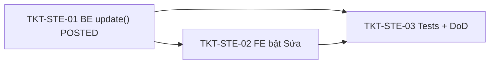

# EPIC-09062026 Sửa phiếu chuyển kho (POSTED) — đảo + ghi lại tồn kho

## Summary

Cho phép **sửa một phiếu chuyển kho đã POSTED** (form "Sửa phiếu chuyển kho", Image #11): sửa được **tất cả thông tin trừ `Số phiếu chuyển`** (Người vận chuyển, Diễn giải, Tài liệu đính kèm, Ngày/Giờ chuyển, và toàn bộ dòng chi tiết: Kho xuất/nhập, Vị trí, Số lượng, Đơn giá). Vì stock ledger **bất biến**, khi lưu bản sửa hệ thống phải **rollback số liệu tồn của phiếu cũ rồi ghi lại theo dữ liệu mới** trong **một** transaction, giữ nguyên `id` + `Số phiếu chuyển` + trạng thái POSTED.

Hiện tại `StockTransferService.update()` **chỉ cho sửa DRAFT** (chặn POSTED) — thực tế là code chết vì mọi phiếu tạo qua HTTP đều POSTED ngay. Epic này **mở rộng** `update()` để xử lý POSTED.

Quyết định đã chốt (Step 1):
- **Đảo + ghi lại (1 transaction)**: đảo bút toán phiếu cũ (TRANSFER_IN trả về kho xuất cũ, TRANSFER_OUT khỏi kho nhập cũ) → thay dòng → ghi bút toán mới theo dữ liệu sửa (TRANSFER_OUT kho xuất mới, TRANSFER_IN kho nhập mới). Sổ kho giữ đủ dấu vết: gốc + đảo + mới. KHÔNG hard-edit ledger.
- **Chặn nếu thiếu tồn**: khóa bi quan (`SELECT … FOR UPDATE`) + kiểm tra **net delta** mỗi `(item, location)` của (đảo + ghi mới); nếu bất kỳ vị trí nào âm (kho xuất mới không đủ, hoặc hàng đã rời kho nhập cũ) → `400`, rollback toàn bộ, phiếu gốc giữ nguyên.

**Out of scope**:
- Sửa phiếu **CANCELLED** (đã hủy) — chặn.
- Đổi chi nhánh (giữ same-branch như khi tạo).
- Upload tài liệu đính kèm thật (giữ placeholder + `attachmentIds`).
- Thay đổi cách tạo/danh sách (đã làm ở [EPIC inter-warehouse-transfer](./EPIC-09062026-inter-warehouse-transfer.md) + [EPIC list-v2](./EPIC-09062026-stock-transfer-list-v2.md)).
- Migration / entity / permission mới (tái dùng `inventory.transfer.create`, endpoint `PATCH /:id` + DTO đã có).

## Flows

### Sửa phiếu POSTED (đảo + ghi lại, 1 transaction)

```mermaid
sequenceDiagram
  actor U as User
  participant FE as backoffice-web (TransferFormDialog edit)
  participant API as StockTransferController
  participant SVC as StockTransferService.update
  participant LED as StockLedgerService
  participant DB as Postgres
  participant K as Redpanda

  U->>FE: Chọn phiếu POSTED → Sửa → đổi dòng/thông tin → Lưu
  FE->>API: PATCH /inventory/stock/transfers/:id (X-Branch-Id, X-Idempotency-Key)
  API->>SVC: update(id, dto, actor)
  Note over SVC: CANCELLED → 400; DRAFT → thay dòng (no ledger); POSTED → đảo + ghi lại
  SVC->>SVC: resolveBranchScopedTransfer(dto) (same-branch, vị trí mặc định, định giá)
  SVC->>DB: BEGIN tx
  SVC->>DB: net delta mỗi (item,location) của (đảo cũ + ghi mới) → SELECT … FOR UPDATE
  Note over SVC: onHand + delta < 0 ở bất kỳ vị trí → 400, rollback
  SVC->>LED: recordBatchMovements([reversal cũ, posting mới], manager)
  SVC->>DB: DELETE lines cũ + INSERT lines mới; UPDATE header (giữ documentNumber + POSTED)
  SVC->>DB: COMMIT
  SVC->>K: publishMovementEvents(reversal + new)
  API-->>FE: phiếu đã sửa (cùng Số phiếu chuyển)
```

## Success Metrics

- Sửa phiếu POSTED: tồn kho phản ánh **trạng thái mới** (net = đảo gốc + ghi mới). Ví dụ đổi kho nhập từ A sang B: A không còn +q, B có +q; kho xuất giữ nguyên −q.
- `Số phiếu chuyển`, `id`, trạng thái POSTED **không đổi** sau khi sửa.
- Sửa khi thiếu tồn (kho xuất mới không đủ, hoặc hàng đã rời kho nhập cũ) → `400`, **phiếu gốc giữ nguyên** (rollback toàn bộ).
- Sửa phiếu đã CANCELLED → `400`.
- Gọi lại cùng `X-Idempotency-Key` + body → replay, không ghi sổ 2 lần.

## Tickets trong epic

| Ticket | Mô tả ngắn |
|--------|------------|
| [TKT-STE-01](../tickets/TKT-STE-01-be-edit-reverse-repost.md) | BE: mở rộng `update()` cho POSTED — đảo + ghi lại 1 tx, net-delta chặn thiếu tồn, giữ số phiếu |
| [TKT-STE-02](../tickets/TKT-STE-02-fe-enable-edit.md) | FE: bật nút "Sửa" cho POSTED + xác nhận điều chỉnh tồn + reload danh sách/Chi tiết |
| [TKT-STE-03](../tickets/TKT-STE-03-tests-and-dod.md) | Service spec (đảo+ghi/chặn tồn/giữ số phiếu) + DoD gate |

## Graph phụ thuộc ticket



## Dependencies (epic-level)

- Requires [EPIC inter-warehouse-transfer](./EPIC-09062026-inter-warehouse-transfer.md) (kho→kho create/post, `resolveBranchScopedTransfer`, valuation) + [EPIC list-v2](./EPIC-09062026-stock-transfer-list-v2.md) (reverse pattern trong `cancel()`).
- **Reuses**:
  - `StockTransferService.resolveBranchScopedTransfer` (same-branch, resolve vị trí mặc định, định giá), pattern đảo bút toán từ `cancel()`, khóa bi quan từ `post()`.
  - `StockLedgerService.recordBatchMovements`/`publishMovementEvents`.
  - Endpoint `PATCH /inventory/stock/transfers/:id` + DTO inline + permission `inventory.transfer.create` (đã có).
  - FE `TransferFormDialog` mode `edit` (đã prefill + PATCH); chỉ bật nút "Sửa".
  - Global `IdempotencyInterceptor`.

## Epic acceptance criteria

- [ ] `PATCH /:id` trên phiếu POSTED: đảo bút toán cũ + ghi bút toán mới trong 1 transaction; giữ `documentNumber` + POSTED.
- [ ] Net-delta `(item, location)` được khóa + kiểm tra; thiếu tồn ở bất kỳ vị trí → 400, rollback, phiếu gốc nguyên vẹn.
- [ ] Sửa CANCELLED → 400; DRAFT vẫn thay dòng như cũ (no ledger).
- [ ] FE: nút "Sửa" bật cho POSTED (chỉ disable khi CANCELLED); form prefill đúng, lưu xong reload danh sách + panel Chi tiết.
- [ ] Scope `organizationId` + same-branch; idempotent.

## Epic Definition of Done

- [ ] TKT-STE-01–03 đạt DoD; `pnpm --filter @erp/api test` + `lint` xanh; FE `tsc` xanh.
- [ ] Không Vietnamese trong source BE; UI strings FE tiếng Việt.
- [ ] Không migration (không đổi schema); `synchronize` vẫn false.
- [ ] Không regression: create/post, Xóa (reverse+void), danh sách v2, goods-issue, transfer-order vẫn pass test cũ.
