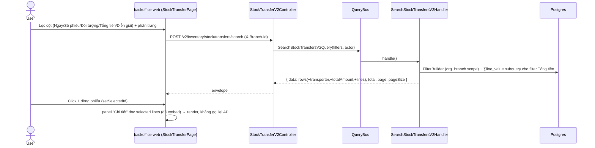
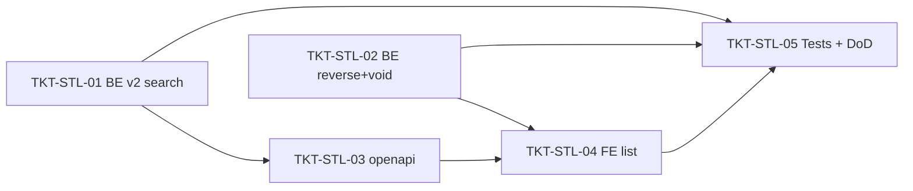

# EPIC-09062026 Danh sách Chuyển kho theo mẫu mShopKeeper (v2 search + master-detail)

## Summary

Clone giao diện **trang danh sách Chuyển kho** (`/inventory/stock-transfers`) theo mẫu mShopKeeper (Image #8): chuyển từ bảng tĩnh hiện tại (Image #6) sang danh sách **CQRS v2 search** giống hệt các trang chứng từ anh em (`Phiếu nhập kho` / `Xuất kho`), với:

1. **Lọc theo từng cột** (operator `=` / `*` / `≤`) query toàn bộ dataset + phân trang server-side (tái dùng `BaseDataTable` column filters + `useCrudV2Search`).
2. **Cột mới**: Ngày, **Số phiếu chuyển** (link mở Xem), **Đối tượng** (= Người vận chuyển), **Tổng tiền** (∑ `line_value`), Diễn giải. Bỏ các cột cũ Trạng thái / Số dòng / Tổng số lượng.
3. **Dòng tổng cuối bảng** (footer) cộng **Tổng tiền** của trang.
4. **Panel "Chi tiết" master-detail**: **click 1 dòng phiếu** ở bảng trên → set dòng được chọn → panel "Chi tiết" phía dưới hiển thị các dòng hàng của phiếu đó (Mã SKU, Tên hàng hóa, Kho xuất, Vị trí xuất, Kho nhập, Vị trí nhập, ĐVT, Số lượng, Đơn giá, Thành tiền, Ghi chú). Dữ liệu đọc từ `lines` **embed sẵn** trong response search (không fetch thêm) — mirror `DetailPanel` của `GoodsIssuePage`. Bảng dưới trống ("Chọn một phiếu để xem chi tiết.") khi chưa chọn dòng nào.
5. **Toolbar**: Thêm mới, **Nhân bản** (mở form Thêm mới đã prefill từ phiếu chọn), Xem, Sửa, **Xóa** (đảo bút toán + void), Nạp.

Quyết định đã chốt (Step 1):
- **CQRS v2 search** (skill `cqrs-search-endpoint`), mirror `GoodsIssuePage` + `search-goods-issues-v2`.
- **Xóa = đảo bút toán + soft-void**: post bút toán đảo (TRANSFER_IN trả về kho xuất, TRANSFER_OUT khỏi kho nhập) trong 1 transaction rồi set `status = CANCELLED` (ledger bất biến → sửa bằng reversal). Không hard-delete, không migration (tái dùng enum `TransferStatus.CANCELLED`).
- **Nhân bản = FE-only**: mở "Thêm mới" prefill dòng từ phiếu chọn; user lưu thành phiếu mới.

**Out of scope**:
- Thay đổi **form Thêm mới/Sửa** (đã làm ở [EPIC-09062026 Chuyển kho giữa các kho](./EPIC-09062026-inter-warehouse-transfer.md)).
- Hard-delete / xoá vĩnh viễn; cột `deleted_at` (dùng `status = CANCELLED`).
- Upload tài liệu đính kèm thật.
- Permission mới (tái dùng `inventory.transfer.read` / `inventory.transfer.cancel`).

## Flows

### Tải danh sách (CQRS v2 search) + master-detail



### Xóa (đảo bút toán + void)

```mermaid
sequenceDiagram
  actor U as User
  participant FE as backoffice-web
  participant API as StockTransferController
  participant SVC as StockTransferService
  participant LED as StockLedgerService
  participant DB as Postgres
  participant K as Redpanda

  U->>FE: Chọn phiếu POSTED → Xóa → xác nhận
  FE->>API: POST /inventory/stock/transfers/:id/cancel (X-Idempotency-Key)
  API->>SVC: cancel(id, actor)
  Note over SVC: POSTED → đảo bút toán; DRAFT → void thẳng
  SVC->>DB: BEGIN tx
  SVC->>LED: recordBatchMovements(reversed legs, manager)
  SVC->>DB: UPDATE status = CANCELLED
  SVC->>DB: COMMIT
  SVC->>K: publishMovementEvents(reversal entries)
  API-->>FE: phiếu CANCELLED (rời khỏi danh sách POSTED)
```

## Success Metrics

- Lọc theo từng cột query toàn bộ dataset (không chỉ trang đã tải); kết quả + phân trang đúng; scope `organizationId` + `branchId`.
- Cột Đối tượng hiện tên Người vận chuyển; Tổng tiền = ∑ `line_value`; footer cộng đúng tổng trang (vd 641.000).
- Chọn 1 phiếu → panel Chi tiết hiện đủ dòng hàng (kho/vị trí/đơn giá/thành tiền) khớp Image #8.
- Nhân bản mở form Thêm mới đã prefill; lưu tạo phiếu mới độc lập.
- Xóa 1 phiếu POSTED: tồn kho xuất tăng lại, kho nhập giảm lại đúng số lượng (đảo bút toán); phiếu chuyển sang CANCELLED và biến mất khỏi danh sách; gọi lại (idempotent) không đảo 2 lần.

## Tickets trong epic

| Ticket                                                     | Mô tả ngắn                                                                                        |
| ---------------------------------------------------------- | ------------------------------------------------------------------------------------------------- |
| [TKT-STL-01](../tickets/TKT-STL-01-be-cqrs-v2-search.md)   | BE: `POST /v2/inventory/stock/transfers/search` (DTO + Query + Handler + controller + CqrsModule) |
| [TKT-STL-02](../tickets/TKT-STL-02-be-reverse-and-void.md) | BE: Xóa = đảo bút toán + set CANCELLED (mở rộng `cancel` cho POSTED), idempotent                  |
| [TKT-STL-03](../tickets/TKT-STL-03-openapi-regen.md)       | `pnpm openapi:generate` + commit snapshot (DTO v2 được introspect)                                |
| [TKT-STL-04](../tickets/TKT-STL-04-fe-list-redesign.md)    | FE: redesign danh sách (cột + column filters + footer + master-detail + Nhân bản + Xóa)           |
| [TKT-STL-05](../tickets/TKT-STL-05-tests-and-dod.md)       | Handler spec + reverse spec + DoD gate                                                            |

## Graph phụ thuộc ticket



## Dependencies (epic-level)

- Requires [EPIC-09062026 Chuyển kho giữa các kho](./EPIC-09062026-inter-warehouse-transfer.md) — `transporter_user_id`, `unit_price`/`line_value`, inline transporter/storages/locations đã có.
- **Reuses**:
  - Skill `cqrs-search-endpoint`; mirror `goods-issue` v2 stack (`dto/goods-issue-search-v2.dto.ts`, `queries/search-goods-issues-v2.{query,handler}.ts`, `controllers/goods-issue-v2.controller.ts`).
  - `FilterBuilder` (`common/filters/`), `QueryBus`/`@nestjs/cqrs`.
  - FE: `BaseDataTable` (column filters `=`/`*`/`≤` qua `ColumnFilterModeDropdown`, `date-range`, footer/`tfoot`), `useCrudV2Search` + `crudV2Search.ts` mapper, mirror `GoodsIssuePage` (toolbar Nhân bản/Xóa + panel "Chi tiết").
  - `StockLedgerService.recordBatchMovements`/`publishMovementEvents`; `TransferStatus.CANCELLED`; permission `inventory.transfer.read`/`cancel`; global `IdempotencyInterceptor`.

## Epic acceptance criteria

- [ ] `POST /v2/inventory/stock/transfers/search` lọc theo từng cột (Ngày range, Số phiếu/Đối tượng/Diễn giải contains, Tổng tiền compare) query toàn bộ dataset, scope org+branch, envelope `{ data,total,page,pageSize }`.
- [ ] Mỗi row trả `transporter` inline + `totalAmount` (∑ line_value) + `lines` embed sẵn (cho panel Chi tiết, không cần fetch thêm).
- [ ] FE: danh sách + column filters + footer total khớp Image #8; toolbar Thêm mới/Nhân bản/Xem/Sửa/Xóa/Nạp.
- [ ] **Click 1 dòng phiếu → panel "Chi tiết" phía dưới hiển thị đúng dòng hàng của phiếu đó**; chưa chọn → panel hiện "Chọn một phiếu để xem chi tiết."
- [ ] Nhân bản mở form prefill; Xóa đảo bút toán + CANCELLED (idempotent, không đảo 2 lần).

## Epic Definition of Done

- [ ] Mọi ticket TKT-STL-01–05 đạt DoD riêng.
- [ ] `pnpm --filter @erp/api test` + `lint` xanh; FE `tsc` xanh.
- [ ] `pnpm openapi:generate` cập nhật snapshot + `schema.ts` (DTO v2).
- [ ] Không Vietnamese trong source BE; UI strings FE tiếng Việt; số/tiền format `Intl` `vi-VN`.
- [ ] Không regression: form Thêm mới/Sửa, goods-issue, transfer-order vẫn pass test cũ.
