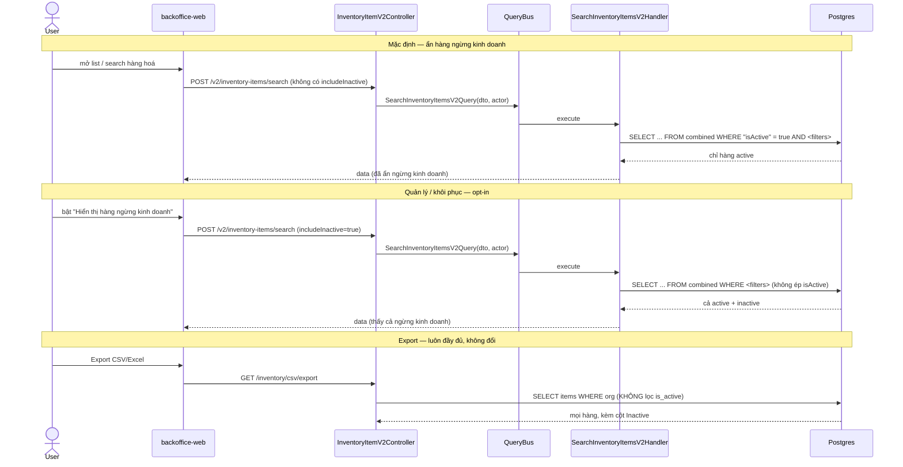
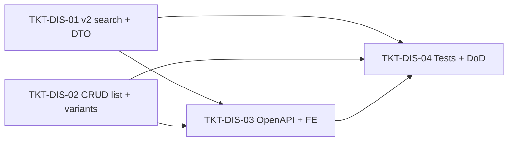

# EPIC-10072026 Hide Discontinued Products From Search & Catalog

## Goal

Hàng hoá đã **ngừng kinh doanh** (`ItemEntity.isActive = false`) không được xuất hiện trên các API search và catalog. Chúng **chỉ** hiện khi export (CSV/Excel) — nơi đã sẵn cột `Inactive` để đánh dấu trạng thái.

Success = mọi surface search/catalog mặc định loại bỏ hàng ngừng kinh doanh; backoffice quản lý vẫn xem/khôi phục được chúng qua cờ opt-in `includeInactive=true`; export không đổi.

## Scope

- **No schema change, no new entity, no migration, no events.** Reuse cột boolean `is_active` sẵn có trên `items` (label "Ngừng kinh doanh") + index `IDX_items_org_pos_catalog` / `IDX_items_org_active_category` đã tồn tại.
- **Definition of "ngừng bán":** `isActive = false`. Với product group (v2 search / listProductGroups) một group bị coi là ngừng kinh doanh khi **tất cả** variant inactive (`bool_and(i.is_active) = false`) — đúng model hiện tại.
- **Backoffice policy:** default-hide + opt-in override. Server loại bỏ hàng ngừng kinh doanh theo mặc định; caller có thể truyền `includeInactive=true` để thấy chúng (dùng cho màn quản lý/khôi phục).
- **Surfaces cần enforce (theo user):**
  1. `POST /v2/inventory-items/search` (`SearchInventoryItemsV2Handler`) — gap chính, hiện không ép `isActive`.
  2. Generic CRUD list twin `InventoryItemCrudService.listProductGroups` (đang parameterize `isActive` optional, mặc định null = show all).
  3. Variant queries `listProductItems` (picker/search). **Ngoại lệ:** `loadProductVariants` (hydrate bảng variant của form sửa) **giữ nguyên** hiển thị cả variant inactive để còn khôi phục được.
- **Không đụng:** `PosCatalogService` / `PosCatalogProductService` (đã hardcode `is_active = true AND is_pos_visible = true`); `CsvExportService.exportItems` / `exportItemsExcelBuffer` (cố ý không lọc — phải giữ nguyên).

## Success Metrics

- v2 search + generic CRUD list + variant picker mặc định **không** trả về hàng ngừng kinh doanh (`isActive=false`).
- Truyền `includeInactive=true` → thấy lại hàng ngừng kinh doanh (backoffice quản lý/khôi phục).
- Filter `isActive` tường minh vẫn hoạt động (ví dụ chỉ xem hàng inactive) khi `includeInactive=true`.
- POS catalog không đổi hành vi.
- Export CSV **và** Excel vẫn bao gồm hàng ngừng kinh doanh, cột `Inactive = "Có"`.
- `pnpm --filter @erp/api test` + `lint` xanh; openapi snapshot regen & commit.

## Flows

## Tickets

- [TKT-DIS-01 v2 search default-hide + includeInactive](../tickets/TKT-DIS-01-v2-search-hide-discontinued.md)
- [TKT-DIS-02 CRUD list + variant queries default-hide](../tickets/TKT-DIS-02-crud-list-variant-hide-discontinued.md)
- [TKT-DIS-03 OpenAPI regen + FE toggle + export verify](../tickets/TKT-DIS-03-openapi-fe-toggle.md)
- [TKT-DIS-04 Tests + DoD gate](../tickets/TKT-DIS-04-tests-dod.md)

## Dependencies

- Depends on: EPIC-003 InventoryAndCsv (items, v2 search), EPIC-010 ItemManagementEnhancement (`isActive` toggle, `set-items-status.dto`).
- Reuses: cột `is_active` + label "Ngừng kinh doanh", `SearchInventoryItemsV2Handler`, `InventoryItemCrudService`, `CsvExportService` (untouched), backoffice `buildV2Body` convention.

### Ticket dependency graph

