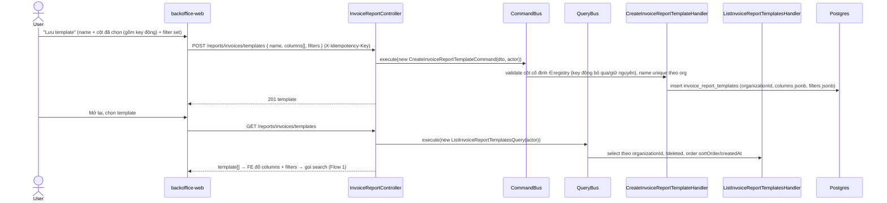
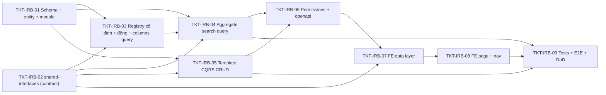

# EPIC-11062026 Báo cáo tổng hợp bán hàng theo ngày (cột động theo phương thức thanh toán + template lưu sẵn, full CQRS)

## Trạng thái triển khai (cập nhật)

- **Report engine generic:** backend không chỉ phục vụ 1 báo cáo mà là **registry nhiều report type** (`ReportDefinition` + `ReportRegistry`), discriminate bằng `reportType`. Có route `GET /reports/invoices/types`. v1 hiện thực 1 type `daily-sales-summary`; thêm type mới = thêm `ReportDefinition` ở backend, **FE không đổi**.
- **BE done + verified:** migration (`invoice_report_templates`, có `report_type`), shared-interfaces, registry + columns/search/types queries, template CQRS CRUD, permissions seed + sync, `openapi:generate`. `pnpm --filter @erp/api test -- invoice-report` = 27 specs xanh; app boot OK.
- **FE = chỉ tài liệu tích hợp, KHÔNG code FE** (theo chỉ đạo): xem [`docs/invoice-report-fe-api-integration.md`](../../docs/invoice-report-fe-api-integration.md). FE là renderer generic (headers + dataRaw), không hard-code cột/nghiệp vụ.
- **Cột bỏ khỏi v1:** "Tiền phí" (không có trường backing trong schema) — chủ ý, không phải thiếu sót.

## Goal

Cho phép người dùng **tự dựng báo cáo "Tổng hợp bán hàng theo ngày"** ở `backoffice-web` (đúng tham chiếu màn hình KiotViet-style đính kèm): chọn các **cột hiển thị** từ một **catalog cột do backend trả về** (gồm cột tổng hợp **cố định** — Tiền hàng, Tiền phí, Khuyến mại, Tổng, Tỷ lệ KM %, Thực thu… — và cột **động theo phương thức thanh toán** sinh từ `PaymentAccountEntity` của org/chi nhánh), lưu lựa chọn đó thành **template** (mỗi template mang **bộ cột riêng + bộ filter riêng**) để dùng lại, rồi gọi API "đổ dữ liệu" trả về **một dòng / một ngày** (aggregate theo ngày trong khoảng `Từ ngày → Đến ngày`) kèm **dòng tổng (footer)**, lọc **theo cửa hàng** (một chi nhánh) hoặc **theo chuỗi** (toàn bộ chi nhánh trong tổ chức nếu có quyền consolidated).

Luồng FE: **(1)** gọi API lấy **catalog cột** (`headers` — gồm cột cố định + cột động theo phương thức của org) + danh sách template đã lưu → **(2)** gọi API search đổ dữ liệu tổng hợp theo `columns[]` + `filters` (bắt buộc có khoảng ngày).

Kết quả đo được: từ trang báo cáo, người dùng chọn ≥1 cột (kể cả cột phương thức thanh toán động), đặt khoảng ngày, bấm "Lấy dữ liệu" → nhận đúng các dòng tổng hợp theo ngày trong phạm vi cửa hàng/chuỗi với đúng các cột đã chọn + dòng tổng; lưu template (cột + filter) và tải lại cho lần sau.

## Decisions (locked — chốt qua Step 1 + clarifying questions)

- **Granularity = AGGREGATE một dòng / một ngày** (group-by ngày trong khoảng `issuedAt`), kèm **dòng tổng (totals footer)**. *(Quyết định này ghi đè bản nháp trước "một dòng / một hóa đơn — không aggregate"; tham chiếu màn hình là "TỔNG HỢP BÁN HÀNG THEO NGÀY".)*
- **Cột = cố định (registry curated) + động (pivot theo phương thức thanh toán).** Cột cố định nằm trong registry server `INVOICE_REPORT_SUMMARY_COLUMNS` (whitelist tiếng Anh, có cột **computed**). Cột động sinh **runtime** từ `PaymentAccountEntity` (active, scope org/branch) — **một cột / một payment account** (`col: 'payment.method.<paymentAccountId>'`, và bản doanh-thu `'revenue.method.<paymentAccountId>'`). **Bác bỏ** truy cập bảng/cột SQL tùy ý từ FE (rủi ro rò chéo tenant + injection); cột động chỉ là id payment-account hợp lệ của org.
- **Aggregate tính trên RAM (JS), KHÔNG `GROUP BY` SQL.** Đúng feedback `prefer_in_memory_aggregation`: handler fetch **raw** invoice rows (+ `invoice_payments`) trong khoảng ngày + scope, **group theo ngày + sum theo cột / theo phương thức trong JS**, rồi compute cột dẫn xuất (Tổng, Thực thu, Tỷ lệ KM %). Cột computed tính **server-side** (một nguồn sự thật, khớp export sau này).
- **HAI API tách biệt (mỗi API một response riêng — không gộp):**
  1. `GET /reports/invoices/columns` → **chỉ** `{ headers: ReportColumnHeader[] }` = **toàn bộ catalog** (cột cố định + mọi cột động của scope) cho FE dựng bộ chọn cột + dòng header. Mỗi header `{ col, name, desc, type, group: { id, name } | null }`; `group` để gom band colspan ("Doanh thu"/"Khách hàng thanh toán"); `desc` = công thức/sub-label (`"(13)=(1)-(11)-(12)"`); `type` = **rich** `ReportColumnDataType` để FE format `vi-VN` + chọn widget filter cột.
  2. `POST /reports/invoices/search` → **chỉ** dữ liệu báo cáo `{ dataRaw: ReportCell[][], totals: ReportCell[] | null, total, page, limit }` (**KHÔNG** kèm `headers` — FE đã có từ API columns). `dataRaw` = mảng dòng (1 dòng = 1 ngày), mỗi dòng là **mảng cell tự mô tả** `{ col, type, value }` (`value: string|number|null`, Date→ISO); `totals` = dòng tổng footer (tính trên tập dòng **sau filter**, khớp footer trong ảnh).
- **Filter theo TỪNG CỘT (như trong ảnh) + filter scope — theo pattern search hiện tại.** Ảnh có hàng widget dưới mỗi header (`Ngày` = `=`, các cột tiền = `≤`/`≥`/`=`). Hai tầng filter:
  - **Scope (pre-aggregate, SQL qua `FilterBuilder` — giống `SearchInvoicesV2`):** `issuedAt` (DateRange, **bắt buộc** — khoảng ngày báo cáo), `status`, `type`, `branchId`. Lọc hóa đơn trước khi gom.
  - **Per-column (post-aggregate, JS):** `columnFilters: ColumnFilterDto[]` mỗi phần tử `{ col, eq?, lt?, lte?, gt?, gte?, from?, to? }` (tái dùng shape `CompareFilterDto`/`DateRangeFilterDto`), áp lên **giá trị đã tổng hợp theo ngày** của cột (kể cả cột computed + cột động). `col` phải ∈ catalog (cố định ∈ registry, động ∈ payment-account org) — lạ → 400.
- **TOÀN BỘ feature theo chuẩn CQRS.** Read = `@QueryHandler` qua `QueryBus`; mọi mutation = `@CommandHandler` qua `CommandBus`. Không service-thường cho CRUD.
  - Queries: `GetInvoiceReportColumnsQuery` (catalog cố định + động), `SearchInvoiceReportQuery` (đổ dữ liệu aggregate), `ListInvoiceReportTemplatesQuery`, `GetInvoiceReportTemplateQuery`.
  - Commands: `CreateInvoiceReportTemplateCommand`, `UpdateInvoiceReportTemplateCommand`, `DeleteInvoiceReportTemplateCommand`.
  - Phần filter tuân theo skill `cqrs-search-endpoint` (request DTO + sub-DTO filter + Query + Handler + `FilterBuilder`).
- **MỘT controller riêng duy nhất:** `InvoiceReportController` (`@Controller('reports/invoices')`), dispatch **mọi** route qua `QueryBus`/`CommandBus`. KHÔNG nhồi vào `ReportingController` sẵn có.
- **Module riêng** `InvoiceReportModule` (`modules/reporting/invoice-report/`): `imports: [CqrsModule, RbacModule, TypeOrmModule.forFeature([...])]`, providers = tất cả handlers + registry. Wire vào `AppModule` (hoặc re-export qua `ReportingModule`).
- **Template = first-class entity mang bộ cột riêng + bộ filter riêng.** Bảng mới `invoice_report_templates` scope ORGANIZATION, soft-delete, org-shared (không `ownerUserId`/cờ private v1). Cột: `name`, `columns: string[]` (jsonb — chứa cả key động `*.method.<paymentAccountId>`), `filters: object` (jsonb), `sortOrder`. Bất kỳ ai có quyền report đều đọc/sửa/xóa template của org. Payment-account bị xóa → key động tương ứng tự rớt khỏi catalog & bỏ qua khi search (không lỗi).
- **Search nhận inline `columns[]` + `filters` (KHÔNG nhận `templateId`).** Chọn template ở FE → FE đổ `columns` + `filters` của template vào body search (có thể override khoảng ngày). Search query stateless với template.
- **Khoảng ngày bắt buộc.** `filters.issuedAt` (DateRange) phải có (thiếu → 400) vì aggregate theo ngày không giới hạn là vô biên. `to` day-inclusive (memory `reference_branchid_varchar_and_typeorm_cast`).
- **Phạm vi cửa hàng/chuỗi** dùng lại logic `ReportingService.resolveBranchScope`: có quyền consolidated → toàn chuỗi hoặc theo `branchId` yêu cầu; không có → khóa về `actor.branchId` (yêu cầu branch khác → 403).
- **Export Excel/CSV = ngoài scope v1** (làm sau, tái dùng `AsyncReportService`).

## Cột động theo phương thức thanh toán (pivot) — nguồn & cách build

Tham chiếu màn hình cho thấy **hai band header**: **"Doanh thu"** và **"Khách hàng thanh toán"**, và **cùng tập phương thức thanh toán xuất hiện ở cả hai band** (American Express, ATM, Chuyển khoản, Dinners Club, Discover, JCB, Master/MasterCard, Techcombank VietQR, UnionPay, Visa/Visa debit, Voucher, Điểm…). Đây là **cột động**, không phải enum cứng:

- Nguồn động = **`PaymentAccountEntity`** (`modules/accounting/payment-accounts/`), per-org **per-branch**: mỗi row map một phương thức → một COA account, mang `label`, `isActive`, `sortOrder`. *(Lưu ý: enum `InvoicePaymentMethod` chỉ có 3 giá trị `cash/bank_transfer/card`; các "phương thức" hiển thị ở màn hình là **payment account** đã cấu hình, phân biệt bằng `label`/`accountId`, KHÔNG phải enum.)*
- `GetInvoiceReportColumnsQuery` (mang `actor`) phải **append** một header / một active payment-account vào catalog: `col: 'payment.method.<paymentAccountId>'` (band `customerPayment`) và `'revenue.method.<paymentAccountId>'` (band `revenue`), `name = account.label`, `type = currency`, `group = { id, name }`. Catalog vì vậy **phụ thuộc scope** (org + branch), không còn tĩnh hoàn toàn.
- `SearchInvoiceReportQuery` khi gặp cột động: tính `SUM(invoice_payments.amount)` theo `account_id` tương ứng **trong JS** sau khi fetch raw payments theo `invoiceId` của các hóa đơn trong khoảng/scope; gom theo ngày. Validate id động ∈ tập payment-account active của org (id lạ → 400).

> ⚠️ Mức chính xác của **partition cố định vs động trong từng band** (và một số cột cố định như `Tiền mặt (7)`, `Voucher (9)`, `Điểm (10)`) chỉ đọc được **một phần** từ 2 ảnh chụp. Danh sách cột cố định cuối cùng (key + công thức `desc`) **đối chiếu lại với báo cáo gốc "Tổng hợp bán hàng theo ngày"** khi làm TKT-03; epic chốt **cơ chế** (cố định trong registry + động pivot từ `PaymentAccountEntity`, hai band, contract descriptor+cell-array), không bịa cột chưa xác thực.

## Registry cột cố định v1 (`INVOICE_REPORT_SUMMARY_COLUMNS` — đọc từ ảnh, reconcile ở TKT-03)

| group | col | name (VI) | desc | type | computed |
| ----- | --- | --------- | ---- | ---- | -------- |
| `null` | `date` | Ngày | — | `date` | no (khóa group-by) |
| `null` | `actualRevenue` | Thực thu | `(13)=(1)-(11)-(12)` | `currency` | **yes** |
| `revenue` (Doanh thu) | `revenue.promoPoints` | Điểm KM | `(14)` | `currency` | no |
| `revenue` | `revenue.goods` | Tiền hàng | `(3)` | `currency` | no |
| `revenue` | `revenue.fee` | Tiền phí | `(4)` | `currency` | no |
| `revenue` | `revenue.discount` | Khuyến mại | `(5)` | `currency` | no |
| `revenue` | `revenue.total` | Tổng | `(1)=(3)+(4)-(5)-(14)` | `currency` | **yes** |
| `revenue` | `revenue.promoRate` | Tỷ lệ KM (%) | `(6)` | `percent` | **yes** |
| `revenue` | `revenue.cash` | Tiền mặt | `(7)` | `currency` | no |
| `revenue` | `revenue.method.<paymentAccountId>` | `<account.label>` | — | `currency` | no (động) |
| `customerPayment` (Khách hàng thanh toán) | `payment.method.<paymentAccountId>` | `<account.label>` | — | `currency` | no (động) |
| `customerPayment` | `payment.voucher` | Voucher | `(9)` | `currency` | no |
| `customerPayment` | `payment.points` | Điểm | `(10)` | `currency` | no |

Nhãn tiếng Việt của cột **cố định** (`INVOICE_REPORT_COLUMN_LABELS_VI`) đặt ở `@erp/shared-interfaces` (đúng tiền lệ `PERMISSION_LABELS_VI`) để **không có tiếng Việt trong source backend**. Cột **động** lấy `name` từ `PaymentAccountEntity.label` (đã là dữ liệu org, không phải string source).

## Scope

- **API (`modules/reporting/invoice-report/`):**
  - `InvoiceReportTemplateEntity` + bảng mới `invoice_report_templates` (scope ORGANIZATION, soft-delete, `columns` jsonb + `filters` jsonb).
  - Registry cột cố định + helper + `GetInvoiceReportColumnsQuery`/handler (merge label VI + **append cột động** từ `PaymentAccountEntity`).
  - `SearchInvoiceReportQuery`/handler (aggregate theo ngày trong JS + cột động pivot + cột computed + scope cửa hàng/chuỗi + totals footer).
  - Template queries (`List`/`Get`) + commands (`Create`/`Update`/`Delete`) + handlers.
  - 1 `InvoiceReportController` dispatch tất cả qua bus.
  - `TypeOrmModule.forFeature([InvoiceEntity, InvoicePaymentEntity, PaymentAccountEntity, BranchEntity, InvoiceReportTemplateEntity])` (entity gốc define ở module pos/accounting/branch; forFeature chỉ cấp repo).
- **Multi-tenant:** mọi query/command lọc `actor.organizationId`; phạm vi branch qua `resolveBranchScope` (consolidated → toàn chuỗi).
- **Events:** không. Read-only + CRUD template (command mutation kế thừa `IdempotencyInterceptor` global).
- **shared-interfaces:** `ReportColumnDataType` (rich) + `ReportColumnHeader` + `ReportCell` + `InvoiceReportResult` + nhãn VI cột cố định + shape request search + shape template.
- **FE (`backoffice-web`):** data layer (hooks) + 1 trang báo cáo (chọn cột band/động + filter khoảng-ngày + bảng 2 tầng header + dòng tổng + lưu/tải template) + `<Route>` + `NavChild`.
- **Ngôn ngữ:** prose ticket tiếng Việt; code/identifier/Swagger/comment/log backend **tiếng Anh**; UI string FE tiếng Việt; nhãn cột cố định VI ở `shared-interfaces`; nhãn cột động từ `PaymentAccountEntity.label`.

## Success Metrics

- `GET /reports/invoices/columns` trả **chỉ** `{ headers }` = cột cố định (key/name/desc/type/group + label VI) **+** một cột động / một `PaymentAccountEntity` active của scope; không lộ tên cột DB; không lộ payment-account của org khác. **Không** kèm dữ liệu.
- `POST /reports/invoices/search` với `columns: ["date","revenue.goods","revenue.total","payment.method.<id>"]` + `filters.issuedAt` (khoảng ngày) → **chỉ** `{ dataRaw, totals, total, page, limit }` (**không** `headers`); `dataRaw` = **một dòng / một ngày**, mỗi cell `{col,type,value}` đúng cột đã chọn; cột computed (`revenue.total`, `actualRevenue`, `revenue.promoRate`) tính đúng; `totals` = tổng các ngày sau filter.
- `columnFilters: [{ col:"revenue.goods", lte: 17000000 }]` → chỉ trả các ngày có tổng `revenue.goods` ≤ 17000000 (filter per-cột post-aggregate, áp được cả cột computed/động); `totals` tính lại trên tập đã lọc.
- `columns` hoặc `columnFilters[].col` chứa key cố định ngoài registry **hoặc** id payment-account động không thuộc org → **400**.
- Thiếu `filters.issuedAt` → **400** (aggregate cần khoảng ngày).
- Người dùng có quyền consolidated: bỏ trống `branchId` → tổng hợp **toàn chuỗi**; không có quyền → chỉ branch của mình (yêu cầu branch khác → 403).
- Mọi query/command chỉ chạm dữ liệu của `actor.organizationId` — không rò chéo tenant.
- Lưu template (cột+filter, gồm key động) qua `CreateInvoiceReportTemplateCommand` → `ListInvoiceReportTemplatesQuery` trả lại; tải template → FE dựng lại đúng cột + filter; xóa = soft-delete.
- `pnpm --filter @erp/api test` xanh (handler + command specs + e2e round-trip); sau đổi endpoint: `pnpm openapi:generate` đã chạy, snapshot + `schema.ts` đã commit.

## Flows

### 1) Lấy catalog cột (cố định + động) + đổ dữ liệu tổng hợp (Queries)

```mermaid
sequenceDiagram
  actor U as User
  participant FE as backoffice-web
  participant API as InvoiceReportController
  participant QB as QueryBus
  participant CH as GetInvoiceReportColumnsHandler
  participant SH as SearchInvoiceReportHandler
  participant RBAC as RbacService
  participant DB as Postgres
  U->>FE: Mở trang Tổng hợp bán hàng theo ngày
  FE->>API: GET /reports/invoices/columns (JWT, X-Branch-Id)
  API->>QB: execute(new GetInvoiceReportColumnsQuery(actor))
  QB->>CH: registry cố định + merge label VI
  CH->>DB: SELECT payment_accounts (active, org/branch scope)
  CH->>CH: append cột động revenue.method.<id> + payment.method.<id> (name = label)
  API-->>FE: headers [{ col, name, desc, type, group }]
  U->>FE: Chọn cột + khoảng ngày + cửa hàng + filter từng cột (=/≤…) — hoặc tải template
  FE->>API: POST /reports/invoices/search { columns[], filters{issuedAt,status,type,branchId}, columnFilters[], page, limit }
  API->>API: ValidationPipe → InvoiceReportSearchDto (issuedAt bắt buộc)
  API->>QB: execute(new SearchInvoiceReportQuery(dto, actor))
  QB->>SH: { dto, actor }
  SH->>SH: validate columns + columnFilters.col (cố định ∈ registry; động ∈ payment-account org) → lạ = 400
  SH->>RBAC: hasPermission(consolidated?) → resolve branch scope
  SH->>DB: fetch raw invoices (org+branch scope, issuedAt range + status/type qua FilterBuilder) + invoice_payments theo invoiceId[]
  SH->>SH: group theo NGÀY trong JS → sum cột cố định + pivot theo payment account → compute Tổng/Thực thu/Tỷ lệ KM%
  SH->>SH: áp columnFilters (post-aggregate) lên dòng-ngày → build dataRaw: ReportCell[][] + totals (trên dòng đã lọc)
  SH-->>API: { dataRaw, totals, total, page, limit } (KHÔNG headers)
  API-->>FE: 200
```

### 2) Lưu / tải template cột + filter (Commands + Queries, org-shared)



## Tickets

- [TKT-IRB-01 BE: Migration + InvoiceReportTemplateEntity + module CQRS skeleton](../tickets/TKT-IRB-01-be-schema-entity-module.md)
- [TKT-IRB-02 Shared: contract descriptor+cell (headers/dataRaw/totals) + nhãn VI + shape search/template](../tickets/TKT-IRB-02-shared-interfaces.md)
- [TKT-IRB-03 BE: Registry cột cố định + cột động (PaymentAccount pivot) + GetInvoiceReportColumnsQuery + route](../tickets/TKT-IRB-03-be-column-registry-catalog.md)
- [TKT-IRB-04 BE: SearchInvoiceReportQuery + handler (aggregate theo ngày trong JS + pivot + computed + totals)](../tickets/TKT-IRB-04-be-cqrs-report-search.md)
- [TKT-IRB-05 BE: Template queries + commands + handlers (CQRS CRUD)](../tickets/TKT-IRB-05-be-template-cqrs-crud.md)
- [TKT-IRB-06 BE: Permissions seed + openapi:generate](../tickets/TKT-IRB-06-be-permissions-openapi.md)
- [TKT-IRB-07 FE: Data layer (hooks columns/search/template) + format cell theo type](../tickets/TKT-IRB-07-fe-data-layer.md)
- [TKT-IRB-08 FE: Trang báo cáo (bảng 2 tầng header + cột động + dòng tổng) + Route + Nav](../tickets/TKT-IRB-08-fe-report-page.md)
- [TKT-IRB-09 Tests + E2E + DoD gate](../tickets/TKT-IRB-09-tests-e2e.md)

## Dependencies

- Depends on: [EPIC-007 POS Invoice](./EPIC-007-pos-invoice-customer-promotions.md) (`InvoiceEntity` + `InvoicePaymentEntity`), [EPIC-004 POS & Accounting](./EPIC-004-pos-and-accounting.md) (COA + **`PaymentAccountEntity`** — nguồn cột động), [EPIC-005 Reporting & Hardening](./EPIC-005-reporting-and-hardening.md) (module `reporting` + `resolveBranchScope`).
- Reuses: `FilterBuilder` + sub-DTOs (`StringFilterDto`/`CompareFilterDto`/`DateRangeFilterDto`/`EnumFilterDto`), pattern fetch-raw + attach của `SearchInvoicesV2Handler`, `@Actor()`/`ActorContext`, `RbacService.hasPermission`, `ReportingService.resolveBranchScope` logic, `CqrsModule` (`QueryBus` + `CommandBus`), skill `cqrs-search-endpoint`, `PaymentAccountsService.list` (catalog cột động), `erpApi`/`requireErpData` + `BaseDataTable`/`PageToolbar` (FE).

### Ticket dependency graph



## Out of scope (v1)

- Export Excel/CSV (làm sau qua `AsyncReportService`).
- Granularity khác ngày (theo giờ/tuần/tháng, hoặc detail một dòng/hóa đơn) — v1 chỉ aggregate theo **ngày**.
- Cột tổng hợp ngoài registry cố định + cột động ngoài `PaymentAccountEntity` (vd KM theo nhân viên, theo sản phẩm).
- Template private theo user / cờ visibility (org-shared ở v1).
- `SearchInvoiceReportQuery` resolve `templateId` server-side (v1 nhận inline columns+filters).
- Đụng `pos-web`; sort tùy ý ngoài thứ tự ngày.
- Service-thường cho CRUD (toàn bộ qua Command/Query bus); thêm controller thứ 2.
- Sửa shape các endpoint reporting/invoice hiện có (endpoint mới là additive).
