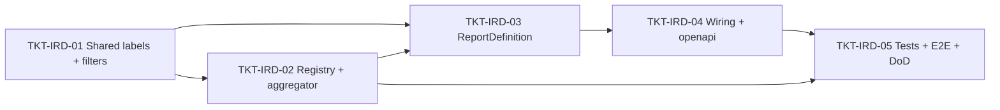

# EPIC-14062026 Báo cáo "Chi tiết doanh thu theo hóa đơn và mặt hàng" (report type thứ 3 — một dòng / một dòng hàng, backend-only)

## Trạng thái triển khai

- **Đã triển khai (branch `template-report`).** Đây là **follow-up** của [EPIC-14062026 Bảng kê hóa đơn và đơn hàng](./EPIC-14062026-invoice-order-listing-report.md) và [EPIC-11062026 Invoice Report Builder](./EPIC-11062026-invoice-report-builder.md) — report engine generic (`ReportDefinition` + `ReportRegistry`, discriminate bằng `reportType`) đã dựng sẵn. Epic này thêm report type thứ 3 ở **granularity một dòng / một dòng hàng (line item)** — mức chi tiết mà 2 type trước defer (`daily-sales-summary` = một dòng/ngày, `invoice-order-listing` = một dòng/hóa đơn).
- **Sandbox = chỉ backend (`apps/api`).** FE là renderer generic (chỉ render `headers` + `dataRaw`), thêm report type mới **FE không đổi**.
- **Thuần additive.** KHÔNG entity mới, KHÔNG migration, KHÔNG endpoint mới, KHÔNG controller/handler mới. Chỉ thêm 1 `ReportDefinition` + registry cột riêng + aggregator riêng + nhãn VI (shared-interfaces) + **3 filter optional** (customer/cashier/salesperson) + wiring.

## Goal

Thêm **report type thứ 3** `invoice-item-revenue-detail` ("Chi tiết doanh thu theo hóa đơn và mặt hàng" — tham chiếu màn hình MISA eShop đính kèm) vào registry báo cáo. Mỗi **dòng = một dòng hàng (invoice line item)**, trải đúng bộ ~33 cột MISA: Ngày, Giờ, Số hóa đơn, Mã SKU, Tên hàng hóa, Nhóm hàng hóa, Đơn vị tính, Số lượng, Đơn giá, Tiền hàng, Tiền KM, Điểm KM, Doanh thu, Tham chiếu, Mã/Tên vị trí, Tài khoản ngân hàng, Mã/Tên/Nhóm/SĐT khách hàng, Kênh bán hàng, Mã/Tên thu ngân, Mã/Tên NV bán hàng, Người nhận/SĐT người nhận, Mã/Tên cửa hàng, Ghi chú hóa đơn, Ghi chú hàng hóa, Nhà cung cấp.

Kết quả đo được: từ FE generic (không đổi), người dùng chọn report type "Chi tiết doanh thu theo hóa đơn và mặt hàng" → `GET /reports/invoices/types` liệt kê nó → `GET /reports/invoices/columns?reportType=invoice-item-revenue-detail` trả catalog cột phẳng (không band, không cột động) → `POST /reports/invoices/search` trả **một dòng / một dòng hàng** với đúng cột đã chọn + dòng tổng (footer) cho cột số lượng/tiền. Lưu/tải template dùng lại nguyên cơ chế có sẵn.

## Decisions (locked — chốt qua clarifying questions)

1. **Granularity = một dòng / một DÒNG HÀNG** (`invoice_items`). Khác cốt lõi so với 2 type trước (ngày / hóa đơn).
2. **Phạm vi dòng = dòng hàng của mọi hóa đơn `status != cancelled`** trong khoảng ngày + scope (khớp `invoice-order-listing`). `status`/`type` vẫn là filter optional.
3. **Backend-only.** FE renderer generic không đổi.
4. **Thêm 3 filter optional** vào contract filter chung (`InvoiceReportFilterPayload` + DTO): `customerId`, `cashierId` (→ `invoice.staffId`), `salespersonId` (→ `invoice.salespersonId`). Mặc định trống = tất cả.
5. **Branch scope = single + consolidated** (tái dùng `resolveBranchScope`, KHÔNG multi-branch `branchIds[]`).
6. **Checkbox "Phân bổ … combo" = OUT OF SCOPE.** Không có model combo trong schema hiện tại → bỏ flag ở v1 (epic tương lai).
7. **Cột thiếu backing = placeholder 0/null tất định** (khớp tiền lệ `invoice-order-listing`): `revenue.promoPoints` (Điểm KM — không có điểm theo dòng), `reference` (Tham chiếu), `payment.bankAccount` (Tài khoản ngân hàng), `salesChannel` (Kênh bán hàng), `receiver`/`receiverPhone` (Người nhận/SĐT) — không có trường/bảng backing.
8. **Aggregate/derive tính trên RAM (JS)** (feedback `prefer_in_memory_aggregation`); **resolve FK inline vào từng dòng** (feedback `inline_relations_over_root_map`); join bằng `find({ where: { id: In(ids) } })` rồi map trong JS — tránh cast `::uuid` SQL (reference `branchid_varchar_and_typeorm_cast`).
9. **Tái dùng toàn bộ surface có sẵn:** `InvoiceReportController`, `InvoiceReportSearchDto`, `GetInvoiceReportColumnsHandler`/`SearchInvoiceReportHandler` (dispatch generic qua `ReportRegistry`). Không controller/DTO/handler mới.
10. **Khoảng ngày bắt buộc** (`filters.issuedAt.from`, thiếu → 400); `to` day-inclusive.

## Phân loại cột (BACKED / DERIVED / PLACEHOLDER)

Catalog **phẳng** (`group: null` cho mọi cột), **không** cột động payment-method.

| col (key) | nhãn VI | type | nguồn / classification |
| --- | --- | --- | --- |
| `date` | Ngày | date | **BACKED** `invoice.issuedAt` (ngày) |
| `time` | Giờ | string | **BACKED** `invoice.issuedAt` (HH:mm) |
| `invoiceCode` | Số hóa đơn | string | **BACKED** `invoice.code` |
| `sku` | Mã SKU | string | **BACKED** `invoice_item.itemCode` |
| `itemName` | Tên hàng hóa | string | **BACKED** `invoice_item.itemName` |
| `itemCategory` | Nhóm hàng hóa | string | **BACKED** inline `items.categoryId → item_categories.name` |
| `unit` | Đơn vị tính | string | **BACKED** `invoice_item.unit` |
| `quantity` | Số lượng | number | **BACKED** `invoice_item.quantity` |
| `unitPrice` | Đơn giá | currency | **BACKED** `invoice_item.unitPrice` |
| `lineAmount` | Tiền hàng | currency | **DERIVED** `quantity * unitPrice` (gross) |
| `lineDiscount` | Tiền KM | currency | **BACKED** `invoice_item.lineDiscount` |
| `revenue.promoPoints` | Điểm KM | currency | **PLACEHOLDER** 0 (không có điểm theo dòng) |
| `lineRevenue` | Doanh thu | currency | **BACKED** `invoice_item.lineTotal` |
| `reference` | Tham chiếu | string | **PLACEHOLDER** null |
| `locationCode` | Mã vị trí | string | **BACKED** inline `invoice_item.locationId → locations.code` |
| `locationName` | Tên vị trí | string | **BACKED** inline `locations.name` |
| `payment.bankAccount` | Tài khoản ngân hàng | string | **PLACEHOLDER** null |
| `customerCode` | Mã khách hàng | string | **BACKED** inline `customers.code` |
| `customer` | Khách hàng | string | **BACKED** inline `customers.name` |
| `customerGroup` | Nhóm khách hàng | string | **BACKED** inline `customer.groupId → customer_groups.name` |
| `customerPhone` | Số điện thoại | string | **BACKED** inline `customers.phone` |
| `salesChannel` | Kênh bán hàng | string | **PLACEHOLDER** null |
| `cashierCode` | Mã Thu ngân | string | **BACKED** inline `invoice.staffId → employee_profiles.code` |
| `cashier` | Thu ngân | string | **BACKED** inline `invoice.staffId → users.name` |
| `salespersonCode` | Mã NV bán hàng | string | **BACKED** inline `invoice.salespersonId → employee_profiles.code` |
| `salesperson` | NV bán hàng | string | **BACKED** inline `salespersonId → employee_profiles.userId → users.name` |
| `receiver` | Người nhận | string | **PLACEHOLDER** null |
| `receiverPhone` | SĐT người nhận | string | **PLACEHOLDER** null |
| `storeCode` | Mã cửa hàng | string | **BACKED** inline `branches.name` (branch không có cột code; khớp `invoice-order-listing`) |
| `storeName` | Tên cửa hàng | string | **BACKED** inline `branches.name` |
| `invoiceNote` | Ghi chú hóa đơn | string | **BACKED** `invoice.note` |
| `itemNote` | Ghi chú hàng hóa | string | **BACKED** `invoice_item.note` |
| `supplier` | Nhà cung cấp | string | **BACKED** inline `items.id → item_providers (isPrimary) → providers.name` |

> `lineAmount` (Tiền hàng) = gross `quantity*unitPrice`; `lineRevenue` (Doanh thu) = `lineTotal` (đã trừ `lineDiscount`, server-canonical — KHÔNG tính lại ở client). `storeCode`/`storeName` đều = `branches.name`.

## Scope

- **API (`modules/reporting/invoice-report/`):**
  - `reports/invoice-item-revenue-detail.report.ts` — `InvoiceItemRevenueDetailReport implements ReportDefinition` (key `invoice-item-revenue-detail`): `buildColumns` (catalog phẳng) + `buildData` (fetch hóa đơn theo scope/filter → fetch `invoice_items IN(ids)` → build một dòng/dòng hàng trong JS, inline FK, derive lineAmount, placeholder, columnFilter post-build, totals footer, pagination).
  - `invoice-item-revenue.columns.ts` — registry cột **per-line-item** riêng (`INVOICE_ITEM_REVENUE_COLUMNS` + helper validate).
  - `invoice-item-revenue.aggregator.ts` — builder thuần JS (`InvoiceItemRowInput`, `itemCellValue`, `buildItemRow`, `buildItemTotals`). Tái dùng `matchColumnFilter`.
  - Wiring: thêm report vào `providers` + factory `ReportRegistry` (`invoice-report.module.ts`); key vào `REPORT_TYPE_DEFINITIONS` (`report-types.seed.ts`, `sortOrder: 30`); thêm repo `InvoiceItemEntity`/`CustomerGroupEntity`/`UserEntity`/`ItemEntity`/`ItemCategoryEntity`/`LocationEntity`/`ItemProviderEntity`/`ProviderEntity` vào `TypeOrmModule.forFeature`.
- **shared-interfaces (additive):** `'invoice-item-revenue-detail'` vào `REPORT_TYPE_LABELS_VI`; các key cột mới vào `INVOICE_REPORT_COLUMN_LABELS_VI`; `customerId?`/`cashierId?`/`salespersonId?` vào `InvoiceReportFilterPayload`.
- **API DTO (additive):** 3 trường `@IsUUID()` optional vào `InvoiceReportFilterDto`.
- **FE:** KHÔNG (renderer generic).
- **Ngôn ngữ:** prose ticket tiếng Việt; code/identifier/Swagger/comment/log backend **tiếng Anh**; nhãn cột VI ở `shared-interfaces`.

## Success Metrics

- `GET /reports/invoices/types` liệt kê **3** type (thêm label VI "Chi tiết doanh thu theo hóa đơn và mặt hàng").
- `GET /reports/invoices/columns?reportType=invoice-item-revenue-detail` trả **chỉ** `{ headers }` = catalog phẳng ~33 cột (`group: null`), không cột động, không lộ cột DB.
- `POST /reports/invoices/search` với report type này + `columns` + `filters.issuedAt` → **chỉ** `{ dataRaw, totals, total, page, limit }`; `dataRaw` = **một dòng / một dòng hàng**; cột BACKED/DERIVED đúng dữ liệu; PLACEHOLDER trả `0`/`null`; `totals` = tổng cột số lượng/tiền (KHÔNG tổng đơn giá) trên tập sau filter.
- Dòng = dòng hàng của hóa đơn `status != cancelled` trong khoảng ngày + scope; 3 filter customer/cashier/salesperson thu hẹp đúng; cột lạ → **400**; thiếu `issuedAt` → **400**; branch khác không có quyền → **403**.
- `pnpm --filter @erp/api test` xanh (specs columns + aggregator + report + e2e round-trip); `daily-sales-summary`/`invoice-order-listing` **không regress**. `pnpm openapi:generate` chạy lại — **có diff** (3 filter mới) → commit `openapi.snapshot.json` + `schema.ts`.

## Flows

### 1) Chọn report type → catalog cột → đổ dữ liệu (một dòng / một dòng hàng)

```mermaid
sequenceDiagram
  actor U as User
  participant FE as backoffice-web (generic, không đổi)
  participant API as InvoiceReportController
  participant QB as QueryBus
  participant CH as GetInvoiceReportColumnsHandler
  participant SH as SearchInvoiceReportHandler
  participant REG as ReportRegistry
  participant DEF as InvoiceItemRevenueDetailReport
  participant RBAC as RbacService
  participant DB as Postgres
  U->>FE: Chọn báo cáo "Chi tiết doanh thu theo hóa đơn và mặt hàng"
  FE->>API: GET /reports/invoices/columns?reportType=invoice-item-revenue-detail
  API->>QB: GetInvoiceReportColumnsQuery
  QB->>CH: execute
  CH->>REG: get('invoice-item-revenue-detail') → DEF
  CH->>DEF: buildColumns(actor) → catalog phẳng
  API-->>FE: { headers }
  U->>FE: Chọn cột + khoảng ngày + cửa hàng + KH/thu ngân/NV bán hàng — hoặc tải template
  FE->>API: POST /reports/invoices/search { reportType, columns[], filters{issuedAt,status,type,branchId,customerId,cashierId,salespersonId}, columnFilters[], page, limit }
  API->>QB: SearchInvoiceReportQuery
  QB->>SH: execute → REG.get → DEF.buildData
  DEF->>DEF: validate columns ∈ registry; issuedAt bắt buộc
  DEF->>RBAC: resolveBranchScope (consolidated?)
  DEF->>DB: invoices (org+branch, issuedAt range, status!=cancelled, +status/type/customer/cashier/salesperson)
  DEF->>DB: invoice_items WHERE invoiceId IN(...) + join customers/branches/employees/users/items/categories/locations/providers (chỉ khi cột cần)
  DEF->>DEF: build một dòng/dòng hàng (JS) → inline FK + derive lineAmount + placeholder
  DEF->>DEF: columnFilters post-build → dataRaw + totals (số lượng/tiền)
  DEF-->>API: { dataRaw, totals, total, page, limit }
  API-->>FE: 200
```

## Tickets

- [TKT-IRD-01 Shared: nhãn VI report type + cột mới + 3 filter optional](../tickets/TKT-IRD-01-shared-interfaces-labels.md)
- [TKT-IRD-02 BE: Registry cột per-line-item + aggregator/row-builder (JS)](../tickets/TKT-IRD-02-column-registry-aggregator.md)
- [TKT-IRD-03 BE: InvoiceItemRevenueDetailReport + filter customer/cashier/salesperson](../tickets/TKT-IRD-03-report-definition.md)
- [TKT-IRD-04 BE: Wiring registry/seed/forFeature + openapi:generate](../tickets/TKT-IRD-04-module-wiring-openapi.md)
- [TKT-IRD-05 Tests + E2E + DoD gate](../tickets/TKT-IRD-05-tests-e2e-dod.md)

## Effort (ước lượng)

| Ticket | Quy mô | Ideal dev-days | Ghi chú rủi ro |
| --- | --- | --- | --- |
| TKT-IRD-01 Shared labels + filters | S | 0.5 | Additive; build lại `@erp/shared-interfaces` |
| TKT-IRD-02 Registry + aggregator | M | 1.0 | Row-builder per-line; placeholder/derived |
| TKT-IRD-03 ReportDefinition | M–L | 2.0 | Joins inline (item/category/location/supplier/customer-group/users) + scope + filter + totals + pagination |
| TKT-IRD-04 Wiring + openapi | S | 0.5 | forFeature 8 repo mới; **có** openapi diff (3 filter) |
| TKT-IRD-05 Tests + E2E + DoD | M | 1.5 | Unit columns/aggregator/buildData + e2e round-trip + no-regress |
| **Tổng** | | **~5.5 dev-days** | Không migration, không FE → rủi ro thấp |

## Dependencies

- Depends on: [EPIC-14062026 Bảng kê hóa đơn và đơn hàng](./EPIC-14062026-invoice-order-listing-report.md), [EPIC-11062026 Invoice Report Builder](./EPIC-11062026-invoice-report-builder.md) (registry/controller/template/contract), [EPIC-007 POS Invoice](./EPIC-007-pos-invoice-customer-promotions.md) (`InvoiceEntity`/`InvoiceItemEntity`), inventory catalog (`ItemEntity`/`ItemCategoryEntity`/`LocationEntity`/`ProviderEntity`/`ItemProviderEntity`), customer (`CustomerEntity`/`CustomerGroupEntity`), rbac/auth (`EmployeeProfileEntity`/`UserEntity`).
- Reuses: `ReportDefinition`/`ReportRegistry`, controller + handlers search/columns/types, `InvoiceReportSearchDto`, `FilterBuilder`, `matchColumnFilter`, `@Actor()`/`ActorContext`, `RbacService.hasPermission`, `resolveBranchScope` logic, template CQRS CRUD.

### Ticket dependency graph



## Out of scope (v1)

- **Backing thật cho cột placeholder:** Điểm KM theo dòng, Tham chiếu, Tài khoản ngân hàng (string), Kênh bán hàng, Người nhận/SĐT người nhận — cần schema + nghiệp vụ mới → epic riêng.
- **Phân bổ doanh thu/KM/thuế cho hàng trong combo:** chưa có model combo → epic riêng.
- **Multi-branch (`branchIds[]`):** v1 dùng single + consolidated.
- **FE / `pos-web`:** không đụng (renderer generic).
- Export Excel/CSV; sửa 2 report type cũ; entity/migration template.
