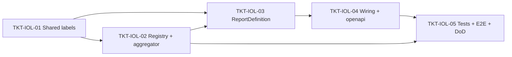

# EPIC-14062026 Báo cáo "Bảng kê hóa đơn và đơn hàng" (report type thứ 2 — một dòng / một hóa đơn, backend-only)

## Trạng thái triển khai

- **Chưa bắt đầu.** Đây là **follow-up** của [EPIC-11062026 Invoice Report Builder](./EPIC-11062026-invoice-report-builder.md) — epic đó đã dựng **report engine generic** (`ReportDefinition` + `ReportRegistry`, discriminate bằng `reportType`) và v1 chỉ có 1 type `daily-sales-summary`. EPIC-11062026 ghi rõ trong "Out of scope (v1)": *"Granularity khác ngày … hoặc detail một dòng/hóa đơn"*. Epic này hiện thực đúng phần bị defer đó.
- **Sandbox = chỉ backend (`apps/api`).** Theo chỉ đạo: KHÔNG code FE. FE đã là renderer generic (chỉ render `headers` + `dataRaw`), thêm report type mới **FE không đổi** (đúng kiến trúc EPIC-11062026). Tài liệu tích hợp FE đã có sẵn: [`docs/invoice-report-fe-api-integration.md`](../../docs/invoice-report-fe-api-integration.md).
- **Thuần additive.** KHÔNG entity mới, KHÔNG migration, KHÔNG endpoint mới, KHÔNG sửa shape endpoint cũ. Chỉ thêm 1 `ReportDefinition` + registry cột riêng + nhãn VI (shared-interfaces) + wiring.

## Goal

Thêm **report type thứ 2** `invoice-order-listing` ("Bảng kê hóa đơn và đơn hàng" — tham chiếu màn hình MISA eShop đính kèm) vào registry báo cáo có sẵn. Khác với `daily-sales-summary` (một dòng / một **ngày**, aggregate), báo cáo này là **một dòng / một hóa đơn** (detail, không gom), trải đúng bộ cột MISA: cột nền (Ngày, Giờ, Số hóa đơn, Trạng thái), band **"Doanh thu"** (Tổng, Tiền hàng, Tiền phí, Khuyến mại, Điểm KM, Tỷ lệ KM %), band **"Khách hàng thanh toán"** (Voucher, Điểm, Công nợ, Thu hộ, Tiền mặt, Tiền gửi NH, Thực thu, Tài khoản ngân hàng, Khách hàng, Số điện thoại, Kênh bán hàng, Thu ngân, NV bán hàng, Ghi chú, Mã cửa hàng) + cột **động theo payment-account** (tái dùng cơ chế `payment.method.<id>`), và band **"Doanh thu sàn TMĐT"** (Phí trả sàn, Thu khác từ sàn, Doanh thu từ sàn).

Kết quả đo được: từ FE generic (không đổi code), người dùng chọn report type "Bảng kê hóa đơn và đơn hàng" → `GET /reports/invoices/types` liệt kê nó → `GET /reports/invoices/columns?reportType=invoice-order-listing` trả đúng catalog cột MISA (cố định + động + placeholder) → `POST /reports/invoices/search` (kèm `reportType` đó + khoảng ngày) trả **một dòng / một hóa đơn** với đúng cột đã chọn + dòng tổng (footer) cho các cột tiền. Lưu/tải template dùng lại nguyên cơ chế có sẵn (template mang `reportType`).

## Decisions (locked — chốt qua clarifying questions)

1. **Granularity = một dòng / một HÓA ĐƠN** (group-key = `invoice.id`, KHÔNG group-by ngày). Đây là điểm khác cốt lõi so với `daily-sales-summary`.
2. **Phạm vi dòng = mọi hóa đơn `status != cancelled`** (khớp filter của `DailySalesSummaryReport`). `status` vẫn là cột + filter để người dùng thu hẹp thêm. Draft/pending = phần "đơn hàng" của báo cáo "hóa đơn **và đơn hàng**".
3. **Cột thiếu backing = ĐƯA VÀO dưới dạng placeholder 0/null** (quyết định của user, KHÁC tiền lệ `daily-sales-summary` vốn *bỏ* "Tiền phí"). Mọi cột MISA đều khai báo để header khớp 1:1; cột chưa có dữ liệu trả `0` (currency) / `null` (string) **một cách tất định**, có đánh dấu rõ là chờ dữ liệu (epic tương lai). Cụ thể placeholder: `revenue.fee` (Tiền phí), `payment.collectOnBehalf` (Thu hộ), `payment.bankAccount` (Tài khoản ngân hàng), `salesChannel` (Kênh bán hàng), toàn bộ band `platform` (Phí trả sàn / Thu khác từ sàn / Doanh thu từ sàn) — **không có trường/bảng backing trong schema hiện tại** (xác thực qua khảo sát code).
4. **Cột thanh toán = tái dùng pattern "động + cố định" của `daily-sales-summary`.** Cột động `payment.method.<paymentAccountId>` sinh runtime từ `PaymentAccountEntity` active của scope (qua helper `dynamicColumnKey`). Cột cố định có backing: `payment.cash` (method=cash), `payment.bankTransfer` (method=bank_transfer), `payment.voucher` (invoice_promotions type=voucher), `payment.points` / `actualRevenue` (invoice fields).
5. **Aggregate/derive tính trên RAM (JS), KHÔNG `GROUP BY` SQL** (feedback `prefer_in_memory_aggregation`). Handler fetch **raw** invoice rows (+ payments/promotions) trong khoảng ngày + scope, build **một dòng / một hóa đơn** trong JS, compute cột dẫn xuất (Tổng, Tỷ lệ KM %), pivot payment theo account.
6. **Resolve FK = inline vào từng dòng** (feedback `inline_relations_over_root_map`): customer (Khách hàng/SĐT), branch (Mã cửa hàng), employee (Thu ngân/NV bán hàng) join và gắn **inline** vào mỗi cell, KHÔNG trả root `{[id]: X}` map.
7. **Tái dùng TOÀN BỘ surface có sẵn:** `InvoiceReportController` (`/reports/invoices/{types,columns,search,templates}`), `InvoiceReportSearchDto`, `GetInvoiceReportColumnsHandler`/`SearchInvoiceReportHandler` (dispatch generic qua `ReportRegistry`). **Không** controller mới, **không** DTO mới, **không** query/command handler mới — handler search/columns sẵn có tự gọi `def.buildColumns`/`def.buildData` của report mới.
8. **Khoảng ngày bắt buộc** (`filters.issuedAt`, thiếu → 400) — khớp `daily-sales-summary`. `to` day-inclusive (memory `reference_branchid_varchar_and_typeorm_cast`).
9. **Phạm vi cửa hàng/chuỗi** dùng lại logic `resolveBranchScope` (quyền `reporting.invoice.consolidated.read` → toàn chuỗi; không có → khóa `actor.branchId`, branch khác → 403).
10. **Template dùng nguyên cơ chế cũ** (`invoice_report_templates.report_type = 'invoice-order-listing'`). Không sửa entity/migration template.

## Phân loại cột (BACKED / DERIVED / PLACEHOLDER)

Xác thực nguồn dữ liệu qua khảo sát code (`invoice.entity.ts`, `invoice-payment.entity.ts`, `invoice-promotion.entity.ts`, `customer.entity.ts`, `branch.entity.ts`, `employee-profile.entity.ts`).

| band | col (key) | nhãn VI | type | nguồn / classification |
| --- | --- | --- | --- | --- |
| `null` | `date` | Ngày | date | **BACKED** `invoice.issuedAt` (phần ngày) |
| `null` | `time` | Giờ | string | **BACKED** `invoice.issuedAt` (HH:mm) — key mới |
| `null` | `invoiceCode` | Số hóa đơn | string | **BACKED** `invoice.code` — key mới |
| `null` | `status` | Trạng thái | enum | **BACKED** `invoice.status` — key mới |
| `revenue` | `revenue.total` | Tổng | currency | **DERIVED** server-side (đối chiếu công thức MISA ở TKT-03) |
| `revenue` | `revenue.goods` | Tiền hàng | currency | **BACKED** `invoice.subtotal` |
| `revenue` | `revenue.fee` | Tiền phí | currency | **PLACEHOLDER** 0 (không có cột phí) |
| `revenue` | `revenue.discount` | Khuyến mại | currency | **BACKED** `invoice.discountAmount` |
| `revenue` | `revenue.promoPoints` | Điểm KM | currency | **BACKED** `invoice.pointsDiscountAmount` |
| `revenue` | `revenue.promoRate` | Tỷ lệ KM (%) | percent | **DERIVED** `(discount+pointsDiscount)/subtotal*100` |
| `customerPayment` | `payment.voucher` | Voucher | currency | **BACKED** `invoice_promotions` (type=voucher) |
| `customerPayment` | `payment.points` | Điểm | currency | **BACKED** `invoice.pointsDiscountAmount` |
| `customerPayment` | `payment.debt` | Công nợ | currency | **DERIVED** `amountDue - totalPaid` khi `status ∈ {debt, partial_debt}`, else 0 — key mới |
| `customerPayment` | `payment.collectOnBehalf` | Thu hộ | currency | **PLACEHOLDER** 0 — key mới |
| `customerPayment` | `payment.cash` | Tiền mặt | currency | **BACKED** `invoice_payments` (method=cash) — key mới |
| `customerPayment` | `payment.bankTransfer` | Tiền gửi NH | currency | **BACKED** `invoice_payments` (method=bank_transfer) — key mới |
| `customerPayment` | `actualRevenue` | Thực thu | currency | **BACKED** `invoice.totalPaid` (tái dùng nhãn có sẵn) |
| `customerPayment` | `payment.bankAccount` | Tài khoản ngân hàng | string | **PLACEHOLDER** null — key mới |
| `customerPayment` | `customer` | Khách hàng | string | **BACKED** join `customers.name` — key mới |
| `customerPayment` | `customerPhone` | Số điện thoại | string | **BACKED** join `customers.phone` — key mới |
| `customerPayment` | `salesChannel` | Kênh bán hàng | string | **PLACEHOLDER** null (không có trường channel) — key mới |
| `customerPayment` | `cashier` | Thu ngân | string | **BACKED** join `invoice.staffId → employee_profiles` — key mới |
| `customerPayment` | `salesperson` | NV bán hàng | string | **BACKED** join `invoice.salespersonId → employee_profiles` — key mới |
| `customerPayment` | `note` | Ghi chú | string | **BACKED** `invoice.note` — key mới |
| `customerPayment` | `storeCode` | Mã cửa hàng | string | **BACKED** join `branches` (theo `branchId`, cast `::uuid`) — key mới |
| `customerPayment` | `payment.method.<paymentAccountId>` | `<account.label>` | currency | **BACKED** (động) Σ `invoice_payments.amount` theo `account_id` |
| `platform` (Doanh thu sàn TMĐT) | `platform.fee` | Phí trả sàn | currency | **PLACEHOLDER** 0 — key mới, band mới |
| `platform` | `platform.otherIncome` | Thu khác từ sàn | currency | **PLACEHOLDER** 0 — key mới |
| `platform` | `platform.revenue` | Doanh thu từ sàn | currency | **PLACEHOLDER** 0 — key mới |

> ⚠️ `desc` (sub-label công thức kiểu `(1)=(2)+(3)-(4)-(5)-(16)` trong ảnh #1) **đối chiếu lại với báo cáo MISA gốc khi làm TKT-03** — epic chốt **cơ chế + classification**, không bịa công thức chưa xác thực. Nhãn VI cột **cố định** đặt ở `@erp/shared-interfaces`; nhãn cột **động** lấy từ `PaymentAccountEntity.label` (đã là dữ liệu org).

## Scope

- **API (`modules/reporting/invoice-report/`):**
  - `reports/invoice-order-listing.report.ts` — `InvoiceOrderListingReport implements ReportDefinition` (key `invoice-order-listing`): `buildColumns` (cột MISA cố định + placeholder + append cột động từ `PaymentAccountEntity`) + `buildData` (fetch raw, một dòng/hóa đơn trong JS, inline FK, per-column filter post-build, totals footer, pagination).
  - `invoice-listing.columns.ts` — registry cột **per-invoice** riêng (`INVOICE_LISTING_COLUMNS` + helper validate key) **tách khỏi** `invoice-report.columns.ts` (vốn per-day) để không đụng `daily-sales-summary`.
  - `invoice-listing.aggregator.ts` — builder **per-invoice** trong JS (pivot payment theo method/account, compute Tổng/Tỷ lệ KM %, classification placeholder). Tái dùng `matchColumnFilter`, shape `ReportCell`, helper `dynamicColumnKey`/`parseDynamicColumnKey`.
  - Wiring: thêm `InvoiceOrderListingReport` vào `providers` + factory `ReportRegistry` (`invoice-report.module.ts`); thêm key vào `REPORT_TYPE_DEFINITIONS` (`report-types.seed.ts`); thêm repo `CustomerEntity`/`BranchEntity`/`EmployeeProfileEntity` vào `TypeOrmModule.forFeature`.
- **shared-interfaces (additive):** thêm `'invoice-order-listing'` vào `REPORT_TYPE_LABELS_VI`; thêm các key cột mới vào `INVOICE_REPORT_COLUMN_LABELS_VI` (+ `INVOICE_REPORT_COLUMN_DESCS` nếu cần); thêm band `platform → 'Doanh thu sàn TMĐT'` vào `INVOICE_REPORT_BAND_LABELS_VI`. (Tùy chọn) map nhãn VI cho giá trị `status` nếu FE cần — additive.
- **Multi-tenant:** mọi truy vấn lọc `actor.organizationId`; branch qua `resolveBranchScope`.
- **Events:** không. Read-only (template CRUD đã có, không đụng).
- **FE:** KHÔNG (renderer generic, không đổi). KHÔNG `pos-web`.
- **Ngôn ngữ:** prose ticket tiếng Việt; code/identifier/Swagger/comment/log backend **tiếng Anh**; nhãn cột cố định VI ở `shared-interfaces`; nhãn cột động từ `PaymentAccountEntity.label`.

## Success Metrics

- `GET /reports/invoices/types` liệt kê **2** type: `daily-sales-summary` + `invoice-order-listing` (label VI "Bảng kê hóa đơn và đơn hàng").
- `GET /reports/invoices/columns?reportType=invoice-order-listing` trả **chỉ** `{ headers }` = đúng bộ cột MISA (nền + 3 band + cột động/PaymentAccount của scope + placeholder), không lộ cột DB, không lộ payment-account org khác.
- `POST /reports/invoices/search` với `reportType=invoice-order-listing` + `columns` + `filters.issuedAt` → **chỉ** `{ dataRaw, totals, total, page, limit }`; `dataRaw` = **một dòng / một hóa đơn** (không gom), mỗi cell `{col,type,value}`; cột BACKED/DERIVED đúng dữ liệu; cột PLACEHOLDER trả `0`/`null` tất định; `totals` = tổng cột tiền trên tập dòng sau filter.
- Dòng = mọi hóa đơn `status != cancelled` trong khoảng ngày + scope; `columnFilters` áp post-build (cả cột derived/động); cột/`columnFilters[].col` lạ → **400**; thiếu `filters.issuedAt` → **400**.
- Quyền consolidated: bỏ trống `branchId` → toàn chuỗi; không có → chỉ branch (branch khác → 403). Không rò chéo tenant.
- Lưu template `reportType=invoice-order-listing` (cột+filter) → list/load lại đúng; soft-delete.
- `pnpm --filter @erp/api test` xanh (specs columns + report buildColumns/buildData + e2e round-trip); `daily-sales-summary` **không regress**. Sau wiring: `pnpm openapi:generate` đã chạy (kỳ vọng **không** diff vì endpoint không đổi — chỉ commit nếu có diff).

## Flows

### 1) Chọn report type "Bảng kê hóa đơn và đơn hàng" → catalog cột → đổ dữ liệu (một dòng/hóa đơn)

```mermaid
sequenceDiagram
  actor U as User
  participant FE as backoffice-web (generic, không đổi)
  participant API as InvoiceReportController
  participant QB as QueryBus
  participant CH as GetInvoiceReportColumnsHandler
  participant SH as SearchInvoiceReportHandler
  participant REG as ReportRegistry
  participant DEF as InvoiceOrderListingReport
  participant RBAC as RbacService
  participant DB as Postgres
  U->>FE: Chọn báo cáo "Bảng kê hóa đơn và đơn hàng"
  FE->>API: GET /reports/invoices/columns?reportType=invoice-order-listing
  API->>QB: GetInvoiceReportColumnsQuery(reportType, actor)
  QB->>CH: execute
  CH->>REG: get('invoice-order-listing')
  REG-->>CH: InvoiceOrderListingReport
  CH->>DEF: buildColumns(actor)
  DEF->>DB: SELECT payment_accounts (active, org scope)
  DEF->>DEF: cột MISA cố định + placeholder + append payment.method.<id> (name=label)
  API-->>FE: { headers }
  U->>FE: Chọn cột + khoảng ngày + cửa hàng + filter từng cột — hoặc tải template
  FE->>API: POST /reports/invoices/search { reportType, columns[], filters{issuedAt,status,type,branchId}, columnFilters[], page, limit }
  API->>QB: SearchInvoiceReportQuery(dto, actor)
  QB->>SH: execute
  SH->>REG: get(dto.reportType) → InvoiceOrderListingReport
  SH->>DEF: buildData(dto, actor)
  DEF->>DEF: validate columns ∈ catalog (cố định/placeholder ∈ registry; động ∈ payment-account org) → lạ=400; issuedAt bắt buộc
  DEF->>RBAC: hasPermission(consolidated?) → resolveBranchScope
  DEF->>DB: raw invoices (org+branch, issuedAt range, status!=cancelled, +status/type qua FilterBuilder) + invoice_payments/promotions + join customers/branches/employees
  DEF->>DEF: build một dòng/hóa đơn (JS) → inline FK + pivot payment + compute derived + placeholder 0/null
  DEF->>DEF: áp columnFilters post-build → dataRaw: ReportCell[][] + totals (cột tiền, tập đã lọc)
  DEF-->>API: { dataRaw, totals, total, page, limit }
  API-->>FE: 200
```

## Tickets

- [TKT-IOL-01 Shared: nhãn VI report type + cột mới + band "Doanh thu sàn TMĐT"](../tickets/TKT-IOL-01-shared-interfaces-labels.md)
- [TKT-IOL-02 BE: Registry cột per-invoice + aggregator/row-builder (JS) + classification](../tickets/TKT-IOL-02-column-registry-aggregator.md)
- [TKT-IOL-03 BE: InvoiceOrderListingReport (buildColumns + buildData một dòng/hóa đơn)](../tickets/TKT-IOL-03-report-definition.md)
- [TKT-IOL-04 BE: Wiring registry/seed/forFeature + openapi:generate](../tickets/TKT-IOL-04-module-wiring-openapi.md)
- [TKT-IOL-05 Tests + E2E + DoD gate](../tickets/TKT-IOL-05-tests-e2e-dod.md)

## Effort (ước lượng)

| Ticket | Quy mô | Ideal dev-days | Ghi chú rủi ro |
| --- | --- | --- | --- |
| TKT-IOL-01 Shared labels | S | 0.5 | Thuần additive; build lại `@erp/shared-interfaces` |
| TKT-IOL-02 Registry + aggregator | M | 1.5 | Row-builder per-invoice mới; classification placeholder; reconcile công thức MISA |
| TKT-IOL-03 ReportDefinition | M–L | 2.0 | Phần nặng: joins inline + scope + per-column filter + totals + pagination |
| TKT-IOL-04 Wiring + openapi | S | 0.5 | forFeature repo mới; kỳ vọng no openapi diff |
| TKT-IOL-05 Tests + E2E + DoD | M | 1.5 | Unit columns/buildData + e2e round-trip + no-regress daily-sales |
| **Tổng** | | **~6.0 dev-days** (~5–7 ngày tùy review) | Không migration, không FE → rủi ro thấp |

## Dependencies

- Depends on: [EPIC-11062026 Invoice Report Builder](./EPIC-11062026-invoice-report-builder.md) (registry `ReportDefinition`/`ReportRegistry`, controller, template, shared contract — **đã ship trên branch `template-report`**), [EPIC-007 POS Invoice](./EPIC-007-pos-invoice-customer-promotions.md) (`InvoiceEntity`/`InvoicePaymentEntity`/`InvoicePromotionEntity`), [EPIC-004 POS & Accounting](./EPIC-004-pos-and-accounting.md) (`PaymentAccountEntity` — cột động), [EPIC-005 Reporting & Hardening](./EPIC-005-reporting-and-hardening.md) (`resolveBranchScope`).
- Reuses: `ReportDefinition`/`ReportRegistry`, `InvoiceReportController` + handlers search/columns/types, `InvoiceReportSearchDto`, `FilterBuilder`, `matchColumnFilter`/`dynamicColumnKey`/`parseDynamicColumnKey`, `@Actor()`/`ActorContext`, `RbacService.hasPermission`, `resolveBranchScope` logic, template CQRS CRUD.

### Ticket dependency graph



## Out of scope (v1)

- **Backing thật cho cột placeholder:** marketplace/sàn TMĐT (Phí trả sàn / Thu khác từ sàn / Doanh thu từ sàn), Thu hộ, Tài khoản ngân hàng (string), Kênh bán hàng, Tiền phí — cần schema + nghiệp vụ mới → **epic riêng**. v1 chỉ trả placeholder 0/null.
- **FE / `pos-web`:** không đụng (renderer generic không đổi).
- Export Excel/CSV (tái dùng `AsyncReportService` sau).
- Sửa `daily-sales-summary`, entity/migration template, hay shape endpoint hiện có.
- Granularity khác (giờ/tuần/tháng) cho report này; sort tùy ý ngoài thứ tự `issuedAt`.
