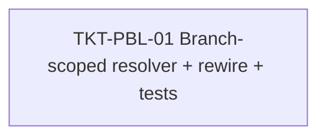

# EPIC-14062026 POS branch-scoped product-location resolver (fix cross-branch stock deduction)

## Goal

POS checkout (and exchange) decrements stock from the **wrong branch's storage** when an org-wide product has a preferred-location row (`product_storage_locations`, "PSL") in more than one branch's storage.

Two POS resolve sites look up PSL by `productId` only, with **no branch/storage scope**, then fold the rows into a `Map` where the *last row wins*. Because products are org-wide and PSL is keyed `@Unique(['productId','storageId'])`, the same product can hold one row per branch. The arbitrary last-row pick means a checkout in Branch B can resolve a `locationId` that lives inside Branch A's storage → the `SALE_ISSUE` ledger row is written against another branch's location, with a `branchId`/`locationId` mismatch.

**Measurable outcome:** a checkout in branch B always resolves a location belonging to branch B's storage(s) (preferring its main/showroom storage), or resolves nothing → the existing checkout guard fails the line closed with 400. A regression unit test reproduces the cross-branch pick and proves it no longer happens.

## Scope

- **No new entity, no migration, no events, no FE.** Pure service-layer read-scoping fix in `apps/api`.
- Touches `apps/api/src/modules/pos/` only; reads `StorageEntity` + `ProductStorageLocationEntity` from `modules/inventory/` (already importable via the shared `EntityManager`, so **no module/DI rewiring**).
- Multi-tenant scope: `ORGANIZATION + BRANCH`.

## Decisions locked (Step 1)

- **Scope by the branch's storages**: resolve `StorageEntity` rows where `branchId = actor.branchId` (+ org), filter PSL by `storageId IN (those)`. Keys off `storage → branch`, not `PSL.branchId`, so legacy `branch_id NULL` PSL rows can't mis-scope. When a product maps to several of the branch's storages, **prefer `isMainStorage`** (the showroom).
- **Fail closed on no mapping**: a product with no PSL row in this branch's storages resolves to `undefined`; the existing checkout guard (`checkout-invoice.service.ts:109-116`) then throws `400 "items without an assigned location"`. Never fall back to another branch's row.
- **Consolidate the duplicated logic** into one shared helper used by both POS resolve sites (the duplication is part of the defect).

## Out of scope

- The unique constraint `@Unique(['productId','storageId'])` stays as-is (no DB change).
- No change to how PSL rows are *created* (`ProductStorageLocationService.validateAndAssign/setLocation` already scope by org+branch correctly).
- No change to the checkout guard, the stock-deduction publisher/consumer, or the ledger.
- No new permission, no `openapi:generate` (no endpoint/contract change).

## Success Metrics

- Checkout in branch B with a product mapped in both branch A and branch B storages deducts from branch B's location (verified by unit test).
- Product mapped in the branch's main + a back storage resolves the **main** storage's location.
- Product with no mapping in the branch → omitted from the map → 400 at checkout (fail-closed preserved).
- `pnpm --filter @erp/api test` and `lint` green; no other resolve behavior changes (single-branch orgs unaffected).

## Flows

### Checkout location resolution (after fix)

```mermaid
sequenceDiagram
  actor U as Cashier
  participant API as @erp/api (InvoiceService.createDraft)
  participant H as resolveBranchProductLocations()
  participant DB as Postgres
  participant CO as CheckoutInvoiceService
  participant K as Redpanda

  U->>API: POST /pos/invoices (draft, X-Branch-Id = B)
  API->>H: (manager, productIds, actor{branchId:B})
  H->>DB: findBy StorageEntity {branchId:B, org}
  DB-->>H: storages(B) [main showroom, ...]
  H->>DB: findBy PSL {productId IN, storageId IN storages(B), org}
  DB-->>H: rows scoped to B
  H-->>API: Map(productId -> locationId in B; main-storage preferred)
  API->>DB: save invoice items (locationId in B, or NULL if unmapped)
  U->>CO: POST /pos/invoices/:id/checkout
  CO->>CO: guard: any item.locationId NULL -> 400 (fail closed)
  CO->>K: publish stock.deduction { locationId in B, branchId B }
```

## Tickets

- [TKT-PBL-01 Branch-scoped PSL resolver + rewire both POS sites + regression tests](../tickets/TKT-PBL-01-branch-scoped-psl-resolver.md)

## Dependencies

- Depends on: EPIC-008 PosEventDrivenRefactor (stock-deduction publisher/consumer), branch showroom/storage auto-creation (`BranchService`), EPIC-011 POS Return & Exchange (`CreateExchangeInvoiceService`).
- Reuses: `StorageEntity.isMainStorage`/`branchId`, `ProductStorageLocationEntity`, the existing checkout location guard. No new infra.

### Ticket dependency graph


