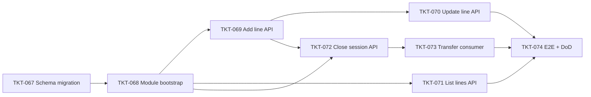

# EPIC-15052026 Kho Tạm Session

## Summary

Tạo khái niệm **"Kho Tạm Session"** — một sổ ghi nhận tạm thời cho từng chi nhánh, dùng để gom các đợt luân chuyển hàng giữa **kho chính (warehouse)** và **showroom** trong cùng branch. Mỗi chi nhánh chỉ có **1 session ACTIVE** tại một thời điểm.

Trong session, người dùng liên tục thêm các *line* theo 2 chiều:

- `warehouse_to_showroom` (W2S) — xuất từ kho chính qua showroom
- `showroom_to_warehouse` (S2W) — trả từ showroom về kho chính

Cuối ca, người quản lý chốt session với 1 trong 3 mode:

1. **NET_OFFSET** — hệ thống tự sinh thêm line cân bằng (đảo chiều phần dư) để mỗi item có tổng W2S = tổng S2W (net = 0), rồi đóng session. **Không** post stock ledger.
2. **CREATE_TRANSFERS** — đóng session ngay, đồng thời publish event Kafka `erp.temp-warehouse.transfer-requested` (tối đa 2 event: 1 cho W2S, 1 cho S2W). Consumer độc lập sẽ tiêu thụ event, gọi `StockTransferService.create/approve/post` để tạo phiếu chuyển kho và ghi stock ledger. Lỗi đẩy DLQ theo infra hiện có (TKT-047).
3. **NONE** — chỉ set session `status=CLOSED`, không tạo phiếu, không cân bằng, không publish event.

**Scope EPIC:** **backend only** — API + Kafka consumer + migration. Không có UI/backoffice trong epic này (UI sẽ được lên kế hoạch ở epic phase 2 sau).

Mục tiêu: rút gọn nghiệp vụ "nhiều phiếu chuyển kho/ngày" thành "1 sổ + 1 lần chốt", trong khi tách phần ghi nhận inventory ra background consumer để API response nhanh, idempotent, có retry/DLQ.

**Out of scope (Phase 2)**:

- Backoffice UI cho kho tạm session.
- Multi-showroom: hiện chỉ hỗ trợ branch có 1 main showroom + 1 main storage.
- Cross-branch transfer trong kho tạm (W2S/S2W giả định cùng branch).
- Approve workflow trước khi close (1 user vừa add line vừa close).
- Edit session settings sau khi đã open (`warehouse_location_id`, `showroom_location_id` lock sau open).
- Re-open session sau khi đã CLOSED.

## Dependencies (epic-level)

- Hoàn thành [EPIC-003 Inventory and CSV](./EPIC-003-inventory-and-csv.md) — `items`, `locations`, `storages`, `showrooms`, `stock_transfers` đã có.
- Phụ thuộc [EPIC-008 POS Event-Driven Refactor](./EPIC-008-pos-event-driven-refactor.md) — `EventPublisher`, `@OnDomainEvent`, ERP_TOPICS, idempotency, DLQ recorder đã có.
- Phụ thuộc [TKT-022 Document Numbering Rule Engine](../tickets/TKT-022-document-numbering-rule-engine.md) — `DocumentNumberingService` được tái sử dụng qua `StockTransferService.post()`.
- Phụ thuộc [TKT-047 Dead-letter events infrastructure](../tickets/TKT-047-dead-letter-events-infrastructure.md) — DLQ recorder + dead_letter_events table.

## Tickets trong epic

| Ticket | Mô tả ngắn |
|--------|------------|
| [TKT-067](../tickets/TKT-067-temp-warehouse-schema-migration.md) | Migration: 2 bảng `temp_warehouse_sessions` + `temp_warehouse_lines`, partial unique 1 ACTIVE/branch, cột tracking transfer status |
| [TKT-068](../tickets/TKT-068-temp-warehouse-module-bootstrap.md) | Entity classes + DTOs + module skeleton + register vào CRUD platform + 4 enum trong shared-interfaces |
| [TKT-069](../tickets/TKT-069-temp-warehouse-add-line-api.md) | `POST /inventory/temp-warehouse/lines` — auto-open session, insert line |
| [TKT-070](../tickets/TKT-070-temp-warehouse-update-line-api.md) | `PATCH /inventory/temp-warehouse/lines/:id` — soft-delete + thêm line mới |
| [TKT-071](../tickets/TKT-071-temp-warehouse-list-lines-api.md) | `GET /inventory/temp-warehouse/lines` — raw mode + aggregated net view |
| [TKT-072](../tickets/TKT-072-temp-warehouse-close-session-api.md) | `POST /inventory/temp-warehouse/sessions/:id/close` — 3 mode close, publish event cho CREATE_TRANSFERS |
| [TKT-073](../tickets/TKT-073-temp-warehouse-transfer-consumer.md) | Kafka consumer `erp.temp-warehouse.transfer-requested` → gọi `StockTransferService` tạo + post phiếu chuyển kho |
| [TKT-074](../tickets/TKT-074-temp-warehouse-test-plan.md) | E2E + DoD gate (API + consumer flow) |

## Graph phụ thuộc ticket

## Epic acceptance criteria

- [ ] Mỗi branch tối đa 1 `temp_warehouse_sessions` `status=ACTIVE` (DB partial unique index enforce).
- [ ] Add line khi chưa có session active → tự open session; cùng item add 2 lần → ra 2 line riêng.
- [ ] Update line giữ audit trail: line cũ `status=DELETED`, line mới `status=ACTIVE`, `superseded_by_id` link.
- [ ] GET list với `hideOffsetting=true` trả về 1 row/item với `totalW2s`, `totalS2w`, `netQuantity`, `netDirection`.
- [ ] Close `NET_OFFSET`: với mỗi item, sau khi close tổng W2S = tổng S2W; không có ledger entry mới; không publish event.
- [ ] Close `CREATE_TRANSFERS`: session `status=CLOSED` ngay; event `erp.temp-warehouse.transfer-requested` được publish (1 cho W2S nếu có line, 1 cho S2W nếu có line); consumer tạo `StockTransferEntity` `POSTED`, ledger entries TRANSFER_IN/OUT đúng tổng line từng direction; session columns `transferW2sId` / `transferS2wId` được consumer set khi hoàn tất.
- [ ] Close `NONE`: chỉ session `status=CLOSED`, không thay đổi line/ledger, không event.
- [ ] Consumer idempotent: re-deliver cùng eventId → không tạo transfer trùng (qua `processed_events`).
- [ ] Consumer fail 3 lần → message đẩy DLQ `erp.temp-warehouse.transfer-requested.dlq`, ghi `dead_letter_events`.
- [ ] Multi-tenant: branch A không thấy được session/line của branch B.
- [ ] **Idempotency end-to-end**: mọi mutation API (`POST /lines`, `PATCH /lines/:id`, `DELETE /lines/:id`, `POST /sessions/:id/close`) support `X-Idempotency-Key` header (auto qua `IdempotencyInterceptor` Redis 24h). Replay cùng key + same body → cùng response, không tạo entity trùng. Consumer dedupe qua `processed_events` với `eventId = ${sessionId}:${direction}` deterministic.

## Epic Definition of Done

- [ ] Tất cả ticket TKT-067–074 đạt DoD riêng.
- [ ] Migration up + down chạy clean trên staging replica.
- [ ] OpenAPI snapshot regenerate, `pnpm openapi:generate` cập nhật `packages/api-client`.
- [ ] Topic `erp.temp-warehouse.transfer-requested` + DLQ được tạo tự động bởi `TopicInitializer.ensureTopics()` ở app start.
- [ ] Không regression: stock-transfer (TKT-011), goods-receipt, POS checkout, các consumer hiện có pass test cũ.
- [ ] E2E coverage cho cả 3 close mode + async consumer flow (verify eventual consistency).
