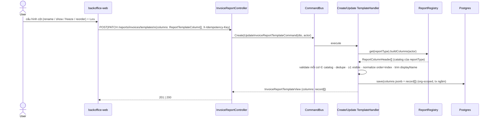
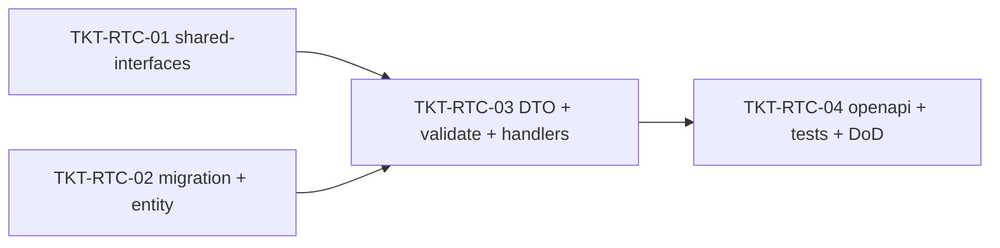

# EPIC-15062026 Cấu hình cột báo cáo theo template (mỗi cột = 1 record, backend-only)

## Goal

Màn hình cấu hình cột báo cáo (MISA-style — ảnh #3 "Tên cột dữ liệu / Tên cột hiển thị / Hiển thị / Cố định cột" + nút lên/xuống) cần **mỗi cột mang cấu hình riêng**. Hiện `invoice_report_templates.columns` chỉ là `string[]` (danh sách key cột đã chọn) — không lưu được tên hiển thị override, bật/tắt hiển thị, cố định cột, hay thứ tự.

**Nâng `columns` từ `string[]` → mảng record** `{ col, displayName, visible, frozen, order }`, áp dụng **generic cho cả 3 report type** đang có (`daily-sales-summary`, `invoice-order-listing`, `invoice-item-revenue-detail`). **Chỉ backend** — FE renderer + màn cấu hình cột tách sang FE epic riêng.

## Scope

- **Entity/bảng:** mở rộng *tại chỗ* `invoice_report_templates.columns` (jsonb) từ `string[]` → record[]. **KHÔNG bảng mới, KHÔNG đổi DDL** (cột vẫn `jsonb`) — chỉ **data-transform migration** + đổi type annotation entity. Vẫn ORGANIZATION-scoped, org-shared, soft-delete như cũ.
- **shared-interfaces:** thêm interface `ReportTemplateColumn`; đổi `columns: string[]` → `ReportTemplateColumn[]` ở `InvoiceReportTemplateView` + `InvoiceReportTemplatePayload`.
- **API surface:** không endpoint mới. Sửa DTO (`CreateInvoiceReportTemplateDto`/`UpdateInvoiceReportTemplateDto`) nhận record cột + 2 command handler (Create/Update) + `toTemplateView`.
- **Validate cột theo report type:** thay `isAcceptedColumnKey` (daily-sales-only) bằng validate theo **catalog của `reportType`** (`ReportRegistry.get(reportType).buildColumns(actor)`). Đây cũng là vá một giới hạn hiện có (xem "Discovered issue").
- **Events:** không. **Permission:** không seed mới (giữ scope `organizationId` hiện tại). **Idempotency:** mutation kế thừa `IdempotencyInterceptor` toàn cục — không tự xử lý.
- **FE:** out of scope (defer).

## Success Metrics

- Tạo/sửa template với mảng record cột → `GET /reports/invoices/templates/:id` trả lại đúng từng record (`displayName`/`visible`/`frozen`/`order`).
- Validate cột đúng theo **từng** report type: template cho `invoice-order-listing` / `invoice-item-revenue-detail` dùng được key cột riêng của nó (không còn bị reject oan bởi whitelist daily-sales).
- Migration chuyển **mọi** row `columns` cũ `string[]` → record hợp lệ (`visible:true, frozen:false, displayName:null, order:index`); `down` đảo ngược về `string[]` theo `order`. Migration **idempotent** (bỏ qua row đã là record).
- `pnpm --filter @erp/api test` + `test:e2e` xanh; `openapi:generate` chạy, snapshot + `schema.ts` committed.

## Discovered issue (vá trong epic này)

`CreateInvoiceReportTemplateHandler` / `UpdateInvoiceReportTemplateHandler` đang validate cột bằng `isAcceptedColumnKey()` của `invoice-report.columns.ts` — whitelist **chỉ của `daily-sales-summary`** (+ regex `payment.method.<uuid>`). Template entity lại có `reportType` cho cả 3 loại báo cáo. ⇒ Template cho 2 report type còn lại sẽ bị reject cột. Epic này sửa validate sang **catalog theo `reportType`** để feature thật sự generic. `isAcceptedColumnKey` không bị xoá (vẫn dùng trong path daily-sales khác), chỉ thôi dùng ở 2 handler template.

## Out of scope

- FE: renderer bảng + màn cấu hình cột (show/freeze/reorder/rename), nút "Lấy mẫu ngầm định". Defer FE epic — `GET /reports/invoices/columns` (catalog) đã đủ làm nguồn default.
- Đổi `POST /reports/invoices/search`: vẫn nhận `columns: string[]`. FE tự resolve (lọc `visible`, sort `order`, map `col`) rồi gửi key list. `displayName`/`frozen` là metadata trình bày — backend search không cần.
- Rename **band/group** (Doanh thu / Khách hàng thanh toán) thành record riêng: band label vẫn lấy từ catalog (`ReportColumnHeader.group`); epic này chỉ lưu cấu hình **cột lá**. Show/freeze cấp group là roll-up phía FE.
- Per-user template visibility, `width` cột, export Excel.

## Flows

## Tickets

- [TKT-RTC-01 shared-interfaces: ReportTemplateColumn + đổi type columns](../tickets/TKT-RTC-01-shared-interfaces-column-record.md)
- [TKT-RTC-02 BE: data-transform migration + entity type](../tickets/TKT-RTC-02-be-migration-entity.md)
- [TKT-RTC-03 BE: DTO record cột + validate theo reportType + handlers + view](../tickets/TKT-RTC-03-be-dto-validation-handlers.md)
- [TKT-RTC-04 BE: openapi regen + tests + E2E + DoD](../tickets/TKT-RTC-04-be-openapi-tests-dod.md)

## Dependencies

- **Depends on:** [EPIC-11062026 Báo cáo tổng hợp bán hàng theo ngày](./EPIC-11062026-invoice-report-builder.md) (entity `invoice_report_templates`, `InvoiceReportController`, template CQRS CRUD), [EPIC-14062026 invoice-order-listing](./EPIC-14062026-invoice-order-listing-report.md) + [EPIC-14062026 invoice-item-revenue-detail](./EPIC-14062026-invoice-item-revenue-detail-report.md) (2 report type còn lại + catalog per type qua `ReportRegistry`).
- **Reuses:** `ReportRegistry` + `ReportDefinition.buildColumns` (validate cột theo reportType), `IdempotencyInterceptor` toàn cục, `toTemplateView`, `GET /reports/invoices/columns` (nguồn default FE).

### Ticket dependency graph

