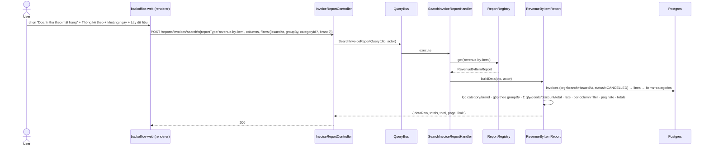
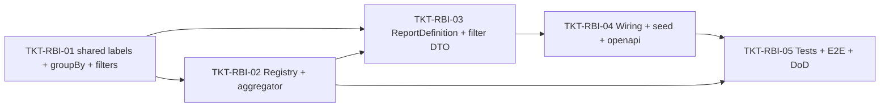

# EPIC-15062026 Doanh thu theo mặt hàng (report type #4 — một dòng/mặt hàng, pivot item·nhóm·thương hiệu, backend-only)

## Goal

Thêm **report type thứ 4** `revenue-by-item` ("Doanh thu theo mặt hàng" — ảnh #1) vào registry báo cáo generic có sẵn (EPIC-11062026). Khác type #3 (`invoice-item-revenue-detail`, một dòng/**dòng hàng**), báo cáo này **gộp** dòng hàng thành **một dòng / một mặt hàng** với **chiều thống kê chuyển đổi được** ("Thống kê theo": **mặt hàng / nhóm hàng / thương hiệu**) qua param `groupBy`. **Chỉ backend** — FE là renderer generic, không đổi.

## Scope

- **Report definition mới** `RevenueByItemReport` (key `revenue-by-item`) — `buildColumns` (catalog phẳng) + `buildData` (scope → load invoices+lines → resolve item metadata → lọc nhóm/thương hiệu → **gộp + cộng theo `groupBy`** trong JS → per-column filter → phân trang → dòng tổng).
- **Aggregator mới** `revenue-by-item.aggregator.ts` (group-and-sum theo key động), **registry cột riêng** `revenue-by-item.columns.ts`.
- **shared-interfaces (additive):** nhãn VI `revenue-by-item` + nhãn cột mới (`brand`…) + enum `ReportGroupBy` + 3 field optional (`groupBy`/`categoryId`/`brand`) trên `InvoiceReportFilterPayload`.
- **DTO (additive):** thêm `groupBy`/`categoryId`/`brand` (optional) vào `InvoiceReportFilterDto` — chỉ report này đọc; report khác bỏ qua.
- **Wiring:** provider + `ReportRegistry` factory + seed report-type (`sortOrder 40`).
- **Tái dùng nguyên:** `InvoiceReportController` (types/columns/search) + template CQRS + `resolveBranchScope` (consolidated permission) + `matchColumnFilter`. **KHÔNG** entity/migration/endpoint/permission mới. `forFeature` đã có `ItemEntity` + `ItemCategoryEntity` → **không thêm repo**.
- **Scope dữ liệu:** `organizationId` + branch (single/consolidated như type #3); `filters.issuedAt.from` bắt buộc.

## Success Metrics

- `GET /reports/invoices/types` liệt kê `revenue-by-item` (nhãn "Doanh thu theo mặt hàng"); `GET columns?reportType=revenue-by-item` trả catalog phẳng.
- `POST search` với `groupBy=item|group|brand` trả **một dòng / một mặt hàng (hoặc nhóm/thương hiệu)**, đo lường (SL/Tiền hàng/Khuyến mại/Doanh thu/Tỷ lệ KM%) **cộng dồn** đúng + dòng tổng.
- Lọc `categoryId` (Nhóm hàng hóa) + `brand` (Thương hiệu) thu hẹp đúng tập mặt hàng; per-column filter post-aggregate hoạt động.
- No-regress: 3 report type cũ + template CQRS + columns/types không đổi hành vi.
- `pnpm --filter @erp/api test` + `test:e2e` + `lint` xanh; `openapi:generate` chạy (DTO filter đổi → có diff), snapshot + `schema.ts` committed.

## Decisions (chốt ở Step 3)

- **`groupBy` để trong `filters`** (`InvoiceReportFilterDto`/`InvoiceReportFilterPayload`), không phải top-level search param — để **template lưu được** "Thống kê theo" qua `filters` jsonb sẵn có (dù về mặt ngữ nghĩa là tham số gộp, không phải bộ lọc). Enum `ReportGroupBy` = `item|group|brand`, default `item`.
- **Cột chiều (dimension) đổi nghĩa theo `groupBy`:** `sku`/`itemName` = mã/tên mặt hàng khi `item`; khi `group`/`brand` → `sku=null`, `itemName` = tên nhóm/thương hiệu (cột `unit`/`brand` null khi không phải grain mặt hàng). Catalog (buildColumns) không biết `groupBy` nên mô tả cột ở mức "chiều đã gộp".
- **"Nhóm hàng hóa" = `ItemCategory`** (FK `items.category_id`); **"Thương hiệu" = `items.brand`** (denormalized string, đủ dùng — không cần `BrandEntity`).
- **Lọc trong JS** (sau khi load item metadata), không SQL join thêm — theo feedback `prefer_in_memory_aggregation`.

## Out of scope

- FE (renderer/màn chọn báo cáo) — generic, không đổi.
- Filter **"Loại hàng hóa"** (Hàng hóa/Dịch vụ/Combo) — **không có cột backing** trên `items` → defer.
- Checkbox **"Thống kê theo chi nhánh"** + **"Phân bổ doanh thu… combo"** (ảnh #1) — out of scope v1 (như type #2/#3).
- Cột band "Khách hàng thanh toán" (Công nợ/Voucher/Tiền mặt…) ở grain mặt hàng — out of scope v1 (vô nghĩa khi gộp theo item); chỉ giữ band Doanh thu.
- Export Excel.

## Flows

## Tickets

- [TKT-RBI-01 shared-interfaces: nhãn VI + cột mới + ReportGroupBy + filter additive](../tickets/TKT-RBI-01-shared-interfaces-labels.md)
- [TKT-RBI-02 BE: column registry + group-and-sum aggregator](../tickets/TKT-RBI-02-column-registry-aggregator.md)
- [TKT-RBI-03 BE: RevenueByItemReport + filter DTO (groupBy/category/brand)](../tickets/TKT-RBI-03-report-definition.md)
- [TKT-RBI-04 BE: module wiring + report-type seed + openapi](../tickets/TKT-RBI-04-module-wiring-openapi.md)
- [TKT-RBI-05 Tests + E2E + DoD](../tickets/TKT-RBI-05-tests-e2e-dod.md)

## Dependencies

- **Depends on:** [EPIC-11062026 invoice-report-builder](./EPIC-11062026-invoice-report-builder.md) (controller/registry/template CQRS), [EPIC-14062026 invoice-item-revenue-detail](./EPIC-14062026-invoice-item-revenue-detail-report.md) (sibling per-line; tái dùng pattern load lines + `matchColumnFilter`), [EPIC-10/EPIC-31052026] (`items.brand`/`category_id`/`item_type`).
- **Compatible với:** [EPIC-15062026 cấu hình cột báo cáo theo template](./EPIC-15062026-report-template-column-config.md) — catalog của report này tự động làm nguồn validate per-column config; không phụ thuộc cứng.
- **Reuses:** `ReportRegistry`, `resolveBranchScope`, `matchColumnFilter`, `FilterBuilder`, `INVOICE_REPORT_COLUMN_LABELS_VI`, `ItemEntity`/`ItemCategoryEntity` repo (đã đăng ký).

### Ticket dependency graph

