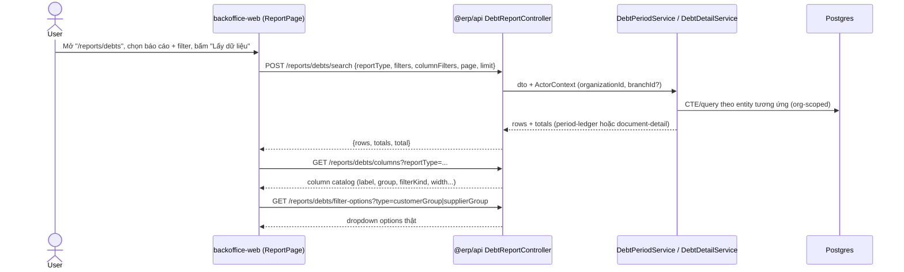
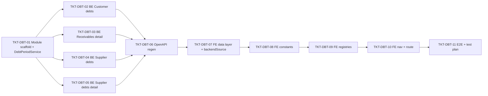

# EPIC-15072026 Báo cáo công nợ (Debt Reports)

## Goal

Backoffice hiện chưa có báo cáo công nợ nào thực sự hoạt động — enum `REPORT_TYPE_DEBTS`
đã khai báo 5/6 report key nhưng chưa wire filter/cột, category "Công nợ" đã có
trong `REPORT_CATEGORY_METADATA` nhưng đang bị comment out, và không có endpoint
backend nào phục vụ domain này (`backendSource` mới chỉ hỗ trợ `"invoice"` và
`"inventory"`).

Ship 4 báo cáo công nợ (đã chốt đặc tả đầy đủ ở
[`docs/24-debt-reports-spec.md`](../../docs/24-debt-reports-spec.md), gồm cả các
câu trả lời trực tiếp của chủ sản phẩm cho từng câu hỏi mở):

1. **Công nợ khách hàng** (`CUSTOMER_DEBTS` — key mới) — sổ công nợ theo kỳ
   (đầu kỳ/tăng/giảm/cuối kỳ) theo từng khách hàng.
2. **Chi tiết công nợ phải thu theo mặt hàng** (`RECEIVABLES_DETAIL_BY_PRODUCT`) —
   sổ chi tiết công nợ của 1 khách hàng cụ thể, theo từng chứng từ + mặt hàng, số
   dư luỹ kế chạy theo dòng.
3. **Công nợ nhà cung cấp** (`SUPPLIER_DEBTS`) — cùng dạng sổ theo kỳ như #1,
   nhưng theo nhà cung cấp, ít cột hơn.
4. **Chi tiết công nợ nhà cung cấp theo chứng từ và mặt hàng**
   (`SUPPLIER_DEBTS_DETAIL_BY_DOCUMENT_AND_PRODUCT`) — sổ chi tiết công nợ của 1
   NCC cụ thể, theo từng phiếu nhập + mặt hàng, có 2 chế độ cột (Hàng hóa/Mẫu mã).

**Ngoài phạm vi epic này** (xem lý do trong `docs/24-debt-reports-spec.md`):
- "Công nợ đối tác giao hàng" — chưa có entity nguồn dữ liệu, cần epic riêng sau
  khi chốt được model.
- "Tổng hợp công nợ phải thu theo tuổi nợ" — thiếu dữ liệu hạn thanh toán trong
  vận hành thực tế, tạm hoãn.

## Scope

- **Không có migration/entity mới.** Toàn bộ 4 báo cáo tái dùng entity đã có:
  `InvoiceDebtEntity`, `DebtPaymentEntity`, `ReceivableEntity`,
  `ReceivableSettlementEntity`, `CustomerEntity`, `MembershipCardEntity`,
  `SupplierDebtEntity`, `SupplierDebtPaymentEntity`, `ProviderEntity`,
  `SupplierGroupEntity`, `GoodsReceiptEntity`, `GoodsReceiptLineEntity`,
  `CashReceiptEntity`, `InvoiceItemEntity`. Cột `%CK`/`Tiền CK`/`Thuế suất`/
  `Tiền thuế` ở báo cáo #4 **hard-code = 0** cho đến khi có entity chiết khấu/thuế
  riêng trên phiếu nhập (quyết định của chủ sản phẩm, xem doc #4).
- **API surface**: custom CQRS-style report endpoints, theo đúng pattern
  "3-API registry-driven contract" (`columns` / `search` / `filter-options` /
  `templates`) đã dùng ở `apps/api/src/modules/reporting/invoice-report/` +
  `apps/api/src/modules/reporting/report-core/`. Module mới:
  `apps/api/src/modules/reporting/debt-report/`.
- **Backend không có sẵn CTE period-ledger dùng chung cho công nợ** (khác kỳ vọng
  ban đầu — `StockPeriodService` chỉ dành riêng cho kho). Cần viết mới
  `DebtPeriodService` (opening/increase/decrease/closing, tham số hoá theo entity
  nguồn) để dùng chung cho báo cáo #1 và #3.
- **FE là generic, data-driven** (`ReportPage.tsx` đọc thuần từ
  `REPORT_CATEGORY_METADATA`/`REPORT_TYPE_METADATA`) — không cần viết page/component
  riêng cho từng báo cáo. Nhưng `backendSource` hiện chỉ có 2 giá trị
  (`"invoice"` | `"inventory"`), phải thêm giá trị thứ 3 `"debt"` và implement branch
  tương ứng ở **3 chỗ hardcode**:
  - `report-data-source.ts` (`getReportDataFetcher`)
  - `report-filter-options.api.ts` (`OPTIONS_PATH`)
  - `report-template.api.ts` (`TEMPLATES_PATH`)
- Category "Công nợ" (`REPORT_CATEGORY.DEBTS`) đã có key trong enum nhưng **đang bị
  comment out** trong `REPORT_CATEGORY_METADATA` — cần uncomment + thêm `<Route>`
  trong `App.tsx` (nav sidebar tự sinh từ metadata, không cần sửa `navConfig.ts`
  thủ công).
- **Events**: không có — toàn bộ 4 endpoint là GET/POST read-only cho báo cáo,
  không mutation, không cần `IdempotencyInterceptor`, không publish/consume Kafka.
- **Permission mới**: `reporting.debts.read` (theo đúng tiền lệ
  `inventory.reports.read` dùng cho báo cáo kho) — seed trong
  `apps/api/src/modules/rbac/permissions.seed.ts`.
- **Phạm vi tổ chức/chi nhánh** (đã chốt với chủ sản phẩm, xem doc):
  - Báo cáo #1, #2 (công nợ khách hàng): **luôn gộp toàn bộ chi nhánh** khách hàng
    từng giao dịch, bất kể đang xem cửa hàng đơn hay chuỗi cửa hàng ở header. Cột
    "Chi nhánh" chỉ để hiển thị nguồn gốc chứng từ, không phải filter giới hạn.
  - Báo cáo #3, #4 (công nợ nhà cung cấp): **mặc định gộp toàn chuỗi/tổ chức**, có
    filter phụ SingleSelect "Cửa hàng" (chỉ hiện ở chế độ Chuỗi cửa hàng, mặc định
    = gộp) để thu hẹp về 1 cửa hàng cụ thể.

## Success Metrics

- Cả 4 báo cáo hiển thị đúng số liệu thật khi test thủ công với dữ liệu seed/demo,
  khớp công thức đã verify trong `docs/24-debt-reports-spec.md` (đặc biệt: báo cáo
  #4 dùng **số luỹ kế (cumulative)** cho "Công nợ tăng/giảm trong kỳ", KHÔNG phải
  delta/dòng như báo cáo #2 — đây là điểm dễ code sai nhất, phải có unit test riêng
  khẳng định đúng công thức).
- "Chọn báo cáo" dialog trong `/reports/debts` liệt kê đủ 4 báo cáo, mỗi báo cáo
  filter/cột đúng theo đặc tả (bộ lọc bắt buộc, cột cố định, group+subtotal, v.v.).
- Không có cross-tenant leakage: mọi query filter theo `actor.organizationId`.
- `pnpm openapi:generate` chạy sạch, `openapi.snapshot.json` + `schema.ts` được
  commit.

## Flows

## Tickets

- [TKT-DBT-01 Backend module scaffold + DebtPeriodService](../tickets/TKT-DBT-01-backend-module-scaffold.md)
- [TKT-DBT-02 Backend — Công nợ khách hàng](../tickets/TKT-DBT-02-be-customer-debts.md)
- [TKT-DBT-03 Backend — Chi tiết công nợ phải thu theo mặt hàng](../tickets/TKT-DBT-03-be-receivables-detail.md)
- [TKT-DBT-04 Backend — Công nợ nhà cung cấp](../tickets/TKT-DBT-04-be-supplier-debts.md)
- [TKT-DBT-05 Backend — Chi tiết công nợ NCC theo chứng từ và mặt hàng](../tickets/TKT-DBT-05-be-supplier-debts-detail.md)
- [TKT-DBT-06 OpenAPI regen + api-client snapshot](../tickets/TKT-DBT-06-openapi-regen.md)
- [TKT-DBT-07 FE data layer + backendSource "debt" wiring](../tickets/TKT-DBT-07-fe-data-layer.md)
- [TKT-DBT-08 FE constants (enum, ReportTableColumn, REPORT_FILTERS_LINE)](../tickets/TKT-DBT-08-fe-constants.md)
- [TKT-DBT-09 FE report registries (4 báo cáo)](../tickets/TKT-DBT-09-fe-registries.md)
- [TKT-DBT-10 FE nav + route "/reports/debts"](../tickets/TKT-DBT-10-fe-nav-route.md)
- [TKT-DBT-11 E2E + test plan + DoD gate](../tickets/TKT-DBT-11-test-plan.md)

## Dependencies

- Depends on: không phụ thuộc epic nào đang dở dang — tất cả entity nguồn đã tồn
  tại và POSTED/settled.
- Reuses:
  - `report-core/report-definition.ts`, `report-core/report-template.entity.ts`
    (contract chung columns/search/filter-options/templates).
  - Pattern module `invoice-report/` làm mẫu cấu trúc (`reports/*.report.ts`,
    `queries/*.handler.ts`, controller, module).
  - `report-registry/*.ts` + `report-type.constant.ts`/`report-filters.constant.ts`/
    `report-table.constant.ts` (FE) — mẫu gần nhất:
    `report-revenue-detail-by-invoice-and-product.registry.ts`.
  - Permission pattern `inventory.reports.read` → `reporting.debts.read`.

### Ticket dependency graph

