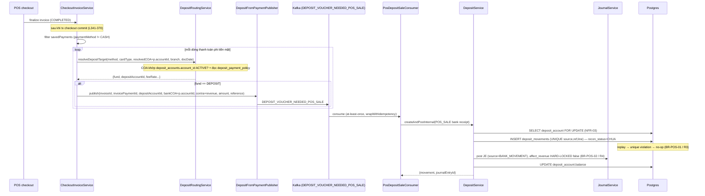
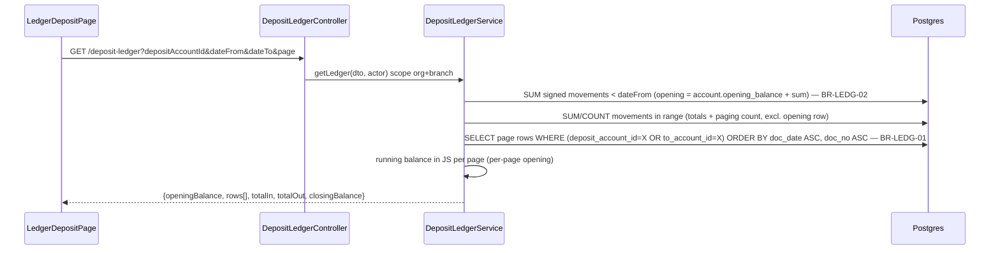
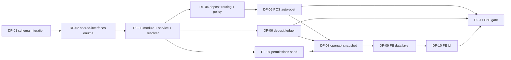

# EPIC-15072026 Quỹ Tiền Gửi — Nền tảng (GĐ1)

> **Đợt 1/4 của module Quỹ tiền gửi (Deposit Fund).** Epic này xây **nền tảng**: danh mục tài
> khoản tiền gửi (FR-01), định tuyến thanh toán → quỹ tiền gửi **suy ra từ COA** + chính sách phí/ghi có (FR-02), tự động ghi nhận thu
> tiền gửi từ POS (FR-03), và Sổ chi tiết tiền gửi (FR-10) — cộng số dư real-time. Toàn bộ
> thiết kế **mirror module Tiền mặt** (`accounting/cash` + `accounting/cash-vouchers`), reuse
> pattern 1:1 và bổ sung các cột đặc thù tiền gửi (recon / fee / value_date). Các đợt sau
> (GĐ2 chi tiêu, GĐ3 đối chiếu/khóa sổ, GĐ4 liên chi nhánh) đều depend on epic này.

## Goal

Xây quỹ **Tiền gửi (bank / ví điện tử / POS-merchant money) theo chi nhánh** song song với quỹ
Tiền mặt đã có. Vấn đề hiện tại: mọi giao dịch POS phi tiền mặt (thẻ / chuyển khoản) **không được
gán tài khoản đích** — cột `Số tài khoản` trong màn Đối chiếu và Sổ chi tiết đang trống hoàn toàn
(ref.md §6.1 gap, §13), nên không thể đối chiếu sao kê và không có số dư quỹ tin cậy.

**Kết quả đo được (tiêu chí GĐ1, ref.md §11):** *mọi giao dịch phi tiền mặt xuất hiện đúng trong
Sổ chi tiết tiền gửi tại đúng chi nhánh, số dư quỹ khớp khi cộng thủ công.* Cụ thể verify qua
UAT-01/02/03/12/13 (§12).

## Scope

**Entities (mới — 4 bảng, 100% greenfield):**
- `banks` — danh mục ngân hàng (generic CRUD catalog: code / name / short_name / is_active). Scope ORGANIZATION.
- `deposit_accounts` — mirror `cash_accounts`; `branch_id NOT NULL` (một tài khoản thuộc đúng 1 chi
  nhánh — decision khóa cứng, OQ-03); `type BANK_ACCOUNT | EWALLET | POS_MERCHANT`; đúng **một**
  `is_default = true` mỗi chi nhánh (BR-ACC-03); `balance` real-time; `allow_negative` (default false).
- `deposit_movements` — mirror `cash_movements` + cột recon/fee/value_date; **append-only**; UNIQUE
  `(source, source_ref_id, source_ref_line_id)` (idempotency payment-line grain — D2/R3/BR-POS-01).
- `deposit_payment_policy` — FR-02 (bảng **mỏng**): `fee_rate`, `fee_bearer`, `settlement_days`, `effective_from/to`
  (non-retroactive) + `deposit_account_id` **override quỹ tùy chọn** (chỉ khi COA nhập nhằng). **Không** map lại
  `payment_method → account`.

> **REUSE `payment_accounts` (không dựng bảng map mới):** `payment_accounts`
> (`apps/api/src/modules/accounting/payment-accounts/`) **đã** map `payment_method → account_id (COA 112x)` + nhãn NH,
> org-wide/branch override, và checkout đã resolve rồi lưu COA vào `invoice_payments.account_id`. Vì thế `target_fund`
> **suy ra từ COA** (không lưu): một dòng phi tiền mặt route vào DEPOSIT **iff** COA khớp `deposit_accounts.account_id`
> ACTIVE cùng org+branch. `deposit_payment_policy` chỉ bổ sung phần kinh tế tiền gửi.

Fee/net/value_date columns **ship trong GĐ1 schema** (decision 3, D4/D5) nhưng **logic phí (2 bút toán)
+ value_date là GĐ3** — GĐ1 chỉ set `fee_amount = 0`, `net_amount = amount`. Các bảng
`bank_receipts`/`bank_payments` (GĐ2), `deposit_recon_batch`/`deposit_period_lock`/`deposit_audit_log`
(GĐ3) **không** thuộc epic này. Scope mọi bảng = ORGANIZATION + BRANCH.

**API surface:**
- Generic CRUD (`/admin/entities/:entityKey/records`) cho `banks`, `deposit_accounts`,
  `deposit_payment_policy` — không hand-build admin page. (Map `payment_method → COA` vẫn ở màn `payment_accounts` hiện có.)
- Custom read: `GET /deposit-ledger` (mirror `GET /cash-ledger`, CQRS-free plain service).
- Internal service: `DepositService.recordMovement()` (mirror `CashService`, negative-balance guard
  qua `SELECT deposit_account FOR UPDATE`), `DepositFundResolverService`,
  `DepositRoutingService.resolveDepositTarget()` (suy ra quỹ từ COA + đọc `deposit_payment_policy`).

**Events:**
- Publish: `ERP_TOPICS.DEPOSIT_VOUCHER_NEEDED_POS_SALE` (mới) — 1 message / dòng thanh toán **phi tiền
  mặt** ánh xạ vào quỹ DEPOSIT, phát sau khi tx checkout commit.
- Consume: `PosDepositSaleConsumer` → `DepositService.createAndPostInternal()` (POS_SALE bank receipt),
  idempotent qua DB unique index + `processed_events` (NFR-04 at-least-once).

**FE surface (backoffice-web):**
- Thay 3 placeholder `/treasury/wip/deposit-*` bằng: danh mục Tài khoản tiền gửi + Chính sách thanh toán
  tiền gửi (generic `/admin/:entityKey` `CrudListPage`) + Sổ chi tiết tiền gửi (clone `LedgerCashPage`).
- Routes trong `App.tsx` + nav thật trong `navConfig.ts` (section `treasury-deposit`). Strings tiếng Việt.

## Success Metrics

- **UAT-01**: POS bán 1.135.000 thanh toán `Thẻ NH/Ví điện tử` → **đúng 1** dòng thu tiền gửi tại CN đó,
  `recon_status = CHUA`, số dư tài khoản tăng 1.135.000.
- **UAT-02**: Split 500.000 tiền mặt + 635.000 chuyển khoản → quỹ tiền mặt +500.000, quỹ tiền gửi +635.000
  (BR-MAP-01 tách bút toán, không gộp).
- **UAT-03**: Replay/retry event hóa đơn ×3 → **đúng 1** movement (DB unique index chặn double-post — R3).
- **UAT-12**: Lọc Sổ chi tiết 01/05–31/05 → `Số dư đầu kỳ` = số dư đến hết 30/04, running balance chính xác
  (BR-LEDG-01/02).
- **UAT-13**: Kế toán CN Nguyễn Trãi không thấy dữ liệu CN Đà Nẵng ở bất kỳ màn hình nào (BR-PERM-01).
- Migration là greenfield (4 bảng mới) → không đụng dữ liệu hiện có; mọi row cũ vẫn valid.

## Flows

### 1. Auto-post thu tiền gửi từ POS (FR-03)

### 2. Đọc Sổ chi tiết tiền gửi (FR-10)

## Tickets

- [TKT-DF-01 Schema migration — banks / deposit_accounts / deposit_movements / deposit_payment_policy](../tickets/TKT-DF-01-schema-migration.md)
- [TKT-DF-02 Shared-interfaces enums + DTO shapes + JournalSource.BANK_MOVEMENT](../tickets/TKT-DF-02-shared-interfaces-enums.md)
- [TKT-DF-03 DepositModule + DepositService.recordMovement + DepositFundResolverService + CRUD register](../tickets/TKT-DF-03-deposit-module-service-resolver.md)
- [TKT-DF-04 Deposit routing + payment policy (reuse payment_accounts)](../tickets/TKT-DF-04-payment-method-fund-mapping.md)
- [TKT-DF-05 POS auto-post — DepositFromPaymentPublisher + PosDepositSaleConsumer](../tickets/TKT-DF-05-pos-auto-post-deposit.md)
- [TKT-DF-06 DepositLedgerService + GET /deposit-ledger + Excel export](../tickets/TKT-DF-06-deposit-ledger.md)
- [TKT-DF-07 Permissions seed + COA 112x verify](../tickets/TKT-DF-07-permissions-seed.md)
- [TKT-DF-08 OpenAPI regen — snapshot + generated schema.ts (BE gate)](../tickets/TKT-DF-08-openapi-snapshot.md)
- [TKT-DF-09 FE data layer — deposit hooks + query keys](../tickets/TKT-DF-09-fe-data-layer.md)
- [TKT-DF-10 FE UI — catalog + mapping + Sổ chi tiết tiền gửi (replace 3 WIP placeholders)](../tickets/TKT-DF-10-fe-ui-catalog-mapping-ledger.md)
- [TKT-DF-11 E2E gate — UAT-01/02/03/12/13](../tickets/TKT-DF-11-e2e-foundation.md)

## Open business questions (ref.md §10) — gates, do not block

- **OQ-03** (một TK ngân hàng dùng chung nhiều chi nhánh?) — **đã chốt cho GĐ1**: `deposit_accounts.branch_id NOT NULL`,
  một tài khoản = một chi nhánh. Nếu nghiệp vụ cần TK tổng dùng chung, xử lý ở đợt sau (không phá schema GĐ1).
- **OQ-01** (bên chịu phí POS, có ghi nhận phí không?) — gate cho R1/GĐ3. GĐ1 **ship cột** `fee_amount`/`net_amount`
  nhưng chưa post bút toán phí (`fee_amount = 0`); logic phí land GĐ3.
- **OQ-06** (Sổ chi tiết lọc 1 tài khoản hay gộp?) — GĐ1 mặc định **lọc 1 tài khoản** (BR-LEDG-03); gộp nhiều TK để đợt sau.
- **OQ-07** (quỹ tiền gửi có được âm không?) — GĐ1 cho cấu hình per-account qua `allow_negative` (default false, chặn âm).
- **OQ-10** (⚠️ **chặn go-live**) — *Số dư đầu kỳ khi go-live lấy từ đâu, ai nhập, có đối chiếu sao kê tại cut-over?*
  GĐ1 ship `opening_balance` + `opening_date` trên `deposit_accounts` (nhập tay khi tạo tài khoản) và Sổ chi tiết
  dùng chúng làm gốc running balance (BR-LEDG-02). **Quy trình nhập/đối chiếu số dư đầu kỳ tại cut-over vẫn chưa chốt
  với nghiệp vụ — phải resolve trước khi go-live production**, đồng thời dọn dữ liệu test (ref.md §13, dòng `Dev Test`).

## Dependencies

- **Depends on:**
  - [EPIC-18052026 Phiếu Thu/Chi + Sổ Tiền Mặt](./EPIC-18052026-cash-vouchers.md) — module `accounting/cash` +
    `accounting/cash-vouchers` là bản mẫu deposit clone; `TKT-CV-00` đã refactor `CashService.recordMovement()` +
    `JournalService.post()/reverse()` nhận `manager?: EntityManager` và trả `{movement, journalEntryId}` — deposit
    dùng đúng contract này.
  - EPIC-004 POS & Accounting — COA (112x seeded), `JournalService`, POS checkout flow.
  - `document-numbering` — `DocumentType.BANK_RECEIPT (NTTK)` / `BANK_PAYMENT (UNC)` / `RECONCILIATION (DS)` **đã có sẵn**.
  - Generic CRUD platform (`EntityRegistryService`).
- **Reuses:**
  - `accounting/cash/*` (recordMovement + resolver + FOR UPDATE negative guard), `accounting/cash-vouchers/cash-ledger/*`
    (ledger algorithm), `accounting/journal/journal.service.ts`, `accounting/payment-accounts/account-resolver.service.ts`
    (contra COA), `pos/services/checkout-invoice.service.ts` (auto-post hook), `crud/*` (generic CRUD),
    `packages/shared-interfaces` + `packages/shared-kafka-client` (topics), FE `pages/treasury/*` + `hooks/treasury/*`.
  - Permissions `accounting.<resource>.<action>`, global `IdempotencyInterceptor`, `processed_events` dedupe.

### Ticket dependency graph

