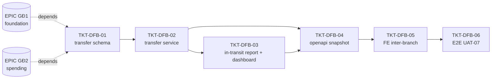

# EPIC-15072026 Quỹ Tiền Gửi — Chuyển tiền liên chi nhánh (GĐ4)

> **Đây là GĐ4** của module Quỹ tiền gửi (ref.md §11). Phủ **FR-07** (chuyển tiền gửi liên chi nhánh, mô hình 2 chân + trạng thái trung gian "Tiền đang chuyển") cộng **Báo cáo tiền đang chuyển** và **Dashboard số dư toàn hệ thống**. Prefix ticket: **DFB**.
>
> **Depends on** hai epic đã ship trước: `EPIC-15072026-deposit-fund-foundation` (GĐ1 — `deposit_accounts` / `deposit_movements` / resolver / `deposit.service.recordMovement`) và `EPIC-15072026-deposit-fund-spending` (GĐ2 — `bank_receipts` / `bank_payments` + service; hai chân của FR-07 tái dùng purpose `INTER_BRANCH_IN` / `INTER_BRANCH_OUT` đã stub sẵn tại đây).

## Goal

CN A chuyển tiền gửi cho CN B là nghiệp vụ **không tức thời**: tiền rời tài khoản A trước, vào tài khoản B sau khi B xác nhận. Nếu chỉ ghi 1 bút toán thì trong khoảng giữa, 10tr "bốc hơi" khỏi sổ tổng (ref.md R5). Epic này chuẩn hóa **mô hình 2 chân qua tài khoản trung gian "Tiền đang chuyển" (TK 113)** để **tổng quỹ toàn tổ chức luôn được bảo toàn** trong suốt quá trình chuyển, cộng báo cáo tiền-đang-chuyển và dashboard số dư đa chi nhánh — tất cả vẫn lọc theo chi nhánh user được gán (BR-PERM-01).

Measurable outcome (UAT-07): CN A chuyển 10tr cho CN B, B chưa xác nhận → quỹ A −10tr **ngay khi lưu**, quỹ B không đổi, báo cáo "Tiền đang chuyển" hiện 10tr; sau khi B xác nhận → quỹ B +10tr, khoản in-transit biến mất, và **tổng số dư toàn hệ thống (số dư các tài khoản + tiền đang chuyển) không đổi ở mọi thời điểm**.

## Scope

- **Entities**
  - **Mới**: `deposit_transfer` (header nối 2 chân: `from_branch`/`to_branch`, `from_account`/`to_account`, `amount`, `status`, `initiated_by`, `confirmed_by`/`confirmed_at`, `from_payment_id`/`to_receipt_id`). Scope ORGANIZATION + BRANCH.
  - **Tái dùng, không đổi schema**: `deposit_movements.transfer_pair_id` + `deposit_movements.transfer_status(DANG_CHUYEN|HOAN_TAT)` — **đã tồn tại từ GĐ1 (TKT-DF-01)**, GĐ4 chỉ populate/đọc. Cột status flag mutable (giống `recon_status`) nên cập nhật được mà không phá tính append-only của các cột tài chính (`amount`, `journal_entry_id`, account ids).
  - **Tái dùng**: `bank_payments` / `bank_receipts` (GĐ2) làm 2 chân chứng từ; COA **113 "Tiền đang chuyển"** làm contra cho cả 2 chân.
- **API surface** — custom controller (không CQRS, không generic CRUD):
  - `DepositTransferController`: `POST /deposit-transfers` (khởi tạo tại A), `POST /deposit-transfers/:id/confirm` (B xác nhận), `POST /deposit-transfers/:id/cancel` (hủy khi còn `DANG_CHUYEN`), `GET /deposit-transfers` (list, filter status/branch/khoảng ngày).
  - `DepositDashboardController`: `GET /deposit-transfers/in-transit` (báo cáo tiền đang chuyển) + `GET /deposit/dashboard` (số dư per-branch + per-account toàn hệ thống). Aggregate **trong RAM bằng JS**, join FK inline per-row (không GROUP BY / window fn, không root `{[id]:X}` map).
- **Events**: không có topic mới. Flow do người dùng chủ động (A khởi tạo, B xác nhận) → gọi service đồng bộ, không event-driven như auto-post POS. Idempotency dựa `IdempotencyInterceptor` + unique index `deposit_movements(source, source_ref_id, source_ref_line_id)` (D2).
- **FE surface** (backoffice-web): khu vực treasury mới cho chuyển liên chi nhánh (khởi tạo tại A → danh sách chờ → xác nhận tại B), trang **Báo cáo tiền đang chuyển**, trang **Dashboard số dư toàn hệ thống**. Thêm route (`App.tsx`) + nav (`navConfig.ts`). Chuỗi UI tiếng Việt.

## Success Metrics

- **UAT-07** pass tự động (E2E): A −10tr tức thời, B không đổi khi chưa xác nhận, in-transit report = 10tr; sau confirm B +10tr, in-transit = 0; **grand total = Σ(deposit_accounts.balance) + Σ(in-transit) không đổi** ở cả 3 mốc (trước / giữa / sau).
- **BR-TRF-05**: cả 2 chân không sinh dòng doanh thu/chi phí — JE chỉ đụng 112x ↔ 113, không đụng 511/6xx/7xx/8xx.
- **BR-TRF-02 / R5**: mọi khoản `DANG_CHUYEN` xuất hiện trong báo cáo tiền đang chuyển; số dư TK 113 = Σ(in-transit) → sổ tổng đối chiếu được, không mất tiền.
- **BR-TRF-03**: sau khi B confirm, A không sửa/hủy được (endpoint cancel trả 409/400).
- **BR-PERM-01 / UAT-13**: kế toán CN chỉ thấy transfer/số dư của chi nhánh được gán; kế toán tổng thấy toàn bộ.
- Migration để lại toàn bộ `deposit_movements` / `deposit_accounts` hiện có hợp lệ (chỉ thêm bảng + seed COA/contra, không sửa dữ liệu cũ).

## Flows

### FR-07 — Chuyển liên chi nhánh (2 chân + trạng thái trung gian)

```mermaid
sequenceDiagram
  actor KTA as Kế toán CN A
  actor KTB as Kế toán CN B
  participant TC as DepositTransferController
  participant TS as DepositTransferService
  participant BP as BankPaymentService (GĐ2)
  participant BR as BankReceiptService (GĐ2)
  participant DS as DepositService.recordMovement (GĐ1)
  participant DB as Postgres

  KTA->>TC: POST /deposit-transfers {toBranch,toAccount,amount}
  TC->>TS: create(dto, actorA)
  Note over TS,DB: 1 LOCAL TX (chỉ đụng CN A)
  TS->>BP: createAndPostInternal(INTER_BRANCH_OUT, fromAccount, contra=113)
  BP->>DS: recordMovement(WITHDRAWAL, source=TRANSFER, ref=transfer.id, line='OUT')
  DS->>DB: SELECT deposit_account FOR UPDATE → balanceA −= amount
  DS->>DB: JE: DR 113 / CR 112(A)  (BR-TRF-05: no P&L)
  TS->>DB: INSERT deposit_transfer {status=DANG_CHUYEN, from_payment_id}
  TS-->>KTA: 201 {id, status:DANG_CHUYEN}  (BR-TRF-01: A giảm ngay)
  Note over DB: amount nằm ở TK 113 — báo cáo in-transit = amount (R5)

  KTB->>TC: POST /deposit-transfers/:id/confirm
  TC->>TS: confirm(id, actorB)
  Note over TS,DB: 1 LOCAL TX (chỉ đụng CN B); guard status=DANG_CHUYEN & branchB=toBranch
  TS->>BR: createAndPostInternal(INTER_BRANCH_IN, toAccount, contra=113)
  BR->>DS: recordMovement(DEPOSIT, source=TRANSFER, ref=transfer.id, line='IN')
  DS->>DB: SELECT deposit_account FOR UPDATE → balanceB += amount
  DS->>DB: JE: DR 112(B) / CR 113  (clears in-transit)
  TS->>DB: UPDATE deposit_transfer {status=HOAN_TAT, to_receipt_id, confirmed_by/at}
  TS->>DB: UPDATE leg-A movement transfer_status → HOAN_TAT
  TS-->>KTB: 200 {status:HOAN_TAT}  (BR-TRF-03: A khóa)
```

### Cancel khi còn DANG_CHUYEN (chỉ A, trước khi B xác nhận)

```mermaid
sequenceDiagram
  actor KTA as Kế toán CN A
  participant TS as DepositTransferService
  participant BP as BankPaymentService
  participant DB as Postgres
  KTA->>TS: cancel(id, reason, actorA)
  Note over TS,DB: guard status=DANG_CHUYEN (BR-TRF-03); nếu HOAN_TAT → 409
  TS->>BP: reverse(from_payment_id)  → DEPOSIT movement khôi phục balanceA, JE đảo (CR 113 → về 112A)
  TS->>DB: UPDATE deposit_transfer {status=DA_HUY, cancelled_by/at, cancel_reason}
  TS-->>KTA: 200 {status:DA_HUY}  (in-transit clears, org total không đổi)
```

## Tickets

- [TKT-DFB-01 Schema — `deposit_transfer` header + tham chiếu transfer columns + COA 113 in-transit](../tickets/TKT-DFB-01-transfer-schema.md)
- [TKT-DFB-02 `DepositTransferService` + controller (FR-07 2 chân)](../tickets/TKT-DFB-02-deposit-transfer-service.md)
- [TKT-DFB-03 Báo cáo tiền đang chuyển + Dashboard số dư toàn hệ thống](../tickets/TKT-DFB-03-in-transit-report-dashboard.md)
- [TKT-DFB-04 `pnpm openapi:generate` + snapshot](../tickets/TKT-DFB-04-openapi-snapshot.md)
- [TKT-DFB-05 FE — chuyển liên chi nhánh + báo cáo in-transit + dashboard](../tickets/TKT-DFB-05-fe-inter-branch.md)
- [TKT-DFB-06 E2E — UAT-07](../tickets/TKT-DFB-06-e2e-inter-branch.md)

## Out of scope — GĐ5 (epic tương lai, KHÔNG ticket ở đây)

Toàn bộ **tự động hóa đối chiếu** thuộc GĐ5 (ref.md §11 GĐ5 + §2.2 O1/O2) và **không** nằm trong epic này:

- **O1** — Import file sao kê ngân hàng / auto-fetch sao kê qua API ngân hàng.
- **O2** — Đối chiếu tự động bằng thuật toán matching.

Sẽ được lập kế hoạch thành một epic riêng sau khi GĐ1-GĐ4 ổn định.

## Open business questions (ref.md §10) — gates, không block

- **BR-TRF-04 "N ngày"**: ngưỡng cảnh báo khoản `DANG_CHUYEN` quá hạn chưa xác nhận cần nghiệp vụ chốt. GĐ4 mặc định `staleDays = 3` (config), hiện dưới dạng cờ `isOverdue` trên báo cáo in-transit; **không** làm cron/notification ở GĐ4 (tránh scope creep). Chốt số N + kênh cảnh báo sau.
- Quyền `confirm` (nhận tiền tại B) tách khỏi quyền `create` (chuyển tại A) theo tinh thần phân nhiệm BR-PERM-02 — xác nhận với nghiệp vụ.

## Dependencies

- **Depends on**:
  - [EPIC-15072026 Quỹ Tiền Gửi — Nền tảng (GĐ1)](./EPIC-15072026-deposit-fund-foundation.md) — `deposit_accounts` (balance real-time, `SELECT FOR UPDATE`), `deposit_movements` (gồm `transfer_pair_id` + `transfer_status`), `DepositService.recordMovement(dto, actor, manager?)` trả `{movement, journalEntryId}`, resolver.
  - [EPIC-15072026 Quỹ Tiền Gửi — Chi tiêu (GĐ2)](./EPIC-15072026-deposit-fund-spending.md) — `bank_payments` / `bank_receipts` + `BankPaymentService` / `BankReceiptService` (`createAndPostInternal()`, `reverse()`), purpose `INTER_BRANCH_OUT` / `INTER_BRANCH_IN` đã stub trong `deposit-vouchers/enums.ts`.
- **Reuses**:
  - Journal: `accounting/journal/journal.service.ts` (`post` / `reverse`, nhận `manager?`); `JournalSource.BANK_MOVEMENT`.
  - Doc numbering: `document-numbering.service.ts` — `DocumentType.BANK_PAYMENT`→`UNC`, `BANK_RECEIPT`→`NTTK` (2 chân dùng lại số chứng từ chuẩn).
  - Contra-COA: `accounting/payment-accounts/account-resolver.service.ts` (`resolveContraAccount`) → **113**; COA seed `accounting/seeders/coa-seeder.service.ts`.
  - Permissions dotted `accounting.deposit_transfer.*` / `accounting.deposit_dashboard.read`; `@UseGuards(PermissionGuard, BranchScopeGuard)`, `@RequireBranchScope()`, `@Actor()`, `@UseInterceptors(AuditInterceptor)`.
  - FE treasury shell (`pages/treasury/*`, `hooks/treasury/*`, `lib/erp-api.ts`), nav `components/layout/navConfig.ts`, route `App.tsx`.

### Ticket dependency graph


