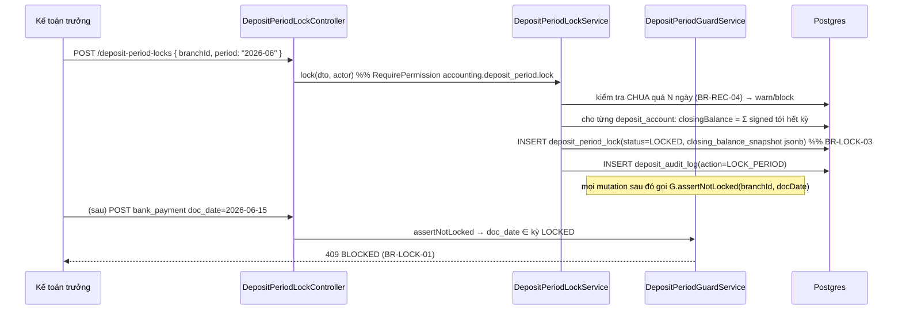
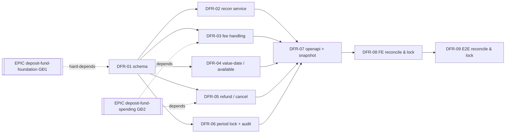

# EPIC-15072026 Deposit Fund — Reconcile & Lock (GĐ3 Kiểm soát)

> **Giai đoạn 3 — Kiểm soát.** Xây tầng đối soát ngân hàng, hoàn/hủy hóa đơn phi tiền mặt, khóa sổ theo kỳ, và — quan trọng nhất — **xử lý phí giao dịch (R1)** + **độ trễ ghi có T+n (R2)**. Đây là nơi biến "sổ tiền gửi" thành "sổ khớp được với sao kê ngân hàng".
>
> ⚠️ **Cảnh báo triển khai (ref.md §11):** KHÔNG mở đối chiếu (GĐ3) khi auto-post GĐ1 chưa vững (idempotency, phí, ngày ghi có). "Nếu auto-post chưa chuẩn mà đã mở đối chiếu, kế toán sẽ mất niềm tin vào số liệu và quay lại làm Excel — module coi như thất bại." Epic này **hard-depends** trên `EPIC-15072026-deposit-fund-foundation` (movements + auto-post idempotent) và `EPIC-15072026-deposit-fund-spending` (voucher/refund path). Không bắt đầu DFR-02..06 trước khi DF auto-post ổn định.

## Goal

Cho phép **Kế toán chi nhánh** đối chiếu các bút toán thu tiền gửi (thẻ / chuyển khoản / ví) với sao kê ngân hàng, và **Kế toán trưởng** khóa sổ theo kỳ với vết audit bất biến. Kết quả đo được:

- Đối chiếu hàng loạt: chọn nhiều giao dịch → nhập tổng sao kê → hệ thống hiện chênh lệch; khớp → `DA`, lệch → `LECH` (bắt buộc ghi chú) — không tự ghi giảm quỹ mà **đề xuất bút toán điều chỉnh** (BR-REC-03).
- **Phí giao dịch (R1)** được tách thành 2 bút toán (thu gross khớp doanh thu + chi phí ngân hàng), số dư ròng khớp sao kê; ước tính theo `fee_rate`, điều chỉnh về thực tế khi đối chiếu.
- **Value-date T+n (R2)**: mỗi màn số dư hiển thị đồng thời **Số dư sổ sách** và **Số dư khả dụng**; đối chiếu match theo `value_date` → không còn "lệch giả" và không cho chi vượt tiền chưa về.
- Hủy hóa đơn phi tiền mặt sinh **bút toán đảo** (không xóa gốc); đã đối chiếu → chặn, hướng người dùng sang phiếu chi hoàn tiền (BR-REF-01/02).
- Khóa kỳ (YYYY-MM/chi nhánh) chốt snapshot số dư cuối kỳ làm số dư đầu kỳ kế tiếp; mọi bút toán có `doc_date` thuộc kỳ khóa bị chặn (BR-LOCK-01).
- Segregation of duties: quyền **Đối chiếu** tách khỏi quyền **Tạo phiếu chi** (BR-PERM-02); **Hủy đối chiếu / khóa-mở kỳ** chỉ Kế toán trưởng (BR-PERM-03).

## Scope

- **Entities / tables**
  - *Mới* (DFR-01): `deposit_recon_batch`, `deposit_period_lock`, `deposit_audit_log`. Org + branch scope.
  - *Tham chiếu, KHÔNG re-add* (đã có từ GĐ1 `TKT-DF-01`): các cột `fee_amount`, `net_amount`, `value_date`, `recon_status(CHUA|DA|LECH)`, `recon_batch_id`, `reconciled_by`, `reconciled_at` trên `deposit_movements`; `fee_rate`, `fee_bearer`, `settlement_days` trên `deposit_payment_policy`; `deposit_accounts.balance` real-time.
- **API surface** — custom services/controllers (không phải generic CRUD): `DepositReconController` (FR-09), `DepositPeriodLockController` (FR-12), read endpoints cho book/available balance (FR-10 mở rộng R2). Fee-posting + reversal là service-internal + consumer, không endpoint riêng ngoài các POST đối chiếu/hoàn tiền.
- **Events** — *Consume*: sự kiện auto-post POS (GĐ1) để gắn fee + value_date; sự kiện hủy/void hóa đơn POS để sinh bút toán đảo. *Emit*: `deposit.reconciliation.completed`, `deposit.period.locked`, `deposit.locked_period.blocked` (alert Kế toán trưởng khi POS trễ rơi vào kỳ khóa — BR-LOCK-02).
- **FE** — backoffice-web: trang **Đối chiếu tiền gửi** (grid multi-select), **Khóa sổ tiền gửi**, hiển thị **Số dư sổ sách / khả dụng**. Thay 3 link `/treasury/wip/*` placeholder. Chuỗi UI tiếng Việt.

## Success Metrics

- UAT-09: đối chiếu 3 giao dịch, sao kê lệch 12.485 (phí) → hệ thống `LECH` + đề xuất bút toán phí, **không** tự ghi giảm quỹ.
- UAT-10: hủy hóa đơn thẻ đã đối chiếu → bị chặn, hướng dẫn tạo phiếu hoàn tiền.
- UAT-11: khóa sổ tháng 06, tạo phiếu chi ngày 15/06 → bị chặn.
- UAT-13: Kế toán CN Nguyễn Trãi không thấy dữ liệu CN 211 Đà Nẵng ở mọi màn đối chiếu / khóa sổ (BR-PERM-01).
- Migration chạy trên DB đang có dữ liệu GĐ1/GĐ2 → mọi row cũ hợp lệ; không đổi `synchronize` (giữ false).
- Số dư ròng của mọi giao dịch thẻ khớp sao kê sau khi tách phí (R1); màn số dư luôn hiển thị 2 con số (R2).

## Flows

### Đối chiếu hàng loạt + phát hiện phí (UAT-09, FR-09, R1)

```mermaid
sequenceDiagram
    participant KT as Kế toán CN
    participant C as DepositReconController
    participant S as DepositReconService
    participant Fee as DepositFeeService
    participant DB as Postgres (tx)
    KT->>C: POST /deposit-recon/reconcile { depositAccountId, movementIds[], stmtTotalAmount, note? }
    C->>S: reconcile(dto, actor)
    S->>DB: SELECT deposit_movements WHERE id IN (...) AND recon_status='CHUA' FOR UPDATE
    S->>S: systemTotal = Σ net_amount ; diff = stmtTotal − systemTotal
    alt diff == 0
        S->>DB: UPDATE recon_status='DA', recon_batch_id, reconciled_by/at
        S->>DB: INSERT deposit_recon_batch(status=RECONCILED)
    else diff != 0 (LECH)
        S-->>C: 400 nếu thiếu note (BR-REC-02)
        S->>DB: UPDATE recon_status='LECH'
        S->>DB: INSERT deposit_recon_batch(status=DISCREPANCY, note)
        S->>Fee: proposeFeeAdjustment(batch, diff)  %% BR-REC-03
        Fee->>DB: INSERT bank_payment DRAFT (purpose=BANK_FEE_ADJUSTMENT)  %% đề xuất, KHÔNG tự ghi giảm quỹ
    end
    S->>DB: INSERT deposit_audit_log(action=RECONCILE)
    S->>DB: generate DS số batch (DocumentType.RECONCILIATION)
    S-->>KT: { batch, systemTotal, diff, proposalId? }
```

### Auto-post gắn phí (R1) + value_date (R2) — consume sự kiện GĐ1

```mermaid
sequenceDiagram
    participant K as Kafka (deposit.movement auto-post, GĐ1)
    participant Con as DepositAutoPostAugmentConsumer
    participant Pol as deposit_payment_policy
    participant Fee as DepositFeeService
    participant DB as Postgres (tx)
    K->>Con: movement created { movementId, amount, docDate, method, cardType }
    Con->>Pol: lookup fee_rate, fee_bearer, settlement_days
    Con->>Con: value_date = doc_date + settlement_days
    Con->>Fee: postFee(movement, policy, manager)
    Fee->>Fee: fee_amount = round(amount * fee_rate) (nếu fee_bearer=MERCHANT) ; net = amount − fee
    Fee->>DB: UPDATE deposit_movements SET fee_amount, net_amount, value_date
    Fee->>DB: recordMovement(WITHDRAWAL fee_amount, source=SYSTEM, category=BANK_FEE, affect_expense) → JE DR 641x / CR 112x
    Note over Fee,DB: 2 bút toán: Thu +gross (khớp doanh thu) + Chi phí NH −fee ⇒ ròng khớp sao kê
```

### Hủy hóa đơn phi tiền mặt (UAT-10, FR-11)

```mermaid
sequenceDiagram
    participant POS as POS invoice cancel/void
    participant R as DepositRefundService
    participant Rec as recon guard (assertNotReconciled)
    participant DB as Postgres (tx)
    POS->>R: reverseForCancelledInvoice(invoiceId, actor)
    R->>DB: SELECT deposit_movements WHERE source=POS_INVOICE, source_ref_id=invoiceId
    R->>Rec: assertNotReconciled(movement)
    alt recon_status == 'CHUA'
        R->>DB: recordMovement(WITHDRAWAL gross, reversal) + JournalService.reverse(gross JE)  %% BR-REF-01, KHÔNG xóa gốc; phí giữ nguyên (BR-REF-03)
        R->>DB: INSERT deposit_audit_log(action=REVERSE)
    else recon_status in ('DA','LECH')  %% BR-REF-02
        R-->>POS: 409 BLOCKED — "Giao dịch đã đối chiếu, tạo Phiếu chi hoàn tiền riêng"
    end
```

### Khóa sổ theo kỳ (UAT-11, FR-12)



## Tickets

- [TKT-DFR-01 recon/lock/audit schema](../tickets/TKT-DFR-01-recon-lock-audit-schema.md)
- [TKT-DFR-02 deposit recon service (FR-09)](../tickets/TKT-DFR-02-deposit-recon-service.md)
- [TKT-DFR-03 fee handling (R1)](../tickets/TKT-DFR-03-fee-handling.md)
- [TKT-DFR-04 value-date & available balance (R2)](../tickets/TKT-DFR-04-value-date-available-balance.md)
- [TKT-DFR-05 refund / cancel non-cash (FR-11)](../tickets/TKT-DFR-05-refund-cancel-noncash.md)
- [TKT-DFR-06 period lock + audit (FR-12, NFR-05)](../tickets/TKT-DFR-06-period-lock-audit.md)
- [TKT-DFR-07 openapi regen + snapshot](../tickets/TKT-DFR-07-openapi-snapshot.md)
- [TKT-DFR-08 FE reconcile & lock](../tickets/TKT-DFR-08-fe-reconcile-lock.md)
- [TKT-DFR-09 E2E reconcile & lock](../tickets/TKT-DFR-09-e2e-reconcile-lock.md)

## Open business questions (ref.md §10) — MUST-CONFIRM gates, do not block planning

Đây là các câu hỏi **chốt trước khi code** (ref.md §9 "cần chốt trước khi code, vì sửa sau rất tốn kém"):

- ⛔ **OQ-01 (gates R1 — highest risk):** Phí POS/chuyển khoản do **cửa hàng hay khách** chịu? Có ghi nhận vào hệ thống không? → quyết định `fee_bearer` semantics trong DFR-03: `MERCHANT` = tách phí thành chi phí (net < gross); `CUSTOMER` = fee_amount=0, net=gross. Nếu chưa chốt, DFR-03 mặc định `MERCHANT` + để `fee_bearer` cấu hình per mapping và **không hard-code**.
- ⛔ **OQ-02 (gates R2):** Có cần phân biệt `Ngày giao dịch` vs `Ngày ghi có`, hay chấp nhận đối chiếu theo lô cuối kỳ? → quyết định DFR-04: nếu "value-date" → populate `value_date` + available balance + match by value_date; nếu "batch cuối kỳ" → available = book, chỉ đối chiếu theo lô. Kế hoạch mặc định theo **value-date** (đề xuất ref.md R2).
- ⛔ **OQ-04 (gates recon scope):** Nguồn sao kê đối chiếu — **nhập tay / import file / API ngân hàng**? → GĐ3 chỉ làm **nhập tay tổng sao kê** (DFR-02). Import/auto-match là GĐ5, ngoài scope epic này.
- ⛔ **OQ-09 (gates FR-11 refund):** Hủy hóa đơn thẻ đã settle xử lý thế nào — refund qua máy POS hay chuyển khoản? → quyết định DFR-05 phiếu chi hoàn tiền là `bank_payment` (chuyển khoản) hay ghi nhận refund-tại-POS. Kế hoạch mặc định: phiếu chi `CUSTOMER_REFUND` (bút toán chi tiền gửi), giữ phí (BR-REF-03).
- Phụ (không chặn kế hoạch): **OQ-06** (sổ lọc 1 TK vs gộp — ảnh hưởng hiển thị available balance khi lọc nhiều TK), **OQ-07** (quỹ có được âm — ảnh hưởng guard chi vượt available balance), **OQ-10** (số dư đầu kỳ go-live — nguồn snapshot chốt kỳ đầu tiên).

## Dependencies

- **Depends on:**
  - `EPIC-15072026-deposit-fund-foundation` (GĐ1, prefix DF) — `deposit_accounts`, `deposit_movements` (kèm cột fee/net/value_date/recon), `deposit_payment_policy` (fee_rate/fee_bearer/settlement_days), auto-post POS **idempotent** (D2 unique index). **BẮT BUỘC ổn định trước** (ref.md §11).
  - `EPIC-15072026-deposit-fund-spending` (GĐ2, prefix DFS) — `bank_receipts`/`bank_payments` (voucher path dùng cho đề xuất bút toán phí + phiếu hoàn tiền), `DepositLedgerService` (mở rộng book/available balance).
- **Reuses:**
  - Movement + journal: `apps/api/src/modules/accounting/cash/cash.service.ts` (`recordMovement(dto, actor, manager?)` → `{movement, journalEntryId}`, guard số dư qua `SELECT ... FOR UPDATE`); `apps/api/src/modules/accounting/journal/journal.service.ts` (`post`/`reverse`, nhận `manager?`); `JournalSource` (thêm `BANK_MOVEMENT`).
  - Voucher template: `apps/api/src/modules/accounting/cash-vouchers/cash-payments/` (đề xuất bút toán phí + phiếu hoàn tiền = `bank_payment` DRAFT/POSTED).
  - Doc numbering: `DocumentType.RECONCILIATION` → `DS` (đã định nghĩa) qua `document-numbering.service.ts`.
  - Contra COA: `accounting/payment-accounts/account-resolver.service.ts` + COA 112x/641x seeded ở `accounting/seeders/coa-seeder.service.ts`.
  - Ledger algorithm: `accounting/cash-vouchers/cash-ledger/cash-ledger.service.ts` (SQL `SUM`, running balance trong RAM).
  - FE grid multi-select: `apps/backoffice-web/src/pages/treasury/documents/receipt-voucher-dialog/DebtCollectionPickDialog.tsx`; treasury shell `pages/treasury/cash/*`, `hooks/treasury/*`, nav `components/layout/navConfig.ts` (section `treasury-deposit`).
  - Permissions/audit: dotted `accounting.<resource>.<action>`; `PermissionGuard`, `BranchScopeGuard`, `@Actor()`, `AuditInterceptor`; DLQ `modules/events/`.

### Ticket dependency graph


