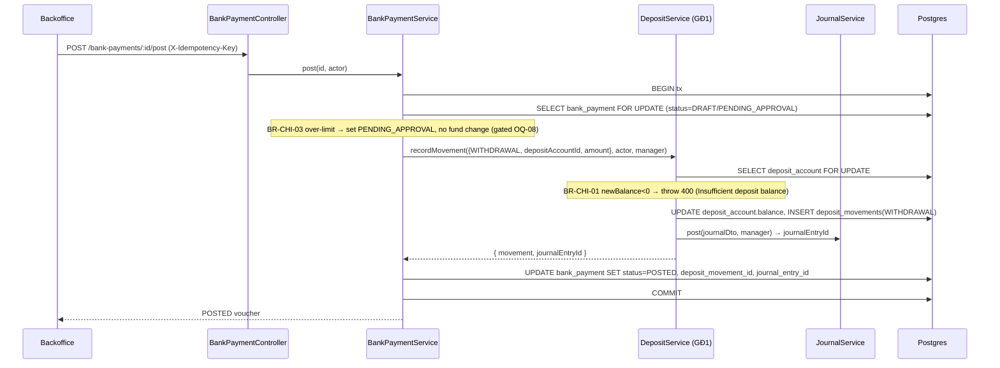
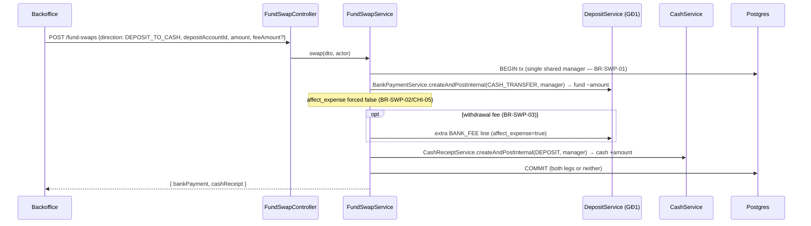
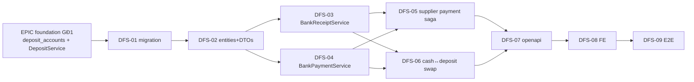

# EPIC-15072026 Quỹ Tiền Gửi — Giai đoạn 2: Chi tiêu (Spending)

> **GĐ2 của module Quỹ tiền gửi (Deposit Fund).** Xây vòng đời chi tiêu của quỹ tiền gửi trên nền tảng
> `deposit_accounts` + `deposit_movements` + `DepositService` đã có ở GĐ1 (EPIC foundation). Toàn bộ thiết kế
> **mirror module tiền mặt** (`accounting/cash-vouchers/`) 1:1 — cặp chứng từ Phiếu thu / Phiếu chi cấp document,
> saga trả NCC, và swap tiền mặt ↔ tiền gửi. Backend + FE trong cùng epic (FE clone shell treasury tiền mặt).

## Goal

Cho phép mỗi chi nhánh **tự vận hành vòng đời chi tiêu của quỹ tiền gửi**: thu tiền thủ công (Phiếu thu tiền gửi),
chi tiền (Phiếu chi tiền gửi), trả nhà cung cấp bằng số dư tiền gửi, và luân chuyển tiền mặt ↔ tiền gửi.

**Kết quả đo được (FR-04/05/06/08, UAT-04/05/06/08):**
- Tạo Phiếu thu / Phiếu chi tiền gửi (DRAFT → POST → REVERSE), số dư `deposit_accounts.balance` cập nhật đúng dấu.
- Chi vượt số dư khả dụng bị chặn ngay tại `post()` với thông báo rõ (BR-CHI-01, UAT-04); hai phiếu chi đồng thời
  trên cùng tài khoản → chỉ 1 thành công (NFR-03 race, UAT-05).
- Trả NCC 20tr bằng tiền gửi → quỹ −20tr **và** công nợ phải trả −20tr trong 1 nghiệp vụ (FR-06, UAT-08).
- Rút 5tr tiền gửi → tiền mặt: quỹ tiền gửi −5tr, quỹ tiền mặt +5tr trong **cùng một transaction**, tổng quỹ không đổi
  (FR-08, BR-SWP-01, UAT-06).

## Scope

**Entities/bảng (mới — org + branch scope):**
- `bank_receipts` / `bank_receipt_lines` — Phiếu thu tiền gửi (mirror `cash_receipts` / `cash_receipt_lines`), prefix `NTTK`.
- `bank_payments` / `bank_payment_lines` — Phiếu chi tiền gửi (mirror `cash_payments` / `cash_payment_lines`), prefix `UNC`.
- Enums riêng cho purpose / reference_type / status (English-only), trạng thái `PENDING_APPROVAL` cho BR-CHI-03.
- Mỗi voucher **bắt buộc** `deposit_account_id` (gap FR-04/05 "Tài khoản nhận / Tài khoản chi", ref.md §13),
  link `deposit_movement_id` + `journal_entry_id` khi POST.
- **Không tạo bảng mới cho saga trả NCC** ngoài `supplier_deposit_payment_saga` (mirror `supplier_debt_payment_saga`).

**Không tạo mới ở GĐ2 (đã có từ GĐ1 foundation):** `deposit_accounts`, `deposit_movements`, `banks`,
`deposit_payment_policy`, `DepositService`, deposit ledger, `JournalSource.BANK_MOVEMENT`.

**API surface (custom service, KHÔNG generic CRUD — mirror cash-vouchers):**
- `bank-receipts` — CRUD DRAFT + `POST /:id/post` + `POST /:id/reverse`; perms `accounting.bank_receipt.{create,read,update,delete,post,reverse}`.
- `bank-payments` — đối xứng; perms `accounting.bank_payment.*`.
- `supplier-deposit-payment` — saga trả NCC bằng tiền gửi (FR-06); perms `accounting.bank_payment.create` + `accounting.supplier_debt.pay`.
- `fund-swaps` — swap tiền mặt ↔ tiền gửi (FR-08) atomic 2 chân trong 1 tx; perms `accounting.fund_swap.create`.

**Events:** Không phát/tiêu event mới ở GĐ2 (mọi nghiệp vụ đồng bộ trong 1 local tx). Auto-post từ POS thuộc GĐ1.
Mọi mutation vẫn kế thừa `IdempotencyInterceptor` (`X-Idempotency-Key`).

**FE surface (backoffice-web):**
- Trang "Thu/chi tiền gửi" (clone `TreasuryCashReceiptsPage`) + dialog Phiếu thu / Phiếu chi tiền gửi (clone
  `receipt-voucher-dialog` / `payment-voucher-dialog`) với `DepositAccountSelect` mới.
- Luồng trả NCC bằng tiền gửi (nút Thanh toán → nguồn quỹ = Tiền gửi) + luồng swap tiền mặt ↔ tiền gửi.
- Thay 3 link WIP `treasury-deposit` trong `navConfig.ts` + routes trong `App.tsx`. FE strings tiếng Việt.

## Success Metrics

- Migration hand-written; `synchronize` stays false; các bảng cash hiện có không đổi (chỉ thêm bảng bank_* + enums).
- Post Phiếu thu tiền gửi 1tr → `deposit_accounts.balance` +1tr, 1 `deposit_movements(DEPOSIT)` + 1 journal entry link đúng.
- Post Phiếu chi 1.5tr trên số dư 1tr → 400 với message nêu số dư khả dụng; balance không đổi (UAT-04).
- 2 Phiếu chi 800k đồng thời, số dư 1tr → đúng 1 phiếu POSTED, 1 phiếu 400 (UAT-05, `SELECT FOR UPDATE`).
- Rút 5tr gửi→mặt → `deposit −5tr` và `cash +5tr` trong 1 tx, không có `affect_revenue`/`affect_expense` (UAT-06, BR-SWP-02).
- Trả NCC 20tr bằng tiền gửi → fund −20tr, payable −20tr, saga COMPLETED; reverse khôi phục payable (UAT-08, BR-BUY-04).
- Reverse Phiếu thu/chi: copy lines giữ `amount > 0`, movement type đảo, journal `reverse`, balance tự khôi phục.

## Flows

### FR-05 — Phiếu chi tiền gửi (POST, negative-balance guard)



### FR-06 — Trả NCC bằng tiền gửi (saga, mirror supplier-debt-payment)

```mermaid
sequenceDiagram
  participant FE as Backoffice (Phiếu nhập / Công nợ phải trả)
  participant C as SupplierDepositPaymentController
  participant Sa as SupplierDepositPaymentSagaService
  participant BP as BankPaymentService
  participant P as SupplierDebtService
  participant DB as Postgres

  FE->>C: POST /supplier-deposit-payment {depositAccountId, allocations[], fund=DEPOSIT}
  C->>Sa: pay(dto, actor)
  Sa->>DB: BEGIN tx
  Sa->>DB: INSERT saga(PENDING)
  loop each allocation (BR-BUY-02 partial + multi-doc)
    Sa->>P: validate remaining ≥ amount (BR-BUY-01; OQ-05 advance gated)
  end
  Sa->>BP: createAndPostInternal({SUPPLIER_PAYMENT, referenceType=PAYABLE/GOODS_RECEIPT, ...}, manager)
  Note over BP: reuses DepositService.recordMovement(WITHDRAWAL) → fund −amount
  Sa->>P: reducePayable(allocations, manager)
  Sa->>DB: UPDATE saga(COMPLETED, bank_payment_id)
  Sa->>DB: COMMIT
  Sa-->>FE: { bankPayment, payables[] }
```

### FR-08 — Swap tiền mặt ↔ tiền gửi (atomic 1 tx)



## Tickets

- [TKT-DFS-01 Migration bảng chứng từ tiền gửi](../tickets/TKT-DFS-01-voucher-schema-migration.md)
- [TKT-DFS-02 Entities + DTOs chứng từ tiền gửi](../tickets/TKT-DFS-02-voucher-entities-dtos.md)
- [TKT-DFS-03 BankReceiptService + Controller (Phiếu thu)](../tickets/TKT-DFS-03-bank-receipt-service.md)
- [TKT-DFS-04 BankPaymentService + Controller (Phiếu chi)](../tickets/TKT-DFS-04-bank-payment-service.md)
- [TKT-DFS-05 Trả NCC bằng tiền gửi (FR-06 saga)](../tickets/TKT-DFS-05-supplier-payment-deposit.md)
- [TKT-DFS-06 Swap tiền mặt ↔ tiền gửi (FR-08)](../tickets/TKT-DFS-06-cash-deposit-swap.md)
- [TKT-DFS-07 OpenAPI regen + snapshot](../tickets/TKT-DFS-07-openapi-snapshot.md)
- [TKT-DFS-08 FE — Thu/chi tiền gửi + dialogs + luồng NCC/swap](../tickets/TKT-DFS-08-fe-receipts-payments.md)
- [TKT-DFS-09 E2E chi tiêu (UAT-04/05/06/08)](../tickets/TKT-DFS-09-e2e-spending.md)

## Open business questions (ref.md §10) — gates, do not block

- **OQ-05 (Ứng trước NCC)**: Có cho phép chi > công nợ còn lại (ứng trước tiền cho NCC)? — **gate cho BR-BUY-01 / TKT-DFS-05.**
  Mặc định GĐ2: **cấm** (`amount ≤ remaining payable`, thừa → 400). Nếu nghiệp vụ chốt cho phép, mở cờ `allowAdvance`
  ở DTO + sinh khoản ứng trước (COA 331 dư Nợ) — không code trước khi chốt.
- **OQ-08 (Hạn mức duyệt phiếu chi)**: Phiếu chi tiền gửi có cần duyệt? Hạn mức bao nhiêu? — **gate cho BR-CHI-03 / TKT-DFS-04.**
  GĐ2 ship **stub**: enum `PENDING_APPROVAL` + cột `approval_status` có sẵn, nhưng **không enforce** cho tới khi hạn mức
  được cấu hình (không có màn duyệt ở GĐ2). Khi chốt, thêm config hạn mức + endpoint `POST /:id/approve`.
- **OQ-07 (Quỹ âm)**: chỉ ảnh hưởng cờ `allow_negative` (đã có ở schema GĐ1) — BR-CHI-01 tôn trọng cờ này.

## Dependencies

- **Depends on:** [EPIC-15072026 Quỹ Tiền Gửi — Giai đoạn 1: Nền tảng](./EPIC-15072026-deposit-fund-foundation.md)
  — cần `deposit_accounts` + `deposit_movements` + `DepositService.recordMovement(dto, actor, manager?)`
  (guard số dư âm qua `SELECT deposit_account FOR UPDATE`), `JournalSource.BANK_MOVEMENT`, `DocumentType.BANK_RECEIPT`/`BANK_PAYMENT`.
- **Reuses:**
  - Voucher doc template — `apps/api/src/modules/accounting/cash-vouchers/cash-receipts/`, `cash-payments/`, `enums.ts`,
    saga `supplier-debt-payment/`, `debt-collection/`.
  - Journal — `apps/api/src/modules/accounting/journal/journal.service.ts` (`post`/`reverse`, nhận `manager?`).
  - Doc numbering — `document-numbering.service.ts` (`DocumentType.BANK_RECEIPT`→`NTTK`, `BANK_PAYMENT`→`UNC`).
  - Contra-COA — `accounting/payment-accounts/account-resolver.service.ts`; COA `112x` từ `coa-seeder.service.ts`.
  - Category lookup — `cash_voucher_categories` (`THU_TIEN_GUI_NH` / `CHI_RUT_TIEN_GUI` đã seed).
  - Permissions — dotted `accounting.<resource>.<action>`, `@UseGuards(PermissionGuard, BranchScopeGuard)`, `@Actor()`, `AuditInterceptor`.
  - FE treasury shell — `apps/backoffice-web/src/pages/treasury/*`, `hooks/treasury/*`, `lib/erp-api.ts`, `navConfig.ts`, `App.tsx`.

### Ticket dependency graph


