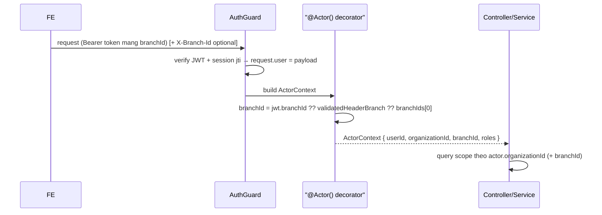
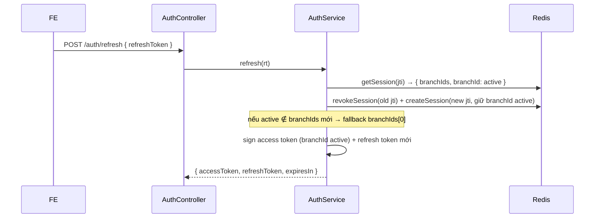
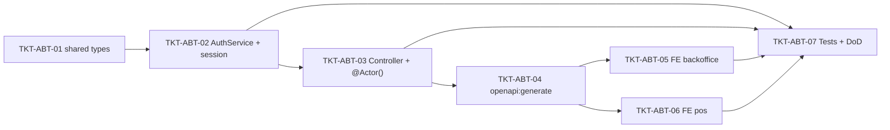

# EPIC-16062026 Active branch trong token (switch-branch mint token mới + actor đọc branch từ JWT)

## Summary

Hiện tại **chi nhánh đang chọn** chỉ tồn tại ở FE (Zustand/localStorage) và gửi xuống mỗi request qua header `X-Branch-Id`. Token không mang chi nhánh; `@Actor()` suy ra `branchId` từ header (đã validate trong `branchIds[]`) → fallback `branchIds[0]`.

Epic này **gắn chi nhánh đang chọn vào chính token**:

1. **JWT + Redis session mang `branchId` (active)** — token login bake `branchIds[0]` làm active; refresh giữ nguyên active branch của session.
2. **Endpoint mới `POST /auth/switch-branch`** — FE đổi chi nhánh sẽ gọi endpoint này (auth bằng access token hiện tại), validate `branchId ∈ branchIds[]`, **rotate session (jti mới)** và trả **access token + refresh token mới** mang chi nhánh đã chọn.
3. **`@Actor()` ưu tiên đọc active branch từ JWT** (`jwt.branchId`), **giữ header `X-Branch-Id` làm fallback** (rồi `branchIds[0]`) để không phá vỡ request cũ trong giai đoạn chuyển tiếp.
4. **FE (cả 2 app)** đổi chi nhánh = gọi `switch-branch` → lưu token mới → backoffice reload, pos điều hướng.

Quyết định đã chốt (Step 1):
- **Endpoint riêng `POST /auth/switch-branch`** (không gộp vào `/auth/refresh`).
- **Giữ `X-Branch-Id` làm fallback** — actor ưu tiên JWT, không xoá header.
- **Token login mặc định active = `branchIds[0]`** (user thao tác được ngay, đổi sau qua switch-branch).
- **Cả `backoffice-web` + `pos-web`**.

**Out of scope**:
- Bỏ hẳn header `X-Branch-Id` (vẫn giữ làm fallback).
- Permission mới (đổi chi nhánh chỉ cần đã đăng nhập + chi nhánh thuộc `branchIds[]`).
- Thay đổi cấu trúc DB / migration (active branch sống trong JWT + Redis session, **không có bảng mới**).
- Per-branch permission scoping trong token (tương lai).

## Flows

### Đổi chi nhánh = mint token mới (switch-branch)

```mermaid
sequenceDiagram
  actor U as User
  participant FE as FE (BranchSelector / BranchSelectPage)
  participant API as AuthController
  participant SVC as AuthService
  participant DB as Postgres
  participant R as Redis (SessionStore)

  U->>FE: Chọn chi nhánh B
  FE->>API: POST /auth/switch-branch { branchId: B } (Bearer access token hiện tại)
  Note over API: AuthGuard verify token + session jti còn sống → request.user = payload
  API->>SVC: switchBranch(payload, B)
  SVC->>DB: resolve roles + branchIds (fresh)
  alt B ∉ branchIds[]
    SVC-->>API: ForbiddenException (403)
  else B hợp lệ
    SVC->>R: revokeSession(old jti)
    SVC->>R: createSession(new jti, { branchIds, branchId: B, roles })
    SVC->>SVC: sign access token (branchId=B) + refresh token (new jti)
    SVC-->>API: { accessToken, refreshToken, expiresIn, session }
  end
  API-->>FE: token mới (mang active branch B)
  FE->>FE: lưu token mới; backoffice reload / pos navigate
```

### Đọc branch trong actor (ưu tiên JWT, fallback header)



### Refresh giữ nguyên active branch



## Success Metrics

- Login trả token có `branchId = branchIds[0]`; `@Actor()` cho ra `branchId` đúng **mà không cần** gửi `X-Branch-Id`.
- `POST /auth/switch-branch` với chi nhánh hợp lệ: trả token mới mang chi nhánh đó, session cũ (jti) bị revoke (request bằng token cũ → 401).
- `switch-branch` với chi nhánh **không** thuộc `branchIds[]` → 403, không rotate session.
- Sau switch-branch, request **không** kèm `X-Branch-Id` vẫn được scope đúng chi nhánh mới (actor đọc từ JWT).
- `refresh` sau khi đã switch giữ nguyên chi nhánh active.
- Request cũ **vẫn** gửi `X-Branch-Id` (token chưa mang branch) tiếp tục hoạt động (fallback).

## Tickets trong epic

| Ticket                                                                       | Mô tả ngắn                                                                                  |
| ---------------------------------------------------------------------------- | ------------------------------------------------------------------------------------------- |
| [TKT-ABT-01](../tickets/TKT-ABT-01-shared-interfaces-active-branch.md)       | shared-interfaces: thêm `branchId?` vào `JwtPayload` + `SwitchBranchRequest/Response`        |
| [TKT-ABT-02](../tickets/TKT-ABT-02-auth-service-active-branch.md)            | AuthService + SessionStore: login/refresh mang active branch + `switchBranch()`             |
| [TKT-ABT-03](../tickets/TKT-ABT-03-controller-and-actor.md)                 | `POST /auth/switch-branch` (DTO + controller) + `@Actor()` ưu tiên JWT branch               |
| [TKT-ABT-04](../tickets/TKT-ABT-04-openapi-regen.md)                        | `pnpm openapi:generate` + commit snapshot api-client                                        |
| [TKT-ABT-05](../tickets/TKT-ABT-05-fe-backoffice-switch-branch.md)          | FE backoffice-web: BranchSelector gọi switch-branch → lưu token → reload                     |
| [TKT-ABT-06](../tickets/TKT-ABT-06-fe-pos-switch-branch.md)                 | FE pos-web: BranchSelectPage gọi switch-branch → lưu token → navigate                        |
| [TKT-ABT-07](../tickets/TKT-ABT-07-tests-and-dod.md)                        | Service/actor spec + E2E (login→switch→scoped call) + DoD gate                               |

## Graph phụ thuộc ticket



## Dependencies (epic-level)

- Requires: auth core hiện có (`TKT-006`) — `AuthService` (login/refresh), `SessionStore` (Redis jti), `AuthGuard`, `@Actor()`, `JwtPayload`.
- **Reuses**:
  - `AuthService.signAccessToken/signRefreshToken`, `resolveUserRoles/resolveUserBranches`, pattern rotate session trong `refresh()`.
  - `SessionStore.createSession/revokeSession/getSession/isSessionActive` (`modules/redis/session.store.ts`).
  - `@Actor()` decorator (`common/decorators/actor-context.decorator.ts`) — đã có nhánh `user?.branchId` sẵn để bật lên.
  - Global `IdempotencyInterceptor` (switch-branch là mutation, kế thừa tự động — xem [[feedback_idempotent_implementation]]).
  - FE: `erpApi`/`requireErpData`, `persistSession`/`persistRefreshResponse` + `setAccessToken` (backoffice), `usePosBranchStore` + `authService` (pos).
  - Không Vietnamese trong source BE — xem [[feedback_no_vietnamese_in_backend_source]].

## Epic acceptance criteria

- [ ] `JwtPayload` mang `branchId?` (active); login bake `branchIds[0]`; refresh giữ active branch.
- [ ] `POST /auth/switch-branch` validate `branchId ∈ branchIds[]`, rotate session, trả token mới mang active branch; chi nhánh sai → 403.
- [ ] `@Actor().branchId` = `jwt.branchId ?? validatedHeader ?? branchIds[0]`; request không kèm header vẫn scope đúng.
- [ ] FE cả 2 app: đổi chi nhánh gọi switch-branch, lưu access+refresh mới; token cũ vô hiệu (401).
- [ ] OpenAPI snapshot + `schema.ts` cập nhật endpoint mới.

## Epic Definition of Done

- [ ] Mọi ticket TKT-ABT-01–07 đạt DoD riêng.
- [ ] `pnpm --filter @erp/api test` + `lint` xanh; FE `tsc` xanh.
- [ ] `pnpm openapi:generate` cập nhật snapshot + `schema.ts` (`/auth/switch-branch`).
- [ ] Không Vietnamese trong source BE; UI strings FE tiếng Việt.
- [ ] Không regression: login/refresh/logout/session cũ + request gửi `X-Branch-Id` vẫn pass.
