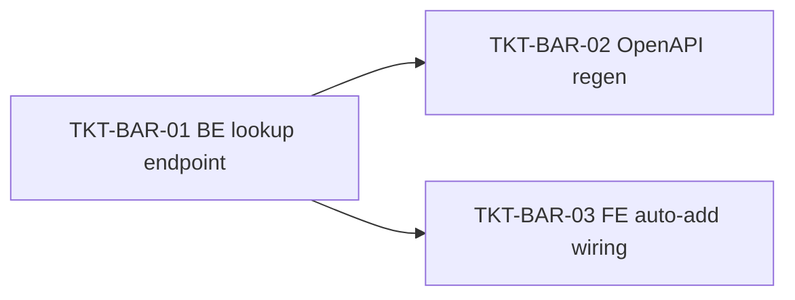

# EPIC-16062026 POS barcode-priority search + auto-add line on 100% match

## Goal

Tại ô tìm hàng trên POS checkout (`(F3) Nhập tên hàng hóa, mã vạch, mã SKU`), khi giá trị input đổi (gõ hoặc máy quét bắn) hoặc khi Enter, **ưu tiên tra mã vạch** (rồi tới mã SKU). Nếu trúng **đúng 1 kết quả khớp 100%** thì **tự động thêm dòng** (qty 1, quét lại cộng dồn +1) thay vì chỉ hiện dropdown gợi ý. Input không khớp tuyệt đối → giữ nguyên dropdown gợi ý theo tên/SKU như hiện tại.

**Measurable outcome:** quét/nhập một mã vạch tồn tại → dòng hàng được thêm mà không cần click; mã SKU chính xác cũng auto-add; gõ một phần tên vẫn ra gợi ý; một lần quét không bao giờ thêm trùng (race giữa "đổi input" và "Enter").

## Scope

- **Entities / tables:** không thêm mới. Dùng lại `item_barcodes` (`ItemBarcodeEntity`, unique `(organizationId, code)`) đã tồn tại. **Không migration.**
- **API surface (apps/api `pos` module):** thêm 1 endpoint READ `GET /pos/branches/:branchId/catalog/lookup?code=<value>` trên `PosController`, backed by `PosCatalogService.lookupByCode(...)`. Khớp tuyệt đối theo mã vạch (`item_barcodes.code = code`) **HOẶC** mã SKU (`items.code = code`), scope `organizationId` + `branchId`, chỉ hàng `is_active = true AND is_pos_visible = true`. Trả `PosCatalogLineDto[]` (0..n) — cùng shape với catalog để FE gọi thẳng `addProductByItem`. Dùng lại quyền `pos.sale.create` + `BranchScopeGuard`. **Không CQRS** (single-filter exact read, không phải dynamic multi-join).
- **Events:** không phát/không tiêu thụ. Endpoint là GET, không side-effect; việc thêm dòng là state giỏ phía client (chỉ commit khi checkout). Không đụng stock ledger / journal / idempotency.
- **FE surface (apps/pos-web):** `catalogService.lookupByCode` → react-query imperative lookup (`queryClient.fetchQuery`, mirror `useSearchPosBranchCatalog`) → page-hook `useCheckoutBarcodeAutoAdd` (`tryAutoAdd(code)`) → wiring trong `ProductSearchInput` (cả `search` adapter lúc đổi input lẫn `onSubmitQuery` lúc Enter) + guard chống thêm trùng + `CATALOG_KEYS.LOOKUP`.

## Quyết định đã chốt (Step 1)

1. **Cách lấy match:** endpoint POS lookup riêng (server call mỗi lần đổi/Enter), KHÔNG nhồi barcode vào payload catalog client-side.
2. **Trigger auto-add:** cả khi **đổi input** (debounced) **và** khi **Enter**.
3. **Thế nào là 100%:** khớp tuyệt đối **mã vạch HOẶC mã SKU**.
4. **Số lượng:** luôn **1** mỗi lần khớp; quét lại cùng mã → dòng hiện có **+1**.

## Success Metrics

- Nhập/quét đúng 1 mã vạch tồn tại (active + pos_visible, còn tồn) → 1 dòng được thêm qty 1, input tự xóa, không cần click.
- Mã SKU chính xác (`items.code`) khớp đúng 1 item → cũng auto-add.
- Quét lại cùng mã → dòng đó +1 (không tạo dòng mới).
- Input gõ một phần (vd `lap`) → dropdown gợi ý tên/SKU như cũ, **không** auto-add.
- Một lần quét (đổi input rồi Enter cùng một chuỗi) thêm **đúng 1 lần** (dedupe race).
- 0 match / >1 match exact → không auto-add, không lỗi giả; rơi về dropdown gợi ý.

## Flows

### Auto-add khi đổi input hoặc Enter (khớp mã vạch/SKU 100%)

```mermaid
sequenceDiagram
  actor U as Thu ngân / máy quét
  participant SP as PosSearchPopover
  participant PSI as ProductSearchInput
  participant BH as useCheckoutBarcodeAutoAdd
  participant RQ as useLookupCatalogByCode (fetchQuery)
  participant SVC as catalogService.lookupByCode
  participant API as PosController GET /catalog/lookup
  participant CSV as PosCatalogService.lookupByCode
  participant DB as Postgres
  participant CART as addProductByItem

  U->>SP: gõ/quét "8935049510016" (+ Enter)
  Note over SP: debounce 150ms → search(q) ; Enter → onSubmitQuery(q)
  SP->>PSI: search(q) / onSubmitQuery(q)
  PSI->>BH: tryAutoAdd(q)
  Note over BH: dedupe theo chuỗi query (đổi-input vs Enter trên cùng q chỉ chạy 1 lần)
  BH->>RQ: lookup(branchId, q)
  RQ->>SVC: GET /pos/branches/:id/catalog/lookup?code=q
  SVC->>API: http.get
  API->>CSV: lookupByCode(branchId, actor, code)
  CSV->>DB: items ⨝ item_barcodes (exact) ⨝ stock_balances (org+branch, active, pos_visible)
  DB-->>CSV: 0..n PosCatalogLineDto
  CSV-->>API: lines[]
  API-->>RQ: lines[]
  RQ-->>BH: lines[]
  alt đúng 1 line khớp 100%
    BH->>CART: addProductByItem(line, 1)
    CART-->>PSI: thêm/cộng dồn dòng + xóa input
    BH-->>PSI: true (đã add → search trả [], dropdown đóng)
  else 0 hoặc >1
    BH-->>PSI: false
    PSI->>SP: search → gợi ý tên/SKU client-side (đổi input) ; addProductByQuery (Enter)
  end
```

## Tickets

- [TKT-BAR-01 BE: POS exact-match lookup endpoint (mã vạch HOẶC SKU)](../tickets/TKT-BAR-01-pos-catalog-lookup-endpoint.md)
- [TKT-BAR-02 OpenAPI regen + api-client snapshot](../tickets/TKT-BAR-02-openapi-regen.md)
- [TKT-BAR-03 FE: barcode-priority search + auto-add wiring](../tickets/TKT-BAR-03-fe-barcode-auto-add.md)

## Dependencies

- Depends on: EPIC-004 (pos module / catalog), EPIC-010 (`item_barcodes` / item management). Cả hai đã ship.
- Reuses: `PosCatalogLineDto` shape + location-aggregation logic của `PosCatalogService.getCatalog`; quyền `pos.sale.create`; `addProductByItem` (`use-checkout-cart-actions`); `PosSearchPopover` (`search` + `onSubmitQuery`); pattern imperative `queryClient.fetchQuery` của `useSearchPosBranchCatalog`.

## Out of scope

- **Bán hàng tồn 0 qua quét** (negative stock): auto-add kế thừa guard `OUT_OF_STOCK` của `addProductByItem`; item khớp nhưng không còn tồn ở chi nhánh → hiện "Hết tồn.", **không** thêm dòng. Không bypass guard, không resolve default-location cho hàng tồn 0 trong epic này.
- Tích hợp thiết bị quét qua camera / wiring nút icon barcode (`Quét mã vạch`) — vẫn dựa trên scanner-as-keyboard (bắn ký tự + Enter).
- Đổi cách match của dropdown gợi ý (vẫn lọc tên/SKU client-side trên catalog đã tải).

### Ticket dependency graph


