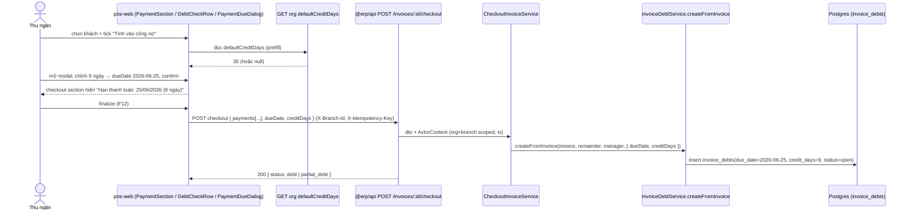
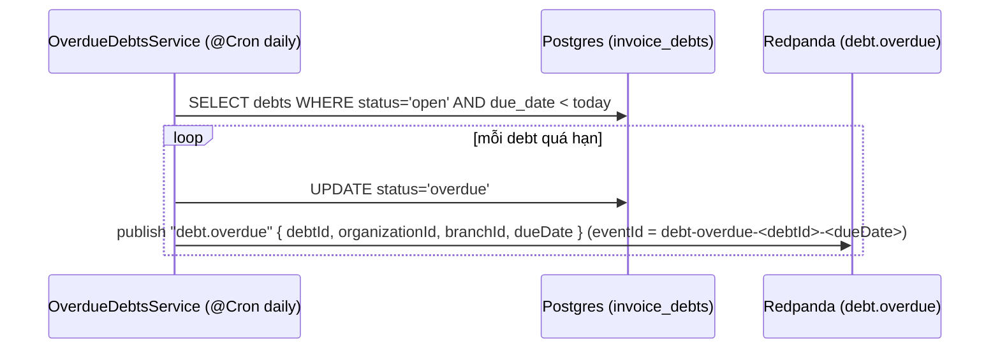
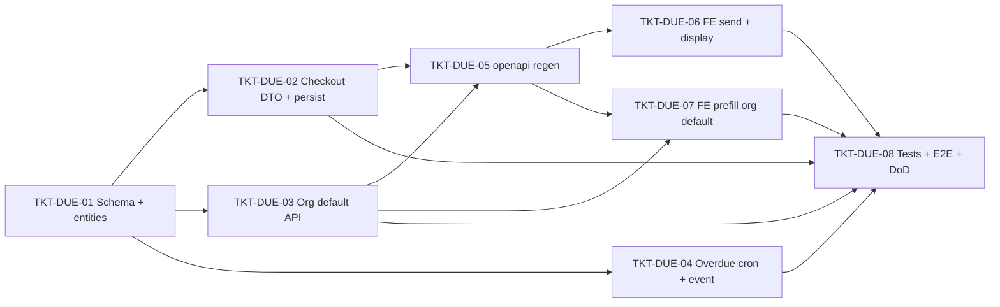

# EPIC-16062026 POS công nợ — Hạn thanh toán (per-invoice due date + org default + overdue)

## Goal

Ở POS checkout, khi tick **"Tính vào công nợ"** rồi mở modal **"Hạn thanh toán"** chọn ngày / số ngày được nợ, giá trị đã chọn **không hiển thị lại** ngoài checkout section (KQHT) và **không được gửi/lưu xuống backend** — comment trong code nói rõ `paymentDueDate` *"Chỉ lưu frontend state — BE chưa có field tương ứng"* (`apps/pos-web/src/interfaces/checkout.interface.ts`).

Epic này:

1. **FE — hiển thị (bug đã báo):** sau khi confirm modal, hiện `Hạn thanh toán: 25/06/2026 (9 ngày)` ngay trong checkout section (KQMM).
2. **FE → BE — lưu per-invoice:** gửi `dueDate` + `creditDays` (do thu ngân nhập **trên từng hóa đơn**) xuống checkout; backend lưu vào `invoice_debts` (cột `due_date` đã có sẵn, thêm cột `credit_days`).
3. **Org default — prefill:** một giá trị `defaultCreditDays` cấp tổ chức để **prefill** modal (thu ngân vẫn sửa được mỗi hóa đơn).
4. **Overdue:** cron hằng ngày đánh dấu debt `OPEN` quá hạn (`due_date < hôm nay`) → `OVERDUE` và publish event `debt.overdue` (idempotent) để sau wire notification/báo cáo.

> Quyết định gốc (Step 1): số ngày được nợ **tính trên từng hóa đơn của khách** (không phải config cố định theo khách hàng). Org `defaultCreditDays` chỉ là giá trị prefill gợi ý, không ghi đè giá trị thu ngân nhập.

## Scope

- **Entities / migration:**
  - `invoice_debts`: thêm cột `credit_days int NULL` (cột `due_date date NULL` **đã có sẵn** từ `1778000000000-AddPosInvoiceEntities.ts` — không tạo lại).
  - `organizations`: thêm cột `default_credit_days int NULL`.
  - Migration **hand-written**, không dùng `migration:generate`.
- **API surface (custom, không generic CRUD):**
  - Mở rộng `CheckoutInvoiceDto` (`dueDate?`, `creditDays?`) + `CheckoutInvoiceService` / `InvoiceDebtService.createFromInvoice` để lưu.
  - GET org `defaultCreditDays` (POS đọc để prefill) + PATCH (admin set) — scope `organizationId`.
- **Events:** topic mới `debt.overdue`; cron publisher idempotent (deterministic `eventId`). Không thêm consumer trong epic này (chỉ phát).
- **FE — `apps/pos-web`:** hiển thị due date trong checkout section, gửi `dueDate`/`creditDays` trong payload checkout, prefill modal từ org default. (Backoffice config UI cho `defaultCreditDays` — xem "Out of scope".)
- **Multi-tenant:** mọi truy vấn scope `organizationId`; checkout còn scope `branchId`. Cron chạy cross-tenant nhưng giữ `organizationId`/`branchId` trong payload event.

## Success Metrics

- Tick "Tính vào công nợ" → chọn `25/06/2026` (9 ngày) → checkout section hiện `Hạn thanh toán: 25/06/2026 (9 ngày)` (KQMM đạt).
- Checkout POST body mang `dueDate=2026-06-25`, `creditDays=9`; sau checkout, dòng `invoice_debts` của hóa đơn có `due_date=2026-06-25` và `credit_days=9`.
- Mở modal khi org có `defaultCreditDays=30` → modal prefill 30 ngày (vẫn sửa được); org chưa set → modal trống.
- Hóa đơn cũ (debt tạo trước epic) có `due_date NULL` / `credit_days NULL` vẫn hợp lệ — migration không phá dữ liệu cũ.
- Cron: debt `OPEN` có `due_date < hôm nay` → `OVERDUE`, phát đúng 1 event `debt.overdue` mỗi debt (replay no-op nhờ deterministic `eventId`).
- `pnpm --filter @erp/api test` + `lint` xanh; `openapi.snapshot.json` + `schema.ts` cập nhật.

## Flows

### 1. Checkout công nợ kèm hạn thanh toán (per-invoice)

### 2. Cron đánh dấu quá hạn + phát event

## Tickets

- [TKT-DUE-01 Schema migration + entity columns](../tickets/TKT-DUE-01-schema-credit-days-org-default.md)
- [TKT-DUE-02 Checkout DTO + lưu dueDate/creditDays trên debt](../tickets/TKT-DUE-02-checkout-dto-persist-debt-terms.md)
- [TKT-DUE-03 Org defaultCreditDays — read (POS prefill) + update (admin)](../tickets/TKT-DUE-03-org-default-credit-days-api.md)
- [TKT-DUE-04 Overdue cron + event debt.overdue](../tickets/TKT-DUE-04-overdue-cron-and-event.md)
- [TKT-DUE-05 openapi:generate + api-client snapshot](../tickets/TKT-DUE-05-openapi-regen.md)
- [TKT-DUE-06 FE checkout: gửi + hiển thị dueDate/creditDays](../tickets/TKT-DUE-06-fe-checkout-send-and-display.md)
- [TKT-DUE-07 FE prefill modal từ org default](../tickets/TKT-DUE-07-fe-modal-prefill-org-default.md)
- [TKT-DUE-08 Tests + E2E + DoD gate](../tickets/TKT-DUE-08-tests-e2e-dod.md)

## Dependencies

- **Depends on:** backend công nợ đã ship — `InvoiceDebtEntity` / `InvoiceDebtService.createFromInvoice` / `CheckoutInvoiceService` (`apps/api/src/modules/pos`), AR posting (acct 131) qua `JournalSaleConsumer`. POS checkout endpoint (EPIC-007). FE modal `PaymentDueDialog` + Zustand `CheckoutPaymentDraft` (`paymentDueDate`/`creditDays`) đã có sẵn.
- **Phối hợp với [EPIC-16062026 POS partial debt checkout](./EPIC-16062026-pos-partial-debt-checkout.md):** TKT-PDC-02 sửa `buildCheckoutInvoiceApiPayload` để **gửi payment lines thật** khi debt; TKT-DUE-06 mở rộng **cùng** `CheckoutInvoiceBody` + cùng hàm đó để thêm `dueDate`/`creditDays`. Land PDC-02 trước hoặc merge cẩn thận để tránh xung đột cùng file.
- **Reuses:** `@nestjs/schedule` (thêm mới — repo chưa có scheduler), `EventPublisher` + `TopicInitializer`, `IdempotencyInterceptor` (mutations), `erpApi`/`requireErpData` (FE), Intl `vi-VN` format.
- **Mới (chưa có trong repo):** `@nestjs/schedule` + `ScheduleModule` (xác nhận khi cài). `DebtStatus.OVERDUE` đã định nghĩa sẵn nhưng chưa từng được set.

### Ticket dependency graph

