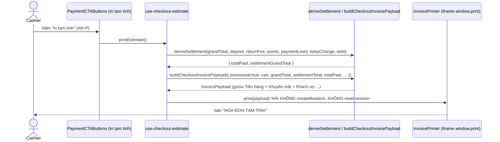
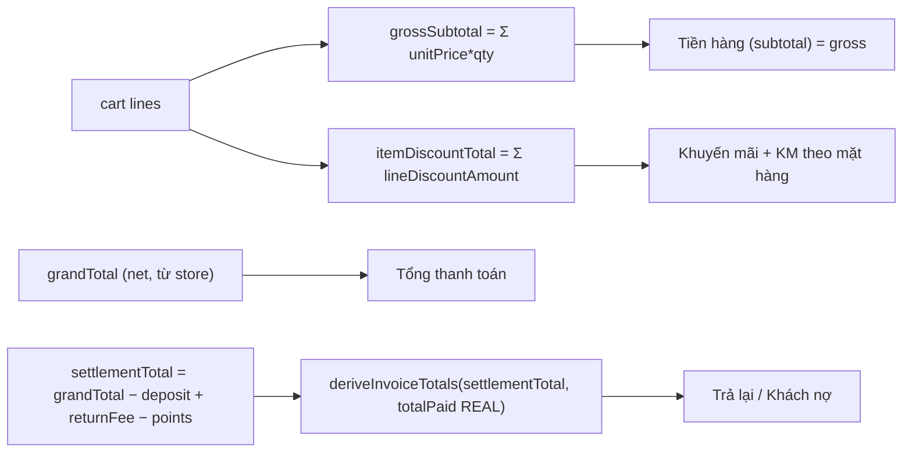
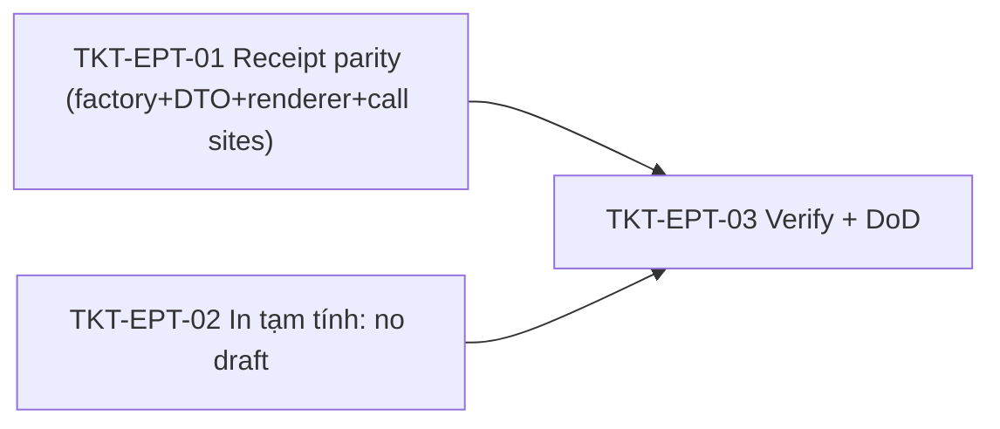

# EPIC-16062026 POS "In tạm tính" — không lưu draft + receipt parity (đặt cọc / công nợ / phương thức / khuyến mãi)

## Goal

Nút **"In tạm tính"** tại POS checkout đang (1) **gọi API tạo hóa đơn draft** (`POST /invoices`) mỗi lần bấm — sai, chỉ nên in xem trước từ state hiện tại; và (2) in ra bản receipt mà **Đặt cọc, Tính vào công nợ, Phương thức thanh toán, Khuyến mãi hiển thị sai/thiếu**. Hai vấn đề:

1. **KQHT:** Đặt cọc & Tính vào công nợ & Phương thức thanh toán & Khuyến mãi chưa đúng trên bản in. → **KQMM:** hiển thị đúng, áp dụng cho **cả** "In tạm tính" lẫn "In hóa đơn" (renderer + factory dùng chung).
2. **KQHT:** Bấm "In tạm tính" đang lưu hóa đơn tạm (gọi API tạo draft). → **KQMM:** bấm "In tạm tính" **không** lưu draft, **không** gọi API; chỉ in từ state hiện tại; thông tin khuyến mãi/công nợ view như [Image #2].

**Root cause (FE-only, `apps/pos-web`):**

- `use-checkout-estimate.ts:92-108` gọi `createMutation.mutateAsync(buildCreateInvoicePayload(...))` → tạo draft mỗi lần in tạm tính.
- `checkoutReceiptFactory.buildCheckoutInvoicePayload` (dùng chung bởi cả 2 luồng in):
  - nạp `grandTotal` thô (không phải `settlementGrandTotal` đã trừ đặt cọc) vào `deriveInvoiceTotals` → **đặt cọc bị bỏ qua** trên receipt.
  - ép `effectiveTotalPaid = debt ? 0 : totalPaid` → **công nợ + phương thức thanh toán sai** khi trả một phần.
  - `subtotal: grandTotal` (net) và **không có** dòng "Khuyến mãi / KM theo mặt hàng" ở khối tổng — chỉ có `discountLabel` từng dòng + dòng ghi chú "HĐ đã được KM" cuối trang → **không khớp [Image #2]**.

## Scope

- **Frontend-only (`apps/pos-web`).** Không entity mới, không migration, không shared-interfaces, không event, không `openapi:generate`, không permission mới, không đụng backend.
- Sửa **renderer + factory dùng chung** nên fix áp dụng cho cả "In tạm tính" và "In hóa đơn" (estimate chỉ khác tiêu đề "HÓA ĐƠN TẠM TÍNH").
- Touches: `lib/page-libs/checkout/checkoutReceiptFactory.ts`, `interfaces/invoice-printing.interface.ts`, `lib/page-libs/checkout/printing/renderInvoiceHtml.ts`, `hooks/page-hooks/checkout/use-checkout-estimate.ts`, `hooks/page-hooks/checkout/use-checkout-actions.ts`, và button busy state ở `components/.../PaymentCTAButtons/PaymentCTAButtons.tsx`.

## Decisions locked (Step 1)

- **Receipt scope = cả 2 bản in** (shared fix ở `checkoutReceiptFactory` + `renderInvoiceHtml`).
- **Đặt cọc = net it out, không có dòng riêng:** dùng `settlementGrandTotal` (đã trừ đặt cọc/cộng phí đổi trả/trừ điểm) để derive Trả lại / Khách nợ; **không** in dòng "Đặt cọc".
- **Khuyến mãi layout = Gross + KM theo mặt hàng:** "Tiền hàng" = gross (∑ `unitPrice*qty`), thêm dòng tổng "Khuyến mãi" + dòng con "KM theo mặt hàng" (= ∑ `lineDiscountAmount`), "Tổng thanh toán" = net (không đổi). Bỏ dòng ghi chú "HĐ đã được KM" cuối trang. Chỉ KM theo mặt hàng (per-line), **không** có KM theo hóa đơn (invoice-level) trong scope này.
- **Fold receipt fix:** epic này **sở hữu toàn bộ** thay đổi `checkoutReceiptFactory.ts` (đặt cọc + công nợ + phương thức + khuyến mãi). Phần receipt của **TKT-PDC-03** (bỏ `effectiveTotalPaid = 0`) được **gộp vào TKT-EPT-01** — coi như absorbed. Phần auto-fill `PaymentSection` của PDC-03 vẫn thuộc EPIC-16062026 partial-debt.

## Out of scope

- Backend checkout/draft/accounting — không đụng.
- KM theo hóa đơn (invoice-level promotion) trên receipt.
- Dòng "Đặt cọc" hiển thị tường minh (đã chốt net-out, không dòng).
- Phần auto-fill effect của TKT-PDC-03 (vẫn ở epic partial-debt).
- Wiring test runner thật cho `pos-web` (vitest chưa cài) — verify bằng tsc build + flow thủ công.

## Success Metrics

- Bấm "In tạm tính" → **không** có request `POST /invoices` trong Network; không sinh draft trong danh sách "Lưu tạm".
- Bản in (cả tạm tính lẫn hóa đơn) với giỏ [Image #2]: **Tiền hàng 2.345.000**, **Khuyến mãi 213.500** + **KM theo mặt hàng 213.500**, **Tổng thanh toán 2.131.500**, **Trả lại khách 0**, **Khách nợ 2.131.500**.
- Có đặt cọc: Khách nợ / Trả lại phản ánh đã trừ đặt cọc (net-out, không có dòng "Đặt cọc").
- Debt + tiền mặt một phần: receipt in đúng "đã trả" thật + `Khách nợ` = phần dư (không còn "đã trả 0 / nợ toàn phần").
- `pnpm --filter @erp/pos-web build` (tsc) green; không file backend nào đổi; `openapi.snapshot.json` không đổi.

## Flows

### "In tạm tính" sau fix (không gọi API)

### Receipt totals sau fix (dùng chung 2 bản in)

## Tickets

- [TKT-EPT-01 Receipt parity: đặt cọc net-out + totalPaid thật + gross Tiền hàng + Khuyến mãi/KM theo mặt hàng](../tickets/TKT-EPT-01-receipt-parity.md)
- [TKT-EPT-02 "In tạm tính": bỏ tạo draft, in thuần từ state](../tickets/TKT-EPT-02-estimate-no-draft.md)
- [TKT-EPT-03 Verify + DoD (flow thủ công + parity 2 bản in)](../tickets/TKT-EPT-03-verify-and-dod.md)

## Dependencies

- Depends on: luồng checkout FE hiện có (`checkoutSettlement.ts` — `deriveSettlement`/`deriveInvoiceTotals`), renderer (`renderInvoiceHtml.ts`), `InvoicePrinter`.
- **Phối hợp / supersede:** TKT-PDC-03 (EPIC-16062026 partial-debt) — phần sửa `checkoutReceiptFactory.ts` (bỏ `effectiveTotalPaid = 0`) **gộp vào TKT-EPT-01**; phần auto-fill `PaymentSection.tsx` của PDC-03 giữ nguyên ở epic partial-debt. Nếu PDC-03 implement trước, TKT-EPT-01 chỉ thêm phần đặt cọc + khuyến mãi.
- Reuses: `deriveSettlement` / `deriveInvoiceTotals`, `lineDiscountAmount` / `lineTotal` (`checkoutUtils.ts`), renderer + `InvoicePrinter`.

### Ticket dependency graph

