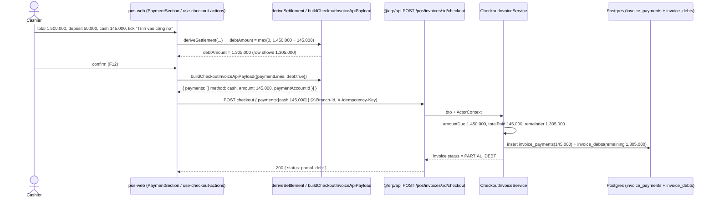
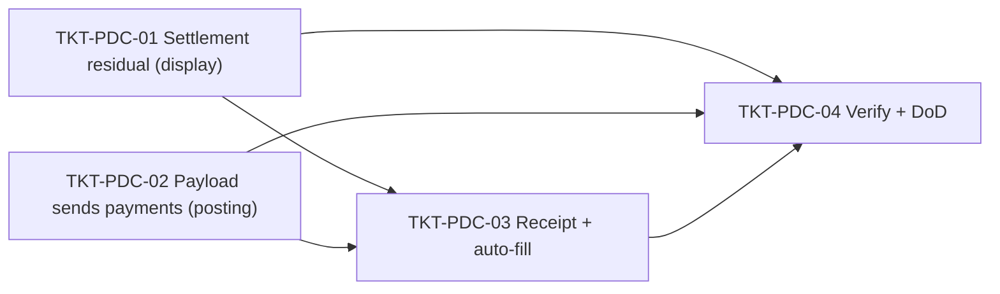

# EPIC-16062026 POS partial debt checkout (net "Tính vào công nợ" against cash tendered)

## Goal

The POS checkout "Tính vào công nợ" (book-as-receivable) row shows the **wrong amount** and posts the **wrong debt**. With a sale of 1.500.000, deposit 50.000, and 145.000 cash tendered, the row shows **1.450.000** (= total − deposit) instead of the expected **1.305.000** (= total − deposit − cash). The checkbox is currently coded as *all-or-nothing full debt*: when ticked, the cash/transfer lines are discarded and the entire remaining balance is booked as customer debt.

**Root cause (frontend only):** when `debt === true`, three FE sites ignore the tendered payment lines:

1. `buildCheckoutInvoiceApiPayload` returns `{ payments: [] }`, dropping every cash line → backend books the **full** balance as receivable.
2. `derivePaymentDisplay` returns `debtAmount = settlementAbs` (full balance) → the wrong number on screen.
3. `checkoutReceiptFactory` forces `effectiveTotalPaid = 0` → the printed receipt also hides the cash and shows full debt.

The backend **already** supports the correct behaviour: a non-empty `payments` array that sums to less than `amountDue` is accepted — it records the payments, auto-books the remainder into `invoice_debts`, and sets invoice status `PARTIAL_DEBT` (`checkout-invoice.service.ts:180-228`). No backend work is required.

**Measurable outcome:** with the screenshot inputs (total 1.500.000, deposit 50.000, cash 145.000, "Tính vào công nợ" ticked), the row shows **1.305.000**, the checkout posts cash 145.000 + receivable 1.305.000 with status **PARTIAL_DEBT**, and the receipt prints "Đã trả 145.000 / Khách nợ 1.305.000".

## Scope

- **Frontend-only (`apps/pos-web`).** No new entity, no migration, no shared-interfaces, no events, no `openapi:generate`, no new permission, no backend change.
- Touches 4 files in the checkout settlement/payment surface: `lib/page-libs/checkout/checkoutSettlement.ts`, `lib/page-libs/checkout/invoicePayloadMapper.ts`, `lib/page-libs/checkout/checkoutReceiptFactory.ts`, and the auto-fill effect in `components/.../PaymentSection/PaymentSection.tsx`.
- Reuses the backend's existing partial-payment / `PARTIAL_DEBT` path and the FE `validateCheckout` (already allows debt + partial via `debtCovered`).

## Decisions locked (Step 1)

- **"Respect entered payments" semantics** (user choice): `debtAmount` displayed and posted = `max(0, amountDue − sum(payment lines))`. Cash/transfer the cashier enters reduces the debt; an empty/zeroed cash line = full debt.
- **Send the real payment lines when debt is on.** Drop the `payments: []` short-circuit in `buildCheckoutInvoiceApiPayload`; the backend derives the residual debt itself. Debt with no tendered cash still yields `payments: []` → full debt (preserved).
- **Auto-fill must not fight the partial entry.** The first payment line auto-fills to the full balance on every total change (`PaymentSection` effect → `computeFirstLineAuto`). Once debt is on, suppress that auto-overwrite so the cashier's partial cash amount stays stable across cart edits.
- **Sale path only for the display change.** `derivePaymentDisplay`'s refund branch keeps its current `debtAmount = settlementAbs` (refund-debt is out of scope; the reported bug is a sale).

## Decisions to confirm (Step 3)

- **Full-debt default.** Because the cash line auto-fills to the full balance, ticking "Tính vào công nợ" on an *untouched* line computes to **paid (debt 0)** until the cashier clears the cash. This is the literal result of "respect entered payments." If you'd prefer **one-click full debt**, we additionally zero the cash line the moment debt is ticked (a small change in `handleDebtChange`). Default in this plan: do **not** auto-zero (pure respect-entered); confirm if you want the one-click variant.
- **Type-then-tick ordering.** With auto-fill suppressed under debt (not zeroed), a cash amount typed *before* ticking debt is respected. A more robust "manually-edited" flag on the line (so auto-fill never clobbers a touched amount) is possible but is a larger change to the existing auto-fill model — flagged as optional follow-up, not in scope.

## Out of scope

- Backend checkout/debt/accounting logic — already correct (`PARTIAL_DEBT`, `invoice_debts`, journal receivable split).
- Refund + debt display behaviour (`derivePaymentDisplay` refund branch unchanged).
- Introducing a per-line "manually edited" flag to fully decouple auto-fill from user edits.
- Wiring a real test runner for `pos-web` beyond what's needed to run the new settlement spec (vitest is referenced by the existing `checkoutValidation.test.ts` but not installed).

## Success Metrics

- Screenshot scenario: "Tính vào công nợ" row = **1.305.000** (was 1.450.000).
- Checkout POST body carries the cash line (145.000); backend response invoice status = **PARTIAL_DEBT**; `invoice_debts.remainingAmount` = **1.305.000**.
- Debt ticked with cash cleared → row = full balance, `payments: []`, status **DEBT** (unchanged).
- Debt ticked with cash ≥ balance → row = 0, status **PAID** (no debt record).
- Receipt prints actual cash paid + residual customer debt (no longer "paid 0 / full debt").
- `pnpm --filter @erp/pos-web build` (tsc typecheck) green; no backend file changed; `openapi.snapshot.json` unchanged.

## Flows

### Checkout with partial debt (after fix)

## Tickets

- [TKT-PDC-01 Settlement: debtAmount = residual after tendered payments (sale)](../tickets/TKT-PDC-01-settlement-residual-debt.md)
- [TKT-PDC-02 Checkout payload: send real payment lines when debt is on](../tickets/TKT-PDC-02-checkout-payload-send-payments.md)
- [TKT-PDC-03 Receipt + auto-fill parity with partial debt](../tickets/TKT-PDC-03-receipt-and-autofill-parity.md)
- [TKT-PDC-04 Verify + DoD gate (manual checkout + settlement spec)](../tickets/TKT-PDC-04-verify-and-dod.md)

## Dependencies

- Depends on: backend partial-payment/`PARTIAL_DEBT` path (already shipped, `checkout-invoice.service.ts`); EPIC-007 PosInvoiceCustomerPromotions (checkout endpoint); the FE checkout settlement helpers (`checkoutSettlement.ts`).
- Reuses: `deriveSettlement` / `deriveInvoiceTotals`, `validateCheckout` (`debtCovered`), backend `invoice_debts` + journal receivable split. No new infra.

### Ticket dependency graph

