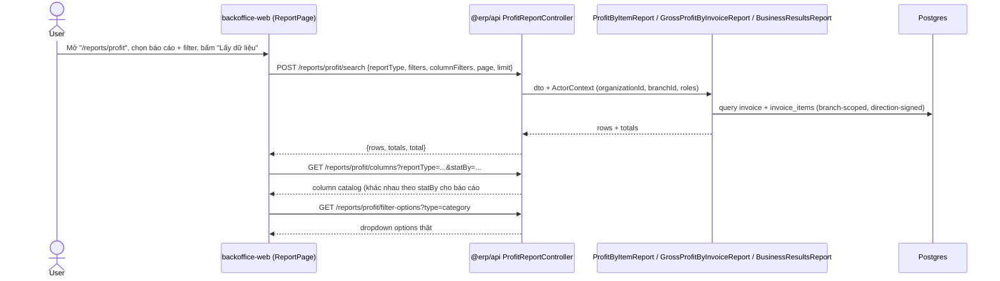
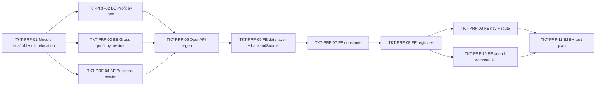

# EPIC-16072026 Báo cáo lợi nhuận (Profit Reports)

## Goal

`REPORT_CATEGORY.PROFIT` đã có sẵn trong enum (`report-category.constant.ts`) và khối
metadata đang bị **comment out** — y hệt cách `DEBTS` từng bị comment trước epic
debt-reports. `backendSource` hiện có 3 giá trị (`"invoice"` | `"inventory"` | `"debt"`);
epic này thêm giá trị thứ 4: `"profit"`.

Ship 3 báo cáo lợi nhuận (đã có UI mẫu thật đối chiếu số liệu, xem từng ticket BE để có đầy
đủ công thức/cột):

1. **Lợi nhuận theo mặt hàng** (`profit-by-item`) — doanh thu/giá vốn/lợi nhuận theo mặt
   hàng, gộp theo 3 grain khác nhau (Hàng hoá/Mẫu mã/Nhóm hàng hóa), mỗi grain có bộ cột
   riêng.
2. **Báo cáo lợi nhuận gộp theo hoá đơn** (`gross-profit-by-invoice`) — rollup lợi nhuận gộp
   theo ngày trong kỳ (tên gọi "theo hoá đơn" mô tả cách tính, không phải grain hiển thị).
3. **Kết quả kinh doanh** (`business-results`) — báo cáo tài chính dạng cố định (~20 dòng
   khoản mục phân cấp, công thức tham chiếu chéo), so sánh 2 kỳ song song (kỳ trước/kỳ hiện
   tại).

Dữ liệu giá vốn (COGS) **đã có sẵn, chính xác, không cần tính lại từ stock ledger**:
`InvoiceItemEntity.costPrice` (`apps/api/src/modules/pos/entities/invoice-item.entity.ts`)
được server snapshot từ `items.purchase_price` tại thời điểm bán (migration
`AddCostPriceAndDefaultPriceToInvoiceItems`). Không có migration/entity mới nào cần thiết.

## Scope

- **Không có migration/entity mới.** Tái dùng `InvoiceEntity`, `InvoiceItemEntity` (đã có
  `costPrice`, `direction`), `ItemEntity`, `ItemCategoryEntity`, `ProductEntity`,
  `ExpenseEntity` (chỉ báo cáo #3, dòng "Chi khác").
- **API surface**: module mới `apps/api/src/modules/reporting/profit-report/`, đúng pattern
  "3-API registry-driven contract" (`columns` / `search` / `filter-options` / `templates`)
  như `debt-report/` và `invoice-report/`.
- **Refactor đi kèm (TKT-PRF-01)**: di chuyển `invoice-report/report-query.util.ts` →
  `report-core/report-query.util.ts` (branch scoping dùng chung: `resolveBranchIds`,
  `applyBranchScope`, `CONSOLIDATED_PERMISSION`, `invoiceTypeSign`, `signedGoods`,
  `applyInvoiceStatusFilter`), cập nhật import trong `invoice-report/*`, rồi
  `profit-report/` import cùng file từ `report-core`.
- **FE**: generic, data-driven, không viết page riêng — uncomment `REPORT_CATEGORY.PROFIT`,
  thêm `<Route path="/reports/profit">`. **4 chỗ hardcode `backendSource`** cần thêm nhánh
  `"profit"` (điểm thứ 4 — `ReportTableConfigSync.tsx` — được phát hiện muộn ở epic
  debt-reports, đưa thẳng vào scope từ đầu ở epic này):
  `report-data-source.ts`, `report-filter-options.api.ts` (`OPTIONS_PATH`),
  `report-template.api.ts` (`TEMPLATES_PATH`),
  `ReportTableConfigSync/ReportTableConfigSync.tsx` (nhánh gọi `fetch*ReportColumns`).
- **Phạm vi chi nhánh**: theo UI mẫu, cả 3 báo cáo dùng chung 1 pattern — filter "Cửa hàng"
  **chỉ hiện ở chế độ Chuỗi cửa hàng** (ẩn hẳn ở single-store), mặc định
  **"Chuỗi cửa hàng"** (org-wide/consolidated qua `CONSOLIDATED_PERMISSION`), có thể thu hẹp
  về 1 cửa hàng cụ thể. Khác debt-reports (luôn org-wide, không filter phụ ở #1/#2).
- **Permission mới**: `reporting.profit.read` (seed trong `permissions.seed.ts`, theo tiền
  lệ `reporting.debts.read`).
- **Events**: không có — toàn bộ endpoint GET/POST read-only.
- **Ticket prefix mới**: `PRF`.

### Ghi chú riêng — Kết quả kinh doanh (báo cáo #3)

Khác 2 báo cáo còn lại: không phải bảng "1 dòng/1 entity" mà là báo cáo tài chính dạng cố
định (danh mục dòng cố định, công thức tham chiếu chéo bằng số thứ tự — kiểu I/II/2.1/a/b).
Cột vẫn khớp contract `ReportColumnHeader[]`/`ReportRow[]` hiện có (5 cột: Khoản mục/Kỳ
trước/Kỳ hiện tại/Thay đổi %/Thay đổi số tiền), nhưng **filter là 2 khoảng ngày song song**
(kỳ trước + kỳ hiện tại) — chưa có tiền lệ UI này trong `REPORT_FILTERS_LINE`, cần build mới
(TKT-PRF-10). 3 dòng trong báo cáo không có nguồn dữ liệu trong schema hiện tại (Tiền phí,
Thu khác, Phí giao hàng trả đối tác) — hard-code 0 kèm TODO, theo đúng tiền lệ debt-reports
xử lý cột thiếu entity (%CK/Thuế suất báo cáo #4).

## Success Metrics

- Cả 3 báo cáo hiển thị đúng số liệu thật khi test thủ công với dữ liệu seed/demo, khớp
  công thức đã verify chéo giữa các screenshot mẫu (báo cáo #1 và #2 cùng kỳ phải ra cùng
  dòng Tổng — đã dùng để verify công thức khi viết ticket).
- Hoá đơn RETURN/EXCHANGE trừ đúng chiều (`invoice_items.direction`, không phải
  `invoice.type`) ở mọi báo cáo — đây là điểm dễ sai nhất, giống rủi ro double-count đã gặp
  ở debt-reports. Giá vốn (GV) **có thể âm** khi hàng trả nhiều hơn hàng bán trong kỳ — đã
  xác nhận qua mock data, không phải bug cần chặn.
- Không cross-tenant leakage: mọi query filter theo `actor.organizationId` (+ branch scope
  qua `resolveBranchIds`).
- `pnpm openapi:generate` chạy sạch, `openapi.snapshot.json` + `schema.ts` commit.

## Flows

## Tickets

- [TKT-PRF-01 Backend module scaffold + report-query.util relocation](../tickets/TKT-PRF-01-backend-module-scaffold.md)
- [TKT-PRF-02 Backend — Lợi nhuận theo mặt hàng](../tickets/TKT-PRF-02-be-profit-by-item.md)
- [TKT-PRF-03 Backend — Lợi nhuận gộp theo hoá đơn](../tickets/TKT-PRF-03-be-gross-profit-by-invoice.md)
- [TKT-PRF-04 Backend — Kết quả kinh doanh (2 kỳ so sánh)](../tickets/TKT-PRF-04-be-business-results.md)
- [TKT-PRF-05 OpenAPI regen + api-client snapshot](../tickets/TKT-PRF-05-openapi-regen.md)
- [TKT-PRF-06 FE data layer + backendSource "profit" wiring](../tickets/TKT-PRF-06-fe-data-layer.md)
- [TKT-PRF-07 FE constants (enum, ReportTableColumn, REPORT_FILTERS_LINE)](../tickets/TKT-PRF-07-fe-constants.md)
- [TKT-PRF-08 FE report registries (3 báo cáo)](../tickets/TKT-PRF-08-fe-registries.md)
- [TKT-PRF-09 FE nav + route "/reports/profit"](../tickets/TKT-PRF-09-fe-nav-route.md)
- [TKT-PRF-10 FE dual-period filter + hierarchical row rendering](../tickets/TKT-PRF-10-fe-period-compare-ui.md)
- [TKT-PRF-11 E2E + test plan + DoD gate](../tickets/TKT-PRF-11-test-plan.md)

### Ticket dependency graph

## Dependencies

- Depends on: không phụ thuộc epic nào đang dở dang.
- Reuses:
  - `report-core/report-definition.ts`, `report-core/report-template.entity.ts` (contract
    chung columns/search/filter-options/templates).
  - `invoice-report/report-query.util.ts` → relocated to `report-core/` (xem Scope) cho
    branch scoping (`resolveBranchIds`, `applyBranchScope`, `CONSOLIDATED_PERMISSION`,
    `invoiceTypeSign`, `signedGoods`, `applyInvoiceStatusFilter`).
  - Pattern module `debt-report/` làm mẫu cấu trúc module (dto/queries/reports/module/
    controller). `debt-report`'s `GET .../columns?...&groupBy=item|productTemplate` làm
    mẫu cho báo cáo #1's `GET /reports/profit/columns?...&statBy=...` (cột đổi theo param).
  - `invoice-report/reports/revenue-by-item.report.ts` (báo cáo #1, item-grain aggregation
    theo `ReportGroupBy`) + `invoice-report/reports/daily-sales-summary.report.ts` (báo cáo
    #2, day-grain aggregation qua `aggregateByDay`/`signedGoods`) làm mẫu logic tính toán.
  - `debt-report/reports/receivables-detail-by-product.report.ts` (HEADER/ITEM/SUBTOTAL
    row-type) làm mẫu render hàng không đồng nhất, dùng tham khảo cho hiển thị phân cấp
    "I./2.1./a-" của báo cáo #3.
  - Permission pattern `reporting.debts.read` → `reporting.profit.read`.
