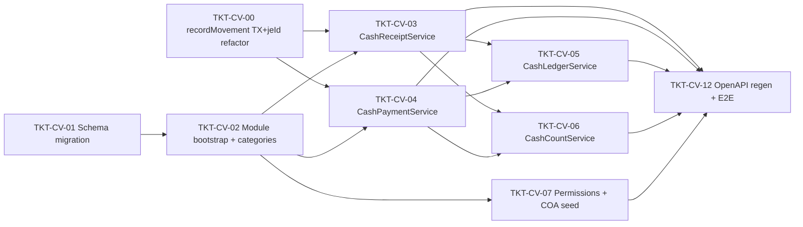
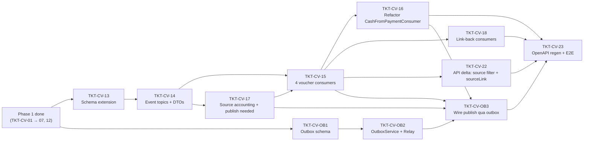

# EPIC-18052026 Phiếu Thu, Phiếu Chi và Sổ Tiền Mặt (Backend-only)

> **Scope của epic này: chỉ BACKEND.** Toàn bộ công việc frontend (backoffice pages, form, nav, query keys, badge…) **được tách ra một epic FE riêng** (xem section [Deferred FE work](#deferred-fe-work--epic-fe-rieng) cuối mỗi phase). Epic này dừng ở: migration + entity + service + controller + consumer + outbox + permissions/seed + OpenAPI regen + E2E backend. API contract phải đầy đủ để FE epic sau consume mà không cần đổi BE.

## Summary

Xây dựng module nghiệp vụ tiền mặt ở cấp **chứng từ** (document-level) cho ERP, bổ sung lên trên hạ tầng `cash_accounts` + `cash_movements` đã có (EPIC-009).

Phase 1 của epic này tập trung vào **manual flow + báo cáo + kiểm kê** (backend), không wire auto-create từ POS/debt/goods-receipt/expense (deferred sang epic phase 2):

1. **Phiếu thu** (cash receipt voucher) — chứng từ header + nhiều dòng chi tiết (Diễn giải, Số tiền, Mục thu). State: `DRAFT → POSTED → REVERSED`. Khi POSTED tạo `cash_movements (DEPOSIT)` + journal entry tương ứng.
2. **Phiếu chi** (cash payment voucher) — đối xứng với Phiếu thu, type WITHDRAWAL.
3. **Sổ chi tiết tiền mặt** (cash detail ledger) — báo cáo read-only theo cash_account, có opening balance + running balance, lọc theo khoảng thời gian.
4. **Kiểm kê tiền mặt** (cash count) — entity mới `cash_counts`, không phụ thuộc `pos_sessions`. Khi post tự sinh ADJUSTMENT movement + Phiếu thu (variance dương) hoặc Phiếu chi (variance âm) cho phần chênh lệch.
5. **Danh mục Mục thu / Mục chi** (`cash_voucher_categories`) — lookup table phục vụ field "Mục thu" / "Mục chi" trên line items.

**Out of scope (Phase 2 — epic sau):**

- Auto-create Phiếu thu từ POS cash sale (refactor `CashFromPaymentConsumer`).
- Auto-create Phiếu thu từ `InvoiceDebtService.collectPayment()` khi paymentMethod=CASH.
- Auto-create Phiếu chi từ goods receipt khi paidInCash.
- Auto-create Phiếu chi từ expense khi paymentMethod=CASH.
- Print template / Xuất khẩu PDF chứng từ.
- Multi-currency.

**Out of scope toàn epic (cả Phase 1 + Phase 2): FRONTEND.** Mọi backoffice page / form / nav / badge / query keys được gom vào FE epic riêng, không nằm trong phạm vi giao của epic này.

## Dependencies (epic-level)

- [EPIC-004 POS and Accounting](./EPIC-004-pos-and-accounting.md) — TKT-015 (COA & Journals), TKT-016 (Cash service).
- [EPIC-009 Cash Management Enhancement](./EPIC-009-cash-management-enhancement.md) — `cash_accounts` (REGISTER/SAFE/PETTY_CASH), `cash_movements` (DEPOSIT/WITHDRAWAL/TRANSFER/ADJUSTMENT), journal bug fix.
- [TKT-022 Document Numbering Rule Engine](../tickets/TKT-022-document-numbering-rule-engine.md) — generate `PT-YY-####` / `PC-YY-####` / `KKQ-YY-####` (prefix `CASH_COUNT` cấu hình sẵn là `KKQ`; đổi sang `KK` nếu muốn 2-ký-tự là chỉnh 1 dòng `DEFAULT_DOC_NUMBER_CONFIG`).
- [TKT-024 Generic CRUD Platform](../tickets/TKT-024-generic-crud-platform.md) — đăng ký `CrudEntityConfig` cho list view tự động.

## Architecture decisions

### recordMovement transaction + JE-id contract (prerequisite — TKT-CV-00)

Đối chiếu code thực tế phát hiện 2 gap nền tảng phải vá **trước** TKT-CV-03 (xem [TKT-CV-00](../tickets/TKT-CV-00-cash-tx-jeid-refactor.md)):

- `CashService.recordMovement()` hiện return `Promise<CashMovementEntity>` (`cash.service.ts:78`), tạo JE nội bộ nhưng **không trả `journalEntryId`**; `cash_movements` không có cột `journal_entry_id` (liên kết gián tiếp qua `journal_entries.sourceReferenceId`). Toàn bộ contract A-revised (`createAndPostInternal` trả jeId, event carry `journalEntryId`, `createVoucherForMovement` link JE có sẵn) phụ thuộc việc lấy được jeId.
- `recordMovement()` **tự mở `dataSource.transaction`** (dòng 131/217), không nhận `EntityManager`. Điều này phá vỡ: (a) tính atomic của `createAndPostInternal`, (b) chống deadlock trong `CashCountService.post()` (FOR UPDATE ngoài + recordMovement TX riêng UPDATE cùng cash_account), (c) tiền đề "1 LOCAL TX" của A-revised + Outbox (`recordMovement` + `UPDATE source` + `outbox.enqueue(manager,…)` phải cùng TX).

TKT-CV-00 refactor `recordMovement` / `JournalService.post`/`reverse` nhận **optional `manager?: EntityManager`** (compose vào TX caller; không truyền → giữ hành vi cũ) và `recordMovement` trả `{ movement, journalEntryId }`. Mọi sequence diagram dưới đây giả định contract sau-refactor này.

### Bảng tách riêng (không polymorphic)

Hai cặp bảng `cash_receipts` / `cash_receipt_lines` và `cash_payments` / `cash_payment_lines`. Lý do: enum `purpose` khác nhau (POS_SALE / DEBT_COLLECTION / OTHER_INCOME vs SUPPLIER_PAYMENT / PURCHASE / EXPENSE / SALARY / REFUND), permission keys khác, contra account mặc định khác, template in khác. Schema lines trùng ~70% chấp nhận được, đổi lại Swagger / TS types rõ ràng và `forbidNonWhitelisted` không yêu cầu nullable column.

### Kiểm kê tiền mặt = entity riêng

`cash_counts` không phụ thuộc `pos_sessions`. Cho phép kiểm kê bất kỳ lúc nào trên bất kỳ `cash_account` (REGISTER/SAFE/PETTY_CASH). `pos_session_reconciliations` giữ nguyên semantic chốt-ca-POS.

### Variance của kiểm kê → Phiếu thu/chi

Khi `cash_counts.post()`:
- `variance > 0` (thừa quỹ): auto-create POSTED Phiếu thu, `purpose = OTHER_INCOME`, contra = TK 711 "Thu nhập khác".
- `variance < 0` (thiếu quỹ): auto-create POSTED Phiếu chi, `purpose = OTHER`, contra = TK 811 "Chi phí khác".
- `variance = 0`: chỉ ghi nhận đã kiểm kê, không tạo voucher.

### Module Expenses giữ độc lập

Phase 1 không touch `ExpenseEntity`. Phase 2 sẽ thêm publisher khi expense POSTED + paymentMethod=CASH → consumer auto-create Phiếu chi.

### Idempotency

Tất cả mutation endpoint dùng Redis idempotency interceptor (`X-Idempotency-Key` header) + `processed_events` cho consumer (Phase 2). Reversal voucher dedupe theo `(reference_type=REVERSAL, reference_id=originalId)`.

### Reversal voucher strategy

Quyết định: **copy lines nguyên giữ amount > 0, đảo direction của movement**. Cụ thể:

- Reversal voucher có header riêng với `reverses_voucher_id = original.id`, `reference_type=REVERSAL`, `reference_id=original.id`, `reversal_reason` lưu lý do (text).
- Lines của reversal **copy nguyên** từ original (cùng `description`, `category_id`, `amount > 0`, `reference_note`). Không lưu lines âm — `cash_receipt_lines.amount CHECK > 0` giữ nguyên.
- `total_amount` header của reversal **dương** (= original.total_amount), không âm.
- `cash_movement` được tạo bằng `recordMovement()` với **type đảo**: Phiếu thu reversal → WITHDRAWAL (rút tiền ra); Phiếu chi reversal → DEPOSIT (trả tiền lại). Balance tự khôi phục.
- Journal entry tự đảo qua `JournalService.reverse(originalJEId)` (lines DR↔CR hoán đổi).
- API trả về cả original (REVERSED) lẫn reversal voucher; field `reverses_voucher_id` / `reversed_by_voucher_id` đủ để FE epic sau render badge "Đảo bút".

### Contra account placement

Quyết định: **per-header only**. `cash_receipts.contra_account_id` (single column) là contra account cho toàn voucher; JE chỉ có 1 cặp DR/CR. 1 voucher có nhiều contra → ops phải tách thành nhiều voucher.

- `cash_voucher_categories.default_account_id` **bị bỏ** (vì không wire được vào line-level). Category chỉ là lookup nhóm cho báo cáo (Mục thu Bán hàng / Thu nợ / Thu khác).
- `contra_account_id` nhận ở **header level** của create/update DTO, độc lập với lines (không có contra per-line).

### Cash count expected_amount semantics

Quyết định: **snapshot lúc POST**, không phải lúc tạo. `cash_counts.expected_amount` nullable trong DRAFT, fill khi post.

- Khi tạo DRAFT: response của API trả `currentBalance` (= live `cash_account.balance`) làm reference cho người kiểm kê. **Không lưu xuống DB.**
- Khi POST: `SELECT cash_account FOR UPDATE` → set `expected_amount = balance hiện tại`, `variance = actual − expected`, sau đó tạo voucher variance nếu ≠ 0.
- Lý do: tránh stale data nếu có movements xảy ra giữa create-DRAFT và post (ví dụ kiểm kê DRAFT lúc sáng, post cuối ngày).

### Balance không âm (đã có sẵn — chỉ verify + align)

`CashService.recordMovement()` **đã** chặn balance âm: `if (newBalance < 0) throw BadRequestException` (`cash.service.ts:201-205`, áp dụng cho WITHDRAWAL/TRANSFER). Đây **không phải việc làm mới** — chỉ cần verify hành vi tồn tại và **align message lỗi** với chuỗi mà E2E assert (kiểm tra message thực tế; nếu khác `'Insufficient cash balance'` thì sửa E2E theo message thật hoặc đổi message — note trong PR). Behavior này được dựa vào ở:

- POST `/cash-payments/:id/post` (chi tiền)
- POST `/cash-receipts/:id/reverse` (đảo Phiếu thu = rút tiền ra)
- POST `/cash-counts/:id/post` khi variance < 0 (kiểm kê thiếu quỹ tạo Phiếu chi)

`SELECT cash_account FOR UPDATE` đảm bảo không race condition giữa check và update.

### Aggregate trong RAM (memory rule)

`CashLedgerService.getLedger()` fetch raw `cash_movements` rồi tính running balance bằng JS, không dùng SQL window function / GROUP BY. Partner / voucher info được JOIN inline vào từng row trả về, không trả root `{[id]: X}` map.

### Validation rules (service-level)

- **`search` filter** (list endpoints): ILIKE trên `document_number`, `payer_name`/`payee_name`, `reason` (OR). Không search trên line description ở Phase 1.
- **`partner_id` polymorphic** (không FK): khi `partner_type` + `partner_id` có giá trị, service validate tồn tại trong table tương ứng (`customers`/`suppliers`/`employees`) cùng `organizationId` trước khi create/post; không hợp lệ → 400. Snapshot `partner_name`/`partner_address` được freeze lúc post.
- **`denominations`** (cash_counts, optional): nếu client gửi `[{denom, count}]`, service validate `sum(denom*count) === actual_amount`, lệch → 400. Bỏ trống → skip.
- **`total_amount`** (header): validate `=== sum(lines.amount)` cả khi update DRAFT (sau upsert lines) lẫn khi post.

## Tickets trong epic (Phase 1)

> Cột **Layer**: 🟦 BE = thuộc phạm vi epic này (có ticket file). 🟨 FE = đã tách sang epic FE riêng (xem [Deferred FE work](#deferred-fe-work--epic-fe-rieng)).

| Ticket    | Layer | Mô tả ngắn |
| --------- | ----- | ---------- |
| TKT-CV-00 | 🟦 BE | **Prerequisite**: refactor `CashService.recordMovement()` + `JournalService.post()`/`reverse()` nhận `manager?: EntityManager` (compose vào TX caller) và `recordMovement` trả `{ movement, journalEntryId }`. Vá gap atomic của `createAndPostInternal`, deadlock cash-count post, và tiền đề "1 LOCAL TX" của A-revised/Outbox |
| TKT-CV-01 | 🟦 BE | Migration: 6 bảng (`cash_receipts`, `cash_receipt_lines`, `cash_payments`, `cash_payment_lines`, `cash_counts`, `cash_voucher_categories`) + enums (gồm `REVERSAL` trong reference_type cả receipts/payments; `direction` chỉ IN/OUT; `cash_payments.reference_type` ship full enum); column `reversal_reason` cả 2 bảng; `cash_counts.expected_amount` + `variance` nullable; **unique index reversal dedupe**: `uniq_cash_receipts_reversal ON cash_receipts(reference_id) WHERE reference_type='REVERSAL' AND deleted_at IS NULL` + tương tự cash_payments; **DocumentType enum `CASH_RECEIPT`/`CASH_PAYMENT`/`CASH_COUNT` đã tồn tại sẵn** trong shared-interfaces (prefix PT/PC/**KKQ**) — chỉ verify, không cần extend |
| TKT-CV-02 | 🟦 BE | Entity classes + DTOs + `CashVouchersModule` skeleton + register `cash-voucher-categories` qua `EntityRegistryService` + seed mặc định (`THU_BAN_HANG`, `THU_NO_KH`, `THU_KHAC`, `CHI_MUA_HANG`, `CHI_NO_NCC`, `CHI_LUONG`, `CHI_KHAC`) |
| TKT-CV-03 | 🟦 BE | `CashReceiptService` + `CashReceiptController` — CRUD DRAFT (PATCH upsert `lines[]`) + `POST /:id/post` + `POST /:id/reverse`. Reverse: copy lines giữ amount > 0, movement type đảo (WITHDRAWAL), store `reversal_reason`, set `reverses_voucher_id`. `recordMovement(WITHDRAWAL)` validate insufficient balance trước UPDATE. Ship 2 internal method cho Phase 2 + cash-count variance: `createAndPostInternal()` (tạo movement+JE+voucher atomic) và `createVoucherForMovement({cashMovementId, journalEntryId, ...})` (chỉ tạo voucher document link vào movement+JE có sẵn). Unit test |
| TKT-CV-04 | 🟦 BE | `CashPaymentService` + `CashPaymentController` — đối xứng TKT-CV-03 (reverse → DEPOSIT movement; insufficient-balance check trên `post()` vì chi tiền; ship cả `createAndPostInternal()` + `createVoucherForMovement()` cùng signature) |
| TKT-CV-05 | 🟦 BE | `CashLedgerService` + `CashLedgerController` — `GET /cash-ledger` **cursor-based pagination**: `openingBalance` (cộng dồn signed tới `dateFrom` qua SQL `SUM`), `pageOpeningBalance`, `rows[]` (limit ~100, running balance tính trong RAM), `nextCursor`, `closingBalance`, `totalDebit`/`totalCredit` (SQL `SUM` riêng, không GROUP BY). JOIN voucher/partner inline per-row. **Filter phải là `(cashAccountId = X OR toAccountId = X)`** — KHÔNG chỉ `cashAccountId = X`. Convention TRANSFER (verified EPIC-009): `cash_movements` lưu TRANSFER là **1 row duy nhất**, `amount > 0`, `type=TRANSFER`, với `cashAccountId`=két nguồn + `toAccountId`=két đích (không có type TRANSFER_IN/OUT). Signed cho két X: DEPOSIT → `+amount`; WITHDRAWAL → `−amount`; TRANSFER khi `cashAccountId=X` → `−amount` (chuyển đi); TRANSFER khi `toAccountId=X` → `+amount` (nhận về). Bỏ qua `toAccountId` sẽ **sót transfer đến → sai opening/running/closing** |
| TKT-CV-06 | 🟦 BE | `CashCountService` + `CashCountController` — CRUD DRAFT (chỉ lưu `actual_amount` + `counted_at` + `notes` + `denominations`; expected NULL); response create/detail trả `currentBalance` (live) làm reference. `POST /:id/post`: `SELECT cash_count FOR UPDATE` + re-check status=DRAFT (chặn double-post) → `SELECT cash_account FOR UPDATE` → fill `expected_amount` + tính `variance`; variance > 0 → `CashReceiptService.createAndPostInternal(OTHER_INCOME)`; variance < 0 → `CashPaymentService.createAndPostInternal(OTHER)` (insufficient balance throw 400) |
| TKT-CV-07 | 🟦 BE | Permissions seed (`accounting.cash_receipt.*`, `accounting.cash_payment.*`, `accounting.cash_count.*`, `accounting.cash_ledger.read`, `accounting.cash_voucher_category.*`) + COA seeder bổ sung TK 711/811 nếu thiếu |
| ~~TKT-CV-08~~ | 🟨 FE | ~~Backoffice — Phiếu thu page~~ → **deferred sang FE epic** |
| ~~TKT-CV-09~~ | 🟨 FE | ~~Backoffice — Phiếu chi page~~ → **deferred sang FE epic** |
| ~~TKT-CV-10~~ | 🟨 FE | ~~Backoffice — Sổ chi tiết tiền mặt page~~ → **deferred sang FE epic** |
| ~~TKT-CV-11~~ | 🟨 FE | ~~Backoffice — Kiểm kê tiền mặt page~~ → **deferred sang FE epic** |
| TKT-CV-12 | 🟦 BE | `pnpm openapi:generate` + **automated** E2E test (`apps/api/test/e2e/`) cho manual-flow voucher: create→post→ledger reflects, reverse→balance restored, cash count variance creates voucher + DoD gate |

## Ticket dependency graph (Phase 1 — BE-only)



## Schema chi tiết

### `cash_receipts` (header)

| Column                                                                                 | Type                                                                      | Notes                                                                    |
| -------------------------------------------------------------------------------------- | ------------------------------------------------------------------------- | ------------------------------------------------------------------------ |
| `id`                                                                                   | uuid PK                                                                   |                                                                          |
| `organization_id`, `branch_id`, `created_by`, `created_at`, `updated_at`, `deleted_at` | BaseEntity + soft-delete                                                  |                                                                          |
| `document_number`                                                                      | varchar(64)                                                               | nullable cho đến khi POSTED; unique `(organization_id, document_number)` |
| `voucher_date`                                                                         | date NOT NULL                                                             | "Ngày thu"                                                               |
| `status`                                                                               | enum (`DRAFT`,`POSTED`,`REVERSED`)                                        |                                                                          |
| `purpose`                                                                              | enum (`OTHER`,`DEBT_COLLECTION`,`POS_SALE`,`OTHER_INCOME`)                |                                                                          |
| `partner_type`                                                                         | enum (`CUSTOMER`,`SUPPLIER`,`EMPLOYEE`,`OTHER`) nullable                  |                                                                          |
| `partner_id`                                                                           | uuid nullable                                                             |                                                                          |
| `partner_name_snapshot`                                                                | varchar(255) nullable                                                     | freeze cho in chứng từ                                                   |
| `partner_address_snapshot`                                                             | varchar(500) nullable                                                     |                                                                          |
| `payer_name`                                                                           | varchar(255) nullable                                                     | "Người nộp"                                                              |
| `reason`                                                                               | varchar(500) nullable                                                     | "Lý do nộp"                                                              |
| `staff_id`                                                                             | uuid nullable                                                             | thủ quỹ                                                                  |
| `reference_type`                                                                       | enum (`INVOICE`,`INVOICE_DEBT`,`RECEIVABLE`,`MANUAL`,`REVERSAL`) nullable | Phase 2 không thêm value mới; REVERSAL dùng cho voucher đảo              |
| `reference_id`                                                                         | uuid nullable                                                             |                                                                          |
| `cash_account_id`                                                                      | uuid NOT NULL FK `cash_accounts`                                          |                                                                          |
| `contra_account_id`                                                                    | uuid NOT NULL FK `accounts`                                               | TK 511/131/711…; per-header (không per-line)                             |
| `total_amount`                                                                         | numeric(18,2) NOT NULL                                                    | denormalized, validated = sum(lines.amount) khi post                     |
| `attachment_ids`                                                                       | jsonb default `[]`                                                        |                                                                          |
| `cash_movement_id`                                                                     | uuid nullable FK `cash_movements`                                         | set khi POSTED                                                           |
| `journal_entry_id`                                                                     | uuid nullable FK `journal_entries`                                        | set khi POSTED                                                           |
| `reversed_by_voucher_id`                                                               | uuid nullable self-FK                                                     | original→reversal link                                                   |
| `reverses_voucher_id`                                                                  | uuid nullable self-FK                                                     | reversal→original link                                                   |
| `reversal_reason`                                                                      | varchar(500) nullable                                                     | set chỉ trên reversal voucher (lý do đảo bút)                            |
| `posted_at`, `posted_by`                                                               | nullable                                                                  |                                                                          |

Indexes: `(organization_id, status)`, `(organization_id, voucher_date)`, `(cash_account_id, voucher_date)`, unique `(organization_id, document_number) WHERE document_number IS NOT NULL`.

### `cash_receipt_lines`

| Column                  | Type                                       | Notes       |
| ----------------------- | ------------------------------------------ | ----------- |
| `id`                    | uuid PK                                    |             |
| Scoping + audit columns | from BaseEntity                            |             |
| `cash_receipt_id`       | uuid NOT NULL FK CASCADE                   |             |
| `line_order`            | int NOT NULL default 0                     |             |
| `description`           | varchar(500) NOT NULL                      | "Diễn giải" |
| `category_id`           | uuid nullable FK `cash_voucher_categories` | "Mục thu"   |
| `amount`                | numeric(18,2) NOT NULL CHECK > 0           |             |
| `reference_note`        | varchar(255) nullable                      |             |

### `cash_payments` + `cash_payment_lines`

Mirror với:
- `purpose` enum (`OTHER`,`SUPPLIER_PAYMENT`,`PURCHASE`,`EXPENSE`,`SALARY`,`REFUND`).
- `reference_type` enum (`INVOICE_DEBT`,`GOODS_RECEIPT`,`EXPENSE`,`SALARY`,`REFUND`,`MANUAL`,`REVERSAL`) nullable. Phase 1 ship full enum, Phase 2 chỉ wire publisher/consumer cho `GOODS_RECEIPT` + `EXPENSE`.
- Trường `payee_name` thay cho `payer_name`.
- Có column `reversal_reason` như Phiếu thu.
- Mọi cấu trúc khác giống Phiếu thu (contra per-header).

### `cash_voucher_categories` (Mục thu / Mục chi)

| Column            | Type                  | Notes                                                                         |
| ----------------- | --------------------- | ----------------------------------------------------------------------------- |
| `id`              | uuid PK               |                                                                               |
| `organization_id` | varchar NOT NULL      |                                                                               |
| `code`            | varchar(32) NOT NULL  | `THU_BAN_HANG`, `CHI_MUA_HANG`… unique per org                                |
| `name`            | varchar(255) NOT NULL | hiển thị tiếng Việt                                                           |
| `direction`       | enum (`IN`,`OUT`)     | bỏ `BOTH` để tránh ambiguity; nếu cần dual-direction tạo 2 row code khác nhau |
| `is_active`       | boolean default true  |                                                                               |
| `display_order`   | int default 0         |                                                                               |

Note: Phase 1 quyết định contra account đặt **per-header** trên `cash_receipts`/`cash_payments`, nên category không có `default_account_id`. Category thuần là lookup phân nhóm cho báo cáo / filter / mục thu-chi trên line.

Đăng ký vào `EntityRegistryService` với `ScopingPolicy.ORGANIZATION`, `deletionPolicy.SOFT` để có ngay admin CRUD endpoint tự động (FE list page consume sau).

### `cash_counts` (Kiểm kê tiền mặt)

| Column                      | Type                                          | Notes                                                                                                                         |
| --------------------------- | --------------------------------------------- | ----------------------------------------------------------------------------------------------------------------------------- |
| `id`                        | uuid PK                                       |                                                                                                                               |
| Scoping + audit columns     |                                               |                                                                                                                               |
| `document_number`           | varchar(64) nullable                          | `KKQ-YY-####` khi POSTED (prefix `CASH_COUNT` cấu hình sẵn)                                                                  |
| `cash_account_id`           | uuid NOT NULL FK                              |                                                                                                                               |
| `counted_at`                | timestamptz NOT NULL                          |                                                                                                                               |
| `expected_amount`           | numeric(18,2) nullable                        | snapshot `cash_account.balance` **lúc POST** (không phải lúc tạo). DRAFT để NULL; API trả live balance làm reference |
| `actual_amount`             | numeric(18,2) NOT NULL                        | nhập tay khi DRAFT                                                                                                            |
| `variance`                  | numeric(18,2) nullable                        | = actual − expected, computed + stored khi POST                                                                               |
| `status`                    | enum (`DRAFT`,`POSTED`)                       |                                                                                                                               |
| `notes`                     | text nullable                                 |                                                                                                                               |
| `denominations`             | jsonb nullable                                | `[{denom:500000, count:10}]` tùy chọn                                                                                         |
| `variance_cash_movement_id` | uuid nullable FK                              | set khi POSTED & variance ≠ 0                                                                                                 |
| `variance_voucher_kind`     | enum (`CASH_RECEIPT`,`CASH_PAYMENT`) nullable |                                                                                                                               |
| `variance_voucher_id`       | uuid nullable                                 | polymorphic theo `variance_voucher_kind`                                                                                      |
| `posted_at`, `posted_by`    | nullable                                      | (state machine chỉ có `DRAFT → POSTED`, không có bước approve riêng — bỏ approved_by/approved_at)                             |

### `DocumentType` enum (`packages/shared-interfaces/src/document-numbering/`) — ĐÃ CÓ SẴN

Đối chiếu code: enum + `DEFAULT_DOC_NUMBER_CONFIG` **đã chứa cả 3 value** với prefix cấu hình sẵn — **không cần thêm migration/extend**:

```ts
CASH_RECEIPT = 'CASH_RECEIPT',  // prefix PT  (đã có)
CASH_PAYMENT = 'CASH_PAYMENT',  // prefix PC  (đã có)
CASH_COUNT   = 'CASH_COUNT',    // prefix KKQ (đã có — không phải KK)
```

⇒ TKT-CV-01 chỉ **verify** 3 value tồn tại + prefix đúng kỳ vọng. Nếu muốn `CASH_COUNT` dùng prefix `KK` thay vì `KKQ`, đó là chỉnh 1 dòng config (low-risk, chưa có cash-count document nào tồn tại) — quyết định trong PR.

## Backend layout

```
apps/api/src/modules/accounting/cash-vouchers/
  cash-vouchers.module.ts
  cash-receipts/
    cash-receipt.entity.ts
    cash-receipt-line.entity.ts
    cash-receipts.service.ts
    cash-receipts.controller.ts
    dto/{create,update,reverse,query}-cash-receipt.dto.ts
  cash-payments/      # mirror
  cash-counts/
    cash-count.entity.ts
    cash-counts.service.ts
    cash-counts.controller.ts
    dto/...
  cash-ledger/
    cash-ledger.controller.ts
    cash-ledger.service.ts
  cash-voucher-categories/
    cash-voucher-category.entity.ts
    cash-voucher-categories.service.ts
```

Import vào `apps/api/src/modules/accounting/accounting.module.ts`. Mỗi controller `@UseGuards(AuthGuard, PermissionGuard)` ở class level, `@RequireBranchScope()` cho các action thao tác trên két cụ thể.

## APIs

```
POST    /cash-receipts                       create DRAFT (body: header + lines[])
GET     /cash-receipts                       list (filter: status, purpose, cashAccountId, dateFrom/To, partnerId, search)
GET     /cash-receipts/:id                   detail + lines + partner inline
PATCH   /cash-receipts/:id                   update DRAFT only — body chứa full lines[] upsert:
                                             line có id → update; không id → insert; id cũ vắng mặt → delete;
                                             line_order = index trong array (server gán). Diff trong 1 transaction.
DELETE  /cash-receipts/:id                   soft-delete DRAFT only
POST    /cash-receipts/:id/post              DRAFT → POSTED
POST    /cash-receipts/:id/reverse           {reason}, POSTED → REVERSED + reversal voucher
(mirror /cash-payments)

POST    /cash-counts                         create DRAFT (response trả currentBalance reference)
GET     /cash-counts                         list
GET     /cash-counts/:id                     detail
PATCH   /cash-counts/:id                     update DRAFT
POST    /cash-counts/:id/post                tạo variance movement + voucher

GET     /cash-ledger?cashAccountId=&dateFrom=&dateTo=&branchId=&cursor=&limit=100
        → { openingBalance, pageOpeningBalance, rows[], pageClosingBalance,
            nextCursor, closingBalance, totalDebit, totalCredit }

/admin/entities/cash-voucher-categories/records   (auto qua EntityRegistryService)
```

## Sequence diagrams

> "Client" = HTTP caller (FE epic sau hoặc test harness). Epic này chỉ giao behavior phía server.

### (a) Create + Post Phiếu thu

```
Client            Controller        CashReceiptSvc        CashSvc            JournalSvc        DB
 │ POST /cash-receipts ▶                                                                       │
 │                     ─ create() ▶                                                             │
 │                                  ─ INSERT cash_receipts (DRAFT) + lines ──────────────────▶ │
 │ ◀ 201 {id, status:DRAFT}                                                                    │
 │ POST /cash-receipts/:id/post ▶                                                              │
 │                     ─ post(id) ▶                                                             │
 │                                  ─ SELECT FOR UPDATE                                         │
 │                                  ─ DocNumService.generate(CASH_RECEIPT)                      │
 │                                  ─ recordMovement(DEPOSIT) ─▶                                │
 │                                                       ─ INSERT cash_movements ─────────────▶│
 │                                                       ─ UPDATE cash_accounts.balance ──────▶│
 │                                                       ─ journalSvc.post() ─▶                 │
 │                                                                                  ─ INSERT JE+lines
 │                                  ─ UPDATE cash_receipts SET status=POSTED, document_number, │
 │                                       cash_movement_id, journal_entry_id ─────────────────▶ │
 │ ◀ 200 {id, status:POSTED, documentNumber:'PT-26-00001'}                                     │
```

### (b) Reverse Phiếu thu

```
Client     Controller     CashReceiptSvc                CashSvc            JournalSvc
 │ POST /:id/reverse {reason} ▶                                                          │
 │           ─ reverse() ▶                                                                │
 │                          ─ validate status=POSTED                                      │
 │                          ─ INSERT reversal cash_receipt header                         │
 │                              (status=POSTED, total_amount=orig.total > 0,              │
 │                               reverses_voucher_id=orig.id,                             │
 │                               reference_type=REVERSAL, reference_id=orig.id,           │
 │                               reversal_reason=dto.reason)                              │
 │                          ─ INSERT reversal cash_receipt_lines                          │
 │                              (copy nguyên từ original lines, amount > 0 — CHECK pass)  │
 │                          ─ recordMovement(WITHDRAWAL, amount=orig.total) ─▶            │
 │                              ─ check cash_account.balance >= amount (insufficient → 400)
 │                              ─ INSERT cash_movements (type=WITHDRAWAL)                 │
 │                              ─ UPDATE cash_account.balance −= amount                   │
 │                              ─ journalSvc.reverse(originalJEId) ─▶                     │
 │                                                            ─ INSERT JE đảo (DR↔CR)     │
 │                          ─ UPDATE reversal SET cash_movement_id, journal_entry_id      │
 │                          ─ UPDATE original SET status=REVERSED, reversed_by_voucher_id │
 │ ◀ 200 {original:REVERSED, reversal:{id, documentNumber, reversalReason}}              │
```

Note: Phiếu chi reverse đối xứng — movement type=DEPOSIT (trả tiền lại); không cần insufficient-balance check vì balance tăng.

### (c) Kiểm kê tiền mặt → variance voucher

```
Client              CashCountSvc                              CashReceiptSvc / CashPaymentSvc
 │ POST /cash-counts ▶ (create DRAFT)                                                          │
 │                    ─ INSERT cash_counts (status=DRAFT, expected_amount=NULL,                 │
 │                                          actual_amount=dto.actual, denominations=...)        │
 │ ◀ 201 {id, status:DRAFT, currentBalance: live balance (không lưu)}                          │
 │ POST /cash-counts/:id/post ▶                                                                │
 │                    ─ SELECT cash_count WHERE id=X FOR UPDATE  (chặn double-post)            │
 │                    ─ re-check status=DRAFT (nếu POSTED → 400 already posted)                │
 │                    ─ SELECT cash_account FOR UPDATE → balance hiện tại                      │
 │                    ─ UPDATE cash_counts SET expected_amount = balance,                       │
 │                                              variance = actual − balance (lúc post)          │
 │                    ┌ variance > 0: CashReceiptSvc.createAndPostInternal(OTHER_INCOME) ──▶  │
 │                    └ variance < 0: CashPaymentSvc.createAndPostInternal(OTHER) ─────────▶  │
 │                                                            (insufficient balance → throw 400)│
 │                                                            ─ returns voucherId + movementId │
 │                    ─ UPDATE cash_counts SET status=POSTED, variance_voucher_id,             │
 │                         variance_voucher_kind, variance_cash_movement_id,                    │
 │                         posted_at, posted_by, document_number                                │
 │ ◀ 200 {variance, varianceVoucher:{id, kind, documentNumber}}                                │
```

### (d) GET /cash-ledger flow (cursor pagination)

```
Controller         CashLedgerSvc                               DB
 │ getLedger(query, actor) ▶                                                  │
 │           ─ SELECT SUM(signed) WHERE date < dateFrom ─────────────────────▶│  ◀ openingBalance (toàn range)
 │           ─ SELECT SUM(signed) WHERE date IN [from, cursor) ──────────────▶│  ◀ Δ trước page → pageOpeningBalance = openingBalance + Δ
 │           ─ SELECT cash_movements WHERE date IN [cursor, to]               │
 │                ORDER BY (movementDate, id) ASC LIMIT :limit+1 ────────────▶│  ◀ page rows (+1 để biết nextCursor)
 │           ─ SELECT cash_receipts/cash_payments WHERE cash_movement_id IN   │
 │                (page movement_ids) ───────────────────────────────────────▶│  ◀ vouchers (LEFT JOIN: rows cũ → '(Chưa có chứng từ)')
 │           ─ SELECT SUM(debit)/SUM(credit) WHERE date IN [from,to] ────────▶│  ◀ totalDebit/totalCredit (aggregate riêng, không GROUP BY)
 │           ─ in-RAM: map movement → voucher inline + partner inline;        │
 │              running balance per row = cộng dồn từ pageOpeningBalance       │
 │ ◀ { openingBalance, pageOpeningBalance,                                    │
 │     rows: [{date, voucherNumber, kind, description, partnerName,           │
 │            debit, credit, balance}, …],                                     │
 │     pageClosingBalance, nextCursor,                                         │
 │     closingBalance (SUM signed tới dateTo), totalDebit, totalCredit }      │
```

Memory rule: running balance tính trong RAM trên từng page; chỉ openingBalance/Δ/closing/totals dùng SQL `SUM` đơn (aggregate scalar, không window function, không GROUP BY).

TRANSFER (1-row schema): mọi SELECT ở trên filter `WHERE (cash_account_id = :X OR to_account_id = :X)`; `signed`/`debit`/`credit` tính qua `CASE`: `type=DEPOSIT → +amount`; `type=WITHDRAWAL → −amount`; `type=TRANSFER AND cash_account_id=:X → −amount` (đi); `type=TRANSFER AND to_account_id=:X → +amount` (đến). Một transfer giữa 2 két nội bộ vì thế xuất hiện ở sổ của cả két nguồn (Có) lẫn két đích (Nợ).

## Epic acceptance criteria (Phase 1 — BE)

- [x] 6 bảng mới (`cash_receipts`, `cash_receipt_lines`, `cash_payments`, `cash_payment_lines`, `cash_counts`, `cash_voucher_categories`) + enums migrate sạch trên môi trường staging; data hiện có không vỡ. (`DocumentType` đã có sẵn 3 value cash — chỉ verify, không migrate.)
- [x] Manual create + post Phiếu thu: `cash_accounts.balance` tăng đúng số tiền; `cash_movements` có 1 row DEPOSIT với `reference = documentNumber`; `journal_entries` có bút toán cân bằng DR cash / CR contra.
- [x] Phiếu chi đối xứng: WITHDRAWAL, balance giảm, DR contra / CR cash.
- [x] Reverse Phiếu thu: original = REVERSED + `reversed_by_voucher_id` link; reversal voucher POSTED với `total_amount = original.total > 0`, `reverses_voucher_id`, `reference_type=REVERSAL`, `reversal_reason` lưu lý do; lines copy nguyên (amount > 0); movement type=WITHDRAWAL (đối xứng cho Phiếu chi reverse → DEPOSIT); balance trở về giá trị trước post; journal có bút toán đảo (DR↔CR).
- [x] Insufficient cash balance: post Phiếu chi / reverse Phiếu thu / kiểm kê variance < 0 mà `cash_account.balance < amount` → throw 400 "Insufficient cash balance"; không UPDATE balance.
- [x] Edit/Delete chỉ cho phép trên status=DRAFT (POSTED và REVERSED reject 400).
- [x] `GET /cash-ledger` trả về opening + rows + closing chính xác; running balance = sum của debit−credit theo thứ tự thời gian.
- [x] Mỗi row của ledger có `voucherNumber`, `partnerName`, `description` được JOIN inline (không trả root map).
- [x] Kiểm kê tiền mặt: DRAFT chỉ lưu `actual_amount` (expected NULL); post fill `expected_amount = balance hiện tại` qua `SELECT FOR UPDATE`, tính variance; variance > 0 tạo Phiếu thu OTHER_INCOME (TK 711); variance < 0 tạo Phiếu chi OTHER (TK 811) — fail nếu insufficient balance; variance = 0 không tạo voucher.
- [x] Permissions enforced: thiếu `accounting.cash_receipt.post` → 403 khi gọi `/cash-receipts/:id/post`.
- [x] Multi-tenant: actor org A không thấy voucher org B trong list / detail / ledger.
- [x] `openapi.snapshot.json` + `packages/api-client/src/generated/schema.ts` commit kèm (API contract đầy đủ cho FE epic).

## Epic Definition of Done (Phase 1 — BE)

- [x] Mọi ticket BE TKT-CV-01 → TKT-CV-07 + TKT-CV-12 đạt DoD riêng.
- [x] Unit test: `CashReceiptService.post` / `.reverse`, `CashLedgerService.getLedger`, `CashCountService.post` (cả 3 nhánh variance).
- [x] E2E test (`apps/api/test/e2e/`): full happy path Phiếu thu manual + Phiếu chi manual + ledger + kiểm kê (qua HTTP, không cần FE).
- [x] Manual regression POS: tạo POS cash sale → `cash_movements` vẫn được record (qua `CashFromPaymentConsumer` cũ); không vỡ flow hiện có. (Phase 2 sẽ thêm Phiếu thu tự động.)
- [x] Audit trail (API-level): từ voucher trace ngược `cash_movement_id` → `journal_entry_id`; ledger row carry `voucherId` để FE epic deep-link.
- [x] Docs: cập nhật `docs/architecture-cash-flow.md` thêm section voucher document layer; cập nhật `tickets/README.md` đăng ký epic mới + dependency graph.

## Deferred FE work → epic FE riêng

Các hạng mục frontend dưới đây **đã được gỡ khỏi epic này** và sẽ đóng gói thành một epic FE riêng (đề xuất: `EPIC-XX-cash-vouchers-frontend`). API contract do Phase 1 BE cung cấp đủ để FE consume mà không cần đổi BE.

| FE ticket (cũ) | Mô tả gốc (giữ lại để không mất dấu) |
| -------------- | ------------------------------------- |
| TKT-CV-08 | Phiếu thu page (`/admin/cash-receipts`): clone `PurchaseOrdersPage` pattern với `DocumentFormDialog` + `LineItemGrid`. Toolbar: Thêm mới / Sửa / Lưu / Xóa / Ghi sổ / Đảo bút / In. Nav update |
| TKT-CV-09 | Phiếu chi page (`/admin/cash-payments`) đối xứng TKT-CV-08 |
| TKT-CV-10 | Sổ chi tiết tiền mặt page (`/admin/cash-ledger`) dùng `ReportFilters` + `BaseDataTable`: Ngày, Số CT, Loại (PT/PC), Diễn giải, Đối tượng, Phát sinh Nợ, Phát sinh Có, Số dư. Sticky footer opening/closing |
| TKT-CV-11 | Kiểm kê tiền mặt page (`/admin/cash-counts`): list + modal form, hiển thị số dư dự kiến (read-only fetch từ cash-account), nhập số thực tế, tính chênh lệch live, nút Ghi sổ |

Kèm theo: nav update `apps/backoffice-web/src/components/layout/navConfig.ts` (group `catalog-receipts-expenses`), route trong `App.tsx`, TanStack Query keys (`["cash-receipts", …]`, `["cash-payments", …]`, `["cash-ledger", …]`, `["cash-counts", …]`, `["cash-accounts"]`), format `vi-VN` cho số tiền/ngày.

---

# Phase 2 — Auto-create vouchers từ nguồn nghiệp vụ (Backend-only)

> Vẫn **chỉ backend**. FE wiring cho goods-receipt / expense / debt-collection form + voucher source filter/badge được tách sang FE epic (xem [Deferred FE work Phase 2](#deferred-fe-work-phase-2--epic-fe-rieng)).

## Phase 2 Summary

Sau khi Phase 1 đặt nền tảng document-layer cho tiền mặt (Phiếu thu/Phiếu chi manual + ledger + kiểm kê), Phase 2 **wire 4 nguồn nghiệp vụ** auto-create voucher để mọi cash_movement đều có chứng từ truy vết:

1. **POS cash sale** — refactor `CashFromPaymentConsumer` để consumer tạo **Phiếu thu (purpose=POS_SALE)** thay vì raw `cash_movement`. Voucher reference back vào `invoices.id`.
2. **Debt collection** — `InvoiceDebtService.collectPayment()` khi `paymentMethod=CASH` publish event → consumer tạo **Phiếu thu (purpose=DEBT_COLLECTION)**, reference `debt_payments.id`.
3. **Goods receipt paid in cash** — `GoodsReceiptService.post()` khi `paymentMethod=CASH` publish event → consumer tạo **Phiếu chi (purpose=PURCHASE)**, reference `goods_receipts.id`, fill back `goods_receipts.cash_payment_id`.
4. **Expense paid in cash** — `ExpensesService.post()` khi `paymentMethod=CASH` publish event → consumer tạo **Phiếu chi (purpose=EXPENSE)**, reference `expenses.id`, fill back `expenses.cash_payment_id`.

Phase 2 cũng bổ sung hạ tầng **Transactional Outbox** dùng chung (`modules/events/outbox/`) để đóng dual-write gap: hiện publish event xảy ra *sau* khi commit, ngoài TX → crash giữa commit và publish làm mất event → voucher document không bao giờ được tạo. Outbox enqueue event trong cùng TX với accounting, một relay nền publish at-least-once ⇒ hệ thống **tự recovery** (xem decision "Transactional Outbox" + TKT-CV-OB1/OB2/OB3).

Vẫn out of scope: print template / PDF, multi-currency, **toàn bộ FE**.

## Phase 2 Dependencies

- **Phase 1 hoàn thành**: phụ thuộc 2 method từ TKT-CV-03 / TKT-CV-04:
  - `createAndPostInternal({ purpose, cashAccountId, contraAccountId, partner*, amount, lines?, referenceType, referenceId, actor })` → tạo **movement + JE + voucher** atomic (dùng cho POS consumer + cash-count variance). Trả về `{ voucherId, voucherNumber, cashMovementId, journalEntryId }`. **Atomic thật chỉ đạt được sau TKT-CV-00** (mở 1 TX, truyền `manager` xuống `recordMovement`); `journalEntryId` lấy từ return mới của `recordMovement`.
  - `createVoucherForMovement({ cashMovementId, journalEntryId, purpose, cashAccountId, contraAccountId, partner*, amount, lines?, referenceType, referenceId, actor })` → tạo **chỉ voucher document** link vào movement+JE có sẵn (dùng cho 3 flow A-revised: debt / GR / expense). Không tạo movement/JE/balance. Trả về `{ voucherId, voucherNumber }`.
- **Event infra** (đã có): `EventPublisher`, `@OnDomainEvent` decorator, `EventIdempotencyService` (auto-wrap consumer với `processed_events` table), DLQ.
- **Transactional Outbox** (MỚI — TKT-CV-OB1/OB2): hạ tầng dùng chung trong `modules/events/outbox/` để publish at-least-once, đóng dual-write gap. Phase 2 wire toàn bộ publish của epic qua outbox thay vì `await publish()` sau commit.
- **`CashService.recordMovement()`** (refactor ở [TKT-CV-00](../tickets/TKT-CV-00-cash-tx-jeid-refactor.md)): được source service gọi trực tiếp ở 3 flow A-revised. **Signature ĐỔI** — nhận thêm `manager?: EntityManager` (compose vào source TX) và trả `{ movement, journalEntryId }` để source đẩy `journalEntryId` qua event. Cần verify không tạo circular import khi `inventory`/`pos` gọi `accounting/cash`.
- **Phase 1 reference_type enum**: enum đã ship full ở TKT-CV-01 (gồm REVERSAL); Phase 2 chỉ thêm unique constraint (xem Schema bên dưới).

## Phase 2 Architecture decisions

### A-revised: accounting đồng bộ ở source TX, voucher document async

Quyết định cốt lõi (chốt sau khi cân nhắc saga): **tách riêng accounting layer và document layer**.

- **Accounting-critical** (balance check + UPDATE balance + INSERT `cash_movements` + post `journal_entries`) chạy **đồng bộ trong 1 local ACID transaction của source service**. Vì toàn bộ module nằm chung 1 Postgres + 1 process, 1 transaction cho atomicity thật — mạnh hơn saga, không cần compensating logic, không có intermediate state.
- **Document layer** (`cash_receipts` / `cash_payments` row — thuần audit / in chứng từ / hiển thị trong sổ) tạo **async qua event**. Voucher document **không** đụng balance/JE → fail chỉ là "thiếu badge trong ledger", không bao giờ gây inconsistency sổ cái → DLQ-safe thật sự.

Tại sao **không** dùng saga: saga giải bài toán consistency xuyên nhiều datastore không share transaction được (true microservices). Repo này là monolith shared-DB → 1 transaction giải quyết atomicity trực tiếp. Saga chỉ thêm complexity (PENDING states, compensating tx, eventual POSTED) mà không thêm giá trị.

Insight quan trọng: **`recordMovement()` tự tạo đúng JE** khi truyền `contraAccountId` phù hợp — không cần pre-create JE rồi pass `externalJournalEntryId` (concept này bị loại bỏ hoàn toàn):
- Expense CASH: `recordMovement(WITHDRAWAL, contra = expense.accountId)` → JE `DR expense / CR cash`.
- Goods receipt CASH: `recordMovement(WITHDRAWAL, contra = inventoryAccountId)` → JE `DR inventory / CR cash`.
- Debt collection CASH: `recordMovement(DEPOSIT, contra = receivableAccountId 131)` → JE `DR cash / CR 131`.

Non-CASH (PAYABLE/BANK/CREDIT) **không** tạo cash movement — source service tạo JE riêng theo logic cũ (DR expense/inventory / CR payable hoặc bank). Chỉ CASH mới route qua `recordMovement` + voucher.

### Flow tổng quát (source-sync + voucher-async)

```
Source service (post/collect)  [1 LOCAL TX]
   │ recordMovement(type, contra, amount) → {movementId, journalEntryId}   (balance+movement+JE atomic)
   │ UPDATE source SET status=POSTED, journal_entry_id=jeId
   │ COMMIT
   └ publish "cash.voucher.needed.{kind}" {sourceId, cashMovementId, journalEntryId, partner*, amount, ...}
                                          │
                      ┌───────────────────┘
                      ▼
          CashVoucherConsumer (in cash-vouchers module)   [1 LOCAL TX]
                      │ createVoucherForMovement({cashMovementId, journalEntryId, purpose, referenceType, referenceId, ...})
                      │   → INSERT cash_receipts/cash_payments (status=POSTED) + lines
                      │     (link cash_movement_id + journal_entry_id, KHÔNG tạo movement/JE mới)
                      └ publish "cash.voucher.created" {voucherId, voucherNumber, sourceType, sourceId}
                                          │
                  ┌───────────────────────┘
                  ▼
      Domain link consumer (in source module — debt / GR / expense)   [1 LOCAL TX]
                  │ UPDATE source SET cash_receipt_id|cash_payment_id = voucherId
                  ▼
                DB
```

- **No cyclic dependency cho document layer**: cash-vouchers module không cần biết entity của source. Link consumer nằm trong source module.
- **Module coupling cho accounting layer**: source service phụ thuộc `CashService` (core infra trong accounting). `inventory/goods-receipt` → `accounting/cash`: kiểm tra circular-dep khi implement; nếu có, expose `CashService` qua shared provider token hoặc `forwardRef`.
- **Idempotent**: voucher consumer + link consumer đều idempotent qua `processed_events`.

### Defense-in-depth idempotency

Ngoài `processed_events`, thêm unique constraint database-level trên `cash_receipts` và `cash_payments` (xem Schema). Replay event sau khi voucher đã tạo → consumer insert lần 2 → DB unique violation → catch + log + return existing (treated as already-processed). Đảm bảo 1 source record → tối đa 1 voucher document.

### Transactional Outbox — at-least-once delivery + self-recovery

**Vấn đề (dual-write gap)**: các flow A-revised commit accounting đồng bộ trong source TX rồi `await publisher.publish('cash.voucher.needed.*')` **sau** commit, **ngoài** TX. `EventPublisher.publish()` chỉ là wrapper quanh Kafka `producer.send()`, không dính DB transaction nào. Nếu process crash hoặc Kafka down **giữa COMMIT và publish** → event mất luôn → consumer không bao giờ chạy → voucher document không bao giờ được tạo, ledger row kẹt `'(Chưa có chứng từ)'` vĩnh viễn, FK link-back không được set. DLQ **không** cứu được ca này — DLQ chỉ bắt lỗi consumer-side *sau khi* event đã vào Kafka; event chưa tới Kafka thì không có gì để retry.

**Quyết định**: thêm hạ tầng **Transactional Outbox dùng chung** trong `modules/events/outbox/` (generic — mọi publisher opt-in được; epic này là consumer đầu tiên). Thay vì publish sau commit, source/consumer **INSERT event vào `outbox_messages` trong cùng TX** với business write (atomic). Một **OutboxRelay** chạy nền poll row chưa gửi → publish Kafka → đánh dấu `published_at`.

Bất biến mới: **source committed ⟺ outbox row tồn tại ⟺ event chắc chắn được publish ⟺ voucher chắc chắn được tạo**. Crash ở bất kỳ đâu → row outbox còn nguyên trong DB → relay gửi lại khi process sống dậy ⇒ **tự recovery, không cần ops back-fill thủ công**.

**At-least-once + idempotency** (relay là at-least-once: nếu crash *sau* khi Kafka nhận nhưng *trước* khi UPDATE `published_at` → gửi lại lần 2). Đóng lại bởi hạ tầng đã có:

- `event_id` ghi vào outbox phải **deterministic** theo `(sourceType, sourceId)` — vd `uuidv5(ns, 'cash.voucher.needed:GOODS_RECEIPT:'+grId)`.
- Consumer dedupe qua `processed_events.tryClaim()` (INSERT ON CONFLICT DO NOTHING) → gửi trùng → skip.
- DB unique `uniq_*_reference` (TKT-CV-13) là lớp defense cuối.

⇒ Outbox (producer-side) + `processed_events`/DLQ (consumer-side) là 2 nửa bổ sung: outbox đảm bảo event **chắc chắn tới** Kafka; `processed_events` + DLQ đảm bảo nó **xử lý đúng-một-lần-hiệu-dụng** + retry. Khép kín vòng tự recovery.

**Components**:

- `OutboxService.enqueue(manager, topic, event, key?)` — nhận `EntityManager` của TX hiện tại để insert nằm trong cùng TX (bắt buộc nhận manager, không tự mở TX riêng).
- `OutboxRelayService` — poll `WHERE published_at IS NULL AND next_attempt_at <= now() ORDER BY created_at LIMIT N FOR UPDATE SKIP LOCKED` (an toàn multi-instance) → publish → set `published_at`; lỗi → `attempts++`, `last_error`, `next_attempt_at = now() + backoff(attempts)`. Cần thêm dep `@nestjs/schedule` (`@Interval`), hoặc `setInterval` trong `OnApplicationBootstrap` + `clearInterval` trong `OnModuleDestroy`.
- Immediate dispatch (tùy chọn): kick relay best-effort ngay sau commit để happy path đạt latency ≤ 2s; poller là lưới an toàn cho crash path.
- Cleanup job: định kỳ `DELETE WHERE published_at < now() - interval '7 days'`.

**Phạm vi wire ở Phase 2**: cả 3 source `needed.*` (TKT-CV-17), `cash.voucher.created` ở voucher consumer (TKT-CV-15), và POS `needed.pos_sale` (TKT-CV-16). Mọi chỗ `await publisher.publish()` sau commit đổi thành `outbox.enqueue(manager, …)` trong TX. **Các sequence diagram (e)–(h) bên dưới: bước `publish(...)` giờ là `outbox.enqueue(manager, ...)` trong source/consumer TX; OutboxRelay làm việc publish Kafka thực tế** (xem diagram (i)).

### Refactor in-place CashFromPaymentConsumer (POS giữ model "consumer tạo tất cả")

POS là ngoại lệ so với 3 flow kia. Hiện `apps/api/src/modules/accounting/consumers/cash-from-payment.consumer.ts` tạo `cash_movement + JE` **trong consumer** (movement và JE sinh cùng nhau atomic) → POS **không** dính lỗ hổng JE/balance inconsistency (issue #3) vì JE và movement luôn cùng transaction consumer.

Phase 2 refactor: consumer tạo thêm voucher document **trong cùng transaction** với movement+JE. Tức POS dùng `createAndPostInternal()` (tạo cả movement+JE+voucher), KHÁC với 3 flow kia dùng `createVoucherForMovement()` (chỉ voucher).

- Lý do giữ asymmetry: với debt/GR/expense, source service còn làm accounting domain riêng (DR expense, DR inventory, UPDATE remainingAmount) nên JE phải sinh ở source TX. POS thì JE thuần `DR cash / CR revenue`, đặt ở consumer như cũ là hợp lý + tránh refactor checkout đang chạy ổn.
- Topic giữ nguyên `erp.cash.movement.from.payment`; rename hằng số `CASH_MOVEMENT_FROM_PAYMENT` → `CASH_VOUCHER_NEEDED_POS_SALE` (deprecated alias trỏ cùng string).
- Backward compat: `cash_movements` cũ (trước Phase 2) không có voucher → ledger LEFT JOIN, hiển thị `voucherNumber = '(Không có chứng từ)'`.
- Di chuyển consumer sang `accounting/cash-vouchers/cash-voucher-consumers/pos-cash-sale.consumer.ts`.

### Producer/Consumer module placement

```
apps/api/src/modules/
  events/outbox/                          # NEW shared infra (generic, mọi publisher opt-in)
    outbox-message.entity.ts
    outbox.service.ts                     # enqueue(manager, topic, event, key?)
    outbox-relay.service.ts               # poller: SKIP LOCKED + backoff + cleanup
  accounting/cash-vouchers/cash-voucher-consumers/
    pos-cash-sale.consumer.ts             # refactored CashFromPaymentConsumer
    debt-collection-cash.consumer.ts
    goods-receipt-cash.consumer.ts
    expense-cash.consumer.ts
  pos/services/
    invoice-debt.service.ts               # add publisher.publish() after save
  pos/consumers/                          # NEW: link-back FK
    debt-payment-voucher-link.consumer.ts
  inventory/goods-receipt/
    goods-receipt.service.ts              # add publisher.publish() + add paymentMethod field
  inventory/goods-receipt/consumers/      # NEW
    goods-receipt-voucher-link.consumer.ts
  accounting/expenses/
    expenses.service.ts                   # add paymentMethod field + publisher
  accounting/expenses/consumers/          # NEW
    expense-voucher-link.consumer.ts
```

### Failure semantics

Vì accounting đã commit đồng bộ ở source TX **và** event được `outbox.enqueue()` trong cùng TX đó (xem decision Transactional Outbox), mọi failure phía sau chỉ ảnh hưởng **document layer** — sổ cái luôn nhất quán và **event không bao giờ bị mất**:

- Source TX fail (balance không đủ ở flow WITHDRAWAL, DB error) → toàn bộ rollback, source record **không** POSTED, **outbox row cũng rollback theo** → không publish. Người dùng nhận 400 ngay (insufficient balance) — không có movement/JE mồ côi.
- **Crash giữa COMMIT và lúc relay publish** → outbox row đã commit cùng source → OutboxRelay publish lại khi process sống dậy. **Self-recovery, không cần ops can thiệp** (đây là gap cũ mà publish-after-commit không xử lý được).
- Voucher document creation fail (DB error) → DLQ → auto-retry (3 lần) → manual replay nếu vẫn fail. Trong lúc chờ: `cash_movements` + JE đã tồn tại, ledger LEFT JOIN hiển thị row với `voucherNumber = '(Chưa có chứng từ)'`. Accounting đúng, chỉ thiếu document.
- `cash.voucher.created` cũng đi qua outbox (enqueue trong TX tạo voucher) → đảm bảo tới Kafka; idempotency (`processed_events` + unique constraint) chặn tạo voucher trùng khi relay gửi lại.
- Link consumer fail → DLQ. Voucher tồn tại độc lập trong ledger, chỉ thiếu FK back-link từ source row. Ops back-fill: `UPDATE source SET cash_payment_id = (SELECT id FROM cash_payments WHERE reference_type=X AND reference_id=source.id AND status != 'REVERSED')`.

## Tickets trong Phase 2

| Ticket    | Layer | Mô tả ngắn |
| --------- | ----- | ---------- |
| TKT-CV-13 | 🟦 BE | Migration: add unique `(org_id, reference_type, reference_id) WHERE reference_type IS NOT NULL AND reference_id IS NOT NULL AND status != 'REVERSED' AND deleted_at IS NULL` trên cả 2 bảng (filter `status != REVERSED` cho phép re-issue sau đảo bút); add `goods_receipts.payment_method` enum (CASH, CREDIT) + `goods_receipts.cash_account_id` (uuid nullable) + `goods_receipts.journal_entry_id` (uuid nullable FK nếu chưa có); **bỏ** `goods_receipts.contra_account_id` (contra cho CASH là inventory account, derive trong source service); verify `goods_receipts.cash_payment_id` tồn tại. Add `expenses.payment_method` enum (CASH, BANK, PAYABLE) + `expenses.cash_account_id` + `expenses.cash_payment_id` + `expenses.journal_entry_id` (nếu chưa có); add `debt_payments.cash_receipt_id` + `debt_payments.journal_entry_id`. Prerequisite check: verify `GoodsReceiptService.post()` / `InvoiceDebtService.collectPayment()` có tạo JE chưa |
| TKT-CV-14 | 🟦 BE | Event topics + DTOs trong `@erp/shared-kafka-client` / `@erp/shared-interfaces`: `erp.cash.voucher.needed.debt_payment`, `erp.cash.voucher.needed.goods_receipt`, `erp.cash.voucher.needed.expense`, `erp.cash.voucher.created`; rename const `CASH_MOVEMENT_FROM_PAYMENT` → `CASH_VOUCHER_NEEDED_POS_SALE` (deprecated alias, giữ string `erp.cash.movement.from.payment`). Payload `CashVoucherNeededPayload` (carry `cashMovementId` + `journalEntryId`) + `CashVoucherCreatedPayload` + giữ `CashMovementFromPaymentPayload` cho POS |
| TKT-CV-15 | 🟦 BE | `cash-voucher-consumers/` module: 4 consumers. **POS** (`pos-cash-sale`) gọi `createAndPostInternal()` (movement+JE+voucher atomic). **Debt/GR/Expense** gọi `createVoucherForMovement({cashMovementId, journalEntryId, ...})` (chỉ tạo voucher document, link movement+JE có sẵn). Tất cả publish `cash.voucher.created` sau thành công. Unit test: idempotent replay, unique-violation graceful (catch + return existing), createVoucherForMovement không tạo movement/JE thứ 2 |
| TKT-CV-16 | 🟦 BE | Refactor `CashFromPaymentConsumer` → di chuyển sang `cash-voucher-consumers/pos-cash-sale.consumer.ts`, đổi `recordMovement` → `CashReceiptService.createAndPostInternal()`. Update `accounting.module.ts` (remove old binding) + `cash-vouchers.module.ts` (add new binding). Verify existing POS test pass |
| TKT-CV-17 | 🟦 BE | A-revised publisher integration cho 3 nguồn (accounting đồng bộ trong source TX trước khi publish `needed`): (1) `InvoiceDebtService.collectPayment()` khi CASH — `recordMovement(DEPOSIT, contra=131)` → {movementId, jeId}; UPDATE debt_payment + invoice_debts; publish `needed.debt_payment`. DTO add `cashAccountId` (required khi CASH). (2) `GoodsReceiptService.post()` khi CASH — `recordMovement(WITHDRAWAL, contra=inventoryAccountId, amount=total)` → balance check (insufficient → rollback, 400); UPDATE gr.journal_entry_id; publish `needed.goods_receipt`. CREDIT: JE riêng (DR inventory / CR 331), không cash movement. DTO `CreateGoodsReceiptDto` add `paymentMethod` + `cashAccountId`. (3) `ExpensesService.post()` khi CASH — `recordMovement(WITHDRAWAL, contra=expense.accountId)`; insufficient → 400. PAYABLE/BANK: JE riêng. DTO `CreateExpenseDto` add `paymentMethod` + `cashAccountId`. Verify circular-import |
| TKT-CV-18 | 🟦 BE | Link-back consumers ở 3 source modules: `pos/consumers/debt-payment-voucher-link.consumer.ts` (update `debt_payments.cash_receipt_id`), `inventory/goods-receipt/consumers/goods-receipt-voucher-link.consumer.ts` (update `goods_receipts.cash_payment_id`), `accounting/expenses/consumers/expense-voucher-link.consumer.ts` (update `expenses.cash_payment_id`). Mỗi consumer filter event theo `sourceType`. Idempotent qua `processed_events` |
| ~~TKT-CV-19~~ | 🟨 FE | ~~Backoffice: Goods receipt form paymentMethod + két chi + link Phiếu chi~~ → **deferred sang FE epic** |
| ~~TKT-CV-20~~ | 🟨 FE | ~~Backoffice: Expense form paymentMethod + két chi + link~~ → **deferred sang FE epic** |
| ~~TKT-CV-21~~ | 🟨 FE | ~~Backoffice: Invoice debt collection modal két thu + link Phiếu thu~~ → **deferred sang FE epic** |
| TKT-CV-22 | 🟦 BE | **(rescoped → BE-only API delta)** Mở rộng list + detail API: `GET /cash-receipts?source=` + `GET /cash-payments?source=` filter (map `source` → `referenceType`); detail response thêm `sourceLink {sourceType, sourceId, sourceDocumentNumber}` derive từ `reference_type`/`reference_id`. Phần UI (filter dropdown, badge "Tự động", section "Chứng từ nguồn") **deferred sang FE epic** |
| TKT-CV-23 | 🟦 BE | `pnpm openapi:generate` + E2E test (4 flow qua Kafka thật: POS cash sale → PT auto; debt CASH collect → PT auto; GR CASH post → PC auto; expense CASH post → PC auto; replay event → no duplicate; voucher reverse → source row vẫn nhìn thấy) |
| TKT-CV-OB1 | 🟦 BE | **Outbox infra — schema**: migration `outbox_messages` (cột: topic, event_id, partition_key, payload jsonb, published_at, attempts, next_attempt_at, last_error) + partial index `idx_outbox_pending ON (next_attempt_at) WHERE published_at IS NULL`; `OutboxMessageEntity`. Generic, không gắn cứng cash-vouchers. Prerequisite cho TKT-CV-15/16/17 |
| TKT-CV-OB2 | 🟦 BE | **Outbox infra — service + relay**: `OutboxService.enqueue(manager, topic, event, key?)` (insert trong cùng TX, bắt buộc nhận `EntityManager`); `OutboxRelayService` poll `... FOR UPDATE SKIP LOCKED` → publish → mark `published_at`, lỗi → backoff; cleanup job `DELETE published_at < now()-7d`. Add dep `@nestjs/schedule` + register trong `EventsModule` (export `OutboxService`). Unit test: relay publish→mark; crash trước mark→republish (idempotent); backoff; SKIP LOCKED multi-instance |
| TKT-CV-OB3 | 🟦 BE | **Wire publish qua outbox**: thay mọi `await publisher.publish()` sau commit trong epic bằng `outbox.enqueue(manager, …)` trong TX — 3 source `needed.*` (TKT-CV-17), `cash.voucher.created` ở voucher consumer (TKT-CV-15), POS `needed.pos_sale` (TKT-CV-16). `event_id` deterministic theo `(sourceType, sourceId)` (uuidv5). E2E thêm crash-recovery |

## Phase 2 Ticket dependency graph (BE-only)



## Phase 2 Schema chi tiết

### Unique constraint chống voucher trùng (issue #7 fix)

Enum đã ship full ở TKT-CV-01. Phase 2 chỉ add unique constraint, có filter `status != 'REVERSED'` để cho phép re-issue voucher mới sau khi original bị đảo (vd POS void + reissue cùng invoiceId):

```sql
CREATE UNIQUE INDEX uniq_cash_receipts_reference
  ON cash_receipts (organization_id, reference_type, reference_id)
  WHERE reference_type IS NOT NULL AND reference_id IS NOT NULL
    AND status != 'REVERSED' AND deleted_at IS NULL;

CREATE UNIQUE INDEX uniq_cash_payments_reference
  ON cash_payments (organization_id, reference_type, reference_id)
  WHERE reference_type IS NOT NULL AND reference_id IS NOT NULL
    AND status != 'REVERSED' AND deleted_at IS NULL;
```

Lưu ý: reversal voucher có `reference_type=REVERSAL, reference_id=originalId` — dedupe reversal đã được cover bởi unique index riêng `uniq_*_reversal` add ở TKT-CV-01 (xem Phase 1).

### `goods_receipts` — new columns

| Column             | Type                               | Notes                                                                                                           |
| ------------------ | ---------------------------------- | --------------------------------------------------------------------------------------------------------------- |
| `payment_method`   | enum (`CASH`,`CREDIT`) nullable    | Phase 2 default NULL cho rows cũ; mới phải nhập                                                                 |
| `cash_account_id`  | uuid nullable FK `cash_accounts`   | required khi `payment_method=CASH` (két chi)                                                                    |
| `journal_entry_id` | uuid nullable FK `journal_entries` | set khi POSTED; CASH → `recordMovement` tạo, CREDIT → GR tạo trực tiếp                                          |
| `cash_payment_id`  | uuid nullable FK                   | đã có trong entity (`goods-receipt.entity.ts`); verify DB column tồn tại, add nếu thiếu — set bởi link consumer |

Note: **không** có `contra_account_id` (issue #5). Khi CASH, contra của JE = inventory account (TK 156), source service derive từ cấu hình item/category — không lưu trên header. Khi CREDIT, contra = payable (TK 331) cũng derive, không lưu.

### `expenses` — new columns

| Column             | Type                                    | Notes                                        |
| ------------------ | --------------------------------------- | -------------------------------------------- |
| `payment_method`   | enum (`CASH`,`BANK`,`PAYABLE`) nullable | rows cũ NULL; mới phải nhập                  |
| `cash_account_id`  | uuid nullable FK                        | required khi `payment_method=CASH` (két chi) |
| `journal_entry_id` | uuid nullable FK `journal_entries`      | set khi POSTED (verify column tồn tại)       |
| `cash_payment_id`  | uuid nullable FK `cash_payments`        | set bởi link consumer                        |

### `debt_payments` — new columns

| Column             | Type                               | Notes                             |
| ------------------ | ---------------------------------- | --------------------------------- |
| `journal_entry_id` | uuid nullable FK `journal_entries` | set khi CASH (recordMovement tạo) |
| `cash_receipt_id`  | uuid nullable FK `cash_receipts`   | set bởi link consumer             |

### `outbox_messages` (shared infra — Transactional Outbox)

Generic, không gắn cứng với cash-vouchers. Mọi publisher có thể `enqueue` vào bảng này.

| Column            | Type                   | Notes                                                                     |
| ----------------- | ---------------------- | ------------------------------------------------------------------------- |
| `id`              | uuid PK                |                                                                           |
| `organization_id` | uuid nullable          | scoping / observability                                                   |
| `branch_id`       | uuid nullable          |                                                                           |
| `topic`           | varchar(255) NOT NULL  | Kafka topic                                                               |
| `event_id`        | uuid NOT NULL          | = `DomainEvent.eventId`, **deterministic** theo `(sourceType, sourceId)`  |
| `partition_key`   | varchar(255) nullable  | Kafka partition key                                                       |
| `payload`         | jsonb NOT NULL         | full `DomainEvent<T>` (relay publish nguyên payload này)                  |
| `published_at`    | timestamptz nullable   | NULL = chưa gửi                                                           |
| `attempts`        | int NOT NULL default 0 |                                                                           |
| `next_attempt_at` | timestamptz NOT NULL default now() | poller bỏ qua row có `next_attempt_at > now()` (backoff)      |
| `last_error`      | text nullable          | lỗi publish gần nhất                                                      |
| `created_at`      | timestamptz NOT NULL default now() |                                                              |

Index then chốt cho poller (partial — chỉ index row chưa gửi, scan rẻ):

```sql
CREATE INDEX idx_outbox_pending
  ON outbox_messages (next_attempt_at)
  WHERE published_at IS NULL;
```

### Event topics (`packages/shared-kafka-client/src/topics.ts`)

Topic semantics đổi từ "request" (consumer phải tạo accounting) → "needed" (accounting đã xong, consumer chỉ tạo document):

```ts
CASH_VOUCHER_NEEDED_POS_SALE       = 'erp.cash.movement.from.payment',      // giữ string cũ; const rename (deprecated alias CASH_MOVEMENT_FROM_PAYMENT)
CASH_VOUCHER_NEEDED_DEBT_PAYMENT   = 'erp.cash.voucher.needed.debt_payment',
CASH_VOUCHER_NEEDED_GOODS_RECEIPT  = 'erp.cash.voucher.needed.goods_receipt',
CASH_VOUCHER_NEEDED_EXPENSE        = 'erp.cash.voucher.needed.expense',
CASH_VOUCHER_CREATED               = 'erp.cash.voucher.created',
```

Ngoại lệ POS: topic `erp.cash.movement.from.payment` payload vẫn là dạng cũ (chưa có movementId vì POS để consumer tạo movement). 3 topic `needed.*` còn lại carry `cashMovementId` + `journalEntryId` (accounting đã commit ở source).

### Event payload schemas (`@erp/shared-interfaces`)

```ts
// POS (giữ nguyên — consumer tạo movement+JE+voucher atomic):
interface CashMovementFromPaymentPayload {
  invoiceCode: string;
  invoiceId: string;
  cashAccountId: string;
  contraAccountId: string;   // revenue account
  amount: number;
  organizationId: string; branchId: string; actorId: string;
}

// 3 flow A-revised (debt / GR / expense) — accounting đã commit, chỉ cần tạo voucher document:
interface CashVoucherNeededPayload {
  sourceType: 'DEBT_PAYMENT' | 'GOODS_RECEIPT' | 'EXPENSE';
  sourceId: string;
  sourceDocumentNumber?: string;
  amount: number;
  cashAccountId: string;
  contraAccountId: string;
  cashMovementId: string;     // ← đã tạo ở source TX
  journalEntryId: string;     // ← đã tạo ở source TX (bởi recordMovement)
  partnerType?: 'CUSTOMER' | 'SUPPLIER' | 'EMPLOYEE' | 'OTHER';
  partnerId?: string;
  partnerName?: string;
  description?: string;
  categoryCode?: string;
  organizationId: string; branchId: string; actorId: string;
}

interface CashVoucherCreatedPayload {
  sourceType: 'POS_SALE' | 'DEBT_PAYMENT' | 'GOODS_RECEIPT' | 'EXPENSE';
  sourceId: string;
  voucherKind: 'CASH_RECEIPT' | 'CASH_PAYMENT';
  voucherId: string;
  voucherNumber: string;
  // journalEntryId: JE chia sẻ với source/movement (KHÔNG phải JE riêng của voucher) — voucher chỉ link, không sở hữu
  journalEntryId: string;
  cashMovementId: string;
  organizationId: string; branchId: string;
}
```

## Phase 2 APIs (delta)

Không thêm REST endpoint mới. Mở rộng existing DTOs:

```
PATCH/POST /goods-receipts            body: + paymentMethod (CASH|CREDIT), cashAccountId (required khi CASH)
PATCH/POST /expenses                  body: + paymentMethod (CASH|BANK|PAYABLE), cashAccountId (required khi CASH)
POST       /invoice-debts/:id/payments body: + cashAccountId (required khi paymentMethod=CASH)

GET        /cash-receipts             query: + source (POS_SALE|DEBT_COLLECTION|MANUAL) filter        (TKT-CV-22)
GET        /cash-payments             query: + source (GOODS_RECEIPT|EXPENSE|MANUAL) filter           (TKT-CV-22)
GET        /cash-receipts/:id         response: + sourceLink {sourceType, sourceId, sourceDocumentNumber}  (TKT-CV-22)
GET        /cash-payments/:id         response: + sourceLink {sourceType, sourceId, sourceDocumentNumber}  (TKT-CV-22)
```

Contra account của goods-receipt CASH = inventory account (derive trong service), không nhận từ client.

## Sequence diagrams Phase 2

> "UI"/"POS UI" trong các diagram = HTTP caller (FE epic sau hoặc test harness). Epic này giao behavior server-side.

### (e) POS Cash Sale → auto Phiếu thu (POS giữ model "consumer tạo tất cả")

```
POS UI           CheckoutInvoiceSvc      KafkaTopic                    PosCashSaleConsumer       CashReceiptSvc        DB
 │ POST /checkout ▶                                                                                                       │
 │                ─ create+post invoice ─────────────────────────────────────────────────────────────────────────────────▶ │
 │                ─ publish('erp.cash.movement.from.payment', {invoiceId, invoiceCode, amount, cashAccountId, contraAccountId}) ▶
 │ ◀ 201 {invoice}                                                                                                        │
 │                                          ─── consume ────▶                                                              │
 │                                                            ─ tryClaim() ─▶ processed_events                             │
 │                                                            ─ createAndPostInternal({              │  ← POS: tạo cả accounting + voucher
 │                                                                 purpose: POS_SALE,                │
 │                                                                 referenceType: INVOICE,           │
 │                                                                 referenceId: invoiceId, ... }) ─▶ │
 │                                                                       [1 TX] ─ recordMovement(DEPOSIT) → movement + JE ▶
 │                                                                              ─ INSERT cash_receipts + lines (link movement+JE) ▶
 │                                                                              ─ UPDATE cash_account.balance ▶
 │                                                            ─ publish(CASH_VOUCHER_CREATED, {voucherId, sourceType:POS_SALE, sourceId:invoiceId}) ▶
 │                                                            (POS_SALE: link consumer = no-op — trace ngược qua cash_receipts.reference_id = invoiceId)
```

Note: POS là ngoại lệ — JE+movement+voucher tạo cùng nhau trong consumer TX (consistent, không dính issue #3). Không có link-back consumer (invoice không cần FK).

### (f) Debt Collection paymentMethod=CASH → auto Phiếu thu (A-revised)

```
UI                InvoiceDebtSvc                         KafkaTopic            DebtVoucherConsumer    CashReceiptSvc    DebtLinkConsumer  DB
 │ POST /invoice-debts/:id/payments ▶                                                                                                       │
 │ body:{amount, paymentMethod:CASH, cashAccountId} ▶                                                                                       │
 │                  ─ collectPayment()  [1 LOCAL TX] ▶                                                                                       │
 │                  ─ INSERT debt_payments ──────────────────────────────────────────────────────────────────────────────────────────────▶│
 │                  ─ UPDATE invoice_debts.remainingAmount ──────────────────────────────────────────────────────────────────────────────▶│
 │                  if CASH:                                                                                                                 │
 │                    ─ CashSvc.recordMovement(DEPOSIT, contra=131, amount) → {movementId, jeId}  (balance↑ + movement + JE atomic) ──────▶│
 │                    ─ UPDATE debt_payments SET journal_entry_id=jeId                                                                       │
 │                  COMMIT                                                                                                                   │
 │                  ─ publish(needed.debt_payment, {sourceId:debtPaymentId, cashMovementId, journalEntryId, partnerType:CUSTOMER, ...}) ───▶│
 │ ◀ 200 {debt}  (accounting đã nhất quán)                                                                                                   │
 │                                                                  ─── consume ──▶                                                          │
 │                                                                                 ─ tryClaim ✓                                              │
 │                                                                                 ─ createVoucherForMovement({                             │
 │                                                                                     cashMovementId, journalEntryId,                       │
 │                                                                                     purpose:DEBT_COLLECTION,                              │
 │                                                                                     referenceType:INVOICE_DEBT,                           │
 │                                                                                     referenceId:debtPaymentId, ...}) ─▶                   │
 │                                                                                              ─ INSERT cash_receipts + lines (link movement+JE)
 │                                                                                              (unique violation? → catch, return existing) │
 │                                                                                 ─ publish(CASH_VOUCHER_CREATED, {voucherId, sourceId}) ──▶│
 │                                                                                                          ─── consume ──▶                  │
 │                                                                                                                          ─ tryClaim ✓
 │                                                                                                                          ─ UPDATE debt_payments
 │                                                                                                                              SET cash_receipt_id ▶
```

### (g) Goods Receipt paymentMethod=CASH → auto Phiếu chi (A-revised)

```
UI                  GoodsReceiptSvc                       KafkaTopic           GRVoucherConsumer    CashPaymentSvc    GRLinkConsumer    DB
 │ POST /goods-receipts/:id/post ▶                                                                                                          │
 │                    ─ post()  [1 LOCAL TX] ▶                                                                                               │
 │                    ─ validate status=DRAFT, lines.length > 0                                                                              │
 │                    ─ StockLedger.recordBatchMovements() ────────────────────────────────────────────────────────────────────────────▶  │
 │                    if CASH:                                                                                                               │
 │                      ─ CashSvc.recordMovement(WITHDRAWAL, contra=inventoryAccountId, amount=total) → {movementId, jeId}                   │
 │                          └ check balance >= amount  → insufficient: ROLLBACK toàn bộ post(), throw 400 (gr vẫn DRAFT)                    │
 │                          └ DR inventory / CR cash + UPDATE balance                                                                        │
 │                    else CREDIT:                                                                                                           │
 │                      ─ JournalSvc.post() DR inventory / CR payable(331) → jeId  (không cash movement)                                     │
 │                    ─ UPDATE goods_receipts SET status=POSTED, journal_entry_id=jeId                                                       │
 │                    COMMIT                                                                                                                 │
 │                    ─ publish('inventory.goods_receipt.posted', {...}) ──▶ (existing, unchanged)                                          │
 │                    if CASH:                                                                                                               │
 │                      ─ publish(needed.goods_receipt, {sourceId:grId, sourceDocumentNumber:'NK-26-...',                                    │
 │                          cashMovementId, journalEntryId, partnerType:SUPPLIER, partnerId:providerId, amount}) ──▶                         │
 │ ◀ 200 {goodsReceipt}  (POSTED + JE đã tồn tại)                                                                                            │
 │                                                                  ─── consume ──▶                                                          │
 │                                                                                 ─ tryClaim ✓                                              │
 │                                                                                 ─ createVoucherForMovement({                             │
 │                                                                                     cashMovementId, journalEntryId,                       │
 │                                                                                     purpose:PURCHASE,                                     │
 │                                                                                     referenceType:GOODS_RECEIPT,                          │
 │                                                                                     referenceId:grId, ...}) ─▶                            │
 │                                                                                              ─ INSERT cash_payments + lines (link movement+JE)
 │                                                                                 ─ publish(CASH_VOUCHER_CREATED, {voucherId, sourceId}) ─▶│
 │                                                                                                          ─── consume ──▶                  │
 │                                                                                                                          ─ tryClaim ✓
 │                                                                                                                          ─ UPDATE goods_receipts
 │                                                                                                                              SET cash_payment_id ▶
```

### (h) Expense paymentMethod=CASH → auto Phiếu chi (A-revised)

```
UI                  ExpensesSvc                          KafkaTopic           ExpenseVoucherConsumer  CashPaymentSvc    ExpenseLinkConsumer DB
 │ POST /expenses/:id/post ▶                                                                                                                │
 │                    ─ post()  [1 LOCAL TX] ▶                                                                                               │
 │                    ─ validate status=APPROVED  (ExpenseStatus đã có APPROVED)                                                             │
 │                    if CASH:                                                                                                               │
 │                      ─ CashSvc.recordMovement(WITHDRAWAL, contra=expense.accountId, amount) → {movementId, jeId}                          │
 │                          └ check balance >= amount → insufficient: ROLLBACK, throw 400 (expense vẫn APPROVED)                            │
 │                          └ DR expense / CR cash + UPDATE balance                                                                          │
 │                    else PAYABLE/BANK:                                                                                                     │
 │                      ─ JournalSvc.post() DR expense / CR payable|bank → jeId  (không cash movement)                                       │
 │                    ─ UPDATE expenses SET status=POSTED, journal_entry_id=jeId                                                             │
 │                    COMMIT                                                                                                                 │
 │                    if CASH:                                                                                                               │
 │                      ─ publish(needed.expense, {sourceId:expenseId, cashMovementId, journalEntryId,                                       │
 │                          amount, description, categoryCode:'CHI_KHAC'}) ──▶                                                               │
 │ ◀ 200 {expense}  (POSTED + JE đã tồn tại, kế toán nhất quán ngay)                                                                         │
 │                                                                  ─── consume ──▶                                                          │
 │                                                                                 ─ tryClaim ✓                                              │
 │                                                                                 ─ createVoucherForMovement({                             │
 │                                                                                     cashMovementId, journalEntryId,                       │
 │                                                                                     purpose:EXPENSE,                                      │
 │                                                                                     referenceType:EXPENSE,                               │
 │                                                                                     referenceId:expenseId, ...}) ─▶                       │
 │                                                                                              ─ INSERT cash_payments + lines (link movement+JE)
 │                                                                                 ─ publish(CASH_VOUCHER_CREATED, {voucherId, sourceId}) ─▶│
 │                                                                                                          ─── consume ──▶                  │
 │                                                                                                                          ─ tryClaim ✓
 │                                                                                                                          ─ UPDATE expenses
 │                                                                                                                              SET cash_payment_id ▶
```

**Vì sao A-revised xoá bỏ `externalJournalEntryId`**: `recordMovement(WITHDRAWAL, contra=expense.accountId)` đã tự sinh đúng JE `DR expense / CR cash` ngay trong source TX. Không có pre-existing JE nào để pass — chỉ có movementId + jeId do recordMovement trả về, đẩy qua event để voucher consumer **link** (không tạo JE thứ 2). Tính chất:

- **Không vi phạm kế toán**: `expenses.status = POSTED` ⇔ `journal_entries` + `cash_movements` + balance đã commit atomic. Không có cửa sổ inconsistency (đã loại issue #3).
- **Insufficient balance là 400 đồng bộ**: check nằm trong source TX → fail rollback sạch, expense giữ APPROVED, không có movement/JE mồ côi. KHÔNG còn kịch bản "JE giảm cash nhưng balance không đổi".
- **Voucher document chỉ là audit layer**: `createVoucherForMovement` không đụng balance/JE → fail chỉ thiếu badge ledger, DLQ-safe.
- **`createVoucherForMovement()` signature** (TKT-CV-03/04 từ Phase 1):
  ```ts
  createVoucherForMovement(args: {
    cashMovementId: string; journalEntryId: string;   // có sẵn, chỉ link
    purpose; cashAccountId; contraAccountId; partner*; amount;
    referenceType; referenceId; actor; description?; lines?: [...];
  }): Promise<{ voucherId, voucherNumber }>
  ```

**Goods Receipt (g) y hệt**: `recordMovement(WITHDRAWAL, contra=inventoryAccountId)` sinh JE `DR inventory / CR cash`. CREDIT thì GR tạo JE riêng (DR inventory / CR 331), không cash movement, không voucher.

### (i) Outbox — publish at-least-once + self-recovery

Áp cho mọi bước `publish(...)` ở các diagram (e)–(h). Ví dụ GR cash:

```
GoodsReceiptSvc.post()  [1 LOCAL TX]                       OutboxRelay (nền)        Kafka            Consumer
 │ recordMovement(WITHDRAWAL) → {movementId, jeId}                                                            │
 │ UPDATE goods_receipts SET status=POSTED, journal_entry_id                                                  │
 │ outbox.enqueue(manager, 'needed.goods_receipt',                                                            │
 │     {eventId: uuidv5('GR:'+grId), cashMovementId, journalEntryId, ...})   ← INSERT outbox_messages cùng TX │
 │ COMMIT  ───────────────────────────────────────────────┐  (source + outbox nguyên tử)                     │
 │ ◀ 200                                                   │                                                  │
 │ (tùy chọn) kick relay best-effort ────────────────────▶ │                                                  │
 │                                                          ─ poll WHERE published_at IS NULL                 │
 │                                                              FOR UPDATE SKIP LOCKED ─▶                      │
 │                                                          ─ publish(payload) ──────────▶ topic ─── consume ─▶│
 │                                                          ─ UPDATE published_at = now()                      │
 │                                                                                          ─ tryClaim(eventId)│
 │                                                                                          ─ createVoucherForMovement
 ✗ CRASH bất kỳ đâu sau COMMIT → outbox row còn nguyên → relay vớt lại khi sống dậy → publish lại            │
   (eventId deterministic → processed_events + uniq_*_reference dedupe → không tạo voucher trùng)             │
```

Bất biến: **COMMIT thành công ⟹ event chắc chắn được publish ⟹ voucher chắc chắn được tạo** — không còn cửa sổ chết giữa commit và publish.

## Phase 2 Acceptance criteria (BE)

- [x] Migration TKT-CV-13 chạy sạch, không ảnh hưởng data Phase 1.
- [x] POS cash sale: tạo invoice paymentMethod=CASH → sau ≤ 2s có row mới trong `cash_receipts` (purpose=POS_SALE, referenceType=INVOICE, referenceId=invoiceId, status=POSTED, documentNumber dạng `PT-YY-####`). `cash_movements` chỉ có **1 row** DEPOSIT (không double). Journal entry cân bằng.
- [x] Debt collection paymentMethod=CASH (A-revised): POST `/invoice-debts/:id/payments` body có `cashAccountId` → response time đã có `debt_payments.journal_entry_id` (JE `DR cash / CR 131` tạo đồng bộ); `cash_accounts.balance` đã tăng ngay (không chờ consumer); sau ≤ 2s `debt_payments.cash_receipt_id` được set; cash_receipts row purpose=DEBT_COLLECTION, partnerType=CUSTOMER, `journal_entry_id` = debt_payment.journal_entry_id (chia sẻ).
- [x] Goods receipt paymentMethod=CASH (A-revised): POST `/goods-receipts/:id/post` → response đã có `goods_receipts.journal_entry_id` (JE `DR inventory / CR cash`) + balance đã giảm; sau ≤ 2s `goods_receipts.cash_payment_id` set; cash_payments row purpose=PURCHASE, partnerType=SUPPLIER, `journal_entry_id` share với goods_receipts (chỉ 1 JE).
- [x] Expense paymentMethod=CASH (A-revised): POST `/expenses/:id/post` → response đã có `expenses.journal_entry_id` + balance giảm; sau ≤ 2s `expenses.cash_payment_id` set; cash_payments row purpose=EXPENSE, `journal_entry_id` = expense.journal_entry_id; `journal_entries` chỉ 1 row cho transaction (verify `expense.journal_entry_id = cash_payments.journal_entry_id = cash_movements.journal_entry_id`).
- [x] **Insufficient balance đồng bộ (A-revised)**: GR/Expense paymentMethod=CASH mà két không đủ tiền → POST trả **400 ngay** trong response, source record giữ DRAFT/APPROVED, KHÔNG có `cash_movements`/`journal_entries` mồ côi, KHÔNG publish event. (Loại bỏ kịch bản issue #3: JE giảm cash nhưng balance không đổi.)
- [x] **Idempotency**: replay event đã processed (cùng eventId) → consumer skip, log "already processed". Replay eventId mới nhưng cùng (referenceType, referenceId) → unique constraint chặn, consumer catch, return existing voucher. KHÔNG tạo movement/JE/voucher thứ 2.
- [x] **Voucher document fail không vỡ accounting**: mock `createVoucherForMovement` throw → message vào DLQ; nhưng `cash_movements` + `journal_entries` + balance vẫn đúng (đã commit ở source TX); ledger hiển thị row với `voucherNumber='(Chưa có chứng từ)'`. Replay DLQ → voucher xuất hiện.
- [x] **Outbox self-recovery (no event loss)**: với relay tắt (hoặc Kafka down), source POST CASH trả 200 → có 1 row `outbox_messages` (published_at NULL) commit cùng source; KHÔNG có event trên Kafka, voucher chưa tạo. Bật relay → trong ≤ Ns relay tự publish, voucher xuất hiện, `outbox_messages.published_at` được set, ledger hết `(Chưa có chứng từ)` — không thao tác thủ công. Source TX rollback (insufficient balance) → outbox row cũng rollback, KHÔNG publish.
- [x] **Outbox at-least-once an toàn**: giả lập relay publish thành công nhưng crash trước khi UPDATE `published_at` → republish lần 2 → consumer `tryClaim(eventId)` skip + `uniq_*_reference` chặn → KHÔNG tạo voucher/movement/JE thứ 2.
- [x] **Re-issue sau REVERSED (issue #7)**: voucher auto (vd PT cho invoiceId) bị reverse → REVERSED; tạo lại voucher mới cùng `(INVOICE, invoiceId)` → KHÔNG bị unique constraint chặn (vì filter `status != REVERSED`).
- [x] **Reverse voucher tự động**: `/cash-receipts/:id/reverse` lên voucher POS_SALE → reversal POSTED, original REVERSED. Source invoice **vẫn POSTED** (reverse voucher không cascade unpost — ops void invoice riêng nếu cần).
- [x] Multi-tenant: consumer xử lý event dựa trên `event.payload.organizationId` (self-scoped qua payload). Verify: org A's event → voucher tạo trong org A; query org B không thấy.
- [x] **API delta (TKT-CV-22)**: `GET /cash-receipts?source=POS_SALE` (resp. `DEBT_COLLECTION`/`MANUAL`) trả đúng tập theo `referenceType`; `GET /cash-payments?source=GOODS_RECEIPT|EXPENSE|MANUAL` tương tự; `GET /cash-receipts/:id` & `/cash-payments/:id` trả `sourceLink {sourceType, sourceId, sourceDocumentNumber}`.
- [x] `openapi.snapshot.json` + generated client commit kèm.

## Phase 2 Definition of Done (BE)

- [ ] **(partial)** Tất cả ticket BE TKT-CV-13 → TKT-CV-18, TKT-CV-22, TKT-CV-OB1/OB2 đạt DoD riêng ✅. TKT-CV-OB3 (POS + `cash.voucher.created` chưa qua outbox) và TKT-CV-23 (mới có expense flow E2E) còn partial — xem checklist từng ticket.
- [x] Unit test: 4 voucher consumers (`pos-cash-sale` dùng createAndPostInternal; `debt`/`goods-receipt`/`expense` dùng createVoucherForMovement) + 3 link consumers — cover happy path, duplicate event (idempotency), unique-violation graceful, `createVoucherForMovement` không tạo movement/JE thứ 2. Source service test: insufficient balance khi CASH → 400 + rollback (không movement/JE/**outbox row**).
- [x] Unit test outbox: `OutboxRelayService` publish→mark published_at; republish khi crash trước mark (idempotent qua eventId); backoff sau lỗi; `FOR UPDATE SKIP LOCKED` không double-publish khi 2 relay chạy song song. `OutboxService.enqueue()` rollback cùng source TX.
- [ ] **(partial)** E2E test (`cash-vouchers-phase2.e2e-spec.ts`): ✅ expense flow end-to-end qua Redpanda thật — 1 JE per transaction, insufficient-balance rollback, outbox crash-recovery (relay tắt → `pollOnce` → voucher). ⛔ GR/debt/POS flows + re-issue sau REVERSED chưa có spec (testcontainers chưa dùng — chạy trên Redpanda local).
- [ ] **(chưa kiểm chứng)** Manual regression POS cash sale qua checkout API → Phiếu thu trong `GET /cash-receipts`. Consumer đã wire (PosCashSaleConsumer) + unit-test; chưa có assertion E2E/manual.
- [x] Audit trace bidirectional (API-level): từ source row (`debt_payments.cash_receipt_id` / `goods_receipts.cash_payment_id` / `expenses.cash_payment_id`) → voucher; từ voucher detail `sourceLink` → source. (Deep-link UI deferred sang FE epic.)
- [x] Tài liệu: cập nhật `docs/architecture-cash-flow.md` thêm section "Auto-create voucher flows" với 4 sequence diagrams + section "Transactional Outbox" (dual-write gap → self-recovery); cập nhật `tickets/README.md`.
- [x] Migration rollback test: chạy `pnpm migration:revert` trên TKT-CV-13 migration → schema trở về trạng thái Phase 1 sạch.

## Deferred FE work (Phase 2) → epic FE riêng

| FE ticket (cũ) | Mô tả gốc (giữ lại để không mất dấu) |
| -------------- | ------------------------------------- |
| TKT-CV-19 | Goods receipt form add field "Phương thức thanh toán" (CASH/CREDIT) + "Két chi" (visible khi CASH). Không có field "TK đối ứng" (contra = inventory account derive ở backend). Detail view: link "Phiếu chi: PC-26-####" → `/admin/cash-payments/:id` |
| TKT-CV-20 | Expense form add "Phương thức thanh toán" (CASH/BANK/PAYABLE) + "Két chi" (visible khi CASH). Detail/list: link "Phiếu chi" cho expense POSTED+CASH |
| TKT-CV-21 | Invoice debt collection modal add "Két thu" (visible khi paymentMethod=CASH). Payment history list link "Phiếu thu: PT-26-####" |
| TKT-CV-22 (phần UI) | Cash receipt / Cash payment list: filter dropdown "Nguồn" (Manual / POS / Thu nợ / Mua hàng / Chi phí); badge "Tự động" cho voucher `referenceType ≠ MANUAL`; detail section "Chứng từ nguồn" với link sang invoice / debt / GR / expense gốc. (Phần BE — `source` query + `sourceLink` response — **giữ trong epic này** ở TKT-CV-22) |

API contract (filter `source`, `sourceLink`, các field mới trên goods-receipt/expense/debt DTO) do Phase 2 BE cung cấp đủ; FE epic chỉ cần consume.
