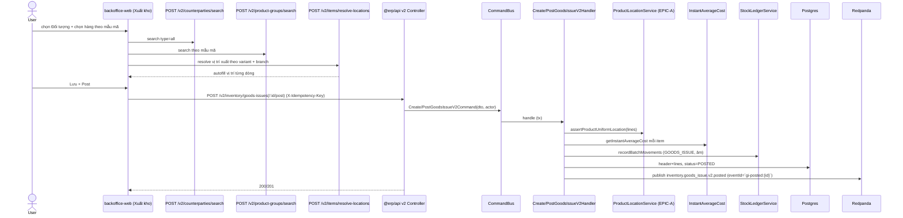
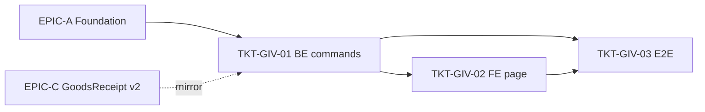

# EPIC-18062026 Xuất kho v2 (backoffice) — mirror Nhập kho: autofill theo chi nhánh, nhóm hàng, đối tượng

## Goal

Làm mới luồng **Xuất kho** trong **backoffice-web** theo CQRS (feature 9), **tương tự Nhập kho v2**. Ưu tiên Kho/Vị trí theo chi nhánh hiện tại; mỗi dòng autofill **vị trí xuất theo vị trí hàng hoá hiện tại** (query resolve của EPIC-A), không có thì theo kho mặc định. Dialog chọn hàng **theo nhóm hàng → mẫu mã**, chọn nhiều. Đối tượng **NCC & Khách hàng** tìm nâng cao. Bảng dòng hàng thêm **min-width**.

**Measurable outcome:** tạo + post phiếu xuất qua command CQRS mới (`/v2/...`), ghi stock ledger (xuất, giá vốn bình quân); vị trí từng dòng autofill theo chi nhánh; đối tượng chọn được cả NCC lẫn KH; mọi variant cùng mẫu mã xuất từ **một vị trí**; endpoint cũ `POST /inventory/goods-issues` giữ nguyên.

## Scope

- **Entities / tables:**
  - `GoodsIssueEntity` — **thêm cột** `counterparty_kind` (enum `supplier|customer`) + `counterparty_id` (uuid, nullable). Giữ `provider_id` cũ. **Migration tay** (khai báo cùng EPIC-A).
  - Line `GoodsIssueLineEntity` — không đổi cột (đã có `itemId`/`locationId`).
- **API surface (mới, CQRS):**
  - `POST /v2/inventory/goods-issues` — `CreateGoodsIssueV2Command` (DRAFT).
  - `POST /v2/inventory/goods-issues/:id/post` — `PostGoodsIssueV2Command` (ledger GOODS_ISSUE + giá vốn).
  - (Resolve vị trí, tìm nhóm hàng, tìm đối tượng dùng query EPIC-A.)
- **Events:** `inventory.goods_issue.v2.created`, `inventory.goods_issue.v2.posted` (deterministic eventId theo `goodsIssueId`).
- **FE surface (backoffice-web):** trang/dialog Xuất kho mới — mirror Nhập kho:
  - Header: picker **Đối tượng** mở `CounterpartySearchDialog` (EPIC-A).
  - Kho/Vị trí default theo chi nhánh; mỗi dòng autofill vị trí xuất qua `useResolveItemLocations`.
  - Nút "Chọn hàng" mở `ProductGroupSearchDialog` — chọn theo mẫu mã, multi-select.
  - Bảng dòng hàng: `min-width` mỗi cột.

## Success Metrics

- Đang ở chi nhánh hiện tại → Kho/Vị trí xuất default theo chi nhánh đó.
- Dòng hàng có tồn ở kho → vị trí xuất autofill theo bin đang giữ hàng; không có → kho mặc định; vẫn không → vị trí "Mặc định".
- Chọn 1 mẫu mã (multi-select) → tất cả variant được thêm, cùng một vị trí xuất.
- Đối tượng chọn được NCC hoặc KH; tìm nâng cao phân trang.
- Tạo qua `CreateGoodsIssueV2Command`, post qua `PostGoodsIssueV2Command`: ghi ledger GOODS_ISSUE (âm), unitPrice = giá vốn bình quân tại thời điểm post; idempotent khi replay.
- Hai variant cùng mẫu mã không xuất từ 2 vị trí khác nhau (command từ chối 422).

## Flows

### Tạo + post phiếu xuất kho v2

## Tickets

- [TKT-GIV-01 BE: Create/Post GoodsIssue v2 (CQRS) + cột đối tượng + events](../tickets/TKT-GIV-01-be-goods-issue-v2-commands.md)
- [TKT-GIV-02 FE: trang Xuất kho backoffice (mirror Nhập kho)](../tickets/TKT-GIV-02-fe-goods-issue-backoffice.md)
- [TKT-GIV-03 E2E + tests + DoD](../tickets/TKT-GIV-03-tests-e2e-dod.md)

## Dependencies

- Depends on: **EPIC-18062026 Inventory Foundation** + có thể tham chiếu **EPIC-C (Nhập kho v2)** để tái dùng DTO/skeleton command (mirror). Có thể làm song song C/D sau khi A xong.
- Reuses: `StockLedgerService`, `getInstantAverageCost`, `DocumentNumberingService`, `GoodsIssueEntity`/`Line` (eager relations, party expression `COALESCE(provider, targetBranch)`).

## Out of scope

- Xuất điều chuyển (`purpose = TRANSFER_OUT`) tự sinh từ EPIC-B — chỉ wiring tối thiểu.
- Lý do xuất (`IssueReasonEntity`) — giữ cơ chế hiện có.

### Ticket dependency graph

