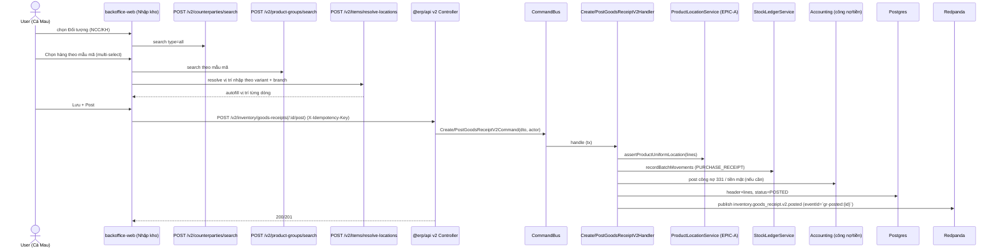
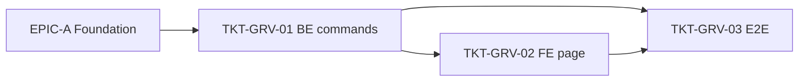

# EPIC-18062026 Nhập kho v2 (backoffice) — autofill theo chi nhánh, chọn hàng theo nhóm, đối tượng NCC & KH

## Goal

Làm mới luồng **Nhập kho** trong **backoffice-web** theo CQRS (feature 8). Ở chi nhánh hiện tại (vd Cà Mau) ưu tiên lấy **Kho / Vị trí** theo chi nhánh đó; mỗi dòng hàng đã từng có trong kho → **tự fill vị trí** (dùng query resolve của EPIC-A). Dialog chọn hàng **theo nhóm hàng → mẫu mã** (không theo từng variant), **chọn nhiều**. Đối tượng phiếu là **NCC hoặc Khách hàng** với **tìm nâng cao** (giống thu/chi tiền mặt). Bảng nhập liệu thêm **min-width** cho thoáng.

**Measurable outcome:** tạo + post phiếu nhập qua command CQRS mới (`/v2/...`), ghi stock ledger + công nợ NCC; vị trí từng dòng autofill theo chi nhánh; đối tượng chọn được cả NCC lẫn KH; mọi variant cùng mẫu mã nhập về **một vị trí**; endpoint cũ `POST /goods-receipts` giữ nguyên, không dùng ở UI mới.

## Scope

- **Entities / tables:**
  - `GoodsReceiptEntity` — **thêm cột** `counterparty_kind` (enum `supplier|customer`) + `counterparty_id` (uuid, nullable) để chứa NCC **hoặc** Khách hàng. Giữ `provider_id` cũ cho tương thích. **Migration tay** (khai báo cột ở EPIC-A; epic này dùng).
  - Line `GoodsReceiptLineEntity` — không đổi cột (đã có `itemId`/`locationId`).
- **API surface (mới, CQRS):**
  - `POST /v2/inventory/goods-receipts` — `CreateGoodsReceiptV2Command` (DRAFT).
  - `POST /v2/inventory/goods-receipts/:id/post` — `PostGoodsReceiptV2Command` (ledger + công nợ/tiền mặt).
  - (Resolve vị trí, tìm nhóm hàng, tìm đối tượng dùng query EPIC-A.)
- **Events:** `inventory.goods_receipt.v2.created`, `inventory.goods_receipt.v2.posted` (deterministic eventId theo `goodsReceiptId`).
- **FE surface (backoffice-web):** trang/dialog Nhập kho mới:
  - Header: picker **Đối tượng** mở `CounterpartySearchDialog` (NCC + KH + NV) — EPIC-A.
  - Kho/Vị trí: mặc định theo chi nhánh đang chọn; mỗi dòng autofill vị trí qua `useResolveItemLocations` (EPIC-A).
  - Nút "Chọn hàng" mở `ProductGroupSearchDialog` (EPIC-A) — chọn theo **mẫu mã, multi-select**.
  - Bảng dòng hàng: thêm `min-width` mỗi cột để không bị chật.

## Success Metrics

- Đang ở chi nhánh Cà Mau → Kho/Vị trí default lấy theo Cà Mau (`isDefaultReceiving` của chi nhánh đó).
- Dòng hàng có lịch sử trong kho → vị trí autofill đúng; không có → kho mặc định; vẫn không → vị trí "Mặc định".
- Chọn 1 mẫu mã trong dialog (multi-select) → tất cả variant của mẫu được thêm, cùng một vị trí nhập.
- Đối tượng chọn được NCC (ghi công nợ phải trả 331) hoặc Khách hàng; tìm nâng cao phân trang.
- Tạo qua `CreateGoodsReceiptV2Command`, post qua `PostGoodsReceiptV2Command`: ghi ledger PURCHASE_RECEIPT + (nếu CREDIT) công nợ; idempotent khi replay.
- Hai variant cùng mẫu mã không nhập vào 2 vị trí khác nhau (command từ chối 422).

## Flows

### Tạo + post phiếu nhập kho v2

## Tickets

- [TKT-GRV-01 BE: Create/Post GoodsReceipt v2 (CQRS) + cột đối tượng + events](../tickets/TKT-GRV-01-be-goods-receipt-v2-commands.md)
- [TKT-GRV-02 FE: trang Nhập kho backoffice (đối tượng, nhóm hàng, autofill, min-width)](../tickets/TKT-GRV-02-fe-goods-receipt-backoffice.md)
- [TKT-GRV-03 E2E + tests + DoD](../tickets/TKT-GRV-03-tests-e2e-dod.md)

## Dependencies

- Depends on: **EPIC-18062026 Inventory Foundation** (resolve-locations, counterparty dialog, product-group dialog, product-uniform service, cột `counterparty_*`).
- Reuses: `StockLedgerService`, công nợ NCC (`SupplierDebtEntity` / accounting recordMovement), `DocumentNumberingService`, `GoodsReceiptEntity`/`Line`.

## Out of scope

- Nhập từ điều chuyển (`purpose = TRANSFER_IN`) tự sinh từ EPIC-B — chỉ wiring tối thiểu, không làm UI riêng.
- Đổi cơ chế tính giá vốn (giữ snapshot cost hiện có).

### Ticket dependency graph

