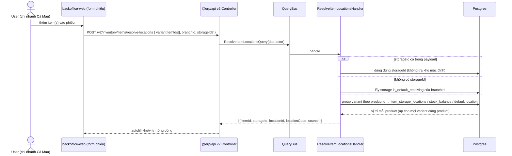
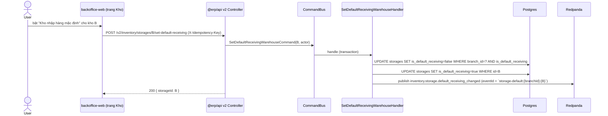
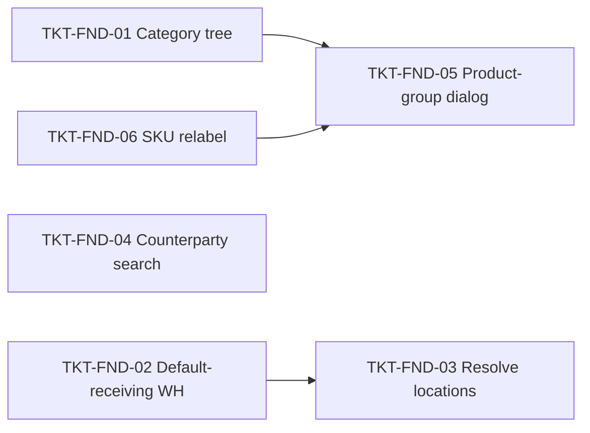

# EPIC-18062026 Inventory Foundation — phân nhóm hàng, kho mặc định, query & component dùng chung

## Goal

Nền tảng dùng chung cho ba epic nghiệp vụ (Chuyển kho v2, Nhập kho v2, Xuất kho v2). Gom mọi thay đổi schema + query/command CQRS + component FE **tái sử dụng** vào một epic để các epic sau chỉ việc lắp ráp:

1. **Nhóm hàng hoá phân cấp** — chọn `parent`, list ưu tiên cha → con (feature 1).
2. **Kho nhập hàng mặc định** — cờ `isDefaultReceiving` (1 kho/chi nhánh), showroom tự sinh không xoá được, đổi nhãn "Kho chính" → "Kho nhập hàng mặc định" (feature 2).
3. **Resolve vị trí theo list variant + chi nhánh** — query CQRS dùng chung cho cả 3 nghiệp vụ (feature 8/9/11).
4. **Tìm đối tượng (NCC + Khách hàng + Nhân viên)** — query CQRS + component dialog dùng chung (feature 8/9).
5. **Tìm hàng theo nhóm (Nhóm hàng → Mẫu mã → Variant)** — query CQRS trả cây + dialog collapse multi-select dùng chung (feature 8/9/11).
6. **Chuẩn hoá ngữ nghĩa SKU/Mẫu mã/Hàng hoá** — đổi nhãn nhất quán toàn FE (feature 15).

**Measurable outcome:** sau epic này tồn tại 3 endpoint query CQRS mới (`resolve-locations`, `counterparties/search`, `product-groups/search`), 1 endpoint command mới (`set-default-receiving`), 1 query tree nhóm hàng; và 2 component FE (`CounterpartySearchDialog`, `ProductGroupSearchDialog`) + 1 hook resolve-location mà 3 epic nghiệp vụ import thẳng, không viết lại.

## Quyết định đã chốt (Step 1)

1. **Cấp vị trí:** giữ `item_storage_locations` ở cấp variant, **enforce ở command**: mọi item cùng `productId` ghi **cùng** `locationId` (không cho 2 variant 1 mẫu nằm 2 vị trí).
2. **Kho mặc định:** thêm cột `is_default_receiving` **riêng biệt** với `is_main_storage` (showroom). 1 kho/chi nhánh; đổi default thì tự gỡ cờ kho cũ.
3. **App:** mọi UI ở **backoffice-web**.
4. **CQRS:** API mới hoàn toàn (cả command lẫn query); endpoint cũ giữ nguyên, không sửa.
5. **Tìm đối tượng:** NCC + Khách hàng + Nhân viên (query CQRS mới, không đụng `/cash-vouchers/partners` raw SQL cũ).
6. **Dialog nhóm hàng:** API trả **cây lồng nhau** (category → product → variants), phân trang theo mẫu mã.

## Scope

- **Entities / tables:**
  - `ItemCategoryEntity` (`inventory_item_categories`) — map cột `parent_group_id` đã có sẵn trong DB (migration `1782400000000-ExtendItemCategory.ts`) vào entity + CRUD config. **Không migration cột** (đã tồn tại); chỉ bổ sung FK/index nếu thiếu.
  - `StorageEntity` (`storages`) — **thêm cột** `is_default_receiving boolean default false` + partial unique index 1 default/branch. **Cần migration tay.**
  - `GoodsReceiptEntity` / `GoodsIssueEntity` — **thêm cột** `counterparty_kind` + `counterparty_id` (nullable) để chứa NCC **hoặc** Khách hàng. **Cần migration tay** (dùng ở epic C/D nhưng khai báo cột ở đây để gom schema).
  - `ItemStorageLocationEntity` (`item_storage_locations`) — không đổi cột; thêm **domain service** ghi có ràng buộc product-uniform.
- **API surface (mới, CQRS):**
  - `POST /v2/inventory/item-categories/tree` — `SearchItemCategoryTreeQuery` (cha → con).
  - `POST /v2/inventory/storages/:id/set-default-receiving` — `SetDefaultReceivingWarehouseCommand`.
  - `POST /v2/inventory/items/resolve-locations` — `ResolveItemLocationsQuery`.
  - `POST /v2/counterparties/search` — `SearchCounterpartiesQuery`.
  - `POST /v2/inventory/product-groups/search` — `SearchProductGroupsQuery`.
- **Events:** `inventory.storage.default_receiving_changed` (publish khi đổi kho mặc định). Các query thuần đọc — không phát event.
- **FE surface (backoffice-web):**
  - Component dùng chung: `components/shared/counterparty-search/CounterpartySearchDialog.tsx` + `useSearchCounterparties`.
  - Component dùng chung: `components/shared/product-group-search/ProductGroupSearchDialog.tsx` + `useSearchProductGroups`.
  - Hook dùng chung: `hooks/useResolveItemLocations`.
  - Nhóm hàng: form CRUD nhóm hàng thêm picker `parent`; trang list render cây cha → con.
  - Kho: cột/nhãn "Kho nhập hàng mặc định" (bind `isDefaultReceiving`), nút bật mặc định gọi command, chặn xoá showroom.
  - Đổi nhãn SKU/Mẫu mã/Hàng hoá nhất quán ở form + list item + dialog tìm hàng.

## Success Metrics

- Tạo nhóm hàng con chọn `parent` → list trả cha trước, con nằm trong `children[]` của đúng cha.
- Bật `isDefaultReceiving` cho kho B khi kho A đang là mặc định → A tự tắt cờ; mỗi chi nhánh luôn ≤ 1 kho mặc định (đảm bảo bằng partial unique index, không chỉ ở app).
- Xoá showroom (`isMainStorage = true`) bị chặn ở cả service (409) lẫn FE (ẩn/disable nút xoá).
- `resolve-locations` nhận `{ variantItemIds[], branchId, storageId? }`: có `storageId` → chỉ tra vị trí trong kho đó; không có → tra theo kho `isDefaultReceiving` của chi nhánh; mọi variant cùng `productId` trả **cùng** `locationId`.
- `counterparties/search?type=all` trả gộp NCC + KH + NV, lọc theo `search`, phân trang ổn định.
- `product-groups/search` trả cây category → mẫu mã → variant, phân trang theo mẫu mã, lọc theo mẫu mã.
- Migration để dữ liệu cũ hợp lệ: `is_default_receiving` mặc định false toàn bộ; `counterparty_*` null; không cột nào NOT NULL phá data cũ.

## Flows

### Resolve vị trí khi fill item (dùng chung 8/9/11)

### Đổi kho nhập hàng mặc định

## Tickets

- [TKT-FND-01 Nhóm hàng hoá phân cấp + query cây cha→con](../tickets/TKT-FND-01-category-hierarchy-tree-query.md)
- [TKT-FND-02 Kho nhập hàng mặc định + chặn xoá showroom + đổi nhãn](../tickets/TKT-FND-02-default-receiving-warehouse.md)
- [TKT-FND-03 Domain service vị trí product-uniform + ResolveItemLocations query](../tickets/TKT-FND-03-resolve-item-locations-query.md)
- [TKT-FND-04 SearchCounterparties query + dialog dùng chung](../tickets/TKT-FND-04-counterparty-search-shared.md)
- [TKT-FND-05 SearchProductGroups (cây) + dialog collapse multi-select](../tickets/TKT-FND-05-product-group-search-shared.md)
- [TKT-FND-06 Chuẩn hoá nhãn SKU / Mẫu mã / Hàng hoá](../tickets/TKT-FND-06-sku-naming-relabel.md)

## Dependencies

- Depends on: EPIC-003 (inventory/location, item, stock balance), EPIC-006 (product/variant), EPIC-010 (item_barcodes, item management), EPIC-14062026 (`resolveBranchItemLocations`, default location) — đã ship.
- Reuses: `StockBalanceService` (tra tồn theo bin), pattern `resolveBranchItemLocations` (POS) làm tham chiếu cho `ResolveItemLocationsQuery`, `FilterBuilder` (`common/filters`), `EventPublisher`, `DocumentNumberingService`. **Không** dùng lại `/cash-vouchers/partners` (raw SQL) — thay bằng query CQRS mới.

## Out of scope

- Sửa/post phiếu Nhập/Xuất/Chuyển kho (thuộc EPIC-B/C/D).
- Đổi cấp lưu vị trí sang product-level (đã chốt giữ variant-level + ràng buộc).
- Đổi component thu/chi tiền mặt hiện có sang component đối tượng mới (chỉ tạo mới để dùng cho inventory; migrate sau).

### Ticket dependency graph

