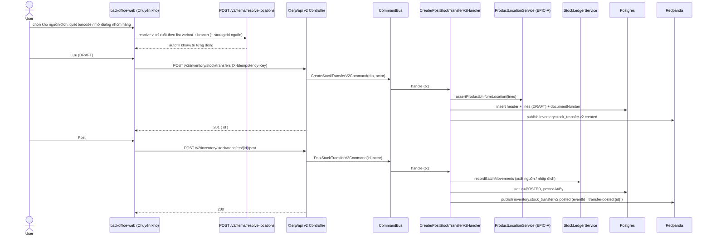
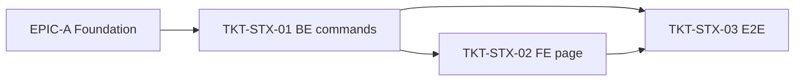

# EPIC-18062026 Chuyển kho v2 (backoffice) — chọn kho, scan barcode, autofill vị trí, tìm theo nhóm

## Goal

Làm mới luồng **Chuyển kho** trong **backoffice-web** theo CQRS (feature 11). Người dùng chọn kho nguồn/đích, **quét mã vạch** để thêm dòng nhanh; khi fill item hệ thống **autofill kho/vị trí xuất theo vị trí hàng hoá hiện tại**, nếu không có thì lấy theo **kho nhập hàng mặc định** của chi nhánh. Dialog chọn hàng là **tìm nâng cao theo nhóm hàng → mẫu mã → variant**.

**Measurable outcome:** quét 1 mã vạch → thêm đúng 1 dòng với kho/vị trí xuất đã autofill; mọi variant cùng mẫu mã luôn xuất từ **một vị trí**; tạo + post phiếu chạy qua command CQRS mới (`/v2/...`), ghi stock ledger và phát event; endpoint cũ `POST /inventory/stock/transfers` vẫn còn nhưng không dùng ở UI mới.

## Scope

- **Entities / tables:** dùng lại `StockTransferEntity` + `StockTransferLineEntity` (đã có `sourceStorageId`/`destinationStorageId`/`sourceLocationId`/`destinationLocationId`). Nếu cần thêm trường (vd `scannedBarcode` cho audit) → thêm property nullable, migration tay. **Không bắt buộc cột mới.**
- **API surface (mới, CQRS):**
  - `POST /v2/inventory/stock/transfers` — `CreateStockTransferV2Command` (tạo DRAFT).
  - `POST /v2/inventory/stock/transfers/:id/post` — `PostStockTransferV2Command` (ghi ledger 2 chiều).
  - (Tìm hàng + resolve vị trí dùng query của EPIC-A; **không** viết lại.)
- **Events:** `inventory.stock_transfer.v2.created`, `inventory.stock_transfer.v2.posted` (deterministic eventId theo `transferId` + version trạng thái).
- **FE surface (backoffice-web):** trang/dialog Chuyển kho mới:
  - Ô chọn **kho nguồn / kho đích** (label rõ ràng) + input **quét mã vạch** thêm dòng.
  - Khi thêm item: gọi `useResolveItemLocations` (EPIC-A) để autofill kho/vị trí xuất.
  - Nút "Tìm hàng" mở `ProductGroupSearchDialog` (EPIC-A) — chọn theo mẫu mã, multi-select.
  - Ràng buộc: mọi variant cùng mẫu mã hiển thị & gửi cùng vị trí xuất.

## Success Metrics

- Quét mã vạch tồn tại → 1 dòng thêm với kho/vị trí xuất autofill; quét lại cùng mã → dòng +1.
- Item có vị trí trong kho nguồn → autofill đúng vị trí đó; không có vị trí → lấy theo kho `isDefaultReceiving`; vẫn không có → vị trí "Mặc định"/"Chưa xếp" của kho.
- Tạo phiếu qua `CreateStockTransferV2Command`; post qua `PostStockTransferV2Command` ghi đúng 2 bút toán ledger (xuất nguồn, nhập đích), idempotent khi replay.
- Hai variant cùng 1 mẫu mã không thể chọn 2 vị trí xuất khác nhau (command từ chối — 422).
- Dialog tìm hàng gom đúng category → mẫu mã → variant; chọn cả mẫu = chọn hết variant.

## Flows

### Tạo + post phiếu chuyển kho v2

## Tickets

- [TKT-STX-01 BE: Create/Post StockTransfer v2 (CQRS command) + events](../tickets/TKT-STX-01-be-stock-transfer-v2-commands.md)
- [TKT-STX-02 FE: trang Chuyển kho backoffice (scan, autofill, dialog nhóm)](../tickets/TKT-STX-02-fe-stock-transfer-backoffice.md)
- [TKT-STX-03 E2E + tests + DoD](../tickets/TKT-STX-03-tests-e2e-dod.md)

## Dependencies

- Depends on: **EPIC-18062026 Inventory Foundation** (resolve-locations, product-group dialog, product-uniform service, kho mặc định). Bắt buộc land trước.
- Reuses: `StockLedgerService`, `DocumentNumberingService`, `StockTransferEntity`/`Line` (eager relations + line_value đã có từ EPIC-09062026).

## Out of scope

- Luồng 2 pha `transfer-order` (export/import qua 2 chi nhánh) — không đụng.
- Trang Chuyển kho POS (`FastStockTransferPage`) — giữ nguyên, không port.

### Ticket dependency graph

