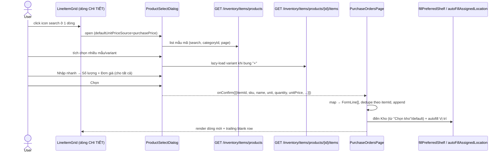
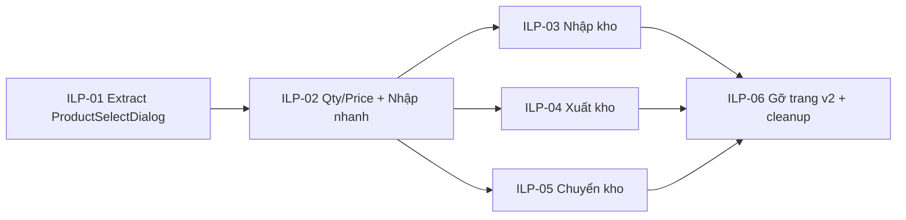

# EPIC-19062026 Dialog chọn hàng (multi-select + Nhập nhanh) trên trang Nhập/Xuất/Chuyển kho v1 — gỡ trang v2

## Goal

Đưa **dialog chọn hàng theo nhóm, multi-select** (layout theo ảnh #3/#4, có **Nhập nhanh**) vào **3 trang v1 hiện có**: Nhập kho (`PurchaseOrdersPage`), Xuất kho (`GoodsIssuePage`), Chuyển kho (`StockTransferPage`). Dialog mở từ **icon search trên từng dòng** của bảng CHI TIẾT; chọn N mẫu/hàng hoá → thêm N dòng một lần. **Nhập nhanh** đặt Số lượng + Đơn giá cho toàn bộ hàng đã chọn. **Chọn kho** điền kho nguồn cho các dòng.

Đồng thời **gỡ 3 trang v2 đã làm sai hướng** (`goods-receipt-v2`, `goods-issue-v2`, `stock-transfer-v2`) khỏi FE (routes + nav). Việc thêm dialog phải làm **trên trang v1**, không tạo trang `*-v2` song song — xem [[feedback_no_parallel_v2_ui_pages]].

**Measurable outcome:**
- Trên cả 3 trang v1, click icon search ở 1 dòng → mở `ProductSelectDialog`; chọn nhiều → thêm nhiều dòng kèm Số lượng/Đơn giá đã nhập; vẫn giữ gõ inline + nút "+" tạo nhanh.
- "Nhập nhanh" set Số lượng + Đơn giá cho tất cả hàng đã chọn trong dialog.
- "Chọn kho" điền kho cho các dòng mới (Chuyển kho: điền kho nguồn).
- 3 trang v2 + route + nav bị gỡ; `pnpm --filter @erp/backoffice-web build` xanh, không còn import treo.
- Trang **Xuất khẩu tồn kho** (inventory export) vẫn chạy đúng sau khi dialog của nó được tổng quát hoá.

## Scope

- **Chỉ FE** (`apps/backoffice-web`). **Không** thêm endpoint backend.
  - Dialog dùng lại 2 endpoint sẵn có: `GET /inventory/items/products` (mẫu mã + orphan, có `purchasePrice`/`sellingPrice`), `GET /inventory/items/products/{productId}/items` (variant, lazy-load).
- **Tổng quát hoá** `InventoryExportSelectDialog` → component dùng chung `ProductSelectDialog` (`components/shared/product-select/`), kèm hook `useProductSearch` (chuyển từ `useInventoryProductGroups`).
- **Thêm tính năng**: cột Số lượng + Đơn giá có thể sửa + "Nhập nhanh" (đặt cho tất cả hàng đã chọn).
- **Tích hợp** vào 3 trang v1 (mỗi trang map `selected → FormLine[]` riêng vì shape khác nhau).
- **Gỡ v2 UI**: 3 trang `*-v2`, route trong `App.tsx`, nav trong `navConfig.ts`, và các component FE trở thành mồ côi sau khi gỡ (grep xác nhận).
- **Giữ backend v2**: các endpoint `/v2/*/search` vẫn được trang list v1 dùng (vd `PurchaseOrdersPage` gọi `POST /v2/goods-receipts/search`).

## Ghi chú dữ liệu (đã xác minh)

- Cột **"Số lượng" / "Đơn giá"** trong dialog #3/#4 là **ô nhập của dòng chứng từ** (số lượng cần nhập/xuất + đơn giá), KHÔNG phải tồn kho. → không cần backend bổ sung tồn kho.
- `GET /inventory/items/products(/{id}/items)` trả `purchasePrice`/`sellingPrice` → dùng prefill mặc định Đơn giá. **Không** trả tồn kho (`quantityOnHand`); **hiển thị tồn kho trong dialog = out of scope**.

## Success Metrics

- 3 trang v1: icon search/dòng → dialog multi-select → thêm đúng số dòng, đúng Số lượng/Đơn giá.
- "Nhập nhanh" áp Số lượng/Đơn giá cho mọi hàng đã chọn (cả variant đang chọn lẫn mẫu mã chọn-tất-cả).
- Dedupe theo `itemId` (chọn lại hàng đã có không tạo dòng trùng).
- "Chọn kho" điền kho + autofill vị trí dòng mới như cơ chế hiện hành (`fillPreferredShelf`/`autoFillAssignedLocation`).
- Gỡ v2: không còn `/inventory/*-v2` trong nav/route; build FE xanh.
- Trang inventory export vẫn chọn + xuất file đúng.

## Flows

### Chọn hàng theo nhóm + Nhập nhanh → thêm dòng (Nhập kho v1)

## Tickets

- [TKT-ILP-01 Trích & tổng quát hoá ProductSelectDialog (từ InventoryExportSelectDialog)](../tickets/TKT-ILP-01-extract-product-select-dialog.md)
- [TKT-ILP-02 Thêm cột Số lượng/Đơn giá + "Nhập nhanh"](../tickets/TKT-ILP-02-quantity-price-quick-entry.md)
- [TKT-ILP-03 Tích hợp vào Nhập kho (PurchaseOrdersPage)](../tickets/TKT-ILP-03-integrate-goods-receipt.md)
- [TKT-ILP-04 Tích hợp vào Xuất kho (GoodsIssuePage)](../tickets/TKT-ILP-04-integrate-goods-issue.md)
- [TKT-ILP-05 Tích hợp vào Chuyển kho (StockTransferPage)](../tickets/TKT-ILP-05-integrate-stock-transfer.md)
- [TKT-ILP-06 Gỡ 3 trang v2 + cleanup component mồ côi](../tickets/TKT-ILP-06-remove-v2-pages.md)

## Dependencies

- **Depends on:** EPIC-18062026 (Inventory Foundation) đã có sẵn `InventoryExportSelectDialog`, `LineItemGrid`, 3 trang v1, 3 trang v2.
- **Supersedes (FE):** phần FE của EPIC-18062026 Nhập/Xuất/Chuyển kho **v2** (3 trang `*-v2` bị gỡ; backend v2 giữ nguyên).
- **Reuses:** `InventoryExportSelectDialog` + `useInventoryProductGroups`/`useInventoryProductItems`, `LineItemGrid` (@erp/ui), `ChooseWarehouseDialog`, `fillPreferredShelf`/`autoFillAssignedLocation`, `inventory-line-normalization.ts`, `getInstantAverageCost`.

### Ticket dependency graph

## Out of scope

- Hiển thị tồn kho (`quantityOnHand`) trong dialog (endpoint không trả; cần BE).
- Sửa/đổi backend v2 (command/DTO/controller) — giữ nguyên.
- "Quét mã vạch" (vẫn placeholder), "Nhập khẩu" Excel (đã có), tạo nhanh NCC/hàng/vị trí (đã có).
- Đổi luồng lưu/post của 3 trang v1 (vẫn dùng endpoint hiện tại).
