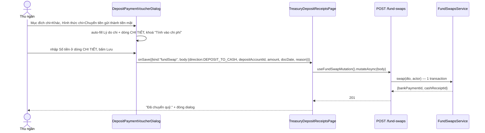
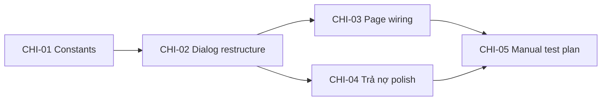

# EPIC-19072026 Phiếu chi tiền gửi — Hợp nhất theo Mục đích chi (MISA parity)

## Goal

"Thêm mới Phiếu chi" tiền gửi hiện chỉ có một dropdown "Mục đích chi" phẳng — chọn `Chuyển thành tiền mặt` hay `Chuyển tiền đến chi nhánh khác (GĐ4, đang disable)` chỉ gắn nhãn cosmetic lên một phiếu chi thường, **không thực sự gọi** `FundSwapsService`/`DepositTransferService`. Hai luồng đó tồn tại và chạy đúng ở hai nơi tách biệt (nút "Chuyển quỹ" trên toolbar, trang `/treasury/deposit-transfers`), buộc thu ngân phải biết đi đúng chỗ cho từng việc.

Mục tiêu: một màn hình "Thêm mới Phiếu chi" duy nhất, dropdown "Mục đích chi" (Khác / Trả nợ) + dropdown con "Hình thức chi" (khi Khác) quyết định UI và luồng lưu — khớp 5 ảnh tham chiếu MISA.

**Kết quả đo được:** từ "Thêm mới Phiếu chi", chọn Khác → Chuyển tiền gửi thành tiền mặt → Lưu thực sự tạo một `bank_payment` + `cash_receipt` qua `FundSwapsService` (không phải phiếu chi trơn); chọn Khác → Chuyển tiền gửi đến cửa hàng khác → Lưu thực sự tạo một `deposit_transfer` (trạng thái Đang chuyển) qua `DepositTransferService`; chọn Trả nợ vẫn hoạt động như hiện tại (đã tự kiểm chứng bằng request thật trong phiên làm việc trước).

## Scope

- **Không entity mới, không migration.** `BankPaymentPurpose` (BE + FE) đã đủ giá trị (`CASH_TRANSFER`, `INTER_BRANCH_OUT`, `SUPPLIER_PAYMENT`, `OTHER`); ba saga đích (`fund-swaps`, `deposit-transfer`, `supplier-deposit-payment`) đã hoàn chỉnh và đã verify chạy đúng.
- **API surface:** không endpoint mới. Toàn bộ là orchestration ở tầng gọi API tại FE.
- **FE surface:** `backoffice-web` — `DepositPaymentVoucherDialog.tsx` (viết lại phần chọn mục đích + nhúng 2 sub-form), `TreasuryDepositReceiptsPage.tsx` (điều hướng kết quả lưu tới đúng mutation), constants dùng chung trong `_shared/voucher-dialog.constants.ts`.
- **Ngoài phạm vi (đã chốt với user):**
  - Không đụng `PaymentVoucherDialog` (Phiếu chi tiền mặt) — hai sub-option `CASH_TO_DEPOSIT`/`BRANCH_TRANSFER` bên đó tiếp tục bị ẩn/dead như hiện trạng.
  - Không thêm khả năng tự-động-confirm cho chuyển liên chi nhánh — giữ nguyên thiết kế "2 bước không atomic" (tạo ở chi nhánh nguồn, xác nhận thủ công ở chi nhánh đích qua trang `/treasury/deposit-transfers` đã có).
  - Không xoá nút toolbar "Chuyển quỹ" (`FundSwapDialog` độc lập) — nó là đường duy nhất cho chiều `CASH_TO_DEPOSIT` (nạp tiền mặt vào quỹ tiền gửi), chiều mà epic này không phục vụ (epic chỉ nằm trong ngữ cảnh "Phiếu CHI tiền gửi" — tiền đi ra khỏi quỹ).
  - Không thêm field "Phí rút tiền" vào sub-mode nhúng (ảnh MISA không có field này ở đây; `FundSwapDialog` gốc có nhưng không nằm trong yêu cầu).

## Success Metrics

- Chọn "Chuyển tiền gửi thành tiền mặt", nhập số tiền ở dòng CHI TIẾT, Lưu → `deposit_movements` có 1 dòng WITHDRAWAL trên quỹ đã chọn **và** `cash_movements` có 1 dòng DEPOSIT tương ứng, cùng transaction (khớp `FundSwapsService.swap`).
- Chọn "Chuyển tiền gửi đến cửa hàng khác", chọn chi nhánh + tài khoản đích, Lưu → `deposit_transfers` có 1 row trạng thái `DANG_CHUYEN`, `bank_payments` có 1 dòng `INTER_BRANCH_OUT` ở chi nhánh nguồn — khớp `DepositTransferService.create`.
- Chọn "Trả nợ" vẫn hoạt động y hệt trước epic (không hồi quy) — đã có bằng chứng E2E thủ công (xem Dependencies).
- Không tài khoản/API endpoint mới nào được thêm; `pnpm build` sạch.

## Flows

### Chuyển tiền gửi thành tiền mặt (nhúng trong Phiếu chi)



### Chuyển tiền gửi đến cửa hàng khác (nhúng trong Phiếu chi)

```mermaid
sequenceDiagram
  actor U as Thu ngân
  participant D as DepositPaymentVoucherDialog
  participant P as TreasuryDepositReceiptsPage
  participant API as POST /deposit-transfers
  participant SVC as DepositTransferService

  U->>D: Mục đích chi=Khác, Hình thức chi=Chuyển tiền gửi đến cửa hàng khác
  D->>D: hiện "Cửa hàng nhận *" + "Tài khoản nhận"; auto-fill Lý do chi + dòng CHI TIẾT
  U->>D: chọn chi nhánh đích + tài khoản đích, nhập Số tiền, bấm Lưu
  D->>P: onSave({kind:"depositTransfer", body:{toBranchId, toAccountId, amount, note}})
  P->>API: useCreateDepositTransfer().mutateAsync(body)
  API->>SVC: create(dto, actor) — leg A, trạng thái DANG_CHUYEN
  SVC-->>API: DepositTransferEntity
  API-->>P: 201
  P-->>U: "Đã khởi tạo chuyển tiền — trạng thái Đang chuyển." + đóng dialog
  Note over U: Xác nhận nhận vẫn là bước riêng ở chi nhánh đích (trang /treasury/deposit-transfers, không đổi)
```

## Tickets

- [TKT-CHI-01 Constants — Mục đích chi / Hình thức chi (tiền gửi)](../tickets/TKT-CHI-01-purpose-constants.md)
- [TKT-CHI-02 DepositPaymentVoucherDialog — UI 2 cấp + nhúng 2 sub-mode](../tickets/TKT-CHI-02-dialog-restructure.md)
- [TKT-CHI-03 TreasuryDepositReceiptsPage — điều hướng kết quả lưu](../tickets/TKT-CHI-03-page-wiring.md)
- [TKT-CHI-04 Trả nợ — polish khớp ảnh MISA (Nhà cung cấp / khoá Nhân viên chi)](../tickets/TKT-CHI-04-debt-mode-polish.md)
- [TKT-CHI-05 Test plan thủ công](../tickets/TKT-CHI-05-manual-test-plan.md)

## Dependencies

- **Depends on:** `fund-swaps`, `deposit-transfer`, `supplier-deposit-payment` modules (đã ship, không đổi). Bug FK trong `SupplierDepositPaymentSagaService.recordInstalment` đã sửa và verify bằng request thật trong phiên làm việc trước epic này (`cashPaymentId` không còn ghi nhầm `bankPaymentId`).
- **Reuses:** `useFundSwapMutation` (`hooks/treasury/use-fund-swap.ts`), `useCreateDepositTransfer` (`hooks/treasury/use-deposit-transfers.ts`), `useBranches` (`hooks/iam/useBranches.ts`), `useDepositDashboard` (`hooks/treasury/use-deposit-dashboard.ts`), `DepositAccountSelect` (`_shared/DepositAccountSelect.tsx`), `DebtRepaymentPickDialog` (đã dùng chung với Phiếu chi tiền mặt, không đổi).

### Ticket dependency graph



Ghi chú: CHI-02 và CHI-03 phải đi cùng nhau khi merge — CHI-02 một mình phát ra 2 loại kết quả lưu mới (`fundSwap`/`depositTransfer`) mà chưa có nơi xử lý sẽ vô tác dụng (Lưu không làm gì). Không release CHI-02 mà thiếu CHI-03.
