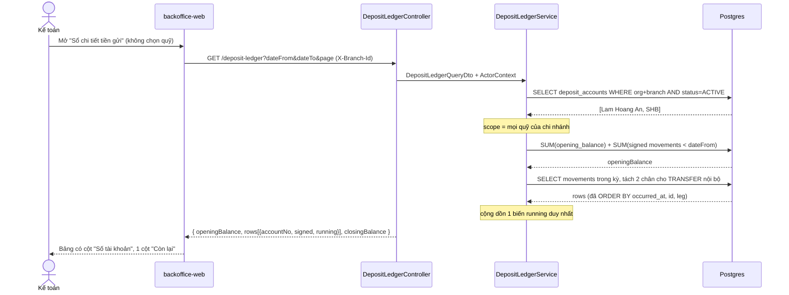
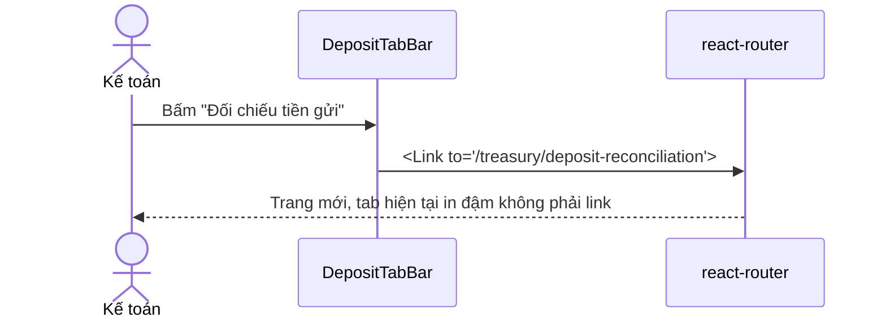
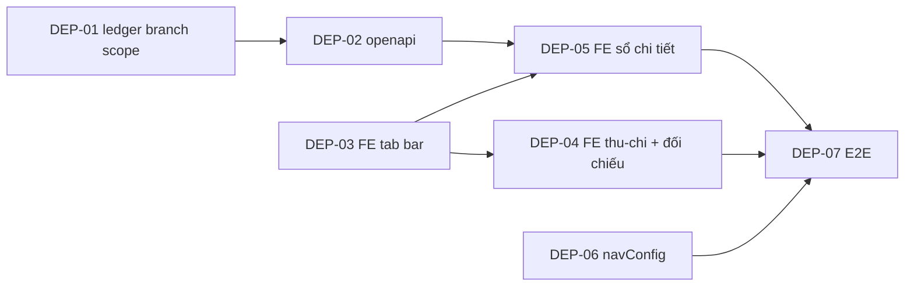

# EPIC-19072026 Deposit Screens — Branch Scope & MISA Parity

## Goal

Ba màn hình Tiền gửi trong backoffice hiện đều **bắt buộc chọn một quỹ** trước khi ra dữ liệu, nên kế toán chỉ xem được một tài khoản tại một thời điểm và phải đổi dropdown liên tục để đối soát cả chi nhánh. Mục tiêu: mặc định hiển thị **toàn bộ giao dịch tiền gửi của chi nhánh đang chọn**, đưa "Số tài khoản" thành cột trong bảng, và thêm thanh điều hướng phụ để nhảy qua lại giữa 3 màn — bám theo chuẩn MISA.

**Kết quả đo được:** mở bất kỳ màn nào trong 3 màn, không thao tác thêm, thấy ngay giao dịch của **tất cả** quỹ thuộc chi nhánh; số dư cuối kỳ của Sổ chi tiết (chế độ Tất cả) khớp đúng tổng `deposit_accounts.balance` của các quỹ trong chi nhánh.

## Scope

- **Entities:** không có bảng mới, **không cần migration**. `deposit_movements`, `bank_receipts`, `bank_payments`, `deposit_recon_batch` đều đã có `organization_id` + `branch_id` NOT NULL và đã đánh index (`idx_deposit_movements_org_branch`, `idx_deposit_recon_batch_scope`).
- **API surface:** chỉ sửa **một** endpoint — `GET /deposit-ledger` (+ `/export`). `depositAccountId` chuyển từ bắt buộc sang tuỳ chọn, và `DepositLedgerService` phải tính số dư luỹ kế theo phạm vi nhiều quỹ. Ba endpoint còn lại (`/deposit-recon`, `/bank-receipts`, `/bank-payments`) **đã** để `@IsOptional()` nên không đụng backend.
- **Events:** không phát/tiêu thụ event nào. Thuần đọc.
- **FE surface:** `backoffice-web`, 3 route `/treasury/deposit/receipts-expenses`, `/treasury/deposit-reconciliation`, `/treasury/deposit/ledger`, cộng `navConfig.ts`.

## Quyết định thiết kế (đã chốt với product)

1. **Số dư luỹ kế ở chế độ Tất cả = gộp chung cả chi nhánh.** Coi chi nhánh là một hũ: `Số dư đầu kỳ` = tổng `opening_balance` của mọi quỹ trong phạm vi; một cột `Còn lại` duy nhất, liền mạch theo thời gian. Chuyển quỹ nội bộ giữa hai quỹ cùng chi nhánh phát sinh **hai dòng** (chi ở quỹ nguồn, thu ở quỹ đích) nên tự triệt tiêu — đúng bản chất nghiệp vụ.
2. **Dropdown "Tài khoản tiền gửi" được giữ lại**, thêm mục `Tất cả` và đặt làm mặc định. Không mất thao tác lọc theo một quỹ.
3. **Nhóm TIỀN GỬI trong sidebar rút còn đúng 3 mục vận hành.** Sáu mục còn lại (Khoá sổ, Tài khoản tiền gửi, Chính sách thanh toán, Chuyển liên chi nhánh, Tiền đang chuyển, Số dư toàn hệ thống) **chuyển sang nhóm khác**, route giữ nguyên — không xoá tính năng.

## Success Metrics

- Mở cả 3 màn với chi nhánh Hồ Chí Minh (2 quỹ: Lam Hoang An 199118899, SHB 123123123): dữ liệu hiện ngay, không cần chọn quỹ.
- Sổ chi tiết chế độ `Tất cả`: `Số dư cuối kỳ` == `SUM(deposit_accounts.balance)` của các quỹ ACTIVE trong chi nhánh.
- Chế độ chọn **một** quỹ cho kết quả **y hệt** hành vi hiện tại (không hồi quy BR-LEDG-03).
- Một chuyển quỹ nội bộ hiện đủ 2 dòng và không làm đổi `Số dư cuối kỳ`.
- Phân trang ở chế độ Tất cả: `Còn lại` ở dòng đầu trang N+1 nối tiếp đúng dòng cuối trang N.

## Flows

### Luồng đọc sổ chi tiết ở chế độ Tất cả

### Luồng chuyển màn bằng sub-nav

## Tickets

- [TKT-DEP-01 Deposit ledger — bỏ ràng buộc một quỹ, số dư gộp chi nhánh](../tickets/TKT-DEP-01-deposit-ledger-branch-scope.md)
- [TKT-DEP-02 OpenAPI regen + snapshot](../tickets/TKT-DEP-02-openapi-snapshot.md)
- [TKT-DEP-03 FE — DepositTabBar sub-nav cho 3 màn](../tickets/TKT-DEP-03-fe-deposit-tabbar.md)
- [TKT-DEP-04 FE — Thu-chi & Đối chiếu bỏ gate chọn quỹ](../tickets/TKT-DEP-04-fe-receipts-recon-all-accounts.md)
- [TKT-DEP-05 FE — Sổ chi tiết chế độ Tất cả](../tickets/TKT-DEP-05-fe-ledger-all-accounts.md)
- [TKT-DEP-06 navConfig — nhóm TIỀN GỬI còn 3 mục](../tickets/TKT-DEP-06-navconfig-regroup.md)
- [TKT-DEP-07 E2E + test plan](../tickets/TKT-DEP-07-e2e-test-plan.md)

## Dependencies

- **Depends on:** EPIC-15072026 Deposit Fund (GĐ1–GĐ4) — toàn bộ schema, service và 3 màn hình đã tồn tại; epic này chỉ chuẩn hoá phạm vi truy vấn và điều hướng.
- **Reuses:**
  - `PageTabBar` (`packages/ui/src/components/page-tab-bar.tsx`) + prop `tabs` của `DocumentListShell` — **không viết component mới**, nhân bản mẫu `components/document/treasuryTabs.tsx` đang dùng cho Quỹ tiền mặt.
  - `depositAccountId` đã `@IsOptional()` ở `list-recon.dto.ts`, `query-bank-receipt.dto.ts`, `query-bank-payment.dto.ts` — không sửa backend cho 2 màn đó.
  - Permission cũ: `accounting.deposit_ledger.read`, `accounting.deposit_recon.read`, `accounting.bank_receipt.read`, `accounting.bank_payment.read` — **không seed permission mới**.
  - `useDepositAccounts` (`hooks/treasury/use-deposit-accounts.ts`) cho dropdown.

### Ticket dependency graph

Ghi chú thứ tự: **DEP-03, DEP-04, DEP-06 không phụ thuộc backend** nên chạy song song được với DEP-01/02 ngay từ đầu.
