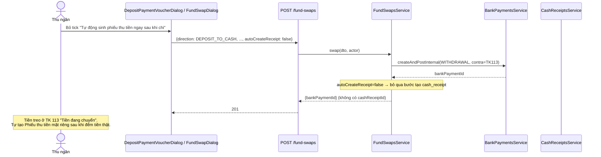
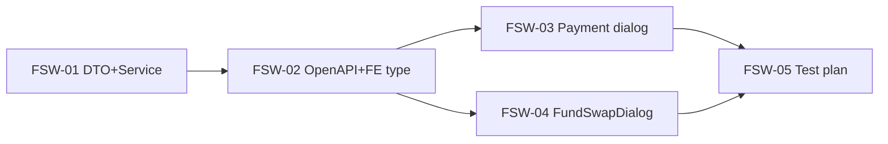

# EPIC-19072026 Chuyển quỹ — cho phép bỏ tự động sinh phiếu thu tiền mặt

## Goal

`FundSwapsService.swap()` chiều `DEPOSIT_TO_CASH` (rút tiền gửi nộp vào quỹ tiền mặt) hiện **luôn** tạo cả 2 chân trong 1 transaction: rút quỹ tiền gửi + tự động sinh phiếu thu tiền mặt tương ứng. Checkbox "Tự động sinh phiếu thu tiền ngay sau khi chi" trong UI hiện chỉ là trang trí (luôn tick, disabled — quyết định tạm thời từ epic EPIC-19072026 trước, lúc đó tưởng BE không có cách nào khác).

Mục tiêu: cho phép **bỏ tick thật** — khi bỏ, chỉ rút quỹ tiền gửi (tiền treo ở TK 113 "Tiền đang chuyển", đúng bản chất kế toán của tài khoản này), **không** tự sinh phiếu thu. Người dùng tự tạo Phiếu thu tiền mặt riêng sau, khi đã đếm tiền thật (khớp cách MISA làm — không có màn "xác nhận" riêng, không entity/trạng thái mới).

**Kết quả đo được:** bỏ tick "Chuyển tiền gửi thành tiền mặt", Lưu → chỉ có `bank_payments` (purpose `CASH_TRANSFER`) được tạo, quỹ tiền gửi giảm đúng số tiền, quỹ tiền mặt **không đổi**, không có `cash_receipts` nào sinh ra. Giữ tick (mặc định) → hành vi y hệt hiện tại, không hồi quy.

## Scope

- **Không entity/migration mới.** Chỉ thêm 1 field optional vào `CreateFundSwapDto` (`autoCreateReceipt?: boolean`, mặc định `true` khi bỏ trống — giữ tương thích ngược 100% với mọi caller hiện có, kể cả `FundSwapDialog` độc lập nếu chưa kịp cập nhật).
- **Chỉ chiều `DEPOSIT_TO_CASH`.** Chiều `CASH_TO_DEPOSIT` (nạp tiền mặt vào quỹ gửi, qua nút "Chuyển quỹ" độc lập) giữ nguyên luôn-atomic — không ai yêu cầu đổi, và không có UI nào hiển thị checkbox này cho chiều đó.
- **Không màn "xác nhận" mới, không entity trạng thái mới** (khác thiết kế ban đầu tôi định theo mẫu `DepositTransferEntity` — đã chốt lại với user: làm đơn giản theo đúng MISA, không cần bước xác nhận riêng).
- **FE surface:** cả 2 điểm vào — `DepositPaymentVoucherDialog.tsx` (sub-mode "Chuyển tiền gửi thành tiền mặt", đã có UI nhúng sẵn) **và** `FundSwapDialog.tsx` (nút toolbar "Chuyển quỹ" độc lập) — cả 2 cùng gọi `POST /fund-swaps`, phải nhất quán.

## Success Metrics

- Bỏ tick ở `DepositPaymentVoucherDialog`: `bank_payments` có 1 dòng, `cash_receipts` không có dòng mới, quỹ tiền gửi giảm đúng, quỹ tiền mặt không đổi.
- Bỏ tick ở `FundSwapDialog` (nút "Chuyển quỹ" độc lập): kết quả y hệt trên.
- Giữ tick (2 nơi): hành vi y hệt trước epic — `bank_payments` + `cash_receipts` cùng sinh ra, cả 2 quỹ cập nhật đúng.
- Gọi `POST /fund-swaps` với `direction=CASH_TO_DEPOSIT` kèm `autoCreateReceipt=false` → 400 rõ ràng (field này không áp dụng cho chiều đó), không âm thầm bỏ qua.
- Test cũ của `fund-swaps.service.spec.ts` không hồi quy.

## Flows

## Tickets

- [TKT-FSW-01 CreateFundSwapDto + FundSwapsService — autoCreateReceipt optional](../tickets/TKT-FSW-01-service-dto.md)
- [TKT-FSW-02 OpenAPI regen + FE type](../tickets/TKT-FSW-02-openapi-fe-type.md)
- [TKT-FSW-03 DepositPaymentVoucherDialog — checkbox thật](../tickets/TKT-FSW-03-payment-dialog-checkbox.md)
- [TKT-FSW-04 FundSwapDialog — checkbox thật](../tickets/TKT-FSW-04-fund-swap-dialog-checkbox.md)
- [TKT-FSW-05 Test plan](../tickets/TKT-FSW-05-test-plan.md)

## Dependencies

- Depends on: `fund-swaps` module (đã ship), EPIC-19072026 trước (Phiếu chi hợp nhất mục đích — đã tạo sẵn checkbox trang trí cần thay).
- Reuses: `FundSwapResult.cashReceiptId` (đã optional sẵn trong type — không cần đổi), permission `accounting.fund_swap.create` (không seed mới).

### Ticket dependency graph

