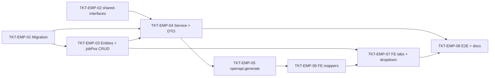

# EPIC-20052026 Quản lý Nhân viên & Hồ sơ nhân sự (Employee HR Profile)

## Summary

Màn hình **"Thêm mới Nhân viên"** (MISA-style, 5 tab) đã dựng **đầy đủ trên frontend** tại `apps/backoffice-web/src/pages/employees/` — type `EmployeeFormDraft` thu thập toàn bộ dữ liệu 5 tab:

1. **Thông tin cơ bản** — mã NV, email, ĐT di động, tên, CMND/nơi cấp/ngày cấp, ngày sinh, giới tính, tình trạng hôn nhân, ảnh, trạng thái làm việc, cho phép đăng nhập.
2. **Vai trò** — quản trị hệ thống / quản lý chuỗi + chọn nhiều vai trò.
3. **Thông tin liên hệ** — hộ khẩu thường trú, chỗ ở hiện tại, liên hệ khẩn cấp.
4. **Thông tin hồ sơ** — vị trí công việc, ngày thử việc/chính thức, tiền lương, tiền đặt cọc, hồ sơ gốc.
5. **Thời gian truy cập** — truy cập tự do / theo khung giờ (7 ngày trong tuần).

**Vấn đề:** Backend `UserEntity` (`apps/api/src/modules/auth/user.entity.ts`) chỉ là entity auth tối giản (email, passwordHash, firstName, lastName, isActive, lastLoginAt). FE hiện chỉ gửi/nhận **email + tên + password + roleIds + branchIds** qua `/admin/users`. Ba tab Liên hệ / Hồ sơ / Thời gian truy cập đang bị **disable (HR-readonly)** kèm banner *"Dữ liệu HR sẽ được đồng bộ trong phiên bản sau"* (`HrReadonlyBanner.tsx`) vì **chưa có chỗ lưu ở DB**. Các field mã NV, ĐT di động, CMND, giới tính, ngày sinh, tình trạng hôn nhân, employmentStatus thật... cũng **bị mất** khi lưu. `job_positions` (dropdown "Vị trí công việc") chưa tồn tại — mảng `JOB_POSITIONS` rỗng.

**Mục tiêu:** Mở rộng **database + API backend** để lưu/đọc toàn bộ dữ liệu HR mà FE đã thu thập, rồi **gỡ readonly + wire FE** cho 5 tab hoạt động end-to-end. Giữ `users` thuần auth, gắn dữ liệu HR vào bảng `employee_profiles` 1:1.

**Out of scope:**
- Danh mục Vai trò kiểu MISA (seed nhiều role bán hàng/quản lý + map permission) — giữ role management generic hiện có (4 role seed sẵn).
- Dịch vụ upload ảnh thật (multer/S3) — Phase này chỉ lưu `photo_url`.
- Autocomplete tỉnh/quận/phường — giữ text input như FE hiện tại.
- Multi-currency cho lương.

## Dependencies (epic-level)

- [EPIC-001 Foundation and Monorepo](./EPIC-001-foundation-and-monorepo.md) — TKT-006 (Auth & RBAC core: `users`, `roles`, `user_roles`, `user_branch_assignments`).
- [TKT-024 Generic CRUD Platform](../tickets/TKT-024-generic-crud-platform.md) — đăng ký `CrudEntityConfig` cho `job_positions` (list view + page tự động).

## Architecture decisions

### `employee_profiles` 1:1 (không nhồi cột vào `users`)

Giữ `users` thuần auth-identity. Toàn bộ field HR nằm ở bảng `employee_profiles` riêng (extends `BaseEntity` → có `organization_id`, `branch_id`, `created_by`, timestamps), FK `user_id` **unique** 1:1 với `users`. Tách concern auth vs HR, tránh phình bảng `users` (vốn không extends BaseEntity) ~25 cột.

### Sub-data chuẩn hóa (không jsonb)

Địa chỉ, liên hệ khẩn cấp, lịch truy cập tách thành **bảng con chuẩn hóa**:
- `employee_addresses` (type PERMANENT/CURRENT, unique `(employee_profile_id, type)`).
- `employee_emergency_contacts` (1:1, unique `employee_profile_id`).
- `employee_access_schedules` (1 dòng/thứ, unique `(employee_profile_id, weekday)`).

### `allowSoftwareAccess` vs `employment_status`

`allowSoftwareAccess` (cho phép đăng nhập phần mềm) → vẫn map vào `users.isActive` đã có (điều khiển login). `employment_status` (`OFFICIAL`/`PROBATION`/`RESIGNED`) là field HR riêng trên profile. Quy ước FE: `RESIGNED` ⇒ gửi `isActive=false`; `OFFICIAL`/`PROBATION` ⇒ `isActive=true`.

### Ảnh nhân viên = `photo_url` string

Chưa có hạ tầng upload file. Lưu `photo_url varchar(500)`; FE gửi URL/data-url. Dịch vụ upload thật để epic sau.

### Mở rộng `/admin/users`, không tạo resource mới

FE đã save 1-lần qua `POST/PATCH /admin/users`. Mở rộng `CreateUserDto`/`UpdateUserDto` thêm nested `profile` + mở rộng `UserDetail` embed `profile`. Tái dùng `UsersController`/`UsersService` (`apps/api/src/modules/rbac/`), persist trong cùng `dataSource.transaction` đã có.

### Idempotency & i18n

- Create/update đã nằm dưới idempotency interceptor (`X-Idempotency-Key`) hiện hữu → thừa hưởng; mọi thao tác trong 1 transaction.
- Backend source English-only (entity/DTO/enum token/comment/error). Enum value = token tiếng Anh (`OFFICIAL`, `SINGLE`, `MONDAY`...). UI tiếng Việt, số/ngày format `vi-VN`.
- Detail trả `jobPosition: {id,name}` **inline** trong từng record (không trả root `{[id]:X}` map).

## Tickets trong epic

| Ticket | Mô tả ngắn |
|---|---|
| TKT-EMP-01 | Migration: 5 bảng (`job_positions`, `employee_profiles`, `employee_addresses`, `employee_emergency_contacts`, `employee_access_schedules`) + enums (gender / marital_status / employment_status / access_mode / weekday / address_type) + index/unique. Up/down sạch. |
| TKT-EMP-02 | shared-interfaces: enums HR + `EmployeeProfilePayload`/`EmployeeProfileView`; mở rộng `CreateUserRequest`/`UpdateUserRequest`/`UserDetail`. |
| TKT-EMP-03 | Entities (`EmployeeProfileEntity` + 3 child + `JobPositionEntity`) + module đăng ký `EntityRegistryService` (entityKey `job-positions`, ScopingPolicy.ORGANIZATION, deletionPolicy SOFT) + permissions seed (`hr.job_position.*`) map vào role hiện có. |
| TKT-EMP-04 | DTO `EmployeeProfileDto` (+ nested addresses/emergency/access) + mở rộng `UsersService.create/update/findById` (transaction, validate code unique + jobPosition thuộc org, inline jobPosition). Unit test. |
| TKT-EMP-05 | Chạy API + `pnpm openapi:generate`; commit `openapi.snapshot.json` + generated `schema.ts`. |
| TKT-EMP-06 | FE wiring: `lib/iam/user-form.ts` + `employee.mappers.ts` (map xuôi/ngược profile); enable field "Mã nhân viên" + "ĐT di động". |
| TKT-EMP-07 | FE: gỡ readonly 3 tab HR (`EmployeeFormModal`, bỏ `HrReadonlyBanner`); dropdown "Vị trí công việc" qua `useCrudRecords('job-positions')`; `EmployeeDetailPanel` hiển thị HR data. |
| TKT-EMP-08 | E2E (`apps/api/test/e2e/`): tạo NV full profile → đọc lại khớp; update profile; resigned ⇒ isActive=false. + cập nhật `docs/`. |

## Ticket dependency graph



## Schema chi tiết

Tất cả bảng extends `BaseEntity` (`apps/api/src/database/entities/base.entity.ts`): `id`, `organization_id`, `branch_id?`, `created_at`, `updated_at`, `created_by`. Enum = native PG enum (pattern `customer.entity.ts` / `discount-code.entity.ts`). Money = `numeric(18,2)`; ngày nghiệp vụ = `date`; giờ = `time`.

### `employee_profiles` (1:1 với `users`)

| Column | Type | Notes |
|---|---|---|
| `id`, scoping+audit | BaseEntity | |
| `user_id` | uuid NOT NULL **UNIQUE** FK → `users(id)` | 1:1 |
| `code` | varchar(50) NOT NULL | "Mã nhân viên" (NV000002); unique `(organization_id, code)` |
| `mobile` | varchar(30) nullable | "ĐT di động" |
| `home_phone` | varchar(30) nullable | "ĐT bàn" |
| `id_card_number` | varchar(20) nullable | "Số CMND" |
| `id_card_issue_place` | varchar(255) nullable | "Nơi cấp CMND" |
| `id_card_issue_date` | date nullable | "Ngày cấp" |
| `birth_date` | date nullable | "Ngày sinh" |
| `gender` | enum(`MALE`,`FEMALE`) nullable | "Giới tính" |
| `marital_status` | enum(`SINGLE`,`MARRIED`) nullable | "Tình trạng hôn nhân" |
| `employment_status` | enum(`OFFICIAL`,`PROBATION`,`RESIGNED`) NOT NULL default `OFFICIAL` | "Trạng thái làm việc" |
| `photo_url` | varchar(500) nullable | "Ảnh nhân viên" |
| `job_position_id` | uuid nullable FK → `job_positions(id)` | "Vị trí công việc" |
| `probation_date` | date nullable | "Ngày thử việc" |
| `official_date` | date nullable | "Ngày chính thức" |
| `salary` | numeric(18,2) NOT NULL default 0 | "Tiền lương" |
| `deposit` | numeric(18,2) NOT NULL default 0 | "Tiền đặt cọc" |
| `original_documents_note` | varchar(1000) nullable | "Danh sách hồ sơ gốc" |
| `access_mode` | enum(`FREE`,`SCHEDULED`) NOT NULL default `FREE` | "Quyền truy cập" |

Index: unique `(organization_id, code)`, unique `(user_id)`, `(organization_id, job_position_id)`.

### `employee_addresses`

| Column | Type | Notes |
|---|---|---|
| `id`, scoping+audit | BaseEntity | |
| `employee_profile_id` | uuid NOT NULL FK CASCADE → `employee_profiles(id)` | |
| `type` | enum(`PERMANENT`,`CURRENT`) | thường trú / hiện tại |
| `address` | varchar(500) nullable | |
| `country` | varchar(100) nullable | default "Việt Nam" (giá trị do FE gửi) |
| `province` | varchar(100) nullable | Tỉnh/TP |
| `district` | varchar(100) nullable | Quận/Huyện |
| `ward` | varchar(100) nullable | Phường/Xã |

Unique `(employee_profile_id, type)`.

### `employee_emergency_contacts` (1:1)

| Column | Type | Notes |
|---|---|---|
| `id`, scoping+audit | BaseEntity | |
| `employee_profile_id` | uuid NOT NULL **UNIQUE** FK CASCADE | |
| `full_name` | varchar(255) nullable | "Họ và tên" |
| `relationship` | varchar(100) nullable | "Quan hệ" |
| `mobile` | varchar(30) nullable | "ĐT di động" |
| `home_phone` | varchar(30) nullable | "ĐT nhà riêng" |
| `email` | varchar(255) nullable | |
| `address` | varchar(500) nullable | |

### `employee_access_schedules`

| Column | Type | Notes |
|---|---|---|
| `id`, scoping+audit | BaseEntity | |
| `employee_profile_id` | uuid NOT NULL FK CASCADE | |
| `weekday` | enum(`MONDAY`..`SUNDAY`) | thứ trong tuần |
| `enabled` | boolean NOT NULL default true | |
| `start_time` | time NOT NULL default '00:00' | |
| `end_time` | time NOT NULL default '23:59' | |

Unique `(employee_profile_id, weekday)` — tối đa 7 dòng/NV. Chỉ ý nghĩa khi `access_mode = SCHEDULED`.

### `job_positions` (reference, generic CRUD)

| Column | Type | Notes |
|---|---|---|
| `id`, scoping+audit | BaseEntity (+ soft-delete) | |
| `name` | varchar(255) NOT NULL | "Tên vị trí" |
| `code` | varchar(50) nullable | unique per org khi set |
| `description` | varchar(500) nullable | |
| `is_active` | boolean NOT NULL default true | |

Unique `(organization_id, name)`. Đăng ký `EntityRegistryService.registerEntity()` với `entityKey: 'job-positions'`, `ScopingPolicy.ORGANIZATION`, `deletionPolicy: SOFT` → tự có `/admin/entities/job-positions/records` + page `/admin/job-positions` (nav đã có sẵn).

## API design

Mở rộng `/admin/users` (controller/service `apps/api/src/modules/rbac/`):

```
POST   /admin/users            body: {email, firstName, lastName, temporaryPassword, roleIds?, branchIds?, profile?}
PATCH  /admin/users/:id        body: {firstName?, lastName?, isActive?, profile?}  (profile upsert)
GET    /admin/users/:id        → UserDetail { ..., roleIds, branchIds, profile?: {addresses[], emergencyContact?, accessSchedule[], jobPosition?{id,name}} }
```

- `EmployeeProfileDto` nested (`@ValidateNested` + `@Type` — bắt buộc do `ValidationPipe { whitelist, forbidNonWhitelisted }`).
- `create`: trong transaction đang có, sau `save(UserEntity)` → INSERT profile + child rows. Validate `code` unique per org; `job_position_id` thuộc org.
- `update`: upsert profile + diff child (addresses theo `type`, access theo `weekday`, emergency 1 row).
- `findById`: load profile + child + inline tên jobPosition.

## Frontend

- `apps/backoffice-web/src/lib/iam/user-form.ts`: `draftToCreateUserRequest` / `draftToUserUpdatePayload` map thêm `basic` (code, mobile, idCard*, gender, birthDate, maritalStatus, employmentStatus, photoDataUrl→photo_url) + `contact` + `profile` + `access` → `profile` payload.
- `apps/backoffice-web/src/pages/employees/employee.mappers.ts`: `userDetailToEmployeeDraft` map ngược `detail.profile`.
- `EmployeeFormModal.tsx`: bỏ disable + `HrReadonlyBanner` cho 3 tab CONTACT/PROFILE/ACCESS.
- `EmployeeProfileFormTab.tsx`: thay `JOB_POSITIONS = []` bằng `useCrudRecords('job-positions')`.
- `EmployeeBasicInfoTab.tsx`: enable "Mã nhân viên" + "ĐT di động".
- `EmployeeDetailPanel.tsx`: hiển thị field HR mới.
- Enum FE: import từ `@erp/shared-interfaces` (hoặc giữ local nhưng đúng string value).

### TanStack Query keys

`["iam","users",filters]`, `["iam","user",id]` (đã có); `["crud","job-positions",...]` cho dropdown.

## Sequence diagrams

### (a) Tạo nhân viên kèm hồ sơ HR

```
FE EmployeeFormModal      UsersController        UsersService              DB
 │ POST /admin/users {..., profile:{...}} ▶                                │
 │                       ─ create(dto) ▶                                    │
 │                                       ─ BEGIN TX                          │
 │                                       ─ validate code unique / jobPos     │
 │                                       ─ INSERT users ─────────────────▶  │
 │                                       ─ INSERT employee_profiles ──────▶  │
 │                                       ─ INSERT employee_addresses[] ───▶  │
 │                                       ─ INSERT employee_emergency ─────▶  │
 │                                       ─ INSERT employee_access[] ──────▶  │
 │                                       ─ INSERT user_roles / branches ──▶  │
 │                                       ─ COMMIT                            │
 │                                       ─ invalidateUserPermissions()       │
 │ ◀ 201 UserDetail { ..., profile:{addresses,emergencyContact,access,jobPosition} }
```

### (b) Xem / sửa nhân viên

```
FE        UsersController     UsersService                         DB
 │ GET /admin/users/:id ▶                                          │
 │          ─ findById() ▶                                         │
 │                       ─ SELECT user + roles + branches          │
 │                       ─ SELECT employee_profiles WHERE user_id  │
 │                       ─ SELECT addresses/emergency/access       │
 │                       ─ SELECT job_positions (inline name)      │
 │ ◀ UserDetail{profile{...}}  (FE: userDetailToEmployeeDraft)     │
 │ PATCH /admin/users/:id {profile:{...}} ▶                        │
 │          ─ update() ─ BEGIN TX ─ upsert profile + child diff ─ COMMIT
 │ ◀ 200 UserDetail{profile{...}}                                  │
```

## Backend layout

```
apps/api/src/modules/rbac/
  employee-profile.entity.ts
  employee-address.entity.ts
  employee-emergency-contact.entity.ts
  employee-access-schedule.entity.ts
  dto/employee-profile.dto.ts
  dto/create-user.dto.ts        # + profile?
  dto/update-user.dto.ts        # + profile?
  users.service.ts              # create/update/findById/toView
  rbac.module.ts                # đăng ký repo mới

apps/api/src/modules/hr/job-position/      # hoặc đặt cạnh rbac
  job-position.entity.ts
  job-position.module.ts        # OnModuleInit → EntityRegistryService.registerEntity
```

## Epic acceptance criteria

- [ ] 5 bảng + enums migrate sạch staging; dữ liệu hiện có không vỡ; `down()` revert được.
- [ ] Tạo NV với đầy đủ profile (basic + contact + profile + access) → `GET /admin/users/:id` trả lại đúng toàn bộ; child rows khớp.
- [ ] `code` unique per org (trùng → 409/400); `job_position_id` không thuộc org → 400.
- [ ] `allowSoftwareAccess` → `users.isActive`; `employment_status=RESIGNED` ⇒ FE gửi `isActive=false`.
- [ ] `jobPosition` trả inline `{id,name}` trong detail (không root map).
- [ ] `/admin/job-positions` render được (generic CRUD); dropdown "Vị trí công việc" nạp từ API.
- [ ] FE: 3 tab Liên hệ/Hồ sơ/Thời gian truy cập hết readonly, lưu + hiển thị lại đúng; banner gỡ.
- [ ] Multi-tenant: org A không thấy NV/profile/job-position org B.
- [ ] `openapi.snapshot.json` + generated `schema.ts` commit kèm.
- [ ] Số tiền format `vi-VN`, ngày `vi-VN`; enum token backend tiếng Anh.

## Epic Definition of Done

- [ ] TKT-EMP-01 → 08 đạt DoD riêng.
- [ ] Unit test `UsersService.create/update/findById` (có profile + child).
- [ ] E2E (`apps/api/test/e2e/`): create→read→update→deactivate.
- [ ] `pnpm --filter @erp/api test` + `pnpm build` pass; FE build pass.
- [ ] Docs cập nhật + epic đăng ký trong `tickets/README.md`.
