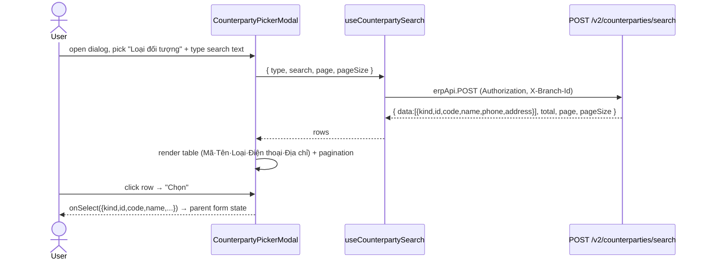

# EPIC-21062026 Counterparty picker redesign — type filter + richer columns

## Goal

Redesign the "Chọn đối tượng" picker dialog used across goods/treasury forms so it matches the reference UI: a **"Loại đối tượng" type dropdown** (Nhà cung cấp / Khách hàng / Nhân viên) plus richer columns (Mã đối tượng · Tên đối tượng · Loại đối tượng · Điện thoại · Địa chỉ), all served by the existing CQRS endpoint `POST /v2/counterparties/search`. Today the picker is supplier-only (columns Mã · Tên) and still calls the legacy `GET /inventory/providers`.

Selection stays **single-select** (one counterparty per goods/treasury document — unchanged). The dropdown lets the user pick *which type* of đối tượng to search before selecting one row.

## Decisions (locked)

- **Single-select stays.** "Chọn nhiều đối tượng" means choosing the *type* to search via the dropdown, not multi-row selection. No document data-model change (goods docs keep one `counterpartyKind + counterpartyId`).
- **3 types only:** `supplier` (Nhà cung cấp) · `customer` (Khách hàng) · `employee` (Nhân viên), plus the dropdown's "Tất cả" default → backend `type: all`. **"Đối tác giao hàng" is dropped** (no distinct entity exists — delivery partners are just `ProviderEntity` rows by `DTGH-` code convention). No new `CounterpartyKind`, **no migration**.
- **Backend already exists.** `POST /v2/counterparties/search` (CQRS, `SearchCounterpartiesHandler`) already filters by `type` and returns `{ kind, id, code, name, phone, address }` with org-scoped pagination. This epic adds **no backend logic** — only an OpenAPI regen so the FE can call it via the typed `@erp/api-client`, and a permission check (see TKT-CPP-01).
- **Dedicated FE component.** Build a `CounterpartyPickerField` / `CounterpartyPickerModal` pair rather than overloading the generic `LookupSearchModal` (used by other lookups) — keeps blast radius to the 2 named consumers. Model it on treasury's `VoucherEntitySearchModal`, which already implements this exact UI.
- **Per-consumer default type.** The dialog accepts `defaultType` / `allowedTypes` props: Nhập kho defaults to **Nhà cung cấp**, Xuất kho to **Khách hàng**.
- **Treasury is out of scope.** Treasury's `VoucherEntitySearchModal` ("Chọn đối tượng nộp") **already is** this reference UI (type dropdown + Mã/Tên/Loại/Điện thoại + single-select + pagination), backed by its own `GET /cash-vouchers/partners`. It is deeply coupled (session store, page cache, selection-pinning, by-id hydration, staff/debt-collection variants); re-pointing it at `/v2/counterparties/search` is a redundant lateral move with regression risk. Left untouched; used only as the design template.

## Scope

- **No backend logic change.** Reuse `POST /v2/counterparties/search` as-is. Only `pnpm openapi:generate` + commit the api-client snapshot, and verify the endpoint's `@RequirePermission("inventory.read")` is held by the Nhập kho / Xuất kho roles (it is — both are inventory surfaces).
- **backoffice-web only.** New `CounterpartyPickerField` / `CounterpartyPickerModal` + a `useCounterpartySearch` TanStack Query hook over `erpApi.POST`. Migrate two existing pickers: `PurchaseOrdersPage` (Nhập kho), `GoodsIssuePage` (Xuất kho).
- UI strings stay **Vietnamese**; `kind`/enum values stay English.

## Success Metrics

- Opening "Chọn đối tượng" on Nhập kho and Xuất kho shows the **type dropdown** + the 5 columns (Mã · Tên · Loại · Điện thoại · Địa chỉ), populated from the live `/v2/counterparties/search`.
- Switching the type dropdown re-queries server-side and paginates the correct entity set; "Tất cả" merges all three types.
- Selecting a row fills each form's existing đối tượng fields exactly as before (no regression in PO/Goods-Issue save).
- App builds + runs; no remaining call to legacy `GET /inventory/providers` from the two migrated pickers.

## Flows

## Tickets

- [TKT-CPP-01 Backend: finalize /v2/counterparties/search + OpenAPI regen + permission check](../tickets/TKT-CPP-01-backend-counterparty-search-openapi.md)
- [TKT-CPP-02 FE: CounterpartyPickerField/Modal + useCounterpartySearch hook](../tickets/TKT-CPP-02-fe-counterparty-picker-dialog.md)
- [TKT-CPP-03 FE: migrate Nhập kho / Xuất kho to the new picker](../tickets/TKT-CPP-03-fe-migrate-consumers.md)
- [TKT-CPP-04 FE: inline field type-ahead searches all types (mixed)](../tickets/TKT-CPP-04-fe-inline-all-types.md)

## Dependencies

- Depends on: the existing `counterparty` module (`POST /v2/counterparties/search`, `SearchCounterpartiesHandler`, `CounterpartyKind`) — already in the working tree.
- Reuses: `erpApi` / `requireErpData`, `LookupSearchModal` UI patterns (pagination, search bar), `@erp/ui` `Select`/`Dialog`/table primitives, `@erp/api-client` generated types.

### Ticket dependency graph

## Out of scope

- Multi-row selection; any join table letting one document reference many counterparties.
- The "Đối tác giao hàng" type and any provider discriminator/migration.
- **Treasury voucher pickers** (`VoucherEntitySearchModal` / `/cash-vouchers/partners`) — already match the reference UI; left untouched.
- Changing how goods docs **persist** the counterparty (kind+id columns are owned by the warehouse-overhaul v2 epic); this epic only swaps the picker UI and feeds the selection into existing form state.
- Any new backend filter, sort, or endpoint.
