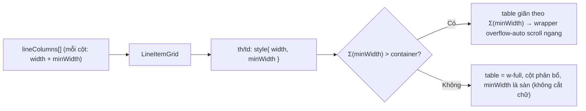
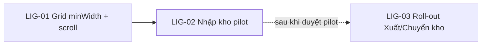

# EPIC-21062026 LineItemGrid Column Min-Width + Horizontal Scroll

## Goal

Bảng "CHI TIẾT" (line items) trong các form chứng từ kho dùng chung component `LineItemGrid` (`@erp/ui`). Hiện component render `<table className="w-full">` (auto layout) và chỉ đặt `width` (gợi ý) trên header `<th>`, **không có `minWidth`**. Khi dialog hẹp, trình duyệt nén các cột xuống dưới `width` → các ô search/select bị **cắt chữ** ("Tìm mã ho…", "Chọn kh…"). Wrapper đã có `overflow-auto` nhưng không bao giờ kích hoạt vì bảng không bao giờ rộng quá container.

Mục tiêu:
1. Thêm hỗ trợ **`minWidth` cho từng cột** trong `LineColumn`/`LineItemGrid` — đặt sàn bề rộng để cột không bị nén, và bảng **scroll ngang** khi tổng min-width vượt bề rộng container.
2. **Pilot trên luồng Nhập kho** trước (form Goods Receipt) với bộ min-width tuned theo nội dung. Xuất kho / Chuyển Kho roll-out ở phase sau (sau khi pilot được duyệt).

Đây là cải tiến **UI/UX, frontend-only**: không đụng data model, migration, event, API, permission.

## Scope

- **Package:** `@erp/ui` — `LineItemGrid` (`packages/ui/src/components/line-item-grid.tsx`): thêm field `minWidth?: number | string` vào `LineColumn`, áp `minWidth` lên cell header (cả 3 hàng header: grouped/non-grouped/filter) và body `<td>`; giữ nguyên wrapper `overflow-auto`. **Đây là thay đổi opt-in** — cột không khai báo `minWidth` không đổi hành vi.
- **FE (pilot):** `backoffice-web` — Nhập kho: `pages/purchase-orders/PurchaseOrdersPage.tsx` (`GoodsReceiptFormDialog`, `lineColumns`). Set `minWidth` cho từng cột theo bộ tuned đã chốt.
- **FE (phase 2, deferred):** Xuất kho `pages/goods-issue/GoodsIssuePage.tsx`, Chuyển Kho `pages/transfer-orders/TransferOrdersPage.tsx` — áp cùng pattern sau khi pilot OK.
- **Out of scope:** không đổi logic dữ liệu/nghiệp vụ; không scaffold trang `*-v2` song song (tích hợp vào trang hiện hữu); không đụng `BaseDataTable` (component bảng list khác).

## Success Metrics

- Bộ min-width chốt (px): **Mã SKU 360 · Tên hàng hóa 280 · Kho 220 · Vị trí 220 · Đơn vị tính 100 · Số lượng 110 · Đơn giá 140 · Thành tiền 150 · Ghi chú 200** (Σ ≈ 1780px).
- Ở bề rộng dialog mặc định, các ô input/select của bảng Nhập kho **không còn bị cắt chữ**; khi bảng rộng hơn container thì **scroll ngang** (header dính khi cuộn dọc vẫn hoạt động).
- `minWidth` là opt-in: các bảng line khác (Xuất/Chuyển kho và mọi consumer khác của `LineItemGrid`) **không hồi quy** khi chưa khai báo `minWidth`.
- `pnpm build` (ui + backoffice) xanh.

## Flows

Đây là thay đổi render thuần (không có HTTP/Kafka flow). Sơ đồ phân giải bề rộng cột:

## Tickets

- [TKT-LIG-01 LineItemGrid: hỗ trợ minWidth + scroll ngang (@erp/ui)](../tickets/TKT-LIG-01-grid-min-width-support.md)
- [TKT-LIG-02 Nhập kho (pilot): áp min-width tuned cho lineColumns](../tickets/TKT-LIG-02-goods-receipt-apply.md)
- [TKT-LIG-03 Roll-out Xuất kho + Chuyển Kho (deferred, sau khi pilot duyệt)](../tickets/TKT-LIG-03-rollout-issue-transfer.md)

## Dependencies

- Depends on: component dùng chung `LineItemGrid` (`@erp/ui`) đã tồn tại và được Nhập/Xuất/Chuyển kho dùng qua `DocumentFormDialog`.
- Reuses: `LineColumn.width`/inline-style pattern hiện có (chỉ mở rộng thêm `minWidth`), wrapper `overflow-auto` sẵn có trong `LineItemGrid`, `DocumentFormDialog` layout flex.

### Ticket dependency graph

