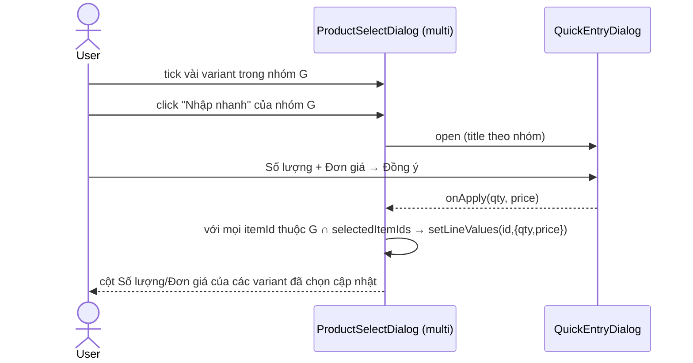
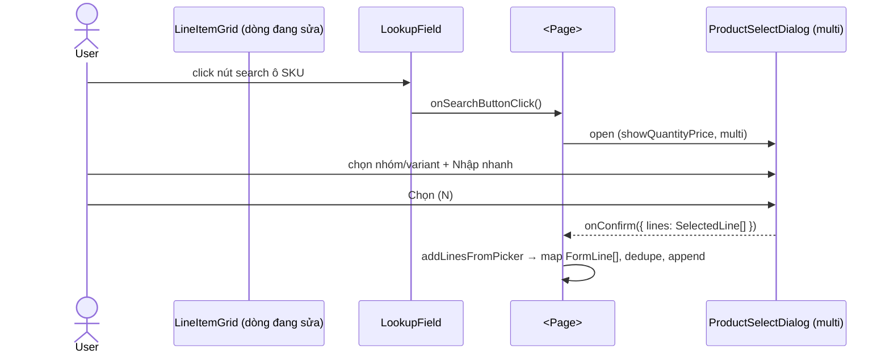
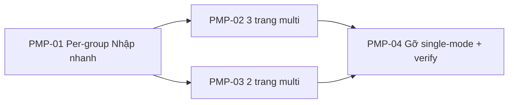

# EPIC-21062026 ProductSelectDialog: per-row dùng multi + "Nhập nhanh" theo từng nhóm

## Goal

Đưa picker chọn hàng trên **từng dòng** về đúng dạng multi-select theo nhóm (như ảnh #5 hệ tham chiếu): chọn **nhóm hàng hóa** → chọn **tất cả variant**; header có **chọn-tất-cả-trang**; cột **Số lượng/Đơn giá**; mỗi nhóm có link **"Nhập nhanh"** đặt Số lượng/Đơn giá cho **các variant đã chọn trong nhóm đó**.

> **Bối cảnh:** [[feedback_no_parallel_v2_ui_pages]] EPIC-21062026-single-fill (vừa implement) cho nút search/dòng mở dialog **single-fill** (điền 1 dòng) — ẩn group checkbox, header select-all, cột qty/price (chính là ảnh #2/#3 user thấy "không chọn nhóm được"). User xem xong **đổi hướng**: nút search/dòng phải mở dialog **multi** đầy đủ. → Epic này **supersede** phần per-row single-fill: gỡ single-fill, per-row dùng multi.

**Measurable outcome:**
- 5 trang line-editor: bấm search ô SKU/dòng → mở `ProductSelectDialog` **multi** (group checkbox chọn cả variant, header select-all/trang, cột Số lượng/Đơn giá, "Nhập nhanh") → chọn N → thêm N dòng.
- Mỗi **nhóm** có link "Nhập nhanh" → mở modal Số lượng/Đơn giá → bấm "Đồng ý" áp cho **các variant đã chọn trong nhóm đó** (variant chưa chọn không đổi).
- "Nhập nhanh" toàn cục (toolbar) vẫn áp cho **tất cả** variant đã chọn (giữ nguyên).
- Code single-fill (`selectionMode="single"`/`isSingle`) bị gỡ; `pnpm --filter @erp/backoffice-web build` xanh.

## Scope

- **Chỉ FE** (`apps/backoffice-web`). **Không** đổi backend/endpoint (`GET /inventory/items/products(/{id}/items)` qua `useProductSearch`).
- **Component** `ProductSelectDialog` + `QuickEntryDialog` (`components/shared/product-select/`):
  - **Mới:** link "Nhập nhanh" trên mỗi **product group row** (chỉ khi `showQuantityPrice`) → áp qty/price cho variant **đã chọn** trong nhóm.
  - **Đã có (xác nhận hoạt động ở multi):** group checkbox (`handleProductCheckChange` → chọn cả variant), header select-all/trang (`handleSelectAll`), "Nhập nhanh" toàn cục (toolbar → `applyQuickEntry`).
  - **Gỡ:** `selectionMode`/`isSingle` (dead sau khi bỏ single-fill). Giữ fix title `"Chọn hàng hóa"`.
- **5 trang** chuyển nút search/dòng → mở dialog multi (thêm N dòng):
  - Đã có `ProductSelectDialog` multi + `addLinesFromPicker`: `PurchaseOrdersPage`, `GoodsIssuePage`, `StockTransferPage` → trỏ `onSearchButtonClick` về dialog multi, gỡ single-fill, gộp nút magnifier trùng.
  - Chưa có mapper multi: `TransferOrdersPage`, `StockTakeFormDialog` → thêm dialog multi + `addLinesFromPicker` (StockTake: resolve location/expected theo từng item như `handlePickItem`).

## Success Metrics

- Chọn group "Giày Gelli" → 6 variant được tick; bỏ tick group → bỏ cả 6.
- Header checkbox → tick/bỏ toàn bộ mẫu mã trang hiện tại.
- Tick D-35/36/37 trong nhóm AK218-61 → bấm "Nhập nhanh" nhóm → 3 variant đó nhận Số lượng/Đơn giá; D-38… không đổi.
- "Chọn (N)" thêm đúng N dòng kèm qty/price; dedupe theo `itemId`.
- Không còn dialog single-fill ở bất kỳ trang nào; build xanh.

## Flows

### Per-group "Nhập nhanh" → áp variant đã chọn trong nhóm

### Per-row search → multi → thêm N dòng

## Tickets

- [TKT-PMP-01 Per-group "Nhập nhanh" trong ProductSelectDialog](../tickets/TKT-PMP-01-per-group-quick-entry.md)
- [TKT-PMP-02 3 trang: per-row search → multi, gỡ single-fill](../tickets/TKT-PMP-02-existing-pages-multi.md)
- [TKT-PMP-03 2 trang còn lại: thêm dialog multi + addLinesFromPicker](../tickets/TKT-PMP-03-remaining-pages-multi.md)
- [TKT-PMP-04 Gỡ dead single-mode + verify build](../tickets/TKT-PMP-04-remove-single-mode.md)

## Dependencies

- **Depends on:** EPIC-19062026 (`ProductSelectDialog` multi + `useProductSearch` + addLinesFromPicker ở 3 trang).
- **Supersedes:** per-row single-fill của EPIC-21062026-single-fill (gỡ `selectionMode="single"` + dialog/state single-fill ở 5 trang).
- **Reuses:** `QuickEntryDialog`, `ProductSelectResult`/`SelectedLine`, `handleProductCheckChange`/`handleSelectAll`/`applyQuickEntry` (đã có), `handlePickItem` (StockTake) làm mẫu cho batch resolve.

### Ticket dependency graph

## Out of scope

- Đổi backend/endpoint; hiển thị tồn kho trong dialog.
- Đổi luồng lưu/post của các trang.
- Giữ lại single-fill (đã quyết gỡ).
