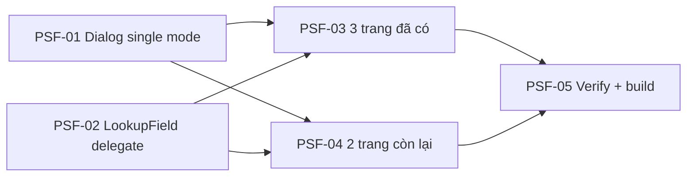

# EPIC-21062026 Thay modal "Chọn hàng hóa" cũ bằng ProductSelectDialog (single-fill) trên 5 trang line-editor

## Goal

Trên các trang có bảng CHI TIẾT dòng hàng, ô "Mã SKU" mỗi dòng vẫn còn **modal tìm hàng cũ** `LookupSearchModal` (tiêu đề "Chọn hàng hóa", bảng phẳng, chọn-1) — đây là phần [[feedback_no_parallel_v2_ui_pages]] EPIC-19062026 **chưa dọn**: nó chỉ gắn `ProductSelectDialog` vào một **nút search riêng (multi-select)** mà **không gỡ modal cũ**.

Epic này hoàn tất việc đó theo hướng **single-fill**: giữ ô typeahead gõ nhanh từng dòng; nút full-search của ô đó mở `ProductSelectDialog` ở **chế độ chọn-1**, điền **đúng dòng đang sửa**. Áp dụng cho **cả 5 trang** line-editor.

> **Sửa giả định ban đầu:** `LookupSearchModal`/`enableSearchModal` **KHÔNG** chỉ dùng cho product — còn phục vụ "Chọn kho", "Chọn vị trí", "Chọn đối tượng", "Chọn lý do xuất kho", "Chọn cửa hàng nguồn/đích", "Chọn người vận chuyển", "Chọn chi nhánh đích". → **GIỮ NGUYÊN** `LookupSearchModal` + `enableSearchModal`; chỉ chuyển riêng các lookup **sản phẩm** (title "Chọn hàng hóa"/"Chọn mặt hàng") sang single-fill bằng prop `onSearchButtonClick` **đã có sẵn** trong `LookupField`.

**Measurable outcome:**
- 5 trang: bấm nút search trên 1 dòng → mở `ProductSelectDialog` (single mode) → chọn 1 hàng/variant → điền đúng dòng đó (SKU, tên, ĐVT, đơn giá mặc định). Không còn modal "Chọn hàng hóa" cũ ở dòng sản phẩm nào.
- Ô typeahead gõ nhanh + dropdown inline + nút "+" tạo nhanh **giữ nguyên**.
- 3 trang đang có nút "Chọn nhiều hàng hoá" (multi-select) **giữ nguyên** nút đó.
- Các lookup không phải sản phẩm (kho/vị trí/đối tượng/…) vẫn dùng `LookupSearchModal` như cũ.
- `ProductSelectDialog` default `title` sửa từ chuỗi debug `"Chọn hàng hóa222"` → `"Chọn hàng hóa"`.
- `pnpm --filter @erp/backoffice-web build` xanh.

## Scope

- **Chỉ FE** (`apps/backoffice-web`). **Không** thêm/đổi endpoint backend. Dialog dùng lại 2 endpoint sẵn có (`GET /inventory/items/products`, `GET /inventory/items/products/{id}/items`) qua `useProductSearch`.
- **Component dùng chung — sửa 2 cái (reusable):**
  - `ProductSelectDialog` (`components/shared/product-select/`): thêm prop `selectionMode: "single" | "multi"` (default `"multi"` — không đổi hành vi cũ). Single mode = chọn-1 (thay thế lựa chọn trước), ẩn checkbox chọn-tất-cả/chọn-cả-mẫu-mã, `onConfirm` trả đúng 1 line.
  - `LookupField` (`components/forms/`): **không cần sửa** — prop `onSearchButtonClick?: () => void` **đã có sẵn**; các trang chỉ chuyển từ `enableSearchModal` sang `onSearchButtonClick` cho riêng ô SKU sản phẩm.
- **Tích hợp single-fill** vào 5 trang (mỗi trang map `SelectedLine → 1 dòng` của FormLine riêng):
  - Đã có `ProductSelectDialog` (multi): `PurchaseOrdersPage`, `GoodsIssuePage`, `StockTransferPage`.
  - Chưa có: `TransferOrdersPage`, `StockTakeFormDialog` (thêm import + dialog).
- **Không xoá gì:** `LookupSearchModal` + `enableSearchModal` còn dùng cho các lookup khác.

## Ghi chú đã xác minh

- `enableSearchModal`/`LookupSearchModal` dùng cho **nhiều loại lookup** (kho, vị trí, đối tượng, lý do xuất, cửa hàng, người vận chuyển, chi nhánh, sản phẩm). → **chỉ** migrate lookup sản phẩm; phần còn lại giữ nguyên.
- `LookupField` đã có sẵn `onSearchButtonClick` (dùng trước ở các trang treasury) → tái dùng, không cần thêm prop.
- `ProductSelectDialog.onConfirm` hiện trả `ProductSelectResult { lines, fullySelectedProductIds, standaloneItemIds, allSelectedItemIds }`. Single mode tái dùng đúng shape này, `lines` đúng 1 phần tử → trang lấy `lines[0]`.
- `ProductSelectDialog` default `title = "Chọn hàng hóa222"` là chuỗi debug sót — sửa trong TKT-PSF-01.

## Success Metrics

- 5 trang: nút search/dòng → dialog single-select → điền đúng 1 dòng đang sửa (không tạo dòng mới, không động dòng khác).
- Variant: chọn 1 variant trong dialog điền đúng variant đó (SKU, `variantLabel`, đơn giá) vào dòng.
- Gõ lại mã trong ô → clear `itemId` cũ (cơ chế hiện hành giữ nguyên).
- Không còn `LookupSearchModal`/`enableSearchModal` trong toàn repo FE; build xanh.
- 3 trang vẫn còn nút "Chọn nhiều hàng hoá" (multi) hoạt động như cũ.

## Flows

### Single-fill: nút search trên 1 dòng → chọn 1 → điền đúng dòng

```mermaid
sequenceDiagram
  actor U as User
  participant Row as LineItemGrid (dòng đang sửa, idx)
  participant LF as LookupField (typeahead)
  participant Page as <Page>
  participant D as ProductSelectDialog (single)
  participant P as GET /inventory/items/products
  participant V as GET /inventory/items/products/{id}/items
  U->>Row: gõ nhanh ở ô SKU (dropdown inline) — giữ nguyên
  U->>LF: bấm nút full-search của ô
  LF->>Page: onOpenSearchModal()
  Page->>Page: setPickerTargetIdx(idx); setSinglePickerOpen(true)
  Page->>D: open (selectionMode="single", defaultUnitPriceSource=...)
  D->>P: list mẫu mã (search, categoryId, page)
  D->>V: lazy-load variant khi bung "+"
  U->>D: chọn 1 hàng/variant → Chọn
  D-->>Page: onConfirm({ lines: [line] })
  Page->>Page: fillLineAt(pickerTargetIdx, line) — map vào FormLine, clear nếu cần
  Page-->>Row: render dòng đã điền
```

## Tickets

- [TKT-PSF-01 ProductSelectDialog: thêm selectionMode "single" + fix default title](../tickets/TKT-PSF-01-product-select-single-mode.md)
- [TKT-PSF-02 LookupField: dùng onSearchButtonClick (đã có sẵn) cho ô SKU sản phẩm](../tickets/TKT-PSF-02-lookupfield-delegate-search.md)
- [TKT-PSF-03 Single-fill cho 3 trang đã có dialog (Nhập/Xuất/Chuyển kho)](../tickets/TKT-PSF-03-integrate-existing-pages.md)
- [TKT-PSF-04 Single-fill cho 2 trang còn lại (Lệnh chuyển/Kiểm kê)](../tickets/TKT-PSF-04-integrate-remaining-pages.md)
- [TKT-PSF-05 Verify product pickers migrated + build (LookupSearchModal giữ nguyên)](../tickets/TKT-PSF-05-remove-lookup-search-modal.md)

## Dependencies

- **Depends on:** EPIC-19062026 (đã có `ProductSelectDialog`, `useProductSearch`, tích hợp multi vào 3 trang v1).
- **Completes (FE):** phần dọn dẹp EPIC-19062026 bỏ sót — gỡ modal product cũ khỏi dòng hàng.
- **Reuses:** `ProductSelectDialog`/`useProductSearch`, `LookupField`, `LineItemGrid` (@erp/ui), cơ chế `onValueChange`/`onSelect` + `markDirty` hiện hành của từng trang.

### Ticket dependency graph



## Out of scope

- Thêm nút bulk "Chọn nhiều hàng hoá" cho `TransferOrdersPage`/`StockTakeFormDialog` (single-fill only — trừ khi yêu cầu thêm).
- Bỏ/đổi nút multi-select đang có trên 3 trang (giữ nguyên).
- Hiển thị tồn kho trong dialog; đổi backend; thay đổi luồng lưu/post của các trang.
- Đổi `useProductSearch`/endpoint.
