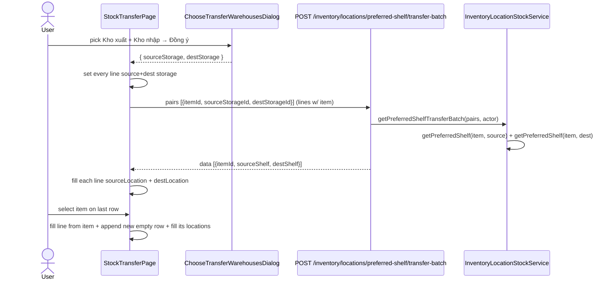
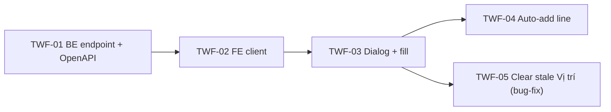

# EPIC-21062026 Chuyển kho — chọn kho xuất/nhập + auto-fill vị trí + auto-thêm dòng

## Goal

Speed up creating a stock transfer (Chuyển kho) by letting the user pick **Kho xuất + Kho nhập** once in a "Chọn kho" dialog, then auto-apply both warehouses to every line and **auto-fill both Vị trí** (source + destination shelf) via a dedicated transfer endpoint. Also auto-append a new empty line when an item is picked, so the user can keep adding items without clicking "+ Thêm dòng".

Measurable outcome: from an empty transfer form, a user picks source+dest warehouse once → every line's `sourceStorage`/`destStorage` is set and both `Vị trí` columns auto-fill; selecting an item appends the next blank line automatically.

## Decisions (locked)

- **Combined "Chọn kho" dialog** (Kho xuất + Kho nhập in one dialog, matching the reference). On Đồng ý it **applies to all lines** — sets every line's source + dest storage (overwriting any per-line warehouse) and auto-fills both Vị trí.
- **Dedicated transfer endpoint** `POST /inventory/locations/preferred-shelf/transfer-batch` — resolves the **preferred shelf at the source storage AND at the dest storage** per item in one call. Reuses the existing `getPreferredShelf(itemId, storageId, actor)` (which already falls back to the item's most-used accessible shelf). **Not** the existing `/preferred-shelf/batch` (single-storage) — transfer needs source+dest together. (Negative stock is allowed, so source = preferred shelf is an acceptable default the user can adjust.)
- **Auto-add line on item select — Chuyển kho only.** Selecting an item on the last row appends a new empty line. Nhập/Xuất kho unchanged.
- The new endpoint follows the typed `erpApi` contract → **OpenAPI regen** so the FE client is generated (the existing `getPreferredShelfBatch` uses `erpApi.POST`).

## Scope

- **API (`modules/inventory/location`):** new DTO + service method `getPreferredShelfTransferBatch` (reuses `getPreferredShelf` ×2) + controller route on `inventory-location-stock.controller.ts`. No new entity, no migration. Org/branch-scoped via `ActorContext`, permission `inventory.read` (same as the existing preferred-shelf endpoints).
- **backoffice-web:** new `getTransferPreferredShelfBatch` client; new combined `ChooseTransferWarehousesDialog`; wire into `StockTransferPage` (apply-to-all + fill); auto-add line on item select in the transfer grid only.
- No events, no cross-module side effects (pure read + form UX).
- UI strings Vietnamese; backend identifiers English.

## Success Metrics

- "Chọn kho" dialog sets Kho xuất + Kho nhập on every line and fills both Vị trí for lines that have an item.
- Picking an item on the last row appends a fresh empty row; the new line's Vị trí auto-fills when the line already has both warehouses.
- Transfer still saves via `POST /inventory/stock/transfers` with per-line `source/destinationStorageId` + `source/destinationLocationId` unchanged.
- App builds; the dedicated endpoint returns `{sourceShelf, destShelf}` per item.

## Flows

## Tickets

- [TKT-TWF-01 BE: transfer preferred-shelf-batch endpoint (source+dest)](../tickets/TKT-TWF-01-be-transfer-preferred-shelf-batch.md)
- [TKT-TWF-02 FE: getTransferPreferredShelfBatch client](../tickets/TKT-TWF-02-fe-transfer-shelf-client.md)
- [TKT-TWF-03 FE: combined Chọn kho dialog + apply-to-all + fill](../tickets/TKT-TWF-03-fe-choose-warehouses-dialog-fill.md)
- [TKT-TWF-04 FE: auto-add line on item select (transfer grid)](../tickets/TKT-TWF-04-fe-auto-add-line-on-select.md)
- [TKT-TWF-05 FE: clear stale Vị trí when "Chọn kho" changes warehouse (bug-fix)](../tickets/TKT-TWF-05-fe-clear-stale-location-on-warehouse-change.md)

## Dependencies

- Depends on: existing `inventory-location-stock` preferred-shelf service (`getPreferredShelf`), `StockTransferPage`, `LineItemGrid`, `ChooseWarehouseDialog` (as a pattern), `getPreferredShelfBatch` client.
- Reuses: `erpApi`/`requireErpData`, the stock-transfer create/post flow (`POST /inventory/stock/transfers`), the transfer line model (source/dest storage + location).

### Ticket dependency graph

## Out of scope

- Per-line warehouse editing UX changes beyond the apply-to-all dialog.
- Source location = actual on-hand stock location (we use preferred shelf for both; deferred).
- Auto-add-on-select for Nhập/Xuất kho (Chuyển kho only this epic).
- Any change to the stock-transfer posting/ledger logic or its DTO.
