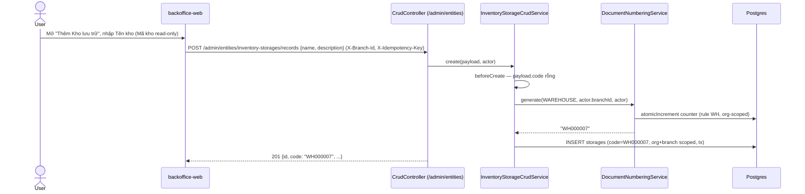
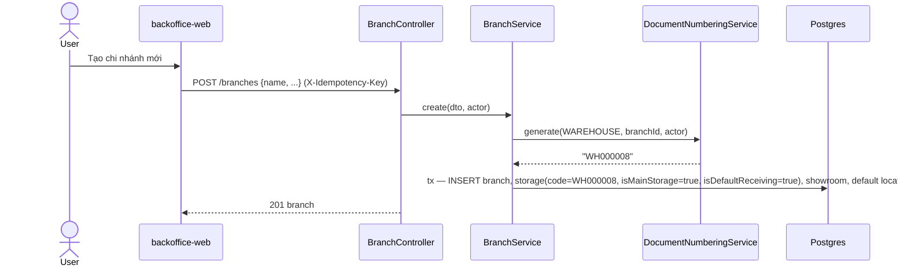
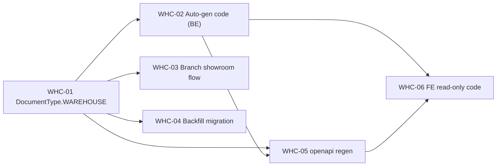

# EPIC-21062026 Warehouse Code Auto-Generation + Branch Showroom Flow

## Goal

Mã kho (`storages.code`) hiện là field **người dùng tự nhập, bắt buộc** trong form CRUD generic — nhưng không có bộ sinh mã, nên dữ liệu mã kho không nhất quán và dễ trùng. Đồng thời, showroom storage do luồng tạo chi nhánh tự sinh ra **không có mã** và **không được đánh dấu `isDefaultReceiving`** (migration `AddStorageDefaultReceiving` chỉ backfill các main storage *cũ*), nên chi nhánh mới không có kho nhập hàng mặc định.

Mục tiêu:
1. Mã kho **chỉ hiển thị, không cho sửa** trên form; khi tạo storage thì **tự sinh** theo `DocumentNumberingService` (prefix `WH`, 6 chữ số, liên tục — `WH000001`).
2. Luồng tạo chi nhánh tạo showroom storage với **mã WH tự sinh** + **`isDefaultReceiving = true`**.
3. Backfill mã `WH` cho mọi storage cũ đang `code = NULL` (không còn ô trống).

## Scope

- **Entities:** `StorageEntity` (`storages`) — không thêm cột; chỉ thay đổi cách set `code` + `isDefaultReceiving`. Scope `ORGANIZATION + BRANCH`.
- **Enum/shared:** thêm `DocumentType.WAREHOUSE` vào `@erp/shared-interfaces` + `DEFAULT_DOC_NUMBER_CONFIG` (`{ prefix: 'WH', continuous: true }`). Rule được auto-tạo lần generate đầu tiên (không cần seed riêng).
- **API surface:** không thêm endpoint. Thay đổi nằm trong `InventoryStorageCrudService.beforeCreate` (generic CRUD platform), `InventoryLocationService.createStorage` (endpoint chuyên dụng), và `BranchService.create`.
- **Events:** không phát/tiêu thụ event mới.
- **FE surface:** `backoffice-web` — form "Kho lưu trữ" (generic `CrudRecordDialog`, route `/admin/inventory-storages`). Mã kho thành read-only.
- **Migration:** 1 migration tay — backfill `code` cho storage `NULL` + seed `DocumentNumberRule`/counter `WAREHOUSE` ở high-water mark mỗi org để runtime generate tiếp tục không trùng.

## Success Metrics

- Tạo storage qua form: server tự sinh `code = WHxxxxxx`, FE không cho nhập mã, không gửi `code` trong payload.
- Tạo chi nhánh mới: showroom storage có `code` WH hợp lệ và `isDefaultReceiving = true` (đúng 1 default receiving/branch — không vi phạm partial unique index `UQ_storages_default_receiving_per_branch`).
- Sau migration: **không** còn storage nào `code IS NULL`; mã tiếp theo do runtime sinh ra **không trùng** mã đã backfill.
- Không có storage nào được sinh ra mà thiếu `code` ở bất kỳ creation path nào (CRUD form, endpoint chuyên dụng, branch flow).

## Flows

### A. Tạo Kho lưu trữ qua form (mã tự sinh)

### B. Tạo chi nhánh → showroom storage có mã + default receiving

## Tickets

- [TKT-WHC-01 DocumentType.WAREHOUSE + numbering config](../tickets/TKT-WHC-01-warehouse-document-type.md)
- [TKT-WHC-02 Auto-gen mã kho + Mã kho display-only (BE)](../tickets/TKT-WHC-02-storage-code-autogen.md)
- [TKT-WHC-03 Branch flow: showroom WH-code + default receiving](../tickets/TKT-WHC-03-branch-showroom-flow.md)
- [TKT-WHC-04 Migration backfill mã kho + seed counter](../tickets/TKT-WHC-04-backfill-migration.md)
- [TKT-WHC-05 openapi:generate + api-client snapshot](../tickets/TKT-WHC-05-openapi-regen.md)
- [TKT-WHC-06 FE: Mã kho read-only trong form Kho lưu trữ](../tickets/TKT-WHC-06-fe-readonly-code.md)

## Dependencies

- Depends on: `document-numbering` module (`DocumentNumberingService.generate`), generic CRUD platform (`InventoryStorageCrudService`), `AddStorageDefaultReceiving` migration (đã có `isDefaultReceiving` + partial unique index).
- Reuses: bộ sinh mã `DocumentNumberingService` (đúng pattern `provider-crud.service.ts` cho NCC), `readOnly` field flag của `CrudEntityConfig`/`CrudRecordDialog` (giống cách xử lý mã NCC của nhà cung cấp), partial unique index `UQ_storages_default_receiving_per_branch`.

### Ticket dependency graph

